# Pheno-CAM Example: Gorlin Syndrome

## GO-CAM Models Used

| Model ID | Description | Key Actors |
|----------|-------------|------------|
| gomodel:693b3c0900000716 | GPR161 export via BBSome/IFT-B | SMO, GRK2, ARRB1, BBSome, IFT-B, GPR161 |
| gomodel:693b3c0900001501 | SMO/DYRK2 → GLI3 activator | SMO, DYRK2, SUFU, GLI3A |
| gomodel:693b3c0900000157 | GPR161 → GLI3 repressor | GPR161, PRKACA, GSK3B, BTRC, GLI3R |
| gomodel:693b3c0900001389 | GLI1 transcription factor activation | SMO, MAPK1/ERK2, SUFU, GLI1 |

## Shared Nodes (appear in multiple GO-CAMs)

- **SMO** (hgnc:11119) — GPCR activity (GO:0004930) — in CAM1, CAM2, CAM4
- **GPR161** (hgnc:23694) — GPCR activity (GO:0004930) — in CAM1 (substrate), CAM2, CAM3
- **SUFU** (hgnc:16466) — protein sequestering activity (GO:0140311) — in CAM2 (substrate: GLI3) and CAM4 (substrate: GLI1)
- **PTCH1** (hgnc:9585) — smoothened inhibitor activity — outside all GO-CAMs (no model exists)

## Hypothesis Groups

- **Hypothesis A** (PTCH1-driven, ~85%): PTCH1 germline mutation → loss of SMO inhibition → constitutive Hh. Double hit: more GLI3A + less GLI3R (CAM3 suppressed via GPR161 export).
- **Hypothesis B** (SUFU-driven, ~10%): SUFU germline mutation → GLI3A and GLI1 freed from sequestration. Single hit: CAM3 still runs → GLI3R partially counterbalances. Milder phenotype but higher medulloblastoma risk.

## Disruption Cascade (Hypothesis A)

1. PTCH1 mutation -.disrupts.-> PTCH1 smoothened inhibitor activity (Level 1)
2. PTCH1 activity loss -.disrupts.-> PTCH1→SMO inhibitory relationship (Level 2)
3. **Sign reversal at SMO**: SMO becomes constitutively active
4. Constitutive SMO → drives CAM1 (GPR161 export) and CAM2 (DYRK2→GLI3A) and CAM4 (MAPK1→GLI1)
5. Constitutive GPR161 export → GPR161 absent from cilium → CAM3 (GLI3R production) disrupted
6. Net: more GLI3A + more GLI1 + less GLI3R → constitutive Hh target gene activation

## Molecular Target Routing to Tissue Outcomes

| Target Gene | Driven By | Routes To | Mechanism |
|-------------|-----------|-----------|-----------|
| CCND1 (Cyclin D1) | GLI1/GLI3A | BCC + MB + OKC (all) | G1/S cell cycle entry |
| MYCN (N-Myc) | GLI1/GLI3A | MB specifically | CGCP-specific proliferation driver |
| BCL2 | GLI1/GLI3A | BCC specifically | Anti-apoptotic survival advantage |

## Key Ontology Terms Used

### Cell Types (CL)
- CL:0002187 — basal cell of epidermis (BCC origin)
- CL:0001031 — cerebellar granule cell (medulloblastoma origin)

### Anatomy (UBERON)
- UBERON:0002097 — skin of body
- UBERON:0002037 — cerebellum
- UBERON:0001975 — (dental/jaw tissues, OKC origin)

### Phenotypes (HPO)
- HP:0002671 — Basal cell carcinoma
- HP:0010603 — Odontogenic keratocysts of the jaw
- HP:0002885 — Medulloblastoma

### Disease (MONDO)
- MONDO:0007187 — nevoid basal cell carcinoma syndrome (Gorlin Syndrome)

### Protein Isoforms (UniProt chain IDs)
- P10071-PRO_0000047202 — GLI3A (transcriptional activator form)
- P10071-PRO_0000406137 — GLI3R (transcriptional repressor form)

## Final Mermaid Diagram

```mermaid
%%{init: {'flowchart': {'curve': 'basis'}}}%%
flowchart TD
    classDef dismech fill:#ffcccc,stroke:#cc0000,color:#000
    classDef hpo fill:#ede0f7,stroke:#6f42c1,color:#000
    classDef gomf fill:#dce8f8,stroke:#4c73c2,color:#000
    classDef gobp fill:#fef3d8,stroke:#c8860a,color:#000
    classDef gocc fill:#dcf5e7,stroke:#2e9a5e,color:#000
    classDef camhdr fill:#f0f0f0,stroke:#999,color:#444,font-style:italic
    classDef mondo fill:#ffd6a5,stroke:#d97706,color:#000

    subgraph HYPA[" "]
        HYPA_H["Hypothesis A · PTCH1-driven · ~85% · hypothesis_group: ptch1_driven"]:::camhdr
        MUT_PTCH1["PTCH1 (hgnc:9585) · Germline Mutation"]:::dismech
        HYPA_H ~~~ MUT_PTCH1
    end

    subgraph HYPB[" "]
        HYPB_H["Hypothesis B · SUFU-driven · ~10% · hypothesis_group: sufu_driven"]:::camhdr
        MUT_SUFU["SUFU (hgnc:16466) · Germline Mutation"]:::dismech
        HYPB_H ~~~ MUT_SUFU
    end

    PTCH1_ACT["PTCH1 (hgnc:9585) · smoothened inhibitor activity"]:::gomf
    SMO["SMO (hgnc:11119) · GPCR activity (GO:0004930)"]:::gomf
    GPR161["GPR161 (hgnc:23694) · GPCR activity (GO:0004930)"]:::gomf

    subgraph CAM1[" "]
        CAM1_H["📦 gomodel:693b3c0900000716 — GPR161 export via BBSome/IFT-B"]:::camhdr
        BBSOME["BBSome complex (GO:0034464) · protein carrier chaperone (GO:0140597)"]:::gomf
        IFTB["IFT-B complex (GO:0030992) · protein carrier chaperone (GO:0140597)"]:::gomf
        CAM1_H ~~~ BBSOME
        BBSOME -->|"directly positively regulates (RO:0002629)"| IFTB
    end

    subgraph CAM2[" "]
        CAM2_H["📦 gomodel:693b3c0900001501 — GLI3 activator"]:::camhdr
        DYRK2["DYRK2 (hgnc:3093) · Ser/Thr kinase activity (GO:0004674)"]:::gomf
        SUFU_GLI3["SUFU (hgnc:16466) · protein sequestering activity (GO:0140311) · substrate: GLI3"]:::gomf
        GLI3A["GLI3A (P10071-PRO_0000047202) · DNA-binding tx activator (GO:0001228)"]:::gomf
        CAM2_H ~~~ DYRK2
        DYRK2 -->|"directly positively regulates (RO:0002629)"| GLI3A
        SUFU_GLI3 -->|"directly negatively regulates (RO:0002630)"| GLI3A
    end

    subgraph CAM3[" "]
        CAM3_H["📦 gomodel:693b3c0900000157 — GLI3 repressor"]:::camhdr
        PKA["PRKACA (hgnc:9380) · cAMP-dep. kinase activity (GO:0004691)"]:::gomf
        GSK3B["GSK3B (hgnc:4617) · Ser/Thr kinase activity (GO:0004674)"]:::gomf
        BTRC["BTRC (hgnc:1144) · ubiquitin ligase-substrate adaptor (GO:1990756)"]:::gomf
        GLI3R["GLI3R (P10071-PRO_0000406137) · DNA-binding tx repressor (GO:0001227)"]:::gomf
        CAM3_H ~~~ PKA
        PKA -->|"directly provides input for (RO:0002413)"| GSK3B
        GSK3B -->|"directly provides input for (RO:0002413)"| BTRC
        BTRC -->|"directly positively regulates (RO:0002629)"| GLI3R
    end

    subgraph CAM4[" "]
        CAM4_H["📦 gomodel:693b3c0900001389 — GLI1 transcription factor activation"]:::camhdr
        MAPK1["MAPK1/ERK2 (hgnc:6871) · Ser/Thr kinase activity (GO:0004674)"]:::gomf
        SUFU_GLI1["SUFU (hgnc:16466) · protein sequestering activity (GO:0140311) · substrate: GLI1"]:::gomf
        GLI1_TF["GLI1 (hgnc:4317) · DNA-binding tx activator (GO:0001228)"]:::gomf
        CAM4_H ~~~ MAPK1
        MAPK1 -->|"directly negatively regulates (RO:0002630)"| SUFU_GLI1
        SUFU_GLI1 -->|"directly negatively regulates (RO:0002630)"| GLI1_TF
    end

    GLITGT["GLI transcription factor activation · GO:0010628"]:::dismech
    GLI1LOOP["GLI1 positive feedback · self-reinforcing Hh activation"]:::dismech
    CCND1["CCND1 · Cyclin D1 upregulation · G1/S cell cycle (GO:0044843)"]:::dismech
    MYCN["MYCN · N-Myc upregulation · CGCP-specific proliferation driver"]:::dismech
    BCL2["BCL2 upregulation · anti-apoptotic (GO:0043066)"]:::dismech

    BCCPROL["Uncontrolled basal cell proliferation · CL:0002187 · GO:0008283 · UBERON:0002097"]:::dismech
    CGCPROL["Cerebellar granule cell hyperproliferation · CL:0001031 · GO:0008283 · UBERON:0002037"]:::dismech
    OKCPROL["Dental epithelium aberrant proliferation · GO:0008283 · UBERON:0001975"]:::dismech

    BCC["Basal cell carcinoma (HP:0002671)"]:::hpo
    OKC["Odontogenic keratocysts of the jaw (HP:0010603)"]:::hpo
    MB["Medulloblastoma (HP:0002885)"]:::hpo
    GORLIN["Gorlin Syndrome (MONDO:0007187)"]:::mondo

    MUT_PTCH1 -.->|"disrupts"| PTCH1_ACT
    PTCH1_ACT -.->|"negatively regulates (RO:0002212)"| SMO
    MUT_SUFU -.->|"disrupts"| SUFU_GLI3
    MUT_SUFU -.->|"disrupts"| SUFU_GLI1

    GLITGT -.->|"causally upstream of, positive effect (RO:0002304)"| CCND1
    GLITGT -.->|"causally upstream of, positive effect (RO:0002304)"| MYCN
    GLITGT -.->|"causally upstream of, positive effect (RO:0002304)"| BCL2
    GLITGT -.->|"causally upstream of, positive effect (RO:0002304)"| GLI1LOOP
    GLI1LOOP -.->|"causally upstream of, positive effect (RO:0002304)"| GLITGT

    CCND1 -.->|"causally upstream of, positive effect (RO:0002304)"| BCCPROL
    CCND1 -.->|"causally upstream of, positive effect (RO:0002304)"| CGCPROL
    CCND1 -.->|"causally upstream of, positive effect (RO:0002304)"| OKCPROL
    MYCN -.->|"causally upstream of, positive effect (RO:0002304)"| CGCPROL
    BCL2 -.->|"causally upstream of, positive effect (RO:0002304)"| BCCPROL

    BCCPROL -.->|"results in development of (RO:0002296)"| BCC
    CGCPROL -.->|"results in development of (RO:0002296)"| MB
    OKCPROL -.->|"results in development of (RO:0002296)"| OKC
    BCC -.->|"has phenotype (RO:0002200)"| GORLIN
    OKC -.->|"has phenotype (RO:0002200)"| GORLIN
    MB -.->|"has phenotype (RO:0002200)"| GORLIN

    SMO -->|"indirectly negatively regulates (RO:0002409)"| GPR161
    SMO -->|"indirectly positively regulates (RO:0002407)"| BBSOME
    SMO -->|"indirectly positively regulates (RO:0002407)"| DYRK2
    SMO -->|"indirectly positively regulates (RO:0002407)"| MAPK1
    IFTB -->|"negatively regulates (RO:0002212)"| GPR161
    GPR161 -->|"directly positively regulates (RO:0002629)"| PKA
    GLI3A -->|"directly positively regulates (RO:0002629)"| GLITGT
    GLI3R -->|"directly negatively regulates (RO:0002630)"| GLITGT
    GLI1_TF -->|"directly positively regulates (RO:0002629)"| GLITGT

    style HYPA fill:#fef9e7,stroke:#f39c12,stroke-width:2px
    style HYPB fill:#fef9e7,stroke:#f39c12,stroke-width:2px
    linkStyle default stroke-width:2px,fill:none
```

## GO-CAM Search Terms That Worked

These terms found hits in the GO-CAM browser (https://go-cam-browser.geneontology.org/):
- `IFT` — found 3 models including GPR161 export
- `GLI3` — found 2 models (GLI3 activator and GLI3 repressor)
- `GLI1` — found 1 model (GLI1 TF activation)

These terms found NO hits:
- `CEP290`, `PTCH1`, `ABL1`

## Design Decisions and Open Questions

1. **Edge-to-edge connections**: Needed for Level 2 disruptions but Mermaid cannot render them. Custom renderers (Cytoscape.js, D3) would be needed for production visualization.
2. **Backward compatibility with dismech schema**: The existing `downstream` field and `CausalEdge` class support basic causal graphs. Extension needed: add optional RO `relation` field (replacing barely-used `causal_link_type`), add `go_cam_modules` to Disease class, extend edge targets to allow GO-CAM node references.
3. **Perturbation vocabulary**: Need formal terms for DISRUPTS, REMOVES, CONSTITUTIVELY_ACTIVATES beyond what RO provides for normal biology edges.
4. **Export formats**: Consider SBGN-PD export for logical operators (AND/OR gates) and BEL export for multi-level causal statements.
