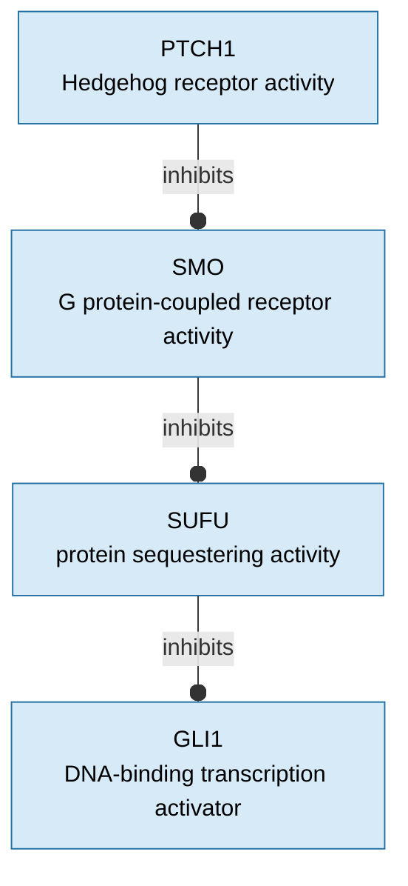
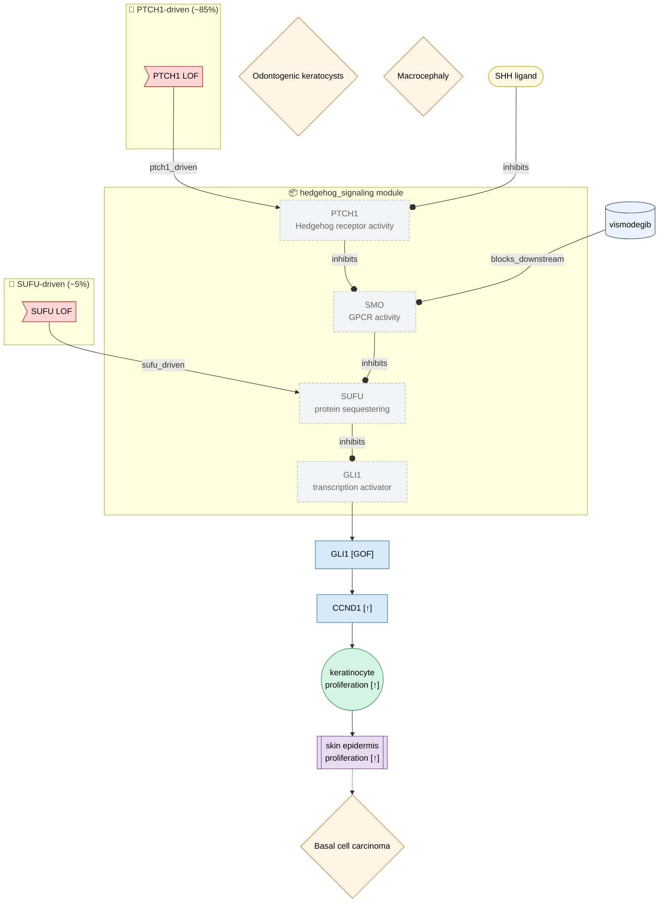

# PhenoCAM V2 — Causal Models

Structured causal disease models using the [PhenoCAM V2 schema](../src/dismech/schema/phenocam/phenocam.yaml).

- **`modules/`** — Reusable normal-biology pathway graphs (e.g., Hedgehog signaling)
- **`diseases/`** — Disease-specific causal overlays that import and perturb modules
- **`viz/`** — Auto-generated Mermaid diagrams (run `just phenocam-viz` to refresh)

---

## Hedgehog Signaling Module

Normal-biology backbone showing PTCH1→SMO→SUFU→GLI1 inhibitory cascade (Hh-off state).

---

## Gorlin Syndrome — Disease Course

Germline PTCH1/SUFU loss-of-function → constitutive Hedgehog/GLI activation → BCC predisposition.

### Legend

| Shape | Node kind |
|-------|-----------|
| `>flag]` | Variant / genetic input |
| `([pill])` | Molecular entity (protein / ligand) |
| `[rect]` | Molecular activity (gene product function) |
| `((circle))` | Cellular process |
| `[[double-rect]]` | Tissue process |
| `{diamond}` | Phenotype (HPO) |
| `[(cylinder)]` | Modulator / therapeutic |
| dashed grey | Node imported from a pathway module |

Badges on nodes: `[GOF]` = gain-of-function, `[↑]` = increased, `[↓]` = decreased, `[∅]` = absent.

---

*Diagrams auto-generated by `scripts/phenocam_mermaid.py`. Run `just phenocam-viz` to refresh after editing YAML files.*
