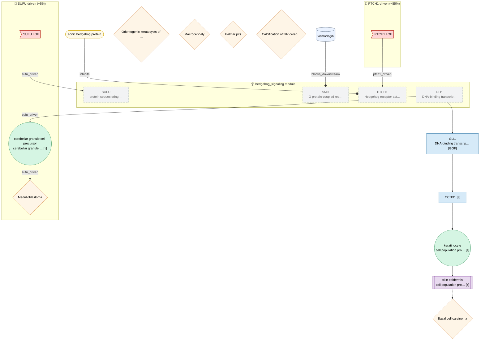

# Gorlin Syndrome — nevoid basal cell carcinoma syndrome

## Legend

| Shape | Node kind |
|-------|-----------|
| `>rect]` | Variant / input |
| `([pill])` | Molecular entity (protein / chemical) |
| `[rect]` | Molecular activity |
| `((circle))` | Cellular process |
| `[[double-rect]]` | Tissue process |
| `{diamond}` | Phenotype |
| `[(cylinder)]` | Modulator (therapeutic / dietary) |
| dashed grey | Imported module node |
