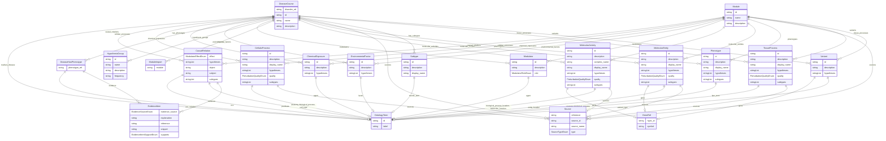

```mermaid
erDiagram
CausalRelation {
    ModulatorEffectEnum effect  
    stringList hypotheses  
    string object  
    string subject  
    stringList subtypes  
}
CellularProcess {
    string id  
    string description  
    string display_name  
    stringList hypotheses  
    PerturbationQualityEnum quality  
    stringList subtypes  
}
ChemicalExposure {
    string id  
    string description  
    stringList hypotheses  
}
DiseaseCourse {
    string disorder_ref  
    string id  
    string name  
    string description  
}
DiseaseHasPhenotype {
    string phenotype_ref  
}
EnvironmentalFactor {
    string id  
    string description  
    stringList hypotheses  
}
EvidenceItem {
    EvidenceSourceEnum evidence_source  
    string explanation  
    string reference  
    string snippet  
    EvidenceItemSupportEnum supports  
}
GeneRef {
    string hgnc_id  
    string symbol  
}
HypothesisGroup {
    string id  
    string name  
    string description  
    string frequency  
}
Modulator {
    string id  
    string description  
    ModulatorRoleEnum role  
}
Module {
    string id  
    string name  
    string description  
}
ModuleImport {
    string module  
}
MolecularActivity {
    string id  
    string description  
    string complex_name  
    string display_name  
    stringList hypotheses  
    PerturbationQualityEnum quality  
    stringList subtypes  
}
MolecularEntity {
    string id  
    string description  
    string display_name  
    stringList hypotheses  
    PerturbationQualityEnum quality  
    stringList subtypes  
}
OntologyTerm {
    string id  
    string label  
}
Phenotype {
    string id  
    string description  
    string display_name  
    stringList hypotheses  
    stringList subtypes  
}
Source {
    string reference  
    string source_id  
    string source_name  
    SourceTypeEnum type  
}
Subtype {
    string id  
    string description  
    string display_name  
}
TissueProcess {
    string id  
    string description  
    string display_name  
    stringList hypotheses  
    PerturbationQualityEnum quality  
    stringList subtypes  
}
Variant {
    string id  
    string description  
    stringList hypotheses  
}

CausalRelation ||--|o OntologyTerm : "eco"
CausalRelation ||--|| OntologyTerm : "predicate"
CausalRelation ||--}o EvidenceItem : "evidence"
CellularProcess ||--|o OntologyTerm : "anatomy, biological_process, cell_type"
CellularProcess ||--}o Source : "sources"
ChemicalExposure ||--|o OntologyTerm : "agent"
DiseaseCourse ||--|o OntologyTerm : "realises_disease"
DiseaseCourse ||--}o CausalRelation : "causal_relations"
DiseaseCourse ||--}o CellularProcess : "cellular_processes"
DiseaseCourse ||--}o ChemicalExposure : "chemical_exposures"
DiseaseCourse ||--}o DiseaseHasPhenotype : "has_phenotype"
DiseaseCourse ||--}o EnvironmentalFactor : "environmental_factors"
DiseaseCourse ||--}o HypothesisGroup : "hypothesis_groups"
DiseaseCourse ||--}o Modulator : "modulators"
DiseaseCourse ||--}o ModuleImport : "imports"
DiseaseCourse ||--}o MolecularActivity : "molecular_activities"
DiseaseCourse ||--}o MolecularEntity : "molecular_entities"
DiseaseCourse ||--}o Phenotype : "phenotypes"
DiseaseCourse ||--}o Source : "sources"
DiseaseCourse ||--}o Subtype : "has_subtypes"
DiseaseCourse ||--}o TissueProcess : "tissue_processes"
DiseaseCourse ||--}o Variant : "variants"
DiseaseHasPhenotype ||--|o OntologyTerm : "eco, relation"
DiseaseHasPhenotype ||--}o EvidenceItem : "evidence"
EnvironmentalFactor ||--|o OntologyTerm : "factor"
Modulator ||--|o OntologyTerm : "agent"
Module ||--}o CausalRelation : "causal_relations"
Module ||--}o CellularProcess : "cellular_processes"
Module ||--}o ChemicalExposure : "chemical_exposures"
Module ||--}o EnvironmentalFactor : "environmental_factors"
Module ||--}o Modulator : "modulators"
Module ||--}o MolecularActivity : "molecular_activities"
Module ||--}o MolecularEntity : "molecular_entities"
Module ||--}o Phenotype : "phenotypes"
Module ||--}o Source : "sources"
Module ||--}o TissueProcess : "tissue_processes"
Module ||--}o Variant : "variants"
MolecularActivity ||--|o GeneRef : "gene"
MolecularActivity ||--|o OntologyTerm : "biological_process, location, molecular_function"
MolecularActivity ||--}o Source : "sources"
MolecularEntity ||--|o GeneRef : "gene"
MolecularEntity ||--|o OntologyTerm : "entity, location"
MolecularEntity ||--}o Source : "sources"
Phenotype ||--|o OntologyTerm : "hpo_term"
Subtype ||--|o OntologyTerm : "mondo_term"
TissueProcess ||--|o OntologyTerm : "anatomy, biological_process, cell_type"
TissueProcess ||--}o Source : "sources"
Variant ||--|o GeneRef : "gene"
Variant ||--|o OntologyTerm : "variant_type"

```

