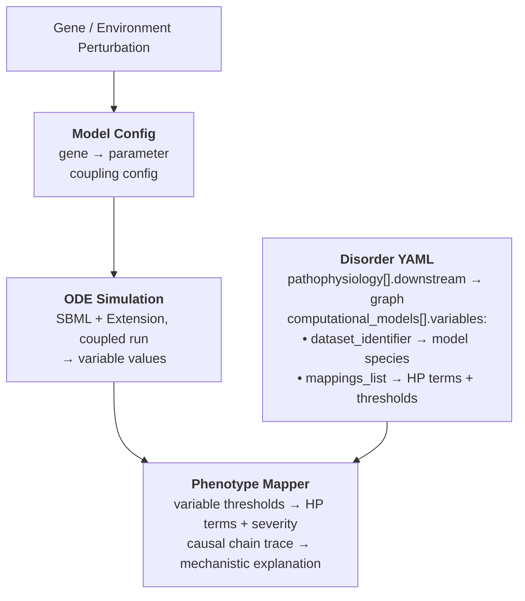
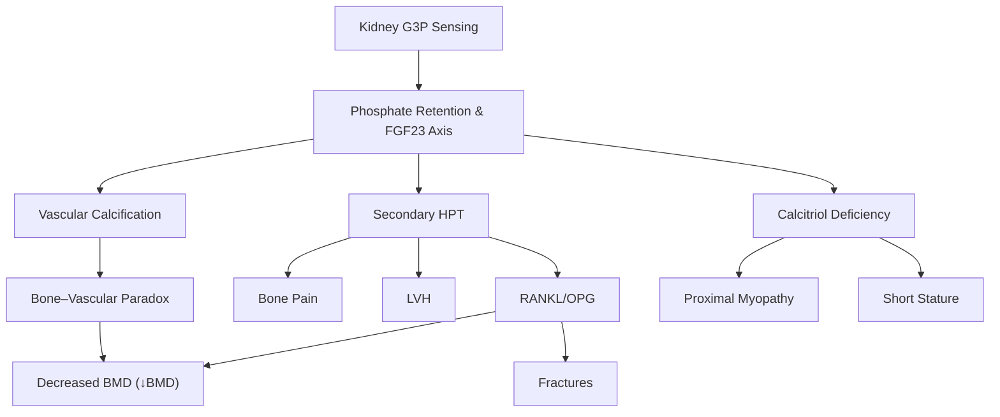

# Computational Models and Causal Perturbation Analysis

## Overview

!!! tip "Finding models"

    Every `computational_models` block curated across `kb/disorders/` and `kb/modules/` is
    searchable in the **Computational Models Browser** (`app/models/index.html`, regenerated
    with `just gen-models-data`), faceted by model type, exchange format, simulation software,
    perturbed gene, and whether the model is runnable in-repo via `dismech-perturb`. For the
    wider execution landscape — the COMBINE/SED-ML stack, BioSimulators, Vivarium, and which
    model classes genuinely need HPC — see
    [Computational Model Execution: State of the Art](../reports/computational-model-execution-landscape-2026-08-01.md).

Some DisMech disorder entries reference SBML (Systems Biology Markup Language) models that capture the quantitative dynamics of disease mechanisms as ordinary differential equations (ODEs). The **dismech-perturb** framework connects these models back to the clinical knowledge in the YAML, answering questions like:

> "If gene X is lost or environmental parameter Y changes, which phenotypes activate, how severely, and through which mechanistic path?"

This bridges two representations that are usually disconnected: the qualitative causal graph in the YAML (mechanisms, phenotypes, evidence) and the quantitative simulation from the ODE model.

## Data Sources

The system is fully data-driven, with no disease-specific Python code. Three data sources work together:

### 1. Disorder YAML (`kb/disorders/*.yaml`)

The pathophysiology section provides the qualitative causal graph. Each mechanism can declare `downstream` edges pointing to other mechanisms or phenotypes:

```yaml
pathophysiology:
- name: Secondary Hyperparathyroidism
  description: >
    Declining calcitriol and hyperphosphatemia stimulate PTH secretion...
  downstream:
  - target: RANKL/OPG Imbalance
    description: Elevated PTH increases RANKL and suppresses OPG
    causal_link_type: DIRECT
  - target: Bone Pain
    description: PTH-driven high-turnover bone disease
    causal_link_type: INDIRECT_KNOWN_INTERMEDIATES
    intermediate_mechanisms:
    - increased bone resorption
```

These edges form a directed graph from root causes through mechanisms to clinical phenotypes (HP terms). The `causal_link_type` field indicates whether the edge is direct or passes through known/unknown intermediates.

### 2. SBML Model + Extension (`models/`)

The base ODE model (e.g., Peterson-Riggs 2010 for CKD-MBD) is stored as BioModels SBML XML. Some pathophysiology mechanisms aren't captured by the base model. Extension models in Antimony format add missing species and reactions:

```
models/
  BIOMD0000000613.xml           # Base SBML (Ca/PO4/PTH/bone dynamics)
  BIOMD0000000613.ext.ant       # Extension (FGF23, Klotho, VascCa, Sclerostin)
  BIOMD0000000613.config.yaml   # Sidecar configuration
```

The base and extension models run as a coupled simulation with bidirectional feedback at each timestep.

### Variable Mapping via `dataset_identifier`

Each `ModelVariable` in the YAML can carry a `dataset_identifier` — the native name of that variable in the model file. This is model-format-agnostic (works for SBML species, COBRA reaction IDs, database columns, etc.) and is scoped to the parent `ComputationalModel`:

```yaml
computational_models:
- name: Peterson-Riggs Calcium Homeostasis
  model_id: BIOMD0000000613
  variables:
  - name: Plasma_Ca
    dataset_identifier: P            # SBML species name in this model
    unit: mg/dL
    mappings_list:
    - term: { id: LOINC:17861-6, label: "Calcium:MCnc:Pt:Ser/Plas:Qn" }
  - name: BMD
    dataset_identifier: Qbone
    unit: relative
    mappings_list:
    - preferred_term: Reduced bone mineral density
      term: { id: HP:0004349, label: "Reduced bone mineral density" }
      threshold: 0.85                # Phenotype activates below this ratio
      threshold_direction: below
      severity_scale:
      - { threshold: 0.85, name: mild }
      - { threshold: 0.70, name: moderate }
      - { threshold: 0.50, name: severe }
  - name: Vascular_Calcification
    dataset_identifier: VascCa
    notes: Extension model species
    mappings_list:
    - preferred_term: Arterial calcification
      term: { id: HP:0003207, label: "Arterial calcification" }
      threshold: 50
      threshold_direction: above
      severity_scale:
      - { threshold: 50, name: mild }
      - { threshold: 150, name: moderate }
      - { threshold: 300, name: severe }
```

Phenotype thresholds live directly on the HP term mappings — when a variable's value crosses the threshold in the specified direction, the phenotype activates. Multiple HP terms on a single variable get independent thresholds (e.g., BMD maps to both "Reduced bone mineral density" at 0.85 and "Pathologic fracture" at 0.70).

If two models use different internal names for the same biological quantity, each `ComputationalModel` entry has its own `variables` list with its own `dataset_identifier`.

### 3. Model Configuration Sidecar (`models/*.config.yaml`)

Contains simulation-specific plumbing: gene-to-parameter mappings, scenarios, and coupling config:

```yaml
gene_effects:
  CASR:
    parameter: T61        # SBML parameter controlling PTH secretion floor
    LoF: 3.0              # Loss-of-function multiplier
    GoF: 0.3              # Gain-of-function multiplier (calcimimetic)

scenarios:
  CASR_LoF:
    label: "CASR loss-of-function"
    gene: CASR
    effect: LoF
    gfr: 2.0
    causal_root: Secondary Hyperparathyroidism

coupling:
  dt_hours: 168
  base_to_extension:
    ECCPhos: ECCPhos_ext
    PTH: PTH_ext
```

## How It Works



1. A perturbation (gene LoF/GoF, parameter change, or GFR level) modifies an ODE model parameter
2. The coupled ODE simulation runs to steady state
3. Final variable values are looked up via `dataset_identifier` from the YAML
4. HP term mappings with thresholds determine which phenotypes activate and at what severity
5. The causal graph (`pathophysiology[].downstream`) is traced from the perturbation root

## CLI Usage

```bash
# Single gene perturbation
just perturb kb/disorders/CKD-Mineral_Bone_Disorder.yaml --gene CASR --effect LoF

# Named scenario from config
just perturb kb/disorders/CKD-Mineral_Bone_Disorder.yaml --scenario CASR_LoF

# Environmental perturbation (high phosphate diet)
just perturb kb/disorders/CKD-Mineral_Bone_Disorder.yaml --param OralPhos=2.0

# All scenarios with gene-phenotype matrix
just perturb kb/disorders/CKD-Mineral_Bone_Disorder.yaml --all

# Adjust CKD severity (GFR: 6.0=healthy, 2.0=CKD3b, 1.0=CKD4)
just perturb kb/disorders/CKD-Mineral_Bone_Disorder.yaml --gene CASR --effect LoF --gfr 1.0
```

## Exemplar: CKD-Mineral Bone Disorder

CKD-MBD is the first disorder fully wired for perturbation analysis. It demonstrates the framework's capabilities.

### The Model

The base model is Peterson-Riggs 2010 (BioModels BIOMD0000000613), a 12-compartment ODE model of calcium-phosphate-PTH-bone dynamics. The extension adds FGF23, soluble Klotho, vascular calcification, and sclerostin — species critical to CKD-MBD pathophysiology but absent from the 2010 model.

### The Causal Graph

Seven pathophysiology mechanisms form the backbone, with `downstream` edges connecting them:



Phenotypes (HP terms) sit at the leaves. Each edge carries a `causal_link_type` and optional `intermediate_mechanisms` for transparency.

### Supported Perturbations

Seven genes map to model parameters, covering both the base SBML and the Antimony extension:

| Gene | Parameter | Model | Effect |
|------|-----------|-------|--------|
| CASR | T61 (PTH floor) | Base | LoF raises PTH; GoF (calcimimetic) lowers it |
| CYP27B1 | Species A (1α-hydroxylase) | Base | LoF reduces calcitriol |
| CYP24A1 | T69 (calcitriol degradation) | Base | LoF slows degradation |
| KL | kin_Klotho | Extension | LoF reduces Klotho signaling |
| SLC20A1 | kin_VascCa | Extension | GoF increases vascular phosphate uptake |
| SOST | kin_SOST | Extension | LoF reduces sclerostin |
| GPD1 | kin_FGF23 | Extension | LoF reduces FGF23 production |

Environmental scenarios include high-phosphate diet, low-calcium diet, phosphate binder therapy, and calcimimetic treatment.

### Example Output

```
PERTURBATION: CASR loss-of-function
Gene: CASR
GFR: 2.0

  Variable                        Unperturbed    Perturbed     Change
  PTH (pg/mL)                           85.97        92.86      +8.0%
  Bone Ca store                      17812.83     17435.46      -2.1%
  Vasc. Calcification                  132.66       141.41      +6.6%
  Sclerostin (pmol/L)                 2893.25      3108.71      +7.4%

  ACTIVATED PHENOTYPES:
    [           mild] HP:0003207 Arterial calcification (value: 141.4)
    [           mild] HP:0001712 Left ventricular hypertrophy (value: 141.4)
    [           mild] HP:0002653 Bone pain (value: 92.9)

  CAUSAL CHAINS (top 3):
    1. Secondary HPT → Vascular Calcification → Bone-Vascular Paradox → ↓BMD
    2. Secondary HPT → RANKL/OPG Imbalance → ↓BMD
    3. Secondary HPT → RANKL/OPG Imbalance → Pathological Fractures
```

## Exemplar: Type 2 Diabetes (treatments as perturbations)

The second fully-wired disorder is **Type 2 Diabetes Mellitus**, on the Topp 2000
beta-cell-mass / insulin / glucose model (BioModels **BIOMD0000000341**,
`PMID:11013117`). It is the worked example for simulating **treatments** as
parameter perturbations.

### The Model

Three ODEs — plasma glucose `G`, plasma insulin `I`, and beta-cell mass `B` —
with fast glucose/insulin dynamics on a slow beta-cell-mass manifold. For normal
parameters the system is **bistable**: a physiological fixed point (euglycemia,
`G≈100 mg/dL`) and a pathological, insulinopenic fixed point (beta-cell-mass
collapse, `G≈600 mg/dL`), separated by a saddle. The model's deposited initial
state (`G=250`) sits on that saddle — the metabolically at-risk /
impaired-fasting tipping point — so an impairing lesion decompensates to overt
diabetes while a corrective treatment recompensates to euglycemia. No extension
model is needed: every target is a native Topp parameter.

### The disease-severity dial is generic

CKD-MBD drives severity with renal function (`GFR`, `6.0` = healthy). That dial
is **not** hard-coded — `coupling.gfr_parameter` names whichever model parameter
represents disease severity, and `coupling.baseline_gfr` is its healthy value.
The diabetes config repurposes it to insulin sensitivity:

```yaml
coupling:
  gfr_parameter: si        # insulin sensitivity is the severity dial
  baseline_gfr: 0.72       # healthy si (Topp default)
  abs_tol: 1.0e-6          # looser than the CKD default; the collapse is stiff
```

### Treatments → parameters

Each treatment scenario is a **diseased `si` (via `gfr`) plus the drug's
parameter change** (`param_overrides`, multiplicative):

| Treatment | Parameter change | Mechanism | Outcome in model |
|-----------|------------------|-----------|------------------|
| Metformin | `R0 ↓` | ↓ hepatic glucose output | rescues moderate disease |
| Thiazolidinedione | `si ↑` | insulin sensitizer | rescues (fixes root cause) |
| SGLT2 inhibitor | `Eg0 ↑` | insulin-**independent** renal glucose clearance | rescues even severe disease |
| GLP-1 receptor agonist | `sigma ↑`, `R0 ↓` | incretin secretion + ↓ hepatic output | rescues (pleiotropic) |
| Sulfonylurea | `sigma ↑` | pure secretagogue | **fails** once beta cells collapse |
| Insulin therapy | `si ↑` (net action) | exogenous insulin | rescues |

The clinically faithful result: insulin-independent therapies (SGLT2 inhibition,
metformin) and sensitizers (TZD) pull the system back across the saddle to
euglycemia, whereas a **pure secretagogue fails once beta-cell mass has
collapsed** — reproducing secondary secretagogue failure in advanced disease.
Six risk genes (PPARG, TCF7L2, KCNJ11, HNF1A, GCK → `sigma`/`si`/`alpha`; SLC5A2
→ `Eg0`, protective) map to `gene_effects` for the `--all` gene→phenotype matrix.

```bash
just perturb kb/disorders/Type_2_Diabetes_Mellitus.yaml --scenario sglt2_inhibitor
just perturb kb/disorders/Type_2_Diabetes_Mellitus.yaml --scenario sulfonylurea   # fails to rescue
just perturb kb/disorders/Type_2_Diabetes_Mellitus.yaml --all                     # gene→phenotype matrix
```

> Thresholds are calibrated to model steady-state values, not clinical reference
> ranges; the bistable model captures the *decompensation threshold*, not graded
> fasting glucose.

## Exemplar: Congenital Hypothyroidism (an authored Antimony model)

The third wired disorder is **Congenital Hypothyroidism**, and it demonstrates
the **Antimony** authoring path (the framework accepts an SBML base exported from
Antimony, exactly as the CKD-MBD extension is hand-authored). The model
(`models/hpt_feedback_axis.ant` → `.xml`) is a minimal two-state
(TSH, free T4) representation of the hypothalamic-pituitary-thyroid negative-
feedback loop — not a BioModels deposit — calibrated to a euthyroid steady state
(TSH ≈ 1.5 mU/L, free T4 ≈ 15 pmol/L):

```
dTSH/dt = P_pit * TSH_prod / (1 + (FT4/Kfb)^n) - kdeg_TSH * TSH
dFT4/dt = secr * S_thy * TSH + LT4 - kdeg_T4 * FT4
```

- **Disease-severity dial**: thyroid secretory capacity `S_thy` (`baseline_gfr:
  1.0`). Reducing it reproduces primary congenital hypothyroidism with a
  compensatory TSH rise; eight congenital-hypothyroidism genes (dyshormonogenesis
  TPO/TG/DUOX2/SLC5A5, dysgenesis PAX8/NKX2-1/FOXE1, resistance TSHR) map to it.
- **Treatment**: `LT4` is an exogenous, TSH-independent T4 source. Because
  `param_overrides` are multiplicative, `LT4` carries a tiny nonzero baseline so
  the treatment scenarios can raise it — titrating from under-replacement
  (residual high TSH) → full replacement (euthyroid, no phenotypes) →
  over-replacement (suppressed TSH, elevated free T4 = iatrogenic thyrotoxicosis).
- **Central hypothyroidism**: reducing pituitary capacity `P_pit` yields low
  free T4 with *inappropriately normal* TSH — the diagnostic hallmark that
  separates it from primary hypothyroidism, and it falls out of the feedback loop
  automatically.

This exemplar shows the framework is not limited to downloaded SBML: any
well-behaved ODE model authored in Antimony and exported to SBML plugs in through
the same config sidecar.

## Exemplar: Gout (multi-drug urate homeostasis)

The fourth wired disorder is **Gout**, and it is the richest **multi-treatment**
example — three urate-lowering drug classes act on three *distinct* model nodes.
The model (`models/urate_homeostasis.ant` → `.xml`) is a single-compartment
serum-urate balance (normal ≈ 5 mg/dL; hyperuricemia threshold at the ~6.8 mg/dL
monosodium-urate solubility limit):

```
dU/dt = k_prod * P * XO - (k_exc * f_exc + k_uricase) * U
```

- **Disease-severity dial**: fractional excretion `f_exc` (`baseline_gfr: 1.0`),
  since >90% of primary hyperuricemia is underexcretion. Overproduction is the
  purine-load term `P`.
- **Treatments on distinct nodes**: xanthine-oxidase inhibitors (allopurinol,
  febuxostat) lower **`XO`** (production); uricosurics (probenecid) raise
  **`f_exc`** (excretion); recombinant uricase (pegloticase) raises **`k_uricase`**
  (direct degradation). All return urate below the solubility limit.
- **Gene directions are clinically faithful**: HPRT1/PRPS1 (overproduction) and
  ABCG2 loss (underexcretion) cause hyperuricemia, whereas URAT1 (`SLC22A12`) and
  GLUT9 (`SLC2A9`) loss *raise* excretion → protective renal **hypouricemia**.

The activated Hyperuricemia phenotype traces the full downstream pathogenesis in
the disorder YAML (Hyperuricemia → Crystal Deposition → Inflammasome Activation →
… → Acute Arthritis), linking the quantitative urate readout to the qualitative
gout mechanism graph.

## Adding Perturbation Support to Other Disorders

A disorder becomes perturbable when it has:

1. **`computational_models[].model_id`** in the YAML — references an SBML model
2. **`computational_models[].variables`** with `dataset_identifier` and HP term `mappings_list` with thresholds
3. **`pathophysiology[].downstream`** edges — the qualitative causal graph
4. **A model config sidecar** in `models/` — gene-to-parameter mappings, scenarios, coupling

The framework is generic. No Python code changes are needed to add a new disorder — only data files. The minimum viable config needs:

- An SBML file (download from BioModels or author in Antimony)
- Variables in the YAML with `dataset_identifier` mapping to model species and HP term thresholds
- A `*.config.yaml` with `gene_effects` and `coupling` for simulation plumbing
- `downstream` edges in the disorder YAML connecting mechanisms to phenotypes

## Persisting Run Results

`dismech-perturb` prints its scenario table to a terminal and keeps nothing, so
the numbers a model actually produces never reached the disorder page.
`just gen-model-results` closes that: it runs every scenario in every
`models/*.config.yaml`, evaluates the curated phenotype thresholds against each
result, and writes `exports/model_runs/<model_id>.json`.

```bash
just gen-model-results                        # all four runnable models
just gen-model-results --id urate_homeostasis # one model
```

Per scenario the artifact records the final value of each curated observable,
its fold change against the healthy baseline, and **which HP phenotypes the
thresholds activate, at what severity** — the step that turns a simulation
number into a dismech claim. The disorder page renders it as a collapsible
table under the model's card, with each scenario's `causal_root` linking to the
pathophysiology node it drives.

**Results are derived, not curated.** They live in `exports/model_runs/`
alongside the SED-ML archives, in the same spirit as `pathographs/`: committed
so the site can render them and reviewers can diff them, regenerated rather than
hand-edited, and rendered with an explicit "derived artifact" notice so no
reader mistakes a simulated value for evidence. Nothing is written into the KB
YAML, and the schema is unchanged.

**Two optional config keys guard interpretation.** A model whose scenarios are
not comparable in severity sets `severity_comparable: false`, which publishes each
phenotype activation *without* a severity tier, and `caveat: <text>`, which is
surfaced as a warning beside the results table. `BIOMD0000000341` (Topp) uses
both: the model is bistable with a baseline near the saddle, so every impairing
lesion collapses to the same attractor and a per-scenario tier would report
GCK-MODY — clinically mild and non-progressive — as severe hyperglycemia with
beta-cell mass zero. The model still reports the *direction* of each effect
faithfully; it just carries no information about magnitude.

**Thresholds are not all in the same units.** `evaluate_phenotypes` compares an
`above` threshold against the raw value in the observable's own unit, but a
`below` threshold against `value / baseline`. The artifact therefore publishes
`threshold_kind: "absolute" | "ratio_of_baseline"` per threshold, and the page
renders ratio thresholds with an explicit `× baseline` suffix — without it,
urate's Hypouricemia threshold of 0.5 reads as 0.5 mg/dL when it means ~2.5.

Two properties keep the committed diff honest:

- **Rounded values.** Integrator jitter between machines or tellurium versions
  is ~1e-9; values are rounded to 6 decimals so that noise never churns the
  artifact. (It also collapses the Topp beta-cell-collapse scenarios, which land
  around 1e-300, to a stable `0.0`.)
- **Input hashes instead of timestamps.** Each artifact carries the sha256 of
  the config and SBML it was generated from, and a test asserts they still
  match. A stale run therefore fails loudly rather than rendering a quietly
  wrong table.

`gen-model-results` is deliberately *not* part of `just gen-all`: it needs
tellurium, which is an optional dependency, and takes a few minutes.

## Exporting Scenarios as SED-ML / COMBINE Archives

A `models/*.config.yaml` is, in substance, a private encoding of a SED-ML
simulation experiment: each `scenarios` entry is a set of pre-simulation model
changes, `coupling` is a uniform time course plus integrator settings, and the
disorder YAML's `computational_models[].variables` are the observables to
report. `dismech.perturb.sedml_export` translates that private encoding into the
COMBINE standards, so any SED-ML-capable engine — COPASI, tellurium, VCell,
AMICI, or [runBioSimulations](https://run.biosimulations.org/) in a browser —
can run a dismech scenario with no dismech code in the loop.

```bash
just sedml-export                                 # all exportable configs
just sedml-export --id urate_homeostasis --omex   # one model, plus the zipped archive
just verify-sedml-export                          # re-run each archive and diff vs dismech-perturb
```

Each export writes `exports/sedml/<model_id>/` containing the SBML model, a
`simulation.sedml` document (SED-ML L1V3) with one derived model, task, report
and plot per scenario, and a COMBINE `manifest.xml`. With `--omex` it also zips
that directory into `exports/sedml/<model_id>.omex` — deterministically, so a
re-export of unchanged inputs is byte-identical. The archive directory is
committed; the zip is derived and gitignored.

**Scenario changes are resolved to absolute values.** `run_perturbation` applies
changes in a fixed order — the severity dial (`scenarios[].gfr` →
`coupling.gfr_parameter`) is set absolutely, then a gene effect multiplies its
target, then `param_overrides` multiply theirs, each against the value in force
at that step. Rather than encode that ordering in SED-ML, the exporter replays it
against the SBML initial values and emits plain `changeAttribute` elements. So
the gout combination scenario (`f_exc` set to 0.5, then multiplied by 1.6)
exports as a single `f_exc = 0.8`, with the derivation recorded in the model's
SED-ML `notes`.

**Coupled models cannot be exported.** A config with an `extension_file` runs a
base+extension co-simulation with Hill-type feedback applied between timesteps —
a bespoke numerical scheme with no SED-ML equivalent. Those configs
(`BIOMD0000000613`, the CKD-MBD multiscale model) are reported as skipped rather
than mis-exported.

`just verify-sedml-export` closes the loop: it runs every scenario through both
paths — `run_perturbation` and the `.omex` executed by tellurium's SED-ML
interpreter — and diffs the final value of each observable.

## Dependencies

- **tellurium** — SBML/Antimony simulation via libroadrunner (optional; gracefully skipped if not installed)
- **networkx** — used by the base `dismech.graph` module
- **typer** — CLI interface
- **pyyaml** — YAML parsing

Install tellurium with: `uv pip install tellurium`
