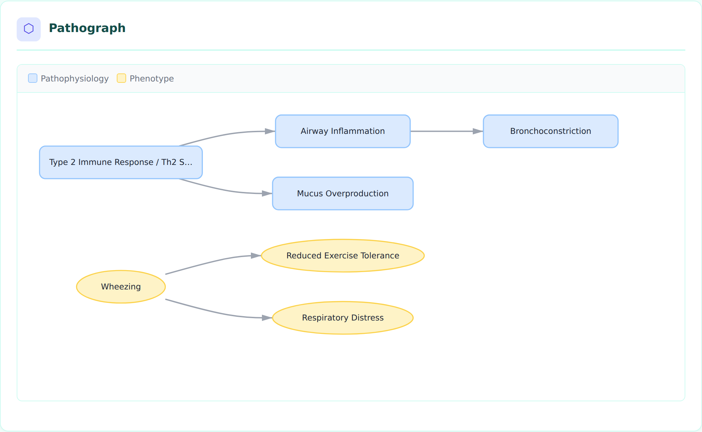
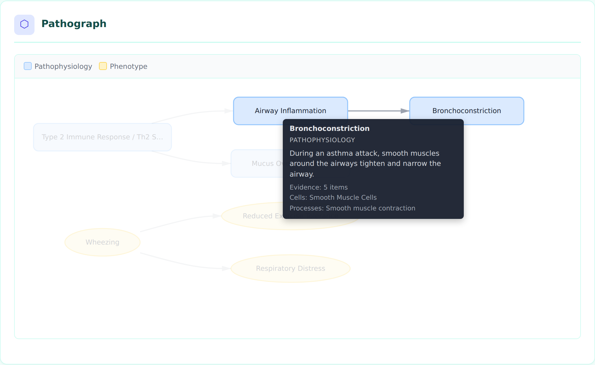
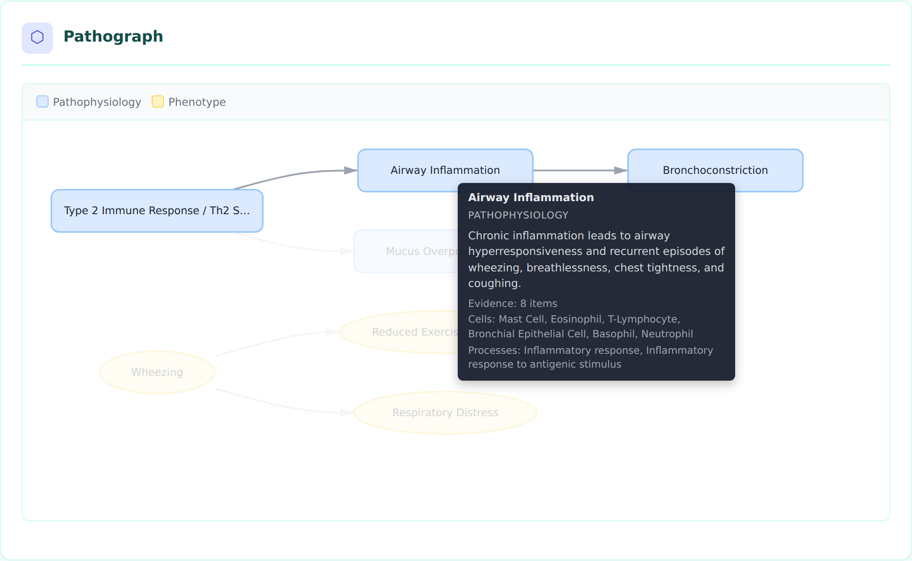
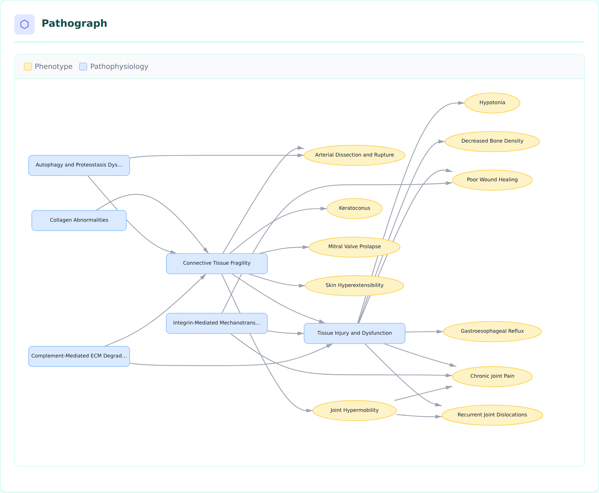

# Pathographs

Pathographs are interactive, directed-graph visualizations of disease causal mechanism networks. They replace the previous static Mermaid diagrams on disorder HTML pages with a D3.js + dagre-based rendering that supports hover tooltips, click-to-highlight, legend filtering, and zoom/pan.

## Overview

Each disorder page automatically generates a pathograph from the `downstream` edges in `pathophysiology` entries and the `sequelae` edges in `phenotypes`. The graph shows how upstream mechanisms cause downstream effects and how phenotypes lead to further complications.


*Asthma pathograph showing Type 2 Immune Response driving Airway Inflammation and Mucus Overproduction, with Wheezing leading to downstream phenotypes.*

## Node Types and Shapes

Nodes are drawn from six sections of the disorder YAML file, each with a distinct shape and color:

| Node Type | Shape | Color | Source Section |
|-----------|-------|-------|----------------|
| Pathophysiology | Rounded rectangle | Blue (#dbeafe) | `pathophysiology` |
| Phenotype | Ellipse | Amber (#fef3c7) | `phenotypes` |
| Environmental | Diamond | Green (#dcfce7) | `environmental` |
| Genetic | Hexagon | Purple (#f3e8ff) | `genetic` |
| Treatment | Rectangle | Pink (#fce7f3) | `treatments` |
| Biochemical | Circle | Indigo (#e0e7ff) | `biochemical` |
| Orphan (undefined target) | Dashed border, red | Red (#fee2e2) | N/A |

Different shapes (not just colors) improve accessibility for colorblind users.

## Interactive Features

### Hover Tooltips

Hovering over a node displays a tooltip with rich metadata pulled from the disorder YAML:

- Node name and type
- Description (truncated to 200 characters)
- Evidence count (number of PMID-backed evidence items)
- Cell types (CL ontology terms)
- Biological processes (GO terms)
- Genes (HGNC terms)
- Anatomical locations (UBERON terms)
- Frequency and severity (for phenotypes)
- Ontology term ID


*Tooltip for the Bronchoconstriction node showing its description, 5 evidence items, cell types (Smooth Muscle Cells), and biological processes.*

### Click to Highlight

Clicking a node highlights it and its direct neighbors (upstream and downstream), dimming all other nodes and edges. This helps trace causal chains in complex graphs.


*Clicking Airway Inflammation highlights its upstream cause (Type 2 Immune Response) and downstream effect (Bronchoconstriction), dimming unrelated nodes.*

Click the background to clear the highlight.

### Legend Filtering

The legend bar at the top of the pathograph shows which node types appear in the graph. Click a legend item to toggle visibility of that node type. This is useful for focusing on specific aspects of the mechanism network.

### Zoom and Pan

- **Scroll** to zoom in/out (0.3x to 3x)
- **Click and drag** the background to pan
- The graph uses `viewBox` scaling so it fits the container width by default

## Complex Graphs

For disorders with many mechanisms and phenotypes, the dagre layout algorithm arranges nodes in a hierarchical left-to-right flow, avoiding overlaps:


*Ehlers-Danlos Syndrome pathograph with 17 nodes showing collagen abnormalities cascading through connective tissue fragility to multiple downstream phenotypes.*

## How Pathograph Data is Generated

The pathograph pipeline has three stages:

1. **`build_causal_graph(disorder)`** (`graph.py`) — Extracts nodes from six disorder sections and edges from `downstream`/`sequelae` fields. Performs referential integrity checks (orphan target detection).

2. **`graph_to_json(graph, disorder)`** (`graph.py`) — Serializes the graph to JSON, enriching each node with metadata from the raw YAML data (evidence counts, cell types, GO processes, genes, locations, etc.).

3. **Template rendering** (`disorder.html.j2`) — Embeds the JSON inline and renders it using D3.js with dagre layout. The visualization is self-contained in each HTML page with no server-side dependencies.

### Data Flow

```
disorder YAML
    |
    v
build_causal_graph() --> CausalGraph (nodes + edges + integrity issues)
    |
    v
graph_to_json()     --> JSON string with enriched node metadata
    |
    v
disorder.html.j2    --> Inline <script> calling renderPathograph()
    |
    v
D3.js + dagre       --> Interactive SVG visualization
```

## YAML Structure That Drives Pathographs

Edges come from two sources:

### Pathophysiology `downstream` edges

```yaml
pathophysiology:
- name: Airway Inflammation
  description: Chronic inflammation leads to airway hyperresponsiveness...
  downstream:
  - target: Bronchoconstriction
    description: AHR provides the substrate for bronchoconstriction...
    evidence:
    - reference: PMID:38395082
      supports: SUPPORT
      snippet: "..."
```

### Phenotype `sequelae` edges

```yaml
phenotypes:
- name: Wheezing
  sequelae:
  - target: Respiratory Distress
  - target: Reduced Exercise Tolerance
```

The `target` field must match the `name` of another entry in any section. Unresolved targets appear as orphan nodes with dashed red borders.

## Node Granularity and Debundling (case study: CSAN)

A pathograph is only as informative as the node boundaries the curator chooses.
Compressing several mechanistic layers into one "gain-of-function" node produces a
valid but shallow graph that hides the actual causal wiring, and any node that is not
on an edge (`downstream`/`sequelae`, `target_phenotypes`/`target_mechanisms`) is
dropped from the serialized graph entirely. Crouzon syndrome with acanthosis nigricans
(CSAN, `MONDO:0012833`, recurrent FGFR3 p.Ala391Glu) is a compact worked example
([issue #4158](https://github.com/monarch-initiative/dismech/issues/4158), debundled in
[PR #4182](https://github.com/monarch-initiative/dismech/pull/4182)).

**Before** — a bundled four-node chain in which one node carried the variant, the
receptor biophysics, and two effector branches at once, and the syndrome-defining
cutaneous phenotype was present but disconnected (so invisible in the pathograph):

```text
FGFR3 A391E Gain-of-Function
  -> Sustained MAPK/STAT signaling in suture osteoblasts
  -> Premature cranial suture fusion
  -> Craniosynostosis
```

**After** — the single receptor lesion is split into its biophysical layers and then
forked into the skeletal and cutaneous phenotypes it actually drives:

```text
FGFR3 A391E Transmembrane Dimer Stabilization
  -> Constitutive FGFR3 Kinase Autophosphorylation        # branch point
       -> FRS2-GRB2-SOS RAS-MAPK Signaling
            -> Cranial Suture Osteoblast Differentiation
                 -> Premature cranial suture fusion -> Craniosynostosis
       -> FGFR3-STAT Signaling                            # parallel effector, kept separate
       -> FGFR3 Signaling in Keratinocytes                # cutaneous fork
            -> Epidermal Hyperkeratosis and Hyperpigmentation -> Acanthosis Nigricans
```

### Modeling rules this case study illustrates

- **One node = one mechanistic claim.** Split a node when it bundles steps that have
  *separable evidence*, *different cell types/locations*, or *different downstream
  targets*. In CSAN, dimer stabilization (`PMID:21536014`, `PMID:23437153`) and
  activation-loop autophosphorylation are distinct, separately-evidenced biophysical
  steps, so they became two nodes rather than one "gain-of-function" node.
- **Branch at the real branch point, not at a pathway label.** The activated receptor
  (`Constitutive FGFR3 Kinase Autophosphorylation`) is the node from which RAS-MAPK,
  STAT, and the keratinocyte branch all diverge. Modeling the fork at the receptor —
  rather than inside a single "MAPK/STAT" node — makes the parallel outputs explicit.
- **Do not merge parallel effectors under a pathway shorthand.** STAT and ERK are
  parallel FGFR3 outputs with distinct biology; "MAPK/STAT" as one node hid that. Keep
  them as sibling nodes unless a specific downstream phenotype edge genuinely requires
  both inputs.
- **Connect every syndrome-defining phenotype into the graph.** Acanthosis nigricans is
  diagnostic for CSAN but was an orphan before debundling. Adding the keratinocyte →
  epidermal-change → phenotype branch (and linking treatments via `target_phenotypes`)
  is what brings these nodes into the serialized pathograph.
- **Make edge confidence visible, and let it expose knowledge gaps.** Edge confidence
  varies by layer: human genetics and craniosynostosis are strongly evidenced
  (`causal_link_type: DIRECT` / `INDIRECT_KNOWN_INTERMEDIATES`), whereas the
  keratinocyte route to flexural acanthosis is inferential
  (`causal_link_type: INDIRECT_UNKNOWN_INTERMEDIATES`, node
  `mechanism_confidence: PROVISIONAL`). Rather than overstate that edge, the cutaneous
  branch carries an explicit `KNOWLEDGE_GAP` discussion
  (`gap_csan_cutaneous_fgfr3_branch`) attached to the provisional nodes and phenotype.

### When *not* to debundle

Granularity has a cost: a graph that expands every canonical pathway into its textbook
intermediates becomes pathway-heavy and harder to read without adding disease-specific
insight. Split a node only when the finer boundary carries its own evidence, its own
ontology annotations, or a distinct downstream target. If an intermediate has none of
those, leave it folded into the adjacent node and capture the detail in the node
`description` instead. The goal is a graph whose node boundaries mirror the points where
the *causal evidence* actually changes.

## Dependencies

The pathograph loads two libraries via CDN:

- **D3.js v7** (`https://d3js.org/d3.v7.min.js`) — SVG rendering, zoom, event handling
- **dagre 0.8.5** (`https://cdn.jsdelivr.net/npm/dagre@0.8.5/dist/dagre.min.js`) — Hierarchical graph layout algorithm

No build step or bundling is required. The libraries load directly in the browser.

## Accessibility

Each pathograph SVG includes:
- `role="img"` attribute
- `<title>` element with the disorder name
- `<desc>` element describing the visualization purpose
- Distinct shapes per node type (not just color-coded)
- Keyboard-accessible zoom via browser native scroll

## Regenerating Screenshots

The screenshot script uses Playwright with Chromium:

```bash
# Ensure D3/dagre are cached locally for headless browser
curl -sL https://d3js.org/d3.v7.min.js -o /tmp/d3.v7.min.js
curl -sL https://cdn.jsdelivr.net/npm/dagre@0.8.5/dist/dagre.min.js -o /tmp/dagre.min.js

# Render disorder pages first
uv run python -m dismech.render kb/disorders/Asthma.yaml

# Take screenshots
node scripts/screenshot_pathograph.js
```

Screenshots are saved to `docs/images/pathograph_*.png`.
