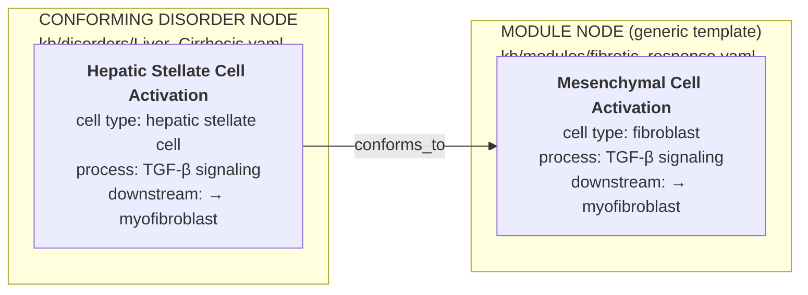

# Primer: Mechanism Modules & Conformance

Some pathological processes recur across many diseases — the fibrotic response,
lysosomal substrate accumulation, glaucomatous optic neuropathy. Dismech captures
each as a **mechanism module** in `kb/modules/`, and individual disorders declare
that one of their pathophysiology nodes **conforms to** a module node.

## Conformance is *not* DRY inheritance

This is the key mental model. Conformance is a **consistency check**, not code
reuse. A conforming disorder node **fully duplicates** the content — it does not
inherit or `$ref` the module. The `conforms_to` link just says "this node is an
instance of that shared pattern, check that it looks like one."



Reading the diagram:

- **Module node** — *defines the pattern*. Generic cell type (`fibroblast`), the
  conserved biological process, and the conserved causal edge.
- **Disorder node** — *conforms to* the module via
  `conforms_to: "fibrotic_response#Mesenchymal Cell Activation"`, and **fully
  duplicates** the content rather than inheriting it. Row by row:
    - `cell type: hepatic stellate cell` — **substituted** with the organ-specific cell.
    - `process: TGF-β signaling` — **same** conserved process.
    - `downstream: → myofibroblast` — **same** conserved causal edge.

**Organ-specific substitution** is the whole point: the module says generic
`fibroblast`; the conforming node swaps in the organ's real cell type
(`hepatic stellate cell`) while keeping the conserved biological process and
causal edges.

## How to declare it

```yaml
# In kb/disorders/Liver_Cirrhosis.yaml
pathophysiology:
- name: Hepatic Stellate Cell Activation
  conforms_to: "fibrotic_response#Mesenchymal Cell Activation"
  cell_types:
  - preferred_term: Hepatic Stellate Cell
    term: { id: CL:0000632, label: hepatic stellate cell }
  biological_processes:
  - preferred_term: TGF-beta Receptor Signaling
    term: { id: GO:0007179, label: transforming growth factor beta receptor signaling pathway }
    modifier: INCREASED
```

The reference format is `"module_name#Node Name"` — `module_name` is the module
filename in `kb/modules/` (without `.yaml`); `Node Name` matches a
pathophysiology `name` in that module.

## Principles

- **Same schema.** Modules validate against the `Disease` class, just like disorder files.
- **Not DRY.** Conformance is for cross-disease consistency, not inheritance — duplicate the content.
- **Substitute, don't abstract.** Generic module cell types → organ-specific types in the conforming node.
- **Consistency checking.** A `conforms_to` node should carry the module's expected processes and causal edges.

## The module library

There are many modules (conserved fibrosis, lysosomal storage, aortopathy
TGF-β dysregulation, ciliopathy, cardiac ion-channel repolarization, and a large
family of "disease-like phenotype" final-common-pathway modules such as
osteoporosis, glaucoma, cataract, PAH, and more). The authoritative, current
list — with each module's key conformance target — lives in the project
`CLAUDE.md` under **"Mechanism Modules"**, alongside the module YAML in
`kb/modules/`.

## Go deeper

- `CLAUDE.md` → "Mechanism Modules" (full module catalog + conformance targets).
- [Schema: Pathophysiology](../schema/classes/Pathophysiology.md) · [CausalEdge](../schema/classes/CausalEdge.md) · [MechanisticHypothesis](../schema/classes/MechanisticHypothesis.md)
- [Data Model overview](../data-model.md)
