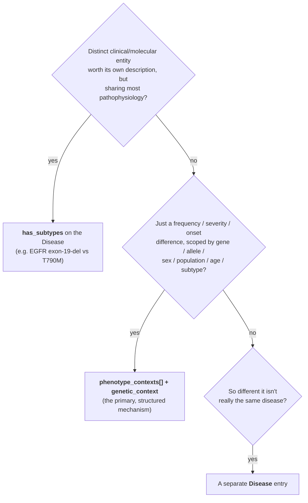

# Primer: Phenotype Association Context

**The question this answers:** the same disease often shows a phenotype at
different rates (or not at all) depending on *which gene*, *which mutation type*,
*which population*, or *which subtype* you're looking at. How do you record that
without flattening it into a single misleading number?

This is the canonical Dismech use case — not risk modeling, but **scoped
phenotype assertions**: one source is OMIM-like (gene-scoped, single-gene
disease), another is Orphanet-like (rolled up across the whole rare disease).

## Source granularity: OMIM-like vs Orphanet-like

| | **OMIM-like source** | **Orphanet-like source** |
|---|---|---|
| Scope | One gene → one disease entity | One rare disease, rolled up across genes |
| Phenotype stats | Gene-specific frequency / onset | Overall frequency for the whole disorder |
| Example claim | "BRCA2 (FA-D1) patients do **not** develop bone marrow failure" | "~82% of Fanconi Anemia patients develop bone marrow failure" |
| Where it lands | a `phenotype_contexts` entry with a `genetic_context` | a `phenotype_contexts` entry with **no** scoping slots (the default/overall claim) |

Both live on the **same** `Phenotype`, as separate entries in its
`phenotype_contexts` list. The unscoped entry carries the overall number; each
scoped entry carries a qualified one.

## Which mechanism do I use?



Rule of thumb: **`phenotype_contexts`** for "same disease, different numbers by
context"; **`has_subtypes`** when the subtype is the defining axis and deserves
its own prose; a **separate `Disease`** only when the entities diverge enough
that one entry would mislead.

## Evidence locality

Evidence attaches to the claim it actually supports — this is the
"frequency–evidence separation" fix:

- Evidence for the **base disease→phenotype** association → on the `Phenotype` (or the unscoped context).
- Evidence for a **context-specific** frequency / severity / onset → on **that** `PhenotypeContext`, not the parent.

A context with no scoping slots (`genetic_context`, `sex`, `population`,
`age_range`, `subtype`) is how you give the overall frequency number its own
citation.

## Worked YAML — Fanconi Anemia bone marrow failure

```yaml
phenotype_contexts:
  # Overall (Orphanet-like): no scoping slots → this is the default claim
  - frequency: VERY_FREQUENT
    notes: Over 80% of FA patients develop bone marrow failure.
    evidence:
      - reference: PMID:31558676
        snippet: "82% of the patients developed BMF"

  # Gene-scoped (OMIM-like): BRCA2 patients do NOT get BMF
  - genetic_context:
      gene:
        preferred_term: FANCD1/BRCA2
        term: { id: hgnc:1101, label: BRCA2 }
      complementation_group: FA-D1
    frequency: EXCLUDED
    notes: Neither FANCD1/BRCA2 patient developed BMF.
    evidence:
      - reference: PMID:31558676
        snippet: "neither of the patients with FANCD1 mutations developed BMF"

  # Allele-type-scoped: nonsense mutations → earlier cancer onset
  - genetic_context:
      allele_type: nonsense
    notes: Earlier cancer onset than deletions (P=0.011).
    evidence:
      - reference: PMID:31558676
        snippet: "patients with nonsense and splice site mutations developed the
          first cancer at a significantly lower age than patients with deletions"
```

## Go deeper

- [Contextualization](../explanation/contextualization.md) — the full mechanism list, `GeneticContext` slots, limitations.
- [Schema: PhenotypeContext](../schema/classes/PhenotypeContext.md) · [GeneticContext](../schema/classes/GeneticContext.md) · [Phenotype](../schema/classes/Phenotype.md)
- `kb/disorders/Fanconi_Anemia.yaml` — the richest genetic-context example in the knowledge base.
