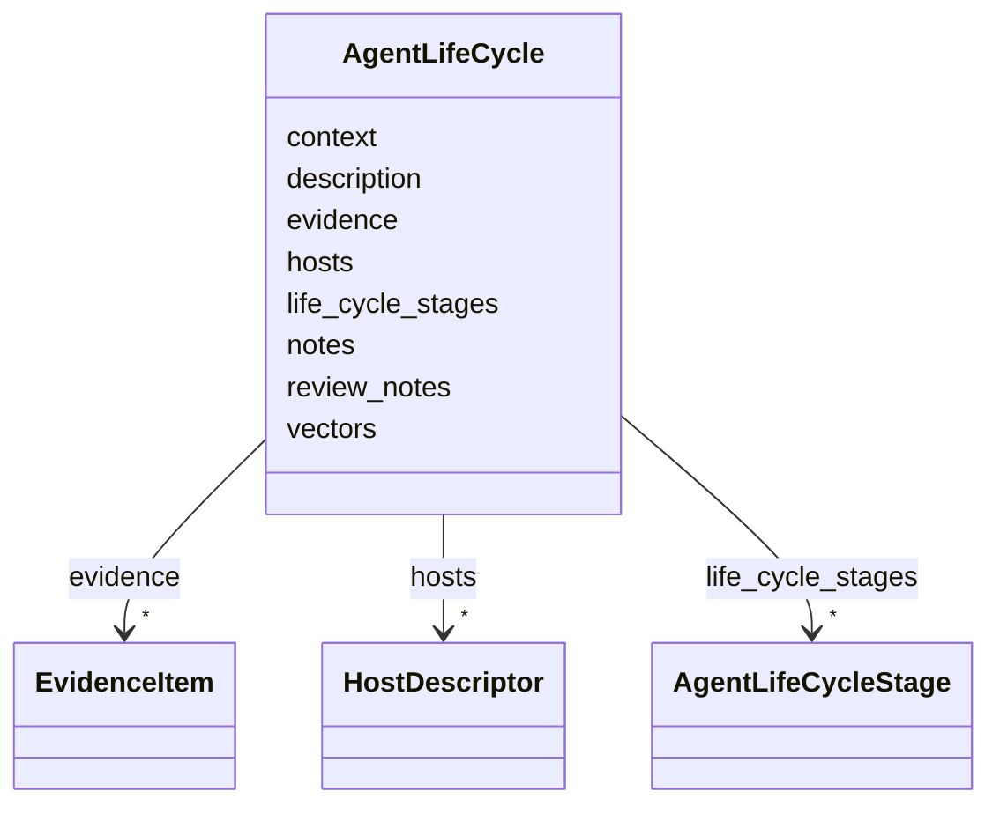

# Class: AgentLifeCycle 


URI: [dismech:AgentLifeCycle](https://w3id.org/monarch-initiative/dismech/AgentLifeCycle)





<!-- no inheritance hierarchy -->


## Slots

| Name | Cardinality and Range | Description | Inheritance |
| ---  | --- | --- | --- |
| [description](description.md) | 0..1 <br/> [String](String.md) |  | direct |
| [life_cycle_stages](life_cycle_stages.md) | * <br/> [AgentLifeCycleStage](AgentLifeCycleStage.md) |  | direct |
| [hosts](hosts.md) | * <br/> [HostDescriptor](HostDescriptor.md) |  | direct |
| [vectors](vectors.md) | * <br/> [String](String.md) |  | direct |
| [evidence](evidence.md) | * _recommended_ <br/> [EvidenceItem](EvidenceItem.md) |  | direct |
| [notes](notes.md) | 0..1 <br/> [String](String.md) |  | direct |
| [context](context.md) | 0..1 <br/> [String](String.md) |  | direct |
| [review_notes](review_notes.md) | 0..1 <br/> [String](String.md) |  | direct |


## Usages

| used by | used in | type | used |
| ---  | --- | --- | --- |
| [Disease](Disease.md) | [agent_life_cycle](agent_life_cycle.md) | range | [AgentLifeCycle](AgentLifeCycle.md) |


## Identifier and Mapping Information


### Schema Source


* from schema: https://w3id.org/monarch-initiative/dismech


## Mappings

| Mapping Type | Mapped Value |
| ---  | ---  |
| self | dismech:AgentLifeCycle |
| native | dismech:AgentLifeCycle |


## LinkML Source

<!-- TODO: investigate https://stackoverflow.com/questions/37606292/how-to-create-tabbed-code-blocks-in-mkdocs-or-sphinx -->

### Direct

<details>
```yaml
name: AgentLifeCycle
from_schema: https://w3id.org/monarch-initiative/dismech
slots:
- description
- life_cycle_stages
- hosts
- vectors
- evidence
- notes
- context
- review_notes

```
</details>

### Induced

<details>
```yaml
name: AgentLifeCycle
from_schema: https://w3id.org/monarch-initiative/dismech
attributes:
  description:
    name: description
    from_schema: https://w3id.org/monarch-initiative/dismech
    rank: 1000
    alias: description
    owner: AgentLifeCycle
    domain_of:
    - Descriptor
    - GeneticContext
    - Dataset
    - ClinicalTrial
    - ComputationalModel
    - DifferentialDiagnosis
    - Subtype
    - CausalEdge
    - TreatmentMechanismTarget
    - EpidemiologyInfo
    - Pathophysiology
    - Phenotype
    - HistopathologyFinding
    - Environmental
    - Disease
    - Stage
    - AgentLifeCycle
    - AgentLifeCycleStage
    - AnimalModel
    - Treatment
    - InfectiousAgent
    - Transmission
    - Assay
    - Diagnosis
    - Inheritance
    - Variant
    - FunctionalEffect
    - Mechanism
    - ModelingConsideration
    - Definition
    - CriteriaSet
    - ConditionDescriptor
    - GOEnrichment
    - ComorbidityHypothesis
    - UpstreamConditionHypothesis
    - MechanisticHypothesis
    range: string
  life_cycle_stages:
    name: life_cycle_stages
    from_schema: https://w3id.org/monarch-initiative/dismech
    rank: 1000
    alias: life_cycle_stages
    owner: AgentLifeCycle
    domain_of:
    - AgentLifeCycle
    range: AgentLifeCycleStage
    multivalued: true
    inlined: true
    inlined_as_list: true
  hosts:
    name: hosts
    comments:
    - Use NCBITaxon terms for host organisms
    - Use the role slot to indicate definitive, intermediate, reservoir, or accidental
      host
    from_schema: https://w3id.org/monarch-initiative/dismech
    rank: 1000
    alias: hosts
    owner: AgentLifeCycle
    domain_of:
    - AgentLifeCycle
    range: HostDescriptor
    multivalued: true
    inlined: true
    inlined_as_list: true
  vectors:
    name: vectors
    from_schema: https://w3id.org/monarch-initiative/dismech
    rank: 1000
    alias: vectors
    owner: AgentLifeCycle
    domain_of:
    - AgentLifeCycle
    range: string
    multivalued: true
  evidence:
    name: evidence
    from_schema: https://w3id.org/monarch-initiative/dismech
    rank: 1000
    alias: evidence
    owner: AgentLifeCycle
    domain_of:
    - PhenotypeContext
    - Dataset
    - ClinicalTrial
    - ComputationalModel
    - DifferentialDiagnosis
    - Subtype
    - CausalEdge
    - TreatmentMechanismTarget
    - Finding
    - Prevalence
    - ProgressionInfo
    - EpidemiologyInfo
    - Pathophysiology
    - Phenotype
    - Biochemical
    - HistopathologyFinding
    - Genetic
    - Environmental
    - Stage
    - AgentLifeCycle
    - AgentLifeCycleStage
    - AnimalModel
    - Treatment
    - InfectiousAgent
    - Transmission
    - Diagnosis
    - Inheritance
    - Variant
    - ModelingConsideration
    - ClassificationAssignment
    - Definition
    - CriteriaSet
    - AssociationSignal
    - AssociationStatistics
    - ComorbidityHypothesis
    - UpstreamConditionHypothesis
    - MechanisticHypothesis
    range: EvidenceItem
    recommended: true
    multivalued: true
    inlined: true
    inlined_as_list: true
  notes:
    name: notes
    examples:
    - value: Contagious stage where symptoms appear and the bacteria can be spread
        to others.
    from_schema: https://w3id.org/monarch-initiative/dismech
    rank: 1000
    alias: notes
    owner: AgentLifeCycle
    domain_of:
    - GeneticContext
    - OnsetDescriptor
    - PhenotypeContext
    - Dataset
    - ClinicalTrial
    - ComputationalModel
    - DifferentialDiagnosis
    - Prevalence
    - ProgressionInfo
    - EpidemiologyInfo
    - Pathophysiology
    - Phenotype
    - Biochemical
    - HistopathologyFinding
    - Genetic
    - Environmental
    - Disease
    - Stage
    - AgentLifeCycle
    - AgentLifeCycleStage
    - Treatment
    - Transmission
    - Diagnosis
    - ClassificationAssignment
    - Definition
    - CriteriaSet
    - TermMapping
    - MappingConsistency
    - ComorbidityAssociation
    - AssociationSignal
    - AssociationMetric
    - AssociationStatistics
    - MechanisticHypothesis
    range: string
  context:
    name: context
    examples:
    - value: Pregnancy
    from_schema: https://w3id.org/monarch-initiative/dismech
    rank: 1000
    alias: context
    owner: AgentLifeCycle
    domain_of:
    - Phenotype
    - Biochemical
    - HistopathologyFinding
    - Stage
    - AgentLifeCycle
    - AgentLifeCycleStage
    - Treatment
    range: string
  review_notes:
    name: review_notes
    examples:
    - value: Added an additional clinically relevant subtype.
    from_schema: https://w3id.org/monarch-initiative/dismech
    rank: 1000
    alias: review_notes
    owner: AgentLifeCycle
    domain_of:
    - ClinicalTrial
    - Subtype
    - ProgressionInfo
    - Phenotype
    - Genetic
    - Environmental
    - Disease
    - Stage
    - AgentLifeCycle
    - AgentLifeCycleStage
    - Treatment
    range: string

```
</details>