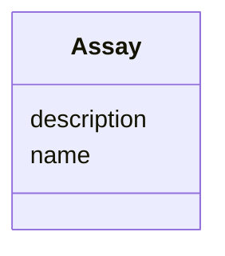

# Class: Assay 


URI: [dismech:Assay](https://w3id.org/monarch-initiative/dismech/Assay)





<!-- no inheritance hierarchy -->


## Slots

| Name | Cardinality and Range | Description | Inheritance |
| ---  | --- | --- | --- |
| [name](name.md) | 1 <br/> [String](String.md) |  | direct |
| [description](description.md) | 0..1 <br/> [String](String.md) |  | direct |


## Identifier and Mapping Information


### Schema Source


* from schema: https://w3id.org/monarch-initiative/dismech


## Mappings

| Mapping Type | Mapped Value |
| ---  | ---  |
| self | dismech:Assay |
| native | dismech:Assay |


## LinkML Source

<!-- TODO: investigate https://stackoverflow.com/questions/37606292/how-to-create-tabbed-code-blocks-in-mkdocs-or-sphinx -->

### Direct

<details>
```yaml
name: Assay
from_schema: https://w3id.org/monarch-initiative/dismech
slots:
- name
- description

```
</details>

### Induced

<details>
```yaml
name: Assay
from_schema: https://w3id.org/monarch-initiative/dismech
attributes:
  name:
    name: name
    examples:
    - value: Adolescent Nephronophthisis
    from_schema: https://w3id.org/monarch-initiative/dismech
    rank: 1000
    identifier: true
    alias: name
    owner: Assay
    domain_of:
    - ClinicalTrial
    - ComputationalModel
    - DifferentialDiagnosis
    - Subtype
    - EpidemiologyInfo
    - Pathophysiology
    - Phenotype
    - Biochemical
    - HistopathologyFinding
    - Genetic
    - Environmental
    - Disease
    - Stage
    - AgentLifeCycleStage
    - Treatment
    - InfectiousAgent
    - Transmission
    - Assay
    - Diagnosis
    - Inheritance
    - Variant
    - Mechanism
    - ModelingConsideration
    - Definition
    - CriteriaSet
    - ComorbidityAssociation
    range: string
    required: true
  description:
    name: description
    from_schema: https://w3id.org/monarch-initiative/dismech
    rank: 1000
    alias: description
    owner: Assay
    domain_of:
    - Descriptor
    - GeneticContext
    - Dataset
    - ClinicalTrial
    - ComputationalModel
    - DifferentialDiagnosis
    - Subtype
    - CausalEdge
    - TreatmentMechanismTarget
    - EpidemiologyInfo
    - Pathophysiology
    - Phenotype
    - HistopathologyFinding
    - Environmental
    - Disease
    - Stage
    - AgentLifeCycle
    - AgentLifeCycleStage
    - AnimalModel
    - Treatment
    - InfectiousAgent
    - Transmission
    - Assay
    - Diagnosis
    - Inheritance
    - Variant
    - FunctionalEffect
    - Mechanism
    - ModelingConsideration
    - Definition
    - CriteriaSet
    - ConditionDescriptor
    - GOEnrichment
    - ComorbidityHypothesis
    - UpstreamConditionHypothesis
    - MechanisticHypothesis
    range: string

```
</details>