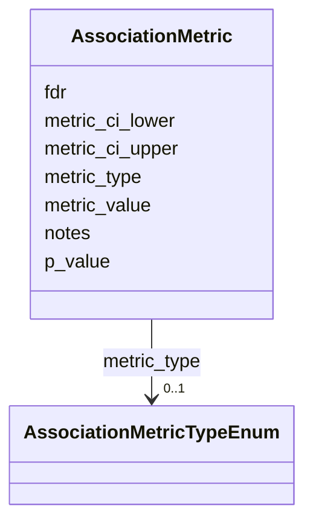

# Class: AssociationMetric 


_Quantitative association metric and its uncertainty._


URI: [dismech:AssociationMetric](https://w3id.org/monarch-initiative/dismech/AssociationMetric)





<!-- no inheritance hierarchy -->


## Slots

| Name | Cardinality and Range | Description | Inheritance |
| ---  | --- | --- | --- |
| [metric_type](metric_type.md) | 0..1 <br/> [AssociationMetricTypeEnum](AssociationMetricTypeEnum.md) | Metric type (e | direct |
| [metric_value](metric_value.md) | 0..1 <br/> [Float](Float.md) | Metric value | direct |
| [metric_ci_lower](metric_ci_lower.md) | 0..1 <br/> [Float](Float.md) | Lower confidence interval bound | direct |
| [metric_ci_upper](metric_ci_upper.md) | 0..1 <br/> [Float](Float.md) | Upper confidence interval bound | direct |
| [p_value](p_value.md) | 0..1 <br/> [Float](Float.md) | P-value for an association or enrichment | direct |
| [fdr](fdr.md) | 0..1 <br/> [Float](Float.md) | FDR-adjusted p-value for an association or enrichment | direct |
| [notes](notes.md) | 0..1 <br/> [String](String.md) |  | direct |


## Usages

| used by | used in | type | used |
| ---  | --- | --- | --- |
| [AssociationSignal](AssociationSignal.md) | [metrics](metrics.md) | range | [AssociationMetric](AssociationMetric.md) |
| [AssociationStatistics](AssociationStatistics.md) | [metrics](metrics.md) | range | [AssociationMetric](AssociationMetric.md) |


## Identifier and Mapping Information


### Schema Source


* from schema: https://w3id.org/monarch-initiative/dismech


## Mappings

| Mapping Type | Mapped Value |
| ---  | ---  |
| self | dismech:AssociationMetric |
| native | dismech:AssociationMetric |


## LinkML Source

<!-- TODO: investigate https://stackoverflow.com/questions/37606292/how-to-create-tabbed-code-blocks-in-mkdocs-or-sphinx -->

### Direct

<details>
```yaml
name: AssociationMetric
description: Quantitative association metric and its uncertainty.
from_schema: https://w3id.org/monarch-initiative/dismech
slots:
- metric_type
- metric_value
- metric_ci_lower
- metric_ci_upper
- p_value
- fdr
- notes

```
</details>

### Induced

<details>
```yaml
name: AssociationMetric
description: Quantitative association metric and its uncertainty.
from_schema: https://w3id.org/monarch-initiative/dismech
attributes:
  metric_type:
    name: metric_type
    description: Metric type (e.g., OR, RR, HR)
    from_schema: https://w3id.org/monarch-initiative/dismech
    rank: 1000
    alias: metric_type
    owner: AssociationMetric
    domain_of:
    - AssociationMetric
    range: AssociationMetricTypeEnum
  metric_value:
    name: metric_value
    description: Metric value
    from_schema: https://w3id.org/monarch-initiative/dismech
    rank: 1000
    alias: metric_value
    owner: AssociationMetric
    domain_of:
    - AssociationMetric
    range: float
  metric_ci_lower:
    name: metric_ci_lower
    description: Lower confidence interval bound
    from_schema: https://w3id.org/monarch-initiative/dismech
    rank: 1000
    alias: metric_ci_lower
    owner: AssociationMetric
    domain_of:
    - AssociationMetric
    range: float
  metric_ci_upper:
    name: metric_ci_upper
    description: Upper confidence interval bound
    from_schema: https://w3id.org/monarch-initiative/dismech
    rank: 1000
    alias: metric_ci_upper
    owner: AssociationMetric
    domain_of:
    - AssociationMetric
    range: float
  p_value:
    name: p_value
    description: P-value for an association or enrichment
    from_schema: https://w3id.org/monarch-initiative/dismech
    rank: 1000
    alias: p_value
    owner: AssociationMetric
    domain_of:
    - AssociationMetric
    - GOEnrichmentTerm
    range: float
  fdr:
    name: fdr
    description: FDR-adjusted p-value for an association or enrichment
    from_schema: https://w3id.org/monarch-initiative/dismech
    rank: 1000
    alias: fdr
    owner: AssociationMetric
    domain_of:
    - AssociationMetric
    - GOEnrichmentTerm
    range: float
  notes:
    name: notes
    examples:
    - value: Contagious stage where symptoms appear and the bacteria can be spread
        to others.
    from_schema: https://w3id.org/monarch-initiative/dismech
    rank: 1000
    alias: notes
    owner: AssociationMetric
    domain_of:
    - GeneticContext
    - OnsetDescriptor
    - PhenotypeContext
    - Dataset
    - ClinicalTrial
    - ComputationalModel
    - DifferentialDiagnosis
    - Prevalence
    - ProgressionInfo
    - EpidemiologyInfo
    - Pathophysiology
    - Phenotype
    - Biochemical
    - HistopathologyFinding
    - Genetic
    - Environmental
    - Disease
    - Stage
    - AgentLifeCycle
    - AgentLifeCycleStage
    - Treatment
    - Transmission
    - Diagnosis
    - ClassificationAssignment
    - Definition
    - CriteriaSet
    - TermMapping
    - MappingConsistency
    - ComorbidityAssociation
    - AssociationSignal
    - AssociationMetric
    - AssociationStatistics
    - MechanisticHypothesis
    range: string

```
</details>