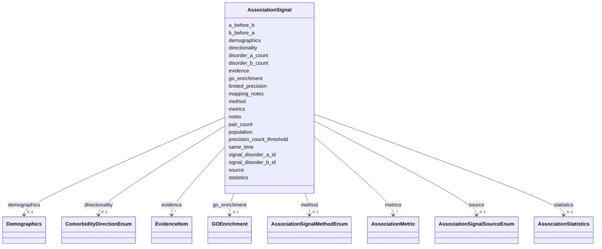

# Class: AssociationSignal 


_An association signal from EHR, registry, or computational sources, optionally stratified by sex, age, or cohort._


URI: [dismech:AssociationSignal](https://w3id.org/monarch-initiative/dismech/AssociationSignal)





<!-- no inheritance hierarchy -->


## Slots

| Name | Cardinality and Range | Description | Inheritance |
| ---  | --- | --- | --- |
| [source](source.md) | 0..1 <br/> [AssociationSignalSourceEnum](AssociationSignalSourceEnum.md) | Source dataset or provenance label | direct |
| [method](method.md) | 0..1 <br/> [AssociationSignalMethodEnum](AssociationSignalMethodEnum.md) | Method or pipeline name | direct |
| [signal_disorder_a_id](signal_disorder_a_id.md) | 0..1 <br/> [Uriorcurie](Uriorcurie.md) | Original identifier for disorder A in this signal (CURIE, e | direct |
| [signal_disorder_b_id](signal_disorder_b_id.md) | 0..1 <br/> [Uriorcurie](Uriorcurie.md) | Original identifier for disorder B in this signal (CURIE, e | direct |
| [population](population.md) | 0..1 <br/> [String](String.md) | Population or cohort description (e | direct |
| [demographics](demographics.md) | 0..1 <br/> [Demographics](Demographics.md) | Demographic stratification for an association signal | direct |
| [mapping_notes](mapping_notes.md) | 0..1 <br/> [String](String.md) | Notes on code-to-concept mapping decisions for this signal | direct |
| [disorder_a_count](disorder_a_count.md) | 0..1 <br/> [Integer](Integer.md) | Number of records/patients carrying disorder A in the source dataset | direct |
| [disorder_b_count](disorder_b_count.md) | 0..1 <br/> [Integer](Integer.md) | Number of records/patients carrying disorder B in the source dataset | direct |
| [pair_count](pair_count.md) | 0..1 <br/> [Integer](Integer.md) | Number of records/patients with co-occurrence of disorder A and disorder B in... | direct |
| [limited_precision](limited_precision.md) | 0..1 <br/> [Boolean](Boolean.md) | Whether the signal has limited statistical precision due to small co-occurren... | direct |
| [precision_count_threshold](precision_count_threshold.md) | 0..1 <br/> [Integer](Integer.md) | Co-occurrence count threshold used to flag limited precision | direct |
| [directionality](directionality.md) | 0..1 <br/> [ComorbidityDirectionEnum](ComorbidityDirectionEnum.md) | Direction of a comorbidity/trajectory association | direct |
| [a_before_b](a_before_b.md) | 0..1 <br/> [Float](Float.md) | Probability or fraction of A before B in an EHR signal | direct |
| [b_before_a](b_before_a.md) | 0..1 <br/> [Float](Float.md) | Probability or fraction of B before A in an EHR signal | direct |
| [same_time](same_time.md) | 0..1 <br/> [Float](Float.md) | Probability or fraction of A and B occurring in the same time window | direct |
| [metrics](metrics.md) | * <br/> [AssociationMetric](AssociationMetric.md) | Quantitative association metrics | direct |
| [statistics](statistics.md) | 0..1 <br/> [AssociationStatistics](AssociationStatistics.md) | Statistical summary for an association signal | direct |
| [go_enrichment](go_enrichment.md) | 0..1 <br/> [GOEnrichment](GOEnrichment.md) | GO enrichment results associated with a signal | direct |
| [evidence](evidence.md) | * _recommended_ <br/> [EvidenceItem](EvidenceItem.md) |  | direct |
| [notes](notes.md) | 0..1 <br/> [String](String.md) |  | direct |


## Usages

| used by | used in | type | used |
| ---  | --- | --- | --- |
| [ComorbidityAssociation](ComorbidityAssociation.md) | [association_signals](association_signals.md) | range | [AssociationSignal](AssociationSignal.md) |


## Identifier and Mapping Information


### Schema Source


* from schema: https://w3id.org/monarch-initiative/dismech


## Mappings

| Mapping Type | Mapped Value |
| ---  | ---  |
| self | dismech:AssociationSignal |
| native | dismech:AssociationSignal |


## LinkML Source

<!-- TODO: investigate https://stackoverflow.com/questions/37606292/how-to-create-tabbed-code-blocks-in-mkdocs-or-sphinx -->

### Direct

<details>
```yaml
name: AssociationSignal
description: An association signal from EHR, registry, or computational sources, optionally
  stratified by sex, age, or cohort.
from_schema: https://w3id.org/monarch-initiative/dismech
slots:
- source
- method
- signal_disorder_a_id
- signal_disorder_b_id
- population
- demographics
- mapping_notes
- disorder_a_count
- disorder_b_count
- pair_count
- limited_precision
- precision_count_threshold
- directionality
- a_before_b
- b_before_a
- same_time
- metrics
- statistics
- go_enrichment
- evidence
- notes
slot_usage:
  source:
    name: source
    range: AssociationSignalSourceEnum
  method:
    name: method
    range: AssociationSignalMethodEnum

```
</details>

### Induced

<details>
```yaml
name: AssociationSignal
description: An association signal from EHR, registry, or computational sources, optionally
  stratified by sex, age, or cohort.
from_schema: https://w3id.org/monarch-initiative/dismech
slot_usage:
  source:
    name: source
    range: AssociationSignalSourceEnum
  method:
    name: method
    range: AssociationSignalMethodEnum
attributes:
  source:
    name: source
    description: Source dataset or provenance label
    from_schema: https://w3id.org/monarch-initiative/dismech
    rank: 1000
    alias: source
    owner: AssociationSignal
    domain_of:
    - AssociationSignal
    range: AssociationSignalSourceEnum
  method:
    name: method
    description: Method or pipeline name
    from_schema: https://w3id.org/monarch-initiative/dismech
    rank: 1000
    alias: method
    owner: AssociationSignal
    domain_of:
    - AssociationSignal
    - GOEnrichment
    range: AssociationSignalMethodEnum
  signal_disorder_a_id:
    name: signal_disorder_a_id
    description: Original identifier for disorder A in this signal (CURIE, e.g., ICD10:E12)
    from_schema: https://w3id.org/monarch-initiative/dismech
    rank: 1000
    alias: signal_disorder_a_id
    owner: AssociationSignal
    domain_of:
    - AssociationSignal
    range: uriorcurie
  signal_disorder_b_id:
    name: signal_disorder_b_id
    description: Original identifier for disorder B in this signal (CURIE, e.g., ICD10:L28)
    from_schema: https://w3id.org/monarch-initiative/dismech
    rank: 1000
    alias: signal_disorder_b_id
    owner: AssociationSignal
    domain_of:
    - AssociationSignal
    range: uriorcurie
  population:
    name: population
    description: Population or cohort description (e.g., for prevalence or association
      signals)
    examples:
    - value: Global
    from_schema: https://w3id.org/monarch-initiative/dismech
    rank: 1000
    alias: population
    owner: AssociationSignal
    domain_of:
    - PhenotypeContext
    - Prevalence
    - AssociationSignal
    range: string
  demographics:
    name: demographics
    description: Demographic stratification for an association signal
    from_schema: https://w3id.org/monarch-initiative/dismech
    rank: 1000
    alias: demographics
    owner: AssociationSignal
    domain_of:
    - AssociationSignal
    range: Demographics
    inlined: true
  mapping_notes:
    name: mapping_notes
    description: Notes on code-to-concept mapping decisions for this signal
    from_schema: https://w3id.org/monarch-initiative/dismech
    rank: 1000
    alias: mapping_notes
    owner: AssociationSignal
    domain_of:
    - AssociationSignal
    range: string
  disorder_a_count:
    name: disorder_a_count
    description: Number of records/patients carrying disorder A in the source dataset
    from_schema: https://w3id.org/monarch-initiative/dismech
    rank: 1000
    alias: disorder_a_count
    owner: AssociationSignal
    domain_of:
    - AssociationSignal
    range: integer
  disorder_b_count:
    name: disorder_b_count
    description: Number of records/patients carrying disorder B in the source dataset
    from_schema: https://w3id.org/monarch-initiative/dismech
    rank: 1000
    alias: disorder_b_count
    owner: AssociationSignal
    domain_of:
    - AssociationSignal
    range: integer
  pair_count:
    name: pair_count
    description: Number of records/patients with co-occurrence of disorder A and disorder
      B in the source dataset
    from_schema: https://w3id.org/monarch-initiative/dismech
    rank: 1000
    alias: pair_count
    owner: AssociationSignal
    domain_of:
    - AssociationSignal
    range: integer
  limited_precision:
    name: limited_precision
    description: Whether the signal has limited statistical precision due to small
      co-occurrence count
    from_schema: https://w3id.org/monarch-initiative/dismech
    rank: 1000
    alias: limited_precision
    owner: AssociationSignal
    domain_of:
    - AssociationSignal
    range: boolean
  precision_count_threshold:
    name: precision_count_threshold
    description: Co-occurrence count threshold used to flag limited precision
    from_schema: https://w3id.org/monarch-initiative/dismech
    rank: 1000
    alias: precision_count_threshold
    owner: AssociationSignal
    domain_of:
    - AssociationSignal
    range: integer
  directionality:
    name: directionality
    description: Direction of a comorbidity/trajectory association
    from_schema: https://w3id.org/monarch-initiative/dismech
    rank: 1000
    alias: directionality
    owner: AssociationSignal
    domain_of:
    - ComorbidityAssociation
    - AssociationSignal
    range: ComorbidityDirectionEnum
  a_before_b:
    name: a_before_b
    description: Probability or fraction of A before B in an EHR signal
    from_schema: https://w3id.org/monarch-initiative/dismech
    rank: 1000
    alias: a_before_b
    owner: AssociationSignal
    domain_of:
    - AssociationSignal
    range: float
  b_before_a:
    name: b_before_a
    description: Probability or fraction of B before A in an EHR signal
    from_schema: https://w3id.org/monarch-initiative/dismech
    rank: 1000
    alias: b_before_a
    owner: AssociationSignal
    domain_of:
    - AssociationSignal
    range: float
  same_time:
    name: same_time
    description: Probability or fraction of A and B occurring in the same time window
    from_schema: https://w3id.org/monarch-initiative/dismech
    rank: 1000
    alias: same_time
    owner: AssociationSignal
    domain_of:
    - AssociationSignal
    range: float
  metrics:
    name: metrics
    description: Quantitative association metrics
    from_schema: https://w3id.org/monarch-initiative/dismech
    rank: 1000
    alias: metrics
    owner: AssociationSignal
    domain_of:
    - AssociationSignal
    - AssociationStatistics
    range: AssociationMetric
    multivalued: true
    inlined: true
    inlined_as_list: true
  statistics:
    name: statistics
    description: Statistical summary for an association signal
    from_schema: https://w3id.org/monarch-initiative/dismech
    rank: 1000
    alias: statistics
    owner: AssociationSignal
    domain_of:
    - AssociationSignal
    range: AssociationStatistics
    inlined: true
  go_enrichment:
    name: go_enrichment
    description: GO enrichment results associated with a signal
    from_schema: https://w3id.org/monarch-initiative/dismech
    rank: 1000
    alias: go_enrichment
    owner: AssociationSignal
    domain_of:
    - AssociationSignal
    range: GOEnrichment
    inlined: true
  evidence:
    name: evidence
    from_schema: https://w3id.org/monarch-initiative/dismech
    rank: 1000
    alias: evidence
    owner: AssociationSignal
    domain_of:
    - PhenotypeContext
    - Dataset
    - ClinicalTrial
    - ComputationalModel
    - DifferentialDiagnosis
    - Subtype
    - CausalEdge
    - TreatmentMechanismTarget
    - Finding
    - Prevalence
    - ProgressionInfo
    - EpidemiologyInfo
    - Pathophysiology
    - Phenotype
    - Biochemical
    - HistopathologyFinding
    - Genetic
    - Environmental
    - Stage
    - AgentLifeCycle
    - AgentLifeCycleStage
    - AnimalModel
    - Treatment
    - InfectiousAgent
    - Transmission
    - Diagnosis
    - Inheritance
    - Variant
    - ModelingConsideration
    - ClassificationAssignment
    - Definition
    - CriteriaSet
    - AssociationSignal
    - AssociationStatistics
    - ComorbidityHypothesis
    - UpstreamConditionHypothesis
    - MechanisticHypothesis
    range: EvidenceItem
    recommended: true
    multivalued: true
    inlined: true
    inlined_as_list: true
  notes:
    name: notes
    examples:
    - value: Contagious stage where symptoms appear and the bacteria can be spread
        to others.
    from_schema: https://w3id.org/monarch-initiative/dismech
    rank: 1000
    alias: notes
    owner: AssociationSignal
    domain_of:
    - GeneticContext
    - OnsetDescriptor
    - PhenotypeContext
    - Dataset
    - ClinicalTrial
    - ComputationalModel
    - DifferentialDiagnosis
    - Prevalence
    - ProgressionInfo
    - EpidemiologyInfo
    - Pathophysiology
    - Phenotype
    - Biochemical
    - HistopathologyFinding
    - Genetic
    - Environmental
    - Disease
    - Stage
    - AgentLifeCycle
    - AgentLifeCycleStage
    - Treatment
    - Transmission
    - Diagnosis
    - ClassificationAssignment
    - Definition
    - CriteriaSet
    - TermMapping
    - MappingConsistency
    - ComorbidityAssociation
    - AssociationSignal
    - AssociationMetric
    - AssociationStatistics
    - MechanisticHypothesis
    range: string

```
</details>