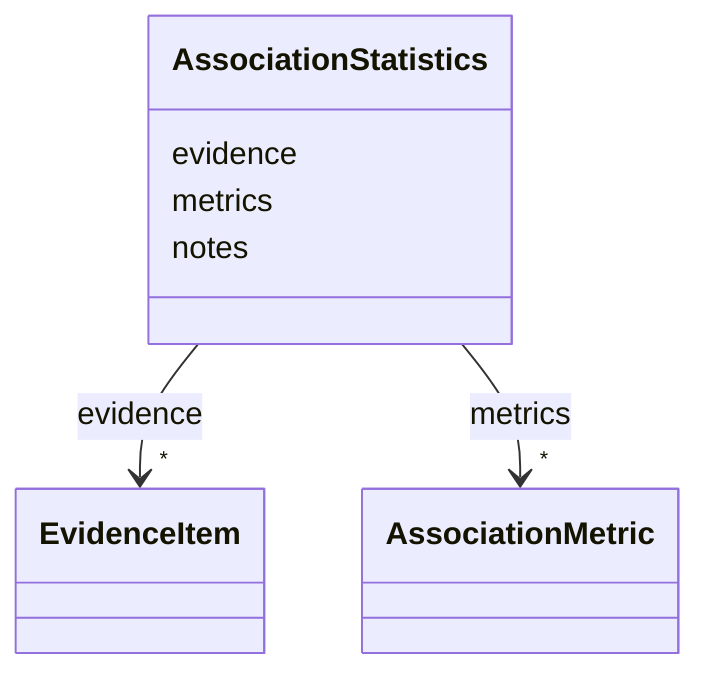

# Class: AssociationStatistics 


_Statistical summary with evidence for an association signal._


URI: [dismech:AssociationStatistics](https://w3id.org/monarch-initiative/dismech/AssociationStatistics)





<!-- no inheritance hierarchy -->


## Slots

| Name | Cardinality and Range | Description | Inheritance |
| ---  | --- | --- | --- |
| [metrics](metrics.md) | * <br/> [AssociationMetric](AssociationMetric.md) | Quantitative association metrics | direct |
| [evidence](evidence.md) | * _recommended_ <br/> [EvidenceItem](EvidenceItem.md) |  | direct |
| [notes](notes.md) | 0..1 <br/> [String](String.md) |  | direct |


## Usages

| used by | used in | type | used |
| ---  | --- | --- | --- |
| [AssociationSignal](AssociationSignal.md) | [statistics](statistics.md) | range | [AssociationStatistics](AssociationStatistics.md) |


## Identifier and Mapping Information


### Schema Source


* from schema: https://w3id.org/monarch-initiative/dismech


## Mappings

| Mapping Type | Mapped Value |
| ---  | ---  |
| self | dismech:AssociationStatistics |
| native | dismech:AssociationStatistics |


## LinkML Source

<!-- TODO: investigate https://stackoverflow.com/questions/37606292/how-to-create-tabbed-code-blocks-in-mkdocs-or-sphinx -->

### Direct

<details>
```yaml
name: AssociationStatistics
description: Statistical summary with evidence for an association signal.
from_schema: https://w3id.org/monarch-initiative/dismech
slots:
- metrics
- evidence
- notes

```
</details>

### Induced

<details>
```yaml
name: AssociationStatistics
description: Statistical summary with evidence for an association signal.
from_schema: https://w3id.org/monarch-initiative/dismech
attributes:
  metrics:
    name: metrics
    description: Quantitative association metrics
    from_schema: https://w3id.org/monarch-initiative/dismech
    rank: 1000
    alias: metrics
    owner: AssociationStatistics
    domain_of:
    - AssociationSignal
    - AssociationStatistics
    range: AssociationMetric
    multivalued: true
    inlined: true
    inlined_as_list: true
  evidence:
    name: evidence
    from_schema: https://w3id.org/monarch-initiative/dismech
    rank: 1000
    alias: evidence
    owner: AssociationStatistics
    domain_of:
    - PhenotypeContext
    - Dataset
    - ClinicalTrial
    - ComputationalModel
    - DifferentialDiagnosis
    - Subtype
    - CausalEdge
    - TreatmentMechanismTarget
    - Finding
    - Prevalence
    - ProgressionInfo
    - EpidemiologyInfo
    - Pathophysiology
    - Phenotype
    - Biochemical
    - HistopathologyFinding
    - Genetic
    - Environmental
    - Stage
    - AgentLifeCycle
    - AgentLifeCycleStage
    - AnimalModel
    - Treatment
    - InfectiousAgent
    - Transmission
    - Diagnosis
    - Inheritance
    - Variant
    - ModelingConsideration
    - ClassificationAssignment
    - Definition
    - CriteriaSet
    - AssociationSignal
    - AssociationStatistics
    - ComorbidityHypothesis
    - UpstreamConditionHypothesis
    - MechanisticHypothesis
    range: EvidenceItem
    recommended: true
    multivalued: true
    inlined: true
    inlined_as_list: true
  notes:
    name: notes
    examples:
    - value: Contagious stage where symptoms appear and the bacteria can be spread
        to others.
    from_schema: https://w3id.org/monarch-initiative/dismech
    rank: 1000
    alias: notes
    owner: AssociationStatistics
    domain_of:
    - GeneticContext
    - OnsetDescriptor
    - PhenotypeContext
    - Dataset
    - ClinicalTrial
    - ComputationalModel
    - DifferentialDiagnosis
    - Prevalence
    - ProgressionInfo
    - EpidemiologyInfo
    - Pathophysiology
    - Phenotype
    - Biochemical
    - HistopathologyFinding
    - Genetic
    - Environmental
    - Disease
    - Stage
    - AgentLifeCycle
    - AgentLifeCycleStage
    - Treatment
    - Transmission
    - Diagnosis
    - ClassificationAssignment
    - Definition
    - CriteriaSet
    - TermMapping
    - MappingConsistency
    - ComorbidityAssociation
    - AssociationSignal
    - AssociationMetric
    - AssociationStatistics
    - MechanisticHypothesis
    range: string

```
</details>