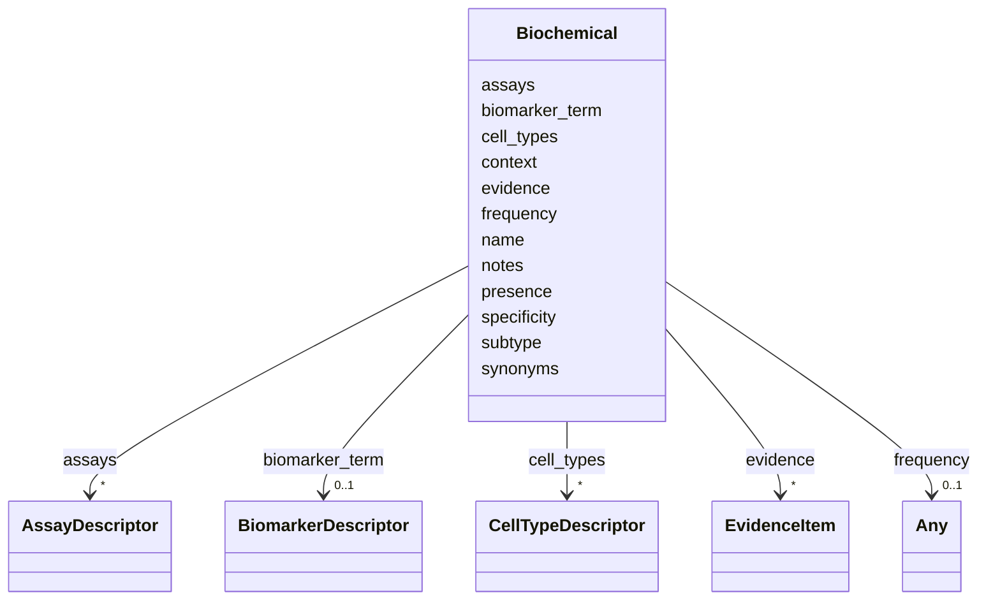

# Class: Biochemical 


URI: [dismech:Biochemical](https://w3id.org/monarch-initiative/dismech/Biochemical)





<!-- no inheritance hierarchy -->


## Slots

| Name | Cardinality and Range | Description | Inheritance |
| ---  | --- | --- | --- |
| [name](name.md) | 1 <br/> [String](String.md) |  | direct |
| [biomarker_term](biomarker_term.md) | 0..1 <br/> [BiomarkerDescriptor](BiomarkerDescriptor.md) | Ontology term for a biomarker (from NCIT) | direct |
| [presence](presence.md) | 0..1 <br/> [String](String.md) |  | direct |
| [evidence](evidence.md) | * _recommended_ <br/> [EvidenceItem](EvidenceItem.md) |  | direct |
| [specificity](specificity.md) | 0..1 <br/> [String](String.md) |  | direct |
| [frequency](frequency.md) | 0..1 <br/> [Any](Any.md)&nbsp;or&nbsp;<br />[FrequencyEnum](FrequencyEnum.md)&nbsp;or&nbsp;<br />[FrequencyQuantity](FrequencyQuantity.md) |  | direct |
| [notes](notes.md) | 0..1 <br/> [String](String.md) |  | direct |
| [context](context.md) | 0..1 <br/> [String](String.md) |  | direct |
| [subtype](subtype.md) | 0..1 <br/> [String](String.md) |  | direct |
| [cell_types](cell_types.md) | * <br/> [CellTypeDescriptor](CellTypeDescriptor.md) |  | direct |
| [assays](assays.md) | * <br/> [AssayDescriptor](AssayDescriptor.md) |  | direct |
| [synonyms](synonyms.md) | * <br/> [String](String.md) |  | direct |


## Usages

| used by | used in | type | used |
| ---  | --- | --- | --- |
| [Disease](Disease.md) | [biochemical](biochemical.md) | range | [Biochemical](Biochemical.md) |


## Identifier and Mapping Information


### Schema Source


* from schema: https://w3id.org/monarch-initiative/dismech


## Mappings

| Mapping Type | Mapped Value |
| ---  | ---  |
| self | dismech:Biochemical |
| native | dismech:Biochemical |


## LinkML Source

<!-- TODO: investigate https://stackoverflow.com/questions/37606292/how-to-create-tabbed-code-blocks-in-mkdocs-or-sphinx -->

### Direct

<details>
```yaml
name: Biochemical
from_schema: https://w3id.org/monarch-initiative/dismech
slots:
- name
- biomarker_term
- presence
- evidence
- specificity
- frequency
- notes
- context
- subtype
- cell_types
- assays
- synonyms

```
</details>

### Induced

<details>
```yaml
name: Biochemical
from_schema: https://w3id.org/monarch-initiative/dismech
attributes:
  name:
    name: name
    examples:
    - value: Adolescent Nephronophthisis
    from_schema: https://w3id.org/monarch-initiative/dismech
    rank: 1000
    identifier: true
    alias: name
    owner: Biochemical
    domain_of:
    - ClinicalTrial
    - ComputationalModel
    - DifferentialDiagnosis
    - Subtype
    - EpidemiologyInfo
    - Pathophysiology
    - Phenotype
    - Biochemical
    - HistopathologyFinding
    - Genetic
    - Environmental
    - Disease
    - Stage
    - AgentLifeCycleStage
    - Treatment
    - InfectiousAgent
    - Transmission
    - Assay
    - Diagnosis
    - Inheritance
    - Variant
    - Mechanism
    - ModelingConsideration
    - Definition
    - CriteriaSet
    - ComorbidityAssociation
    range: string
    required: true
  biomarker_term:
    name: biomarker_term
    description: Ontology term for a biomarker (from NCIT)
    comments:
    - Use NCIT terms for biomarkers (proteins, genes, fusion products)
    - NCIT:C16342 (Biomarker) is the root class for validation
    from_schema: https://w3id.org/monarch-initiative/dismech
    rank: 1000
    alias: biomarker_term
    owner: Biochemical
    domain_of:
    - Biochemical
    range: BiomarkerDescriptor
    inlined: true
  presence:
    name: presence
    examples:
    - value: Positive
    from_schema: https://w3id.org/monarch-initiative/dismech
    rank: 1000
    alias: presence
    owner: Biochemical
    domain_of:
    - Biochemical
    - Genetic
    - Environmental
    - Diagnosis
    range: string
  evidence:
    name: evidence
    from_schema: https://w3id.org/monarch-initiative/dismech
    rank: 1000
    alias: evidence
    owner: Biochemical
    domain_of:
    - PhenotypeContext
    - Dataset
    - ClinicalTrial
    - ComputationalModel
    - DifferentialDiagnosis
    - Subtype
    - CausalEdge
    - TreatmentMechanismTarget
    - Finding
    - Prevalence
    - ProgressionInfo
    - EpidemiologyInfo
    - Pathophysiology
    - Phenotype
    - Biochemical
    - HistopathologyFinding
    - Genetic
    - Environmental
    - Stage
    - AgentLifeCycle
    - AgentLifeCycleStage
    - AnimalModel
    - Treatment
    - InfectiousAgent
    - Transmission
    - Diagnosis
    - Inheritance
    - Variant
    - ModelingConsideration
    - ClassificationAssignment
    - Definition
    - CriteriaSet
    - AssociationSignal
    - AssociationStatistics
    - ComorbidityHypothesis
    - UpstreamConditionHypothesis
    - MechanisticHypothesis
    range: EvidenceItem
    recommended: true
    multivalued: true
    inlined: true
    inlined_as_list: true
  specificity:
    name: specificity
    examples:
    - value: High
    from_schema: https://w3id.org/monarch-initiative/dismech
    rank: 1000
    alias: specificity
    owner: Biochemical
    domain_of:
    - Biochemical
    range: string
  frequency:
    name: frequency
    examples:
    - value: Occasional
    from_schema: https://w3id.org/monarch-initiative/dismech
    rank: 1000
    alias: frequency
    owner: Biochemical
    domain_of:
    - PhenotypeContext
    - Pathophysiology
    - Phenotype
    - Biochemical
    - HistopathologyFinding
    - Genetic
    range: Any
    any_of:
    - range: FrequencyEnum
    - range: FrequencyQuantity
  notes:
    name: notes
    examples:
    - value: Contagious stage where symptoms appear and the bacteria can be spread
        to others.
    from_schema: https://w3id.org/monarch-initiative/dismech
    rank: 1000
    alias: notes
    owner: Biochemical
    domain_of:
    - GeneticContext
    - OnsetDescriptor
    - PhenotypeContext
    - Dataset
    - ClinicalTrial
    - ComputationalModel
    - DifferentialDiagnosis
    - Prevalence
    - ProgressionInfo
    - EpidemiologyInfo
    - Pathophysiology
    - Phenotype
    - Biochemical
    - HistopathologyFinding
    - Genetic
    - Environmental
    - Disease
    - Stage
    - AgentLifeCycle
    - AgentLifeCycleStage
    - Treatment
    - Transmission
    - Diagnosis
    - ClassificationAssignment
    - Definition
    - CriteriaSet
    - TermMapping
    - MappingConsistency
    - ComorbidityAssociation
    - AssociationSignal
    - AssociationMetric
    - AssociationStatistics
    - MechanisticHypothesis
    range: string
  context:
    name: context
    examples:
    - value: Pregnancy
    from_schema: https://w3id.org/monarch-initiative/dismech
    rank: 1000
    alias: context
    owner: Biochemical
    domain_of:
    - Phenotype
    - Biochemical
    - HistopathologyFinding
    - Stage
    - AgentLifeCycle
    - AgentLifeCycleStage
    - Treatment
    range: string
  subtype:
    name: subtype
    examples:
    - value: Eyelid Myoclonia with Absences
    from_schema: https://w3id.org/monarch-initiative/dismech
    rank: 1000
    alias: subtype
    owner: Biochemical
    domain_of:
    - PhenotypeContext
    - Prevalence
    - ProgressionInfo
    - Phenotype
    - Biochemical
    - HistopathologyFinding
    - Genetic
    range: string
  cell_types:
    name: cell_types
    examples:
    - value: '[{preferred_term: Macrophage}, {preferred_term: T Cell}]'
    from_schema: https://w3id.org/monarch-initiative/dismech
    rank: 1000
    alias: cell_types
    owner: Biochemical
    domain_of:
    - Pathophysiology
    - Biochemical
    range: CellTypeDescriptor
    multivalued: true
    inlined: true
    inlined_as_list: true
  assays:
    name: assays
    examples:
    - value: '[{preferred_term: Elevated Blood Glucose}]'
    from_schema: https://w3id.org/monarch-initiative/dismech
    rank: 1000
    alias: assays
    owner: Biochemical
    domain_of:
    - Pathophysiology
    - Biochemical
    range: AssayDescriptor
    multivalued: true
    inlined: true
    inlined_as_list: true
  synonyms:
    name: synonyms
    examples:
    - value: '[''CYFRA 21-1'']'
    from_schema: https://w3id.org/monarch-initiative/dismech
    rank: 1000
    alias: synonyms
    owner: Biochemical
    domain_of:
    - Pathophysiology
    - Biochemical
    - Environmental
    - Disease
    - Variant
    range: string
    multivalued: true

```
</details>