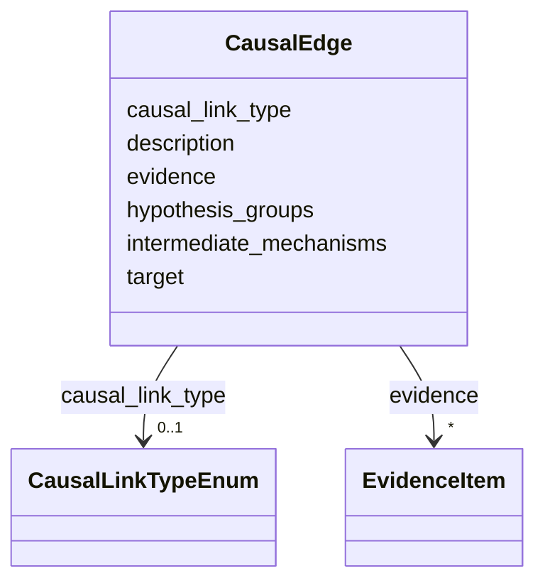

# Class: CausalEdge 


_A reference to a downstream effect or consequence in a causal relationship_


URI: [dismech:CausalEdge](https://w3id.org/monarch-initiative/dismech/CausalEdge)





<!-- no inheritance hierarchy -->


## Slots

| Name | Cardinality and Range | Description | Inheritance |
| ---  | --- | --- | --- |
| [target](target.md) | 1 <br/> [String](String.md) | The name of the target element in a causal relationship | direct |
| [description](description.md) | 0..1 <br/> [String](String.md) |  | direct |
| [evidence](evidence.md) | * _recommended_ <br/> [EvidenceItem](EvidenceItem.md) | Evidence that supports this specific edge (not just the parent node-level cla... | direct |
| [hypothesis_groups](hypothesis_groups.md) | * <br/> [String](String.md) | One or more hypothesis IDs used to group edges within alternative or superimp... | direct |
| [causal_link_type](causal_link_type.md) | 0..1 <br/> [CausalLinkTypeEnum](CausalLinkTypeEnum.md) | Encodes directness and whether omitted intermediates are known versus unknown | direct |
| [intermediate_mechanisms](intermediate_mechanisms.md) | * <br/> [String](String.md) | Free-text intermediates bridging source and target when using an indirect edg... | direct |


## Usages

| used by | used in | type | used |
| ---  | --- | --- | --- |
| [Pathophysiology](Pathophysiology.md) | [downstream](downstream.md) | range | [CausalEdge](CausalEdge.md) |
| [Phenotype](Phenotype.md) | [sequelae](sequelae.md) | range | [CausalEdge](CausalEdge.md) |


## Identifier and Mapping Information


### Schema Source


* from schema: https://w3id.org/monarch-initiative/dismech


## Mappings

| Mapping Type | Mapped Value |
| ---  | ---  |
| self | dismech:CausalEdge |
| native | dismech:CausalEdge |


## LinkML Source

<!-- TODO: investigate https://stackoverflow.com/questions/37606292/how-to-create-tabbed-code-blocks-in-mkdocs-or-sphinx -->

### Direct

<details>
```yaml
name: CausalEdge
description: A reference to a downstream effect or consequence in a causal relationship
from_schema: https://w3id.org/monarch-initiative/dismech
slots:
- target
- description
- evidence
- hypothesis_groups
- causal_link_type
- intermediate_mechanisms
slot_usage:
  evidence:
    name: evidence
    description: Evidence that supports this specific edge (not just the parent node-level
      claim)
  hypothesis_groups:
    name: hypothesis_groups
    description: One or more hypothesis IDs used to group edges within alternative
      or superimposed models
  causal_link_type:
    name: causal_link_type
    description: Encodes directness and whether omitted intermediates are known versus
      unknown
  intermediate_mechanisms:
    name: intermediate_mechanisms
    description: Free-text intermediates bridging source and target when using an
      indirect edge

```
</details>

### Induced

<details>
```yaml
name: CausalEdge
description: A reference to a downstream effect or consequence in a causal relationship
from_schema: https://w3id.org/monarch-initiative/dismech
slot_usage:
  evidence:
    name: evidence
    description: Evidence that supports this specific edge (not just the parent node-level
      claim)
  hypothesis_groups:
    name: hypothesis_groups
    description: One or more hypothesis IDs used to group edges within alternative
      or superimposed models
  causal_link_type:
    name: causal_link_type
    description: Encodes directness and whether omitted intermediates are known versus
      unknown
  intermediate_mechanisms:
    name: intermediate_mechanisms
    description: Free-text intermediates bridging source and target when using an
      indirect edge
attributes:
  target:
    name: target
    description: The name of the target element in a causal relationship
    from_schema: https://w3id.org/monarch-initiative/dismech
    rank: 1000
    alias: target
    owner: CausalEdge
    domain_of:
    - CausalEdge
    - TreatmentMechanismTarget
    range: string
    required: true
  description:
    name: description
    from_schema: https://w3id.org/monarch-initiative/dismech
    rank: 1000
    alias: description
    owner: CausalEdge
    domain_of:
    - Descriptor
    - GeneticContext
    - Dataset
    - ClinicalTrial
    - ComputationalModel
    - DifferentialDiagnosis
    - Subtype
    - CausalEdge
    - TreatmentMechanismTarget
    - EpidemiologyInfo
    - Pathophysiology
    - Phenotype
    - HistopathologyFinding
    - Environmental
    - Disease
    - Stage
    - AgentLifeCycle
    - AgentLifeCycleStage
    - AnimalModel
    - Treatment
    - InfectiousAgent
    - Transmission
    - Assay
    - Diagnosis
    - Inheritance
    - Variant
    - FunctionalEffect
    - Mechanism
    - ModelingConsideration
    - Definition
    - CriteriaSet
    - ConditionDescriptor
    - GOEnrichment
    - ComorbidityHypothesis
    - UpstreamConditionHypothesis
    - MechanisticHypothesis
    range: string
  evidence:
    name: evidence
    description: Evidence that supports this specific edge (not just the parent node-level
      claim)
    from_schema: https://w3id.org/monarch-initiative/dismech
    rank: 1000
    alias: evidence
    owner: CausalEdge
    domain_of:
    - PhenotypeContext
    - Dataset
    - ClinicalTrial
    - ComputationalModel
    - DifferentialDiagnosis
    - Subtype
    - CausalEdge
    - TreatmentMechanismTarget
    - Finding
    - Prevalence
    - ProgressionInfo
    - EpidemiologyInfo
    - Pathophysiology
    - Phenotype
    - Biochemical
    - HistopathologyFinding
    - Genetic
    - Environmental
    - Stage
    - AgentLifeCycle
    - AgentLifeCycleStage
    - AnimalModel
    - Treatment
    - InfectiousAgent
    - Transmission
    - Diagnosis
    - Inheritance
    - Variant
    - ModelingConsideration
    - ClassificationAssignment
    - Definition
    - CriteriaSet
    - AssociationSignal
    - AssociationStatistics
    - ComorbidityHypothesis
    - UpstreamConditionHypothesis
    - MechanisticHypothesis
    range: EvidenceItem
    recommended: true
    multivalued: true
    inlined: true
    inlined_as_list: true
  hypothesis_groups:
    name: hypothesis_groups
    description: One or more hypothesis IDs used to group edges within alternative
      or superimposed models
    from_schema: https://w3id.org/monarch-initiative/dismech
    rank: 1000
    alias: hypothesis_groups
    owner: CausalEdge
    domain_of:
    - CausalEdge
    range: string
    multivalued: true
  causal_link_type:
    name: causal_link_type
    description: Encodes directness and whether omitted intermediates are known versus
      unknown
    from_schema: https://w3id.org/monarch-initiative/dismech
    rank: 1000
    alias: causal_link_type
    owner: CausalEdge
    domain_of:
    - CausalEdge
    range: CausalLinkTypeEnum
  intermediate_mechanisms:
    name: intermediate_mechanisms
    description: Free-text intermediates bridging source and target when using an
      indirect edge
    from_schema: https://w3id.org/monarch-initiative/dismech
    rank: 1000
    alias: intermediate_mechanisms
    owner: CausalEdge
    domain_of:
    - CausalEdge
    range: string
    multivalued: true

```
</details>