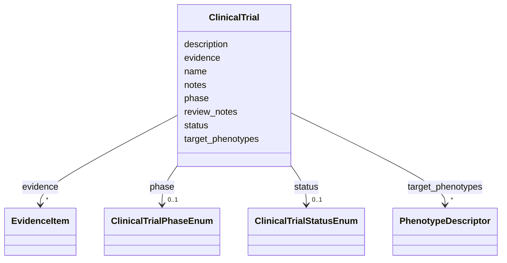

# Class: ClinicalTrial 


_A clinical trial relevant to treatment or research of a disease_


URI: [dismech:ClinicalTrial](https://w3id.org/monarch-initiative/dismech/ClinicalTrial)





<!-- no inheritance hierarchy -->


## Slots

| Name | Cardinality and Range | Description | Inheritance |
| ---  | --- | --- | --- |
| [name](name.md) | 0..1 <br/> [String](String.md) | NCT identifier (e | direct |
| [description](description.md) | 0..1 _recommended_ <br/> [String](String.md) | Brief summary or key details of the clinical trial | direct |
| [phase](phase.md) | 0..1 _recommended_ <br/> [ClinicalTrialPhaseEnum](ClinicalTrialPhaseEnum.md) | Trial phase (Phase I, Phase II, Phase III, Phase IV, or Not Applicable) | direct |
| [status](status.md) | 0..1 _recommended_ <br/> [ClinicalTrialStatusEnum](ClinicalTrialStatusEnum.md) | Recruitment or trial status (e | direct |
| [evidence](evidence.md) | * <br/> [EvidenceItem](EvidenceItem.md) | Supporting evidence with snippets from trial documentation | direct |
| [target_phenotypes](target_phenotypes.md) | * <br/> [PhenotypeDescriptor](PhenotypeDescriptor.md) | Phenotypes that this treatment or trial addresses or targets | direct |
| [notes](notes.md) | 0..1 <br/> [String](String.md) |  | direct |
| [review_notes](review_notes.md) | 0..1 <br/> [String](String.md) |  | direct |


## Usages

| used by | used in | type | used |
| ---  | --- | --- | --- |
| [Disease](Disease.md) | [clinical_trials](clinical_trials.md) | range | [ClinicalTrial](ClinicalTrial.md) |


## Comments

* Uses NCT identifiers from ClinicalTrials.gov
* Evidence and supporting text can be validated via linkml-reference-validator against ClinicalTrials.gov API

## Identifier and Mapping Information


### Schema Source


* from schema: https://w3id.org/monarch-initiative/dismech


## Mappings

| Mapping Type | Mapped Value |
| ---  | ---  |
| self | dismech:ClinicalTrial |
| native | dismech:ClinicalTrial |


## LinkML Source

<!-- TODO: investigate https://stackoverflow.com/questions/37606292/how-to-create-tabbed-code-blocks-in-mkdocs-or-sphinx -->

### Direct

<details>
```yaml
name: ClinicalTrial
description: A clinical trial relevant to treatment or research of a disease
comments:
- Uses NCT identifiers from ClinicalTrials.gov
- Evidence and supporting text can be validated via linkml-reference-validator against
  ClinicalTrials.gov API
from_schema: https://w3id.org/monarch-initiative/dismech
slots:
- name
- description
- phase
- status
- evidence
- target_phenotypes
- notes
- review_notes
slot_usage:
  name:
    name: name
    description: NCT identifier (e.g., NCT00000001) or trial name
    identifier: false
  description:
    name: description
    description: Brief summary or key details of the clinical trial
    recommended: true
  phase:
    name: phase
    description: Trial phase (Phase I, Phase II, Phase III, Phase IV, or Not Applicable)
    range: ClinicalTrialPhaseEnum
    recommended: true
  status:
    name: status
    description: Recruitment or trial status (e.g., Recruiting, Completed, Terminated,
      Active not recruiting)
    range: ClinicalTrialStatusEnum
    recommended: true
  evidence:
    name: evidence
    description: Supporting evidence with snippets from trial documentation
    recommended: false

```
</details>

### Induced

<details>
```yaml
name: ClinicalTrial
description: A clinical trial relevant to treatment or research of a disease
comments:
- Uses NCT identifiers from ClinicalTrials.gov
- Evidence and supporting text can be validated via linkml-reference-validator against
  ClinicalTrials.gov API
from_schema: https://w3id.org/monarch-initiative/dismech
slot_usage:
  name:
    name: name
    description: NCT identifier (e.g., NCT00000001) or trial name
    identifier: false
  description:
    name: description
    description: Brief summary or key details of the clinical trial
    recommended: true
  phase:
    name: phase
    description: Trial phase (Phase I, Phase II, Phase III, Phase IV, or Not Applicable)
    range: ClinicalTrialPhaseEnum
    recommended: true
  status:
    name: status
    description: Recruitment or trial status (e.g., Recruiting, Completed, Terminated,
      Active not recruiting)
    range: ClinicalTrialStatusEnum
    recommended: true
  evidence:
    name: evidence
    description: Supporting evidence with snippets from trial documentation
    recommended: false
attributes:
  name:
    name: name
    description: NCT identifier (e.g., NCT00000001) or trial name
    examples:
    - value: Adolescent Nephronophthisis
    from_schema: https://w3id.org/monarch-initiative/dismech
    rank: 1000
    identifier: false
    alias: name
    owner: ClinicalTrial
    domain_of:
    - ClinicalTrial
    - ComputationalModel
    - DifferentialDiagnosis
    - Subtype
    - EpidemiologyInfo
    - Pathophysiology
    - Phenotype
    - Biochemical
    - HistopathologyFinding
    - Genetic
    - Environmental
    - Disease
    - Stage
    - AgentLifeCycleStage
    - Treatment
    - InfectiousAgent
    - Transmission
    - Assay
    - Diagnosis
    - Inheritance
    - Variant
    - Mechanism
    - ModelingConsideration
    - Definition
    - CriteriaSet
    - ComorbidityAssociation
    range: string
    required: true
  description:
    name: description
    description: Brief summary or key details of the clinical trial
    from_schema: https://w3id.org/monarch-initiative/dismech
    rank: 1000
    alias: description
    owner: ClinicalTrial
    domain_of:
    - Descriptor
    - GeneticContext
    - Dataset
    - ClinicalTrial
    - ComputationalModel
    - DifferentialDiagnosis
    - Subtype
    - CausalEdge
    - TreatmentMechanismTarget
    - EpidemiologyInfo
    - Pathophysiology
    - Phenotype
    - HistopathologyFinding
    - Environmental
    - Disease
    - Stage
    - AgentLifeCycle
    - AgentLifeCycleStage
    - AnimalModel
    - Treatment
    - InfectiousAgent
    - Transmission
    - Assay
    - Diagnosis
    - Inheritance
    - Variant
    - FunctionalEffect
    - Mechanism
    - ModelingConsideration
    - Definition
    - CriteriaSet
    - ConditionDescriptor
    - GOEnrichment
    - ComorbidityHypothesis
    - UpstreamConditionHypothesis
    - MechanisticHypothesis
    range: string
    recommended: true
  phase:
    name: phase
    description: Trial phase (Phase I, Phase II, Phase III, Phase IV, or Not Applicable)
    examples:
    - value: Active TB
    from_schema: https://w3id.org/monarch-initiative/dismech
    rank: 1000
    alias: phase
    owner: ClinicalTrial
    domain_of:
    - ClinicalTrial
    - ProgressionInfo
    range: ClinicalTrialPhaseEnum
    recommended: true
  status:
    name: status
    description: Recruitment or trial status (e.g., Recruiting, Completed, Terminated,
      Active not recruiting)
    examples:
    - value: Recruiting
    - value: Completed
    - value: Terminated
    from_schema: https://w3id.org/monarch-initiative/dismech
    rank: 1000
    alias: status
    owner: ClinicalTrial
    domain_of:
    - ClinicalTrial
    - MechanisticHypothesis
    range: ClinicalTrialStatusEnum
    recommended: true
  evidence:
    name: evidence
    description: Supporting evidence with snippets from trial documentation
    from_schema: https://w3id.org/monarch-initiative/dismech
    rank: 1000
    alias: evidence
    owner: ClinicalTrial
    domain_of:
    - PhenotypeContext
    - Dataset
    - ClinicalTrial
    - ComputationalModel
    - DifferentialDiagnosis
    - Subtype
    - CausalEdge
    - TreatmentMechanismTarget
    - Finding
    - Prevalence
    - ProgressionInfo
    - EpidemiologyInfo
    - Pathophysiology
    - Phenotype
    - Biochemical
    - HistopathologyFinding
    - Genetic
    - Environmental
    - Stage
    - AgentLifeCycle
    - AgentLifeCycleStage
    - AnimalModel
    - Treatment
    - InfectiousAgent
    - Transmission
    - Diagnosis
    - Inheritance
    - Variant
    - ModelingConsideration
    - ClassificationAssignment
    - Definition
    - CriteriaSet
    - AssociationSignal
    - AssociationStatistics
    - ComorbidityHypothesis
    - UpstreamConditionHypothesis
    - MechanisticHypothesis
    range: EvidenceItem
    recommended: false
    multivalued: true
    inlined: true
    inlined_as_list: true
  target_phenotypes:
    name: target_phenotypes
    description: Phenotypes that this treatment or trial addresses or targets
    comments:
    - Should reference phenotype names defined in the same disease's phenotypes list
    - Enables linking treatments/trials to the symptoms/manifestations they aim to
      manage
    - Each phenotype can include ontology term references (HP)
    from_schema: https://w3id.org/monarch-initiative/dismech
    rank: 1000
    alias: target_phenotypes
    owner: ClinicalTrial
    domain_of:
    - ClinicalTrial
    - Treatment
    range: PhenotypeDescriptor
    multivalued: true
    inlined: true
    inlined_as_list: true
  notes:
    name: notes
    examples:
    - value: Contagious stage where symptoms appear and the bacteria can be spread
        to others.
    from_schema: https://w3id.org/monarch-initiative/dismech
    rank: 1000
    alias: notes
    owner: ClinicalTrial
    domain_of:
    - GeneticContext
    - OnsetDescriptor
    - PhenotypeContext
    - Dataset
    - ClinicalTrial
    - ComputationalModel
    - DifferentialDiagnosis
    - Prevalence
    - ProgressionInfo
    - EpidemiologyInfo
    - Pathophysiology
    - Phenotype
    - Biochemical
    - HistopathologyFinding
    - Genetic
    - Environmental
    - Disease
    - Stage
    - AgentLifeCycle
    - AgentLifeCycleStage
    - Treatment
    - Transmission
    - Diagnosis
    - ClassificationAssignment
    - Definition
    - CriteriaSet
    - TermMapping
    - MappingConsistency
    - ComorbidityAssociation
    - AssociationSignal
    - AssociationMetric
    - AssociationStatistics
    - MechanisticHypothesis
    range: string
  review_notes:
    name: review_notes
    examples:
    - value: Added an additional clinically relevant subtype.
    from_schema: https://w3id.org/monarch-initiative/dismech
    rank: 1000
    alias: review_notes
    owner: ClinicalTrial
    domain_of:
    - ClinicalTrial
    - Subtype
    - ProgressionInfo
    - Phenotype
    - Genetic
    - Environmental
    - Disease
    - Stage
    - AgentLifeCycle
    - AgentLifeCycleStage
    - Treatment
    range: string

```
</details>