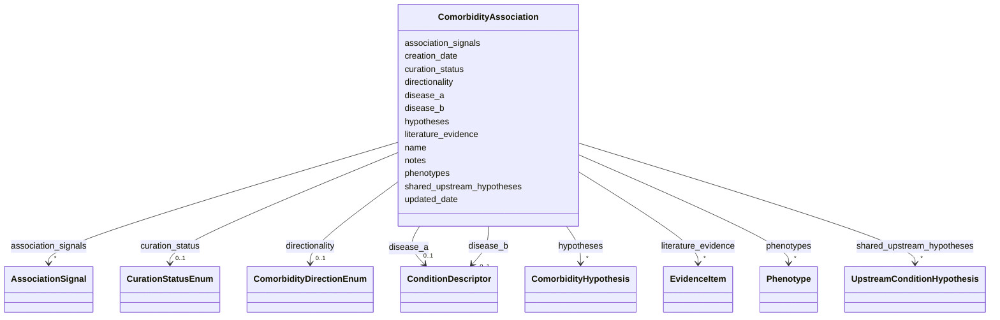

# Class: ComorbidityAssociation 


_An association between two conditions, including directionality, evidence, and computational characterizations._


URI: [dismech:ComorbidityAssociation](https://w3id.org/monarch-initiative/dismech/ComorbidityAssociation)





<!-- no inheritance hierarchy -->


## Slots

| Name | Cardinality and Range | Description | Inheritance |
| ---  | --- | --- | --- |
| [name](name.md) | 1 <br/> [String](String.md) |  | direct |
| [creation_date](creation_date.md) | 0..1 _recommended_ <br/> [String](String.md) | Timestamp for initial creation of this comorbidity entry | direct |
| [updated_date](updated_date.md) | 0..1 _recommended_ <br/> [String](String.md) | Timestamp for the latest substantive update to this comorbidity entry | direct |
| [disease_a](disease_a.md) | 0..1 <br/> [ConditionDescriptor](ConditionDescriptor.md) | First disease in a comorbidity pair | direct |
| [disease_b](disease_b.md) | 0..1 <br/> [ConditionDescriptor](ConditionDescriptor.md) | Second disease in a comorbidity pair | direct |
| [directionality](directionality.md) | 0..1 <br/> [ComorbidityDirectionEnum](ComorbidityDirectionEnum.md) | Direction of a comorbidity/trajectory association | direct |
| [association_signals](association_signals.md) | * <br/> [AssociationSignal](AssociationSignal.md) | Association signals from EHR, registry, or computational sources | direct |
| [literature_evidence](literature_evidence.md) | * <br/> [EvidenceItem](EvidenceItem.md) | Literature-based evidence items for this association | direct |
| [hypotheses](hypotheses.md) | * <br/> [ComorbidityHypothesis](ComorbidityHypothesis.md) | Mechanistic or causal hypotheses about the association | direct |
| [shared_upstream_hypotheses](shared_upstream_hypotheses.md) | * <br/> [UpstreamConditionHypothesis](UpstreamConditionHypothesis.md) | Suspected upstream conditions that may explain both A and B | direct |
| [phenotypes](phenotypes.md) | * <br/> [Phenotype](Phenotype.md) |  | direct |
| [notes](notes.md) | 0..1 <br/> [String](String.md) |  | direct |
| [curation_status](curation_status.md) | 0..1 <br/> [CurationStatusEnum](CurationStatusEnum.md) | Curation workflow status | direct |


## Identifier and Mapping Information


### Schema Source


* from schema: https://w3id.org/monarch-initiative/dismech


## Mappings

| Mapping Type | Mapped Value |
| ---  | ---  |
| self | dismech:ComorbidityAssociation |
| native | dismech:ComorbidityAssociation |


## LinkML Source

<!-- TODO: investigate https://stackoverflow.com/questions/37606292/how-to-create-tabbed-code-blocks-in-mkdocs-or-sphinx -->

### Direct

<details>
```yaml
name: ComorbidityAssociation
description: An association between two conditions, including directionality, evidence,
  and computational characterizations.
from_schema: https://w3id.org/monarch-initiative/dismech
slots:
- name
- creation_date
- updated_date
- disease_a
- disease_b
- directionality
- association_signals
- literature_evidence
- hypotheses
- shared_upstream_hypotheses
- phenotypes
- notes
- curation_status
slot_usage:
  creation_date:
    name: creation_date
    description: Timestamp for initial creation of this comorbidity entry. Keep this
      stable after first set.
  updated_date:
    name: updated_date
    description: Timestamp for the latest substantive update to this comorbidity entry.
      Update this whenever curated content changes.

```
</details>

### Induced

<details>
```yaml
name: ComorbidityAssociation
description: An association between two conditions, including directionality, evidence,
  and computational characterizations.
from_schema: https://w3id.org/monarch-initiative/dismech
slot_usage:
  creation_date:
    name: creation_date
    description: Timestamp for initial creation of this comorbidity entry. Keep this
      stable after first set.
  updated_date:
    name: updated_date
    description: Timestamp for the latest substantive update to this comorbidity entry.
      Update this whenever curated content changes.
attributes:
  name:
    name: name
    examples:
    - value: Adolescent Nephronophthisis
    from_schema: https://w3id.org/monarch-initiative/dismech
    rank: 1000
    identifier: true
    alias: name
    owner: ComorbidityAssociation
    domain_of:
    - ClinicalTrial
    - ComputationalModel
    - DifferentialDiagnosis
    - Subtype
    - EpidemiologyInfo
    - Pathophysiology
    - Phenotype
    - Biochemical
    - HistopathologyFinding
    - Genetic
    - Environmental
    - Disease
    - Stage
    - AgentLifeCycleStage
    - Treatment
    - InfectiousAgent
    - Transmission
    - Assay
    - Diagnosis
    - Inheritance
    - Variant
    - Mechanism
    - ModelingConsideration
    - Definition
    - CriteriaSet
    - ComorbidityAssociation
    range: string
    required: true
  creation_date:
    name: creation_date
    description: Timestamp for initial creation of this comorbidity entry. Keep this
      stable after first set.
    from_schema: https://w3id.org/monarch-initiative/dismech
    rank: 1000
    alias: creation_date
    owner: ComorbidityAssociation
    domain_of:
    - Disease
    - ComorbidityAssociation
    range: string
    recommended: true
    pattern: ^\d{4}-\d{2}-\d{2}T\d{2}:\d{2}:\d{2}(?:\.\d+)?(?:Z|[+\-]\d{2}:\d{2})$
  updated_date:
    name: updated_date
    description: Timestamp for the latest substantive update to this comorbidity entry.
      Update this whenever curated content changes.
    from_schema: https://w3id.org/monarch-initiative/dismech
    rank: 1000
    alias: updated_date
    owner: ComorbidityAssociation
    domain_of:
    - Disease
    - ComorbidityAssociation
    range: string
    recommended: true
    pattern: ^\d{4}-\d{2}-\d{2}T\d{2}:\d{2}:\d{2}(?:\.\d+)?(?:Z|[+\-]\d{2}:\d{2})$
  disease_a:
    name: disease_a
    description: First disease in a comorbidity pair
    from_schema: https://w3id.org/monarch-initiative/dismech
    rank: 1000
    alias: disease_a
    owner: ComorbidityAssociation
    domain_of:
    - ComorbidityAssociation
    range: ConditionDescriptor
    inlined: true
  disease_b:
    name: disease_b
    description: Second disease in a comorbidity pair
    from_schema: https://w3id.org/monarch-initiative/dismech
    rank: 1000
    alias: disease_b
    owner: ComorbidityAssociation
    domain_of:
    - ComorbidityAssociation
    range: ConditionDescriptor
    inlined: true
  directionality:
    name: directionality
    description: Direction of a comorbidity/trajectory association
    from_schema: https://w3id.org/monarch-initiative/dismech
    rank: 1000
    alias: directionality
    owner: ComorbidityAssociation
    domain_of:
    - ComorbidityAssociation
    - AssociationSignal
    range: ComorbidityDirectionEnum
  association_signals:
    name: association_signals
    description: Association signals from EHR, registry, or computational sources
    from_schema: https://w3id.org/monarch-initiative/dismech
    rank: 1000
    alias: association_signals
    owner: ComorbidityAssociation
    domain_of:
    - ComorbidityAssociation
    range: AssociationSignal
    multivalued: true
    inlined: true
    inlined_as_list: true
  literature_evidence:
    name: literature_evidence
    description: Literature-based evidence items for this association
    from_schema: https://w3id.org/monarch-initiative/dismech
    rank: 1000
    alias: literature_evidence
    owner: ComorbidityAssociation
    domain_of:
    - ComorbidityAssociation
    range: EvidenceItem
    multivalued: true
    inlined: true
    inlined_as_list: true
  hypotheses:
    name: hypotheses
    description: Mechanistic or causal hypotheses about the association
    from_schema: https://w3id.org/monarch-initiative/dismech
    rank: 1000
    alias: hypotheses
    owner: ComorbidityAssociation
    domain_of:
    - ComorbidityAssociation
    range: ComorbidityHypothesis
    multivalued: true
    inlined: true
    inlined_as_list: true
  shared_upstream_hypotheses:
    name: shared_upstream_hypotheses
    description: Suspected upstream conditions that may explain both A and B
    from_schema: https://w3id.org/monarch-initiative/dismech
    rank: 1000
    alias: shared_upstream_hypotheses
    owner: ComorbidityAssociation
    domain_of:
    - ComorbidityAssociation
    range: UpstreamConditionHypothesis
    multivalued: true
    inlined: true
    inlined_as_list: true
  phenotypes:
    name: phenotypes
    from_schema: https://w3id.org/monarch-initiative/dismech
    rank: 1000
    alias: phenotypes
    owner: ComorbidityAssociation
    domain_of:
    - DifferentialDiagnosis
    - Disease
    - ComorbidityAssociation
    range: Phenotype
    multivalued: true
    inlined: true
    inlined_as_list: true
  notes:
    name: notes
    examples:
    - value: Contagious stage where symptoms appear and the bacteria can be spread
        to others.
    from_schema: https://w3id.org/monarch-initiative/dismech
    rank: 1000
    alias: notes
    owner: ComorbidityAssociation
    domain_of:
    - GeneticContext
    - OnsetDescriptor
    - PhenotypeContext
    - Dataset
    - ClinicalTrial
    - ComputationalModel
    - DifferentialDiagnosis
    - Prevalence
    - ProgressionInfo
    - EpidemiologyInfo
    - Pathophysiology
    - Phenotype
    - Biochemical
    - HistopathologyFinding
    - Genetic
    - Environmental
    - Disease
    - Stage
    - AgentLifeCycle
    - AgentLifeCycleStage
    - Treatment
    - Transmission
    - Diagnosis
    - ClassificationAssignment
    - Definition
    - CriteriaSet
    - TermMapping
    - MappingConsistency
    - ComorbidityAssociation
    - AssociationSignal
    - AssociationMetric
    - AssociationStatistics
    - MechanisticHypothesis
    range: string
  curation_status:
    name: curation_status
    description: Curation workflow status
    from_schema: https://w3id.org/monarch-initiative/dismech
    rank: 1000
    alias: curation_status
    owner: ComorbidityAssociation
    domain_of:
    - ComorbidityAssociation
    range: CurationStatusEnum

```
</details>