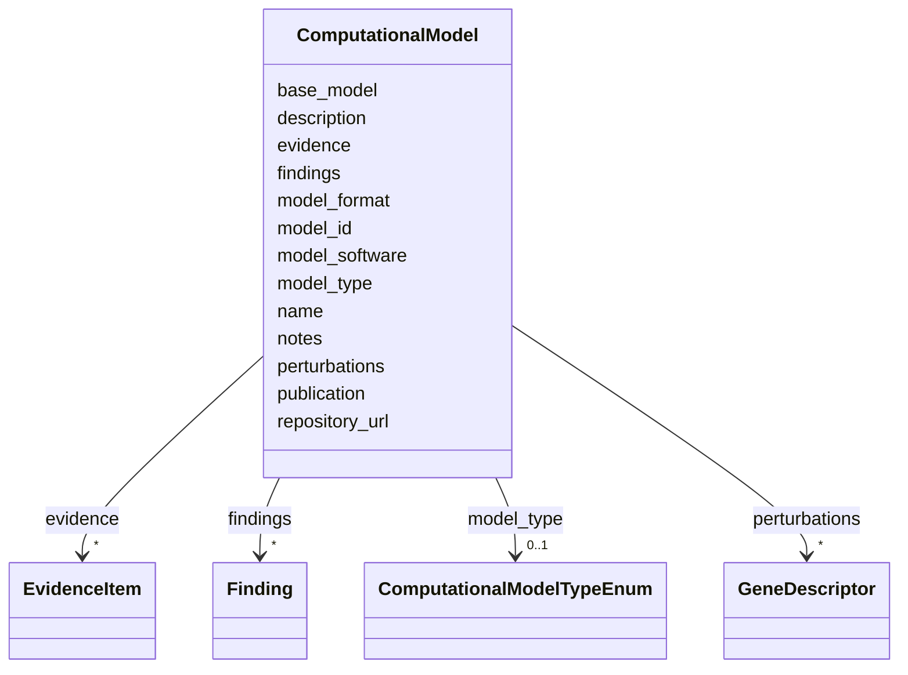

# Class: ComputationalModel 


_A computational or in-silico model relevant to understanding disease mechanisms_


URI: [dismech:ComputationalModel](https://w3id.org/monarch-initiative/dismech/ComputationalModel)





<!-- no inheritance hierarchy -->


## Slots

| Name | Cardinality and Range | Description | Inheritance |
| ---  | --- | --- | --- |
| [name](name.md) | 1 <br/> [String](String.md) |  | direct |
| [description](description.md) | 0..1 <br/> [String](String.md) |  | direct |
| [model_type](model_type.md) | 0..1 <br/> [ComputationalModelTypeEnum](ComputationalModelTypeEnum.md) | Type of computational model | direct |
| [repository_url](repository_url.md) | 0..1 <br/> [Uri](Uri.md) | URL to model repository (GitHub, BiGG, VMH, BioModels) | direct |
| [model_id](model_id.md) | 0..1 <br/> [String](String.md) | Identifier within the repository (e | direct |
| [base_model](base_model.md) | 0..1 <br/> [String](String.md) | Parent/base model this is derived from (e | direct |
| [perturbations](perturbations.md) | * <br/> [GeneDescriptor](GeneDescriptor.md) | Gene knockouts, reaction deletions, or parameter changes modeling the disease | direct |
| [model_software](model_software.md) | 0..1 <br/> [String](String.md) | Software/toolbox for running the model (e | direct |
| [model_format](model_format.md) | 0..1 <br/> [String](String.md) | File format (e | direct |
| [publication](publication.md) | 0..1 <br/> [PMID](PMID.md) | Associated publication (PMID) | direct |
| [findings](findings.md) | * <br/> [Finding](Finding.md) | Key findings or claims extracted from this source (publication or dataset) | direct |
| [evidence](evidence.md) | * _recommended_ <br/> [EvidenceItem](EvidenceItem.md) |  | direct |
| [notes](notes.md) | 0..1 <br/> [String](String.md) |  | direct |


## Usages

| used by | used in | type | used |
| ---  | --- | --- | --- |
| [Disease](Disease.md) | [computational_models](computational_models.md) | range | [ComputationalModel](ComputationalModel.md) |


## Comments

* Covers genome-scale metabolic models, FBA, kinetic models, digital twins, and ML models
* Perturbations track gene knockouts or parameter changes used to simulate the disease
* Findings capture key predictions or insights the model can generate

## Identifier and Mapping Information


### Schema Source


* from schema: https://w3id.org/monarch-initiative/dismech


## Mappings

| Mapping Type | Mapped Value |
| ---  | ---  |
| self | dismech:ComputationalModel |
| native | dismech:ComputationalModel |


## LinkML Source

<!-- TODO: investigate https://stackoverflow.com/questions/37606292/how-to-create-tabbed-code-blocks-in-mkdocs-or-sphinx -->

### Direct

<details>
```yaml
name: ComputationalModel
description: A computational or in-silico model relevant to understanding disease
  mechanisms
comments:
- Covers genome-scale metabolic models, FBA, kinetic models, digital twins, and ML
  models
- Perturbations track gene knockouts or parameter changes used to simulate the disease
- Findings capture key predictions or insights the model can generate
from_schema: https://w3id.org/monarch-initiative/dismech
slots:
- name
- description
- model_type
- repository_url
- model_id
- base_model
- perturbations
- model_software
- model_format
- publication
- findings
- evidence
- notes

```
</details>

### Induced

<details>
```yaml
name: ComputationalModel
description: A computational or in-silico model relevant to understanding disease
  mechanisms
comments:
- Covers genome-scale metabolic models, FBA, kinetic models, digital twins, and ML
  models
- Perturbations track gene knockouts or parameter changes used to simulate the disease
- Findings capture key predictions or insights the model can generate
from_schema: https://w3id.org/monarch-initiative/dismech
attributes:
  name:
    name: name
    examples:
    - value: Adolescent Nephronophthisis
    from_schema: https://w3id.org/monarch-initiative/dismech
    rank: 1000
    identifier: true
    alias: name
    owner: ComputationalModel
    domain_of:
    - ClinicalTrial
    - ComputationalModel
    - DifferentialDiagnosis
    - Subtype
    - EpidemiologyInfo
    - Pathophysiology
    - Phenotype
    - Biochemical
    - HistopathologyFinding
    - Genetic
    - Environmental
    - Disease
    - Stage
    - AgentLifeCycleStage
    - Treatment
    - InfectiousAgent
    - Transmission
    - Assay
    - Diagnosis
    - Inheritance
    - Variant
    - Mechanism
    - ModelingConsideration
    - Definition
    - CriteriaSet
    - ComorbidityAssociation
    range: string
    required: true
  description:
    name: description
    from_schema: https://w3id.org/monarch-initiative/dismech
    rank: 1000
    alias: description
    owner: ComputationalModel
    domain_of:
    - Descriptor
    - GeneticContext
    - Dataset
    - ClinicalTrial
    - ComputationalModel
    - DifferentialDiagnosis
    - Subtype
    - CausalEdge
    - TreatmentMechanismTarget
    - EpidemiologyInfo
    - Pathophysiology
    - Phenotype
    - HistopathologyFinding
    - Environmental
    - Disease
    - Stage
    - AgentLifeCycle
    - AgentLifeCycleStage
    - AnimalModel
    - Treatment
    - InfectiousAgent
    - Transmission
    - Assay
    - Diagnosis
    - Inheritance
    - Variant
    - FunctionalEffect
    - Mechanism
    - ModelingConsideration
    - Definition
    - CriteriaSet
    - ConditionDescriptor
    - GOEnrichment
    - ComorbidityHypothesis
    - UpstreamConditionHypothesis
    - MechanisticHypothesis
    range: string
  model_type:
    name: model_type
    description: Type of computational model
    from_schema: https://w3id.org/monarch-initiative/dismech
    rank: 1000
    alias: model_type
    owner: ComputationalModel
    domain_of:
    - ComputationalModel
    range: ComputationalModelTypeEnum
  repository_url:
    name: repository_url
    description: URL to model repository (GitHub, BiGG, VMH, BioModels)
    from_schema: https://w3id.org/monarch-initiative/dismech
    rank: 1000
    alias: repository_url
    owner: ComputationalModel
    domain_of:
    - ComputationalModel
    range: uri
  model_id:
    name: model_id
    description: Identifier within the repository (e.g., Recon3D, BIOMD0000000123)
    from_schema: https://w3id.org/monarch-initiative/dismech
    rank: 1000
    alias: model_id
    owner: ComputationalModel
    domain_of:
    - ComputationalModel
    range: string
  base_model:
    name: base_model
    description: Parent/base model this is derived from (e.g., Recon3D, Harvey 1.0)
    from_schema: https://w3id.org/monarch-initiative/dismech
    rank: 1000
    alias: base_model
    owner: ComputationalModel
    domain_of:
    - ComputationalModel
    range: string
  perturbations:
    name: perturbations
    description: Gene knockouts, reaction deletions, or parameter changes modeling
      the disease
    from_schema: https://w3id.org/monarch-initiative/dismech
    rank: 1000
    alias: perturbations
    owner: ComputationalModel
    domain_of:
    - ComputationalModel
    range: GeneDescriptor
    multivalued: true
    inlined: true
    inlined_as_list: true
  model_software:
    name: model_software
    description: Software/toolbox for running the model (e.g., COBRApy, COBRA Toolbox)
    from_schema: https://w3id.org/monarch-initiative/dismech
    rank: 1000
    alias: model_software
    owner: ComputationalModel
    domain_of:
    - ComputationalModel
    range: string
  model_format:
    name: model_format
    description: File format (e.g., SBML, MATLAB, JSON, ONNX)
    from_schema: https://w3id.org/monarch-initiative/dismech
    rank: 1000
    alias: model_format
    owner: ComputationalModel
    domain_of:
    - ComputationalModel
    range: string
  publication:
    name: publication
    description: Associated publication (PMID)
    from_schema: https://w3id.org/monarch-initiative/dismech
    rank: 1000
    alias: publication
    owner: ComputationalModel
    domain_of:
    - Dataset
    - ComputationalModel
    range: PMID
  findings:
    name: findings
    description: Key findings or claims extracted from this source (publication or
      dataset)
    from_schema: https://w3id.org/monarch-initiative/dismech
    rank: 1000
    alias: findings
    owner: ComputationalModel
    domain_of:
    - Dataset
    - ComputationalModel
    - PublicationReference
    range: Finding
    multivalued: true
    inlined: true
    inlined_as_list: true
  evidence:
    name: evidence
    from_schema: https://w3id.org/monarch-initiative/dismech
    rank: 1000
    alias: evidence
    owner: ComputationalModel
    domain_of:
    - PhenotypeContext
    - Dataset
    - ClinicalTrial
    - ComputationalModel
    - DifferentialDiagnosis
    - Subtype
    - CausalEdge
    - TreatmentMechanismTarget
    - Finding
    - Prevalence
    - ProgressionInfo
    - EpidemiologyInfo
    - Pathophysiology
    - Phenotype
    - Biochemical
    - HistopathologyFinding
    - Genetic
    - Environmental
    - Stage
    - AgentLifeCycle
    - AgentLifeCycleStage
    - AnimalModel
    - Treatment
    - InfectiousAgent
    - Transmission
    - Diagnosis
    - Inheritance
    - Variant
    - ModelingConsideration
    - ClassificationAssignment
    - Definition
    - CriteriaSet
    - AssociationSignal
    - AssociationStatistics
    - ComorbidityHypothesis
    - UpstreamConditionHypothesis
    - MechanisticHypothesis
    range: EvidenceItem
    recommended: true
    multivalued: true
    inlined: true
    inlined_as_list: true
  notes:
    name: notes
    examples:
    - value: Contagious stage where symptoms appear and the bacteria can be spread
        to others.
    from_schema: https://w3id.org/monarch-initiative/dismech
    rank: 1000
    alias: notes
    owner: ComputationalModel
    domain_of:
    - GeneticContext
    - OnsetDescriptor
    - PhenotypeContext
    - Dataset
    - ClinicalTrial
    - ComputationalModel
    - DifferentialDiagnosis
    - Prevalence
    - ProgressionInfo
    - EpidemiologyInfo
    - Pathophysiology
    - Phenotype
    - Biochemical
    - HistopathologyFinding
    - Genetic
    - Environmental
    - Disease
    - Stage
    - AgentLifeCycle
    - AgentLifeCycleStage
    - Treatment
    - Transmission
    - Diagnosis
    - ClassificationAssignment
    - Definition
    - CriteriaSet
    - TermMapping
    - MappingConsistency
    - ComorbidityAssociation
    - AssociationSignal
    - AssociationMetric
    - AssociationStatistics
    - MechanisticHypothesis
    range: string

```
</details>