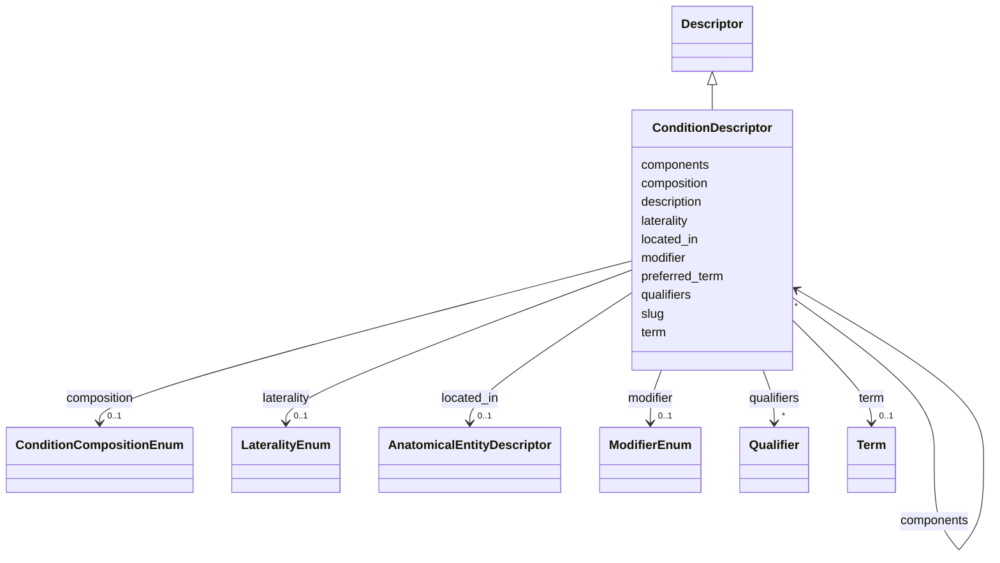

# Class: ConditionDescriptor 


_A descriptor for a condition or disease, optionally bound to MONDO. External coding identifiers (ICD-10, OMOP, SNOMED, etc.) are captured on association signals._


URI: [dismech:ConditionDescriptor](https://w3id.org/monarch-initiative/dismech/ConditionDescriptor)





## Inheritance
* [Descriptor](Descriptor.md)
    * **ConditionDescriptor**


## Slots

| Name | Cardinality and Range | Description | Inheritance |
| ---  | --- | --- | --- |
| [slug](slug.md) | 0..1 <br/> [String](String.md) | Use for leaf conditions; omit when using composition/components | direct |
| [preferred_term](preferred_term.md) | 0..1 <br/> [String](String.md) | The preferred human-readable term for this descriptor | direct |
| [description](description.md) | 0..1 <br/> [String](String.md) | A description of the descriptor | direct |
| [term](term.md) | 0..1 _recommended_ <br/> [Term](Term.md) | Optional MONDO disease term reference | direct |
| [composition](composition.md) | 0..1 <br/> [ConditionCompositionEnum](ConditionCompositionEnum.md) | Composition type for a composite condition descriptor | direct |
| [components](components.md) | * <br/> [ConditionDescriptor](ConditionDescriptor.md) | Component conditions that make up a composite descriptor | direct |
| [modifier](modifier.md) | 0..1 <br/> [ModifierEnum](ModifierEnum.md) | Directional or qualitative modifier for a descriptor (e | [Descriptor](Descriptor.md) |
| [located_in](located_in.md) | 0..1 <br/> [AnatomicalEntityDescriptor](AnatomicalEntityDescriptor.md) | Anatomical location where this entity/process occurs or procedure is performe... | [Descriptor](Descriptor.md) |
| [laterality](laterality.md) | 0..1 <br/> [LateralityEnum](LateralityEnum.md) | Laterality qualifier (left, right, or bilateral) | [Descriptor](Descriptor.md) |
| [qualifiers](qualifiers.md) | * <br/> [Qualifier](Qualifier.md) | List of predicate-value pairs for formal post-composition | [Descriptor](Descriptor.md) |


## Usages

| used by | used in | type | used |
| ---  | --- | --- | --- |
| [ConditionDescriptor](ConditionDescriptor.md) | [components](components.md) | range | [ConditionDescriptor](ConditionDescriptor.md) |
| [ComorbidityAssociation](ComorbidityAssociation.md) | [disease_a](disease_a.md) | range | [ConditionDescriptor](ConditionDescriptor.md) |
| [ComorbidityAssociation](ComorbidityAssociation.md) | [disease_b](disease_b.md) | range | [ConditionDescriptor](ConditionDescriptor.md) |
| [UpstreamConditionHypothesis](UpstreamConditionHypothesis.md) | [upstream_disorder](upstream_disorder.md) | range | [ConditionDescriptor](ConditionDescriptor.md) |


## Identifier and Mapping Information


### Schema Source


* from schema: https://w3id.org/monarch-initiative/dismech


## Mappings

| Mapping Type | Mapped Value |
| ---  | ---  |
| self | dismech:ConditionDescriptor |
| native | dismech:ConditionDescriptor |


## LinkML Source

<!-- TODO: investigate https://stackoverflow.com/questions/37606292/how-to-create-tabbed-code-blocks-in-mkdocs-or-sphinx -->

### Direct

<details>
```yaml
name: ConditionDescriptor
description: A descriptor for a condition or disease, optionally bound to MONDO. External
  coding identifiers (ICD-10, OMOP, SNOMED, etc.) are captured on association signals.
from_schema: https://w3id.org/monarch-initiative/dismech
is_a: Descriptor
slots:
- slug
- preferred_term
- description
- term
- composition
- components
slot_usage:
  slug:
    name: slug
    description: Use for leaf conditions; omit when using composition/components
    required: false
  term:
    name: term
    description: Optional MONDO disease term reference
    bindings:
    - range: DiseaseTerm
      obligation_level: OPTIONAL
      binds_value_of: id
  preferred_term:
    name: preferred_term
    required: false

```
</details>

### Induced

<details>
```yaml
name: ConditionDescriptor
description: A descriptor for a condition or disease, optionally bound to MONDO. External
  coding identifiers (ICD-10, OMOP, SNOMED, etc.) are captured on association signals.
from_schema: https://w3id.org/monarch-initiative/dismech
is_a: Descriptor
slot_usage:
  slug:
    name: slug
    description: Use for leaf conditions; omit when using composition/components
    required: false
  term:
    name: term
    description: Optional MONDO disease term reference
    bindings:
    - range: DiseaseTerm
      obligation_level: OPTIONAL
      binds_value_of: id
  preferred_term:
    name: preferred_term
    required: false
attributes:
  slug:
    name: slug
    description: Use for leaf conditions; omit when using composition/components
    from_schema: https://w3id.org/monarch-initiative/dismech
    rank: 1000
    alias: slug
    owner: ConditionDescriptor
    domain_of:
    - ConditionDescriptor
    range: string
    required: false
  preferred_term:
    name: preferred_term
    description: The preferred human-readable term for this descriptor
    from_schema: https://w3id.org/monarch-initiative/dismech
    rank: 1000
    alias: preferred_term
    owner: ConditionDescriptor
    domain_of:
    - Descriptor
    - ConditionDescriptor
    range: string
    required: false
  description:
    name: description
    description: A description of the descriptor. This may typically be redundant
      with the `term` object, but the description is more human-readable and may be
      used to communicate nuances not captured by the rigid standardization of the
      term object.
    from_schema: https://w3id.org/monarch-initiative/dismech
    rank: 1000
    alias: description
    owner: ConditionDescriptor
    domain_of:
    - Descriptor
    - GeneticContext
    - Dataset
    - ClinicalTrial
    - ComputationalModel
    - DifferentialDiagnosis
    - Subtype
    - CausalEdge
    - TreatmentMechanismTarget
    - EpidemiologyInfo
    - Pathophysiology
    - Phenotype
    - HistopathologyFinding
    - Environmental
    - Disease
    - Stage
    - AgentLifeCycle
    - AgentLifeCycleStage
    - AnimalModel
    - Treatment
    - InfectiousAgent
    - Transmission
    - Assay
    - Diagnosis
    - Inheritance
    - Variant
    - FunctionalEffect
    - Mechanism
    - ModelingConsideration
    - Definition
    - CriteriaSet
    - ConditionDescriptor
    - GOEnrichment
    - ComorbidityHypothesis
    - UpstreamConditionHypothesis
    - MechanisticHypothesis
    range: string
    recommended: false
  term:
    name: term
    description: Optional MONDO disease term reference
    from_schema: https://w3id.org/monarch-initiative/dismech
    rank: 1000
    alias: term
    owner: ConditionDescriptor
    domain_of:
    - Descriptor
    - TermMapping
    - ConditionDescriptor
    - GOEnrichmentTerm
    range: Term
    bindings:
    - range: DiseaseTerm
      obligation_level: OPTIONAL
      binds_value_of: id
    recommended: true
    inlined: true
  composition:
    name: composition
    description: Composition type for a composite condition descriptor
    from_schema: https://w3id.org/monarch-initiative/dismech
    rank: 1000
    alias: composition
    owner: ConditionDescriptor
    domain_of:
    - ConditionDescriptor
    range: ConditionCompositionEnum
  components:
    name: components
    description: Component conditions that make up a composite descriptor
    from_schema: https://w3id.org/monarch-initiative/dismech
    rank: 1000
    alias: components
    owner: ConditionDescriptor
    domain_of:
    - ConditionDescriptor
    range: ConditionDescriptor
    multivalued: true
    inlined: true
    inlined_as_list: true
  modifier:
    name: modifier
    description: Directional or qualitative modifier for a descriptor (e.g., increased,
      decreased, abnormal)
    from_schema: https://w3id.org/monarch-initiative/dismech
    rank: 1000
    alias: modifier
    owner: ConditionDescriptor
    domain_of:
    - Descriptor
    range: ModifierEnum
  located_in:
    name: located_in
    description: Anatomical location where this entity/process occurs or procedure
      is performed
    from_schema: https://w3id.org/monarch-initiative/dismech
    rank: 1000
    alias: located_in
    owner: ConditionDescriptor
    domain_of:
    - Descriptor
    range: AnatomicalEntityDescriptor
    inlined: true
  laterality:
    name: laterality
    description: Laterality qualifier (left, right, or bilateral)
    from_schema: https://w3id.org/monarch-initiative/dismech
    rank: 1000
    alias: laterality
    owner: ConditionDescriptor
    domain_of:
    - Descriptor
    range: LateralityEnum
  qualifiers:
    name: qualifiers
    description: List of predicate-value pairs for formal post-composition. Allows
      OWL-like expressivity with controlled predicates (e.g., RO relations) and values.
    deprecated: Prefer explicit slots like located_in and laterality instead of generic
      qualifiers
    from_schema: https://w3id.org/monarch-initiative/dismech
    rank: 1000
    alias: qualifiers
    owner: ConditionDescriptor
    domain_of:
    - Descriptor
    range: Qualifier
    multivalued: true
    inlined: true
    inlined_as_list: true

```
</details>