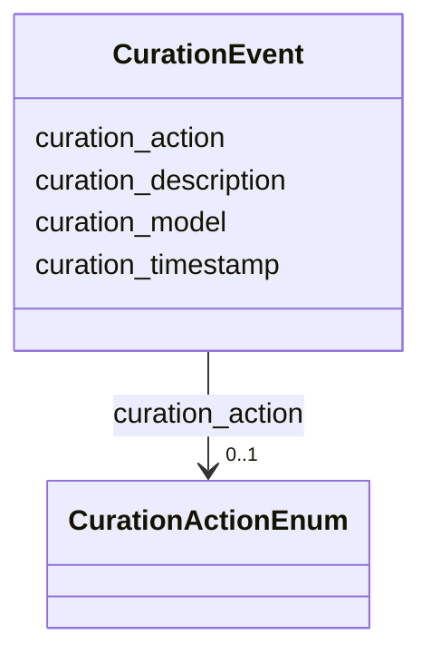

# Class: CurationEvent 


_A single curation event in the audit trail_


URI: [dismech:CurationEvent](https://w3id.org/monarch-initiative/dismech/CurationEvent)





<!-- no inheritance hierarchy -->


## Slots

| Name | Cardinality and Range | Description | Inheritance |
| ---  | --- | --- | --- |
| [curation_timestamp](curation_timestamp.md) | 1 <br/> [Datetime](Datetime.md) | ISO 8601 timestamp of the curation event | direct |
| [curation_model](curation_model.md) | 0..1 <br/> [String](String.md) | Model identifier used for curation (e | direct |
| [curation_action](curation_action.md) | 0..1 <br/> [CurationActionEnum](CurationActionEnum.md) | Type of curation action performed | direct |
| [curation_description](curation_description.md) | 0..1 <br/> [String](String.md) | Human-readable description of changes made | direct |


## Usages

| used by | used in | type | used |
| ---  | --- | --- | --- |
| [Disease](Disease.md) | [curation_history](curation_history.md) | range | [CurationEvent](CurationEvent.md) |


## Identifier and Mapping Information


### Schema Source


* from schema: https://w3id.org/monarch-initiative/dismech


## Mappings

| Mapping Type | Mapped Value |
| ---  | ---  |
| self | dismech:CurationEvent |
| native | dismech:CurationEvent |


## LinkML Source

<!-- TODO: investigate https://stackoverflow.com/questions/37606292/how-to-create-tabbed-code-blocks-in-mkdocs-or-sphinx -->

### Direct

<details>
```yaml
name: CurationEvent
description: A single curation event in the audit trail
from_schema: https://w3id.org/monarch-initiative/dismech
slots:
- curation_timestamp
- curation_model
- curation_action
- curation_description
slot_usage:
  curation_timestamp:
    name: curation_timestamp
    required: true

```
</details>

### Induced

<details>
```yaml
name: CurationEvent
description: A single curation event in the audit trail
from_schema: https://w3id.org/monarch-initiative/dismech
slot_usage:
  curation_timestamp:
    name: curation_timestamp
    required: true
attributes:
  curation_timestamp:
    name: curation_timestamp
    description: ISO 8601 timestamp of the curation event
    from_schema: https://w3id.org/monarch-initiative/dismech
    rank: 1000
    alias: curation_timestamp
    owner: CurationEvent
    domain_of:
    - CurationEvent
    range: datetime
    required: true
  curation_model:
    name: curation_model
    description: Model identifier used for curation (e.g., claude-opus-4-5-20251101)
    from_schema: https://w3id.org/monarch-initiative/dismech
    rank: 1000
    alias: curation_model
    owner: CurationEvent
    domain_of:
    - CurationEvent
    range: string
  curation_action:
    name: curation_action
    description: Type of curation action performed
    from_schema: https://w3id.org/monarch-initiative/dismech
    rank: 1000
    alias: curation_action
    owner: CurationEvent
    domain_of:
    - CurationEvent
    range: CurationActionEnum
  curation_description:
    name: curation_description
    description: Human-readable description of changes made
    from_schema: https://w3id.org/monarch-initiative/dismech
    rank: 1000
    alias: curation_description
    owner: CurationEvent
    domain_of:
    - CurationEvent
    range: string

```
</details>