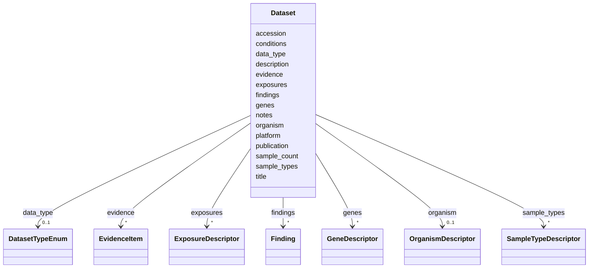

# Class: Dataset 


_A reference to a publicly available omics or phenotype dataset_


URI: [dismech:Dataset](https://w3id.org/monarch-initiative/dismech/Dataset)





<!-- no inheritance hierarchy -->


## Slots

| Name | Cardinality and Range | Description | Inheritance |
| ---  | --- | --- | --- |
| [accession](accession.md) | 1 <br/> [Uriorcurie](Uriorcurie.md) | Dataset accession identifier as a CURIE (e | direct |
| [title](title.md) | 0..1 <br/> [String](String.md) | Title of the publication | direct |
| [description](description.md) | 0..1 _recommended_ <br/> [String](String.md) | A description of the dataset | direct |
| [organism](organism.md) | 0..1 <br/> [OrganismDescriptor](OrganismDescriptor.md) | The organism from which samples were derived | direct |
| [data_type](data_type.md) | 0..1 <br/> [DatasetTypeEnum](DatasetTypeEnum.md) | The type of omics or other data in the dataset | direct |
| [sample_types](sample_types.md) | * <br/> [SampleTypeDescriptor](SampleTypeDescriptor.md) | Types of biological samples in the dataset | direct |
| [sample_count](sample_count.md) | 0..1 <br/> [Integer](Integer.md) | Total number of samples in the dataset | direct |
| [conditions](conditions.md) | * <br/> [String](String.md) | Experimental conditions or disease states represented | direct |
| [exposures](exposures.md) | * <br/> [ExposureDescriptor](ExposureDescriptor.md) | Environmental exposures studied in the dataset | direct |
| [genes](genes.md) | * <br/> [GeneDescriptor](GeneDescriptor.md) |  | direct |
| [platform](platform.md) | 0..1 <br/> [String](String.md) | Sequencing or array platform used | direct |
| [publication](publication.md) | 0..1 <br/> [PMID](PMID.md) | Associated publication (PMID) | direct |
| [findings](findings.md) | * <br/> [Finding](Finding.md) | Key findings or claims extracted from this source (publication or dataset) | direct |
| [evidence](evidence.md) | * _recommended_ <br/> [EvidenceItem](EvidenceItem.md) |  | direct |
| [notes](notes.md) | 0..1 <br/> [String](String.md) |  | direct |


## Usages

| used by | used in | type | used |
| ---  | --- | --- | --- |
| [Disease](Disease.md) | [datasets](datasets.md) | range | [Dataset](Dataset.md) |


## Comments

* Supports GEO, ArrayExpress, SRA, dbGaP, GTEx, ENCODE, phenopacket-store, and other repositories

## Identifier and Mapping Information


### Schema Source


* from schema: https://w3id.org/monarch-initiative/dismech


## Mappings

| Mapping Type | Mapped Value |
| ---  | ---  |
| self | dismech:Dataset |
| native | dismech:Dataset |


## LinkML Source

<!-- TODO: investigate https://stackoverflow.com/questions/37606292/how-to-create-tabbed-code-blocks-in-mkdocs-or-sphinx -->

### Direct

<details>
```yaml
name: Dataset
description: A reference to a publicly available omics or phenotype dataset
comments:
- Supports GEO, ArrayExpress, SRA, dbGaP, GTEx, ENCODE, phenopacket-store, and other
  repositories
from_schema: https://w3id.org/monarch-initiative/dismech
slots:
- accession
- title
- description
- organism
- data_type
- sample_types
- sample_count
- conditions
- exposures
- genes
- platform
- publication
- findings
- evidence
- notes
slot_usage:
  description:
    name: description
    description: A description of the dataset. This may typically be redundant with
      the `title` slot, but the description is more human-readable and may be used
      to communicate nuances not captured by the rigid standardization of the title
      slot.
    recommended: true

```
</details>

### Induced

<details>
```yaml
name: Dataset
description: A reference to a publicly available omics or phenotype dataset
comments:
- Supports GEO, ArrayExpress, SRA, dbGaP, GTEx, ENCODE, phenopacket-store, and other
  repositories
from_schema: https://w3id.org/monarch-initiative/dismech
slot_usage:
  description:
    name: description
    description: A description of the dataset. This may typically be redundant with
      the `title` slot, but the description is more human-readable and may be used
      to communicate nuances not captured by the rigid standardization of the title
      slot.
    recommended: true
attributes:
  accession:
    name: accession
    implements:
    - linkml:authoritative_reference
    description: Dataset accession identifier as a CURIE (e.g., geo:GSE67472)
    from_schema: https://w3id.org/monarch-initiative/dismech
    rank: 1000
    identifier: true
    alias: accession
    owner: Dataset
    domain_of:
    - Dataset
    range: uriorcurie
    required: true
  title:
    name: title
    implements:
    - linkml:title
    description: Title of the publication
    from_schema: https://w3id.org/monarch-initiative/dismech
    rank: 1000
    alias: title
    owner: Dataset
    domain_of:
    - Dataset
    - PublicationReference
    range: string
  description:
    name: description
    description: A description of the dataset. This may typically be redundant with
      the `title` slot, but the description is more human-readable and may be used
      to communicate nuances not captured by the rigid standardization of the title
      slot.
    from_schema: https://w3id.org/monarch-initiative/dismech
    rank: 1000
    alias: description
    owner: Dataset
    domain_of:
    - Descriptor
    - GeneticContext
    - Dataset
    - ClinicalTrial
    - ComputationalModel
    - DifferentialDiagnosis
    - Subtype
    - CausalEdge
    - TreatmentMechanismTarget
    - EpidemiologyInfo
    - Pathophysiology
    - Phenotype
    - HistopathologyFinding
    - Environmental
    - Disease
    - Stage
    - AgentLifeCycle
    - AgentLifeCycleStage
    - AnimalModel
    - Treatment
    - InfectiousAgent
    - Transmission
    - Assay
    - Diagnosis
    - Inheritance
    - Variant
    - FunctionalEffect
    - Mechanism
    - ModelingConsideration
    - Definition
    - CriteriaSet
    - ConditionDescriptor
    - GOEnrichment
    - ComorbidityHypothesis
    - UpstreamConditionHypothesis
    - MechanisticHypothesis
    range: string
    recommended: true
  organism:
    name: organism
    description: The organism from which samples were derived
    from_schema: https://w3id.org/monarch-initiative/dismech
    rank: 1000
    alias: organism
    owner: Dataset
    domain_of:
    - Dataset
    range: OrganismDescriptor
    inlined: true
  data_type:
    name: data_type
    description: The type of omics or other data in the dataset
    from_schema: https://w3id.org/monarch-initiative/dismech
    rank: 1000
    alias: data_type
    owner: Dataset
    domain_of:
    - Dataset
    range: DatasetTypeEnum
  sample_types:
    name: sample_types
    description: Types of biological samples in the dataset
    from_schema: https://w3id.org/monarch-initiative/dismech
    rank: 1000
    alias: sample_types
    owner: Dataset
    domain_of:
    - Dataset
    range: SampleTypeDescriptor
    multivalued: true
    inlined: true
    inlined_as_list: true
  sample_count:
    name: sample_count
    description: Total number of samples in the dataset
    from_schema: https://w3id.org/monarch-initiative/dismech
    rank: 1000
    alias: sample_count
    owner: Dataset
    domain_of:
    - Dataset
    range: integer
  conditions:
    name: conditions
    description: Experimental conditions or disease states represented
    from_schema: https://w3id.org/monarch-initiative/dismech
    rank: 1000
    alias: conditions
    owner: Dataset
    domain_of:
    - Dataset
    range: string
    multivalued: true
  exposures:
    name: exposures
    description: Environmental exposures studied in the dataset
    from_schema: https://w3id.org/monarch-initiative/dismech
    rank: 1000
    alias: exposures
    owner: Dataset
    domain_of:
    - Dataset
    range: ExposureDescriptor
    multivalued: true
    inlined: true
    inlined_as_list: true
  genes:
    name: genes
    examples:
    - value: '[{preferred_term: HLA-DQ2}, {preferred_term: INS}]'
    from_schema: https://w3id.org/monarch-initiative/dismech
    rank: 1000
    alias: genes
    owner: Dataset
    domain_of:
    - GeneticContext
    - Dataset
    - Subtype
    - Pathophysiology
    - AnimalModel
    range: GeneDescriptor
    multivalued: true
    inlined: true
    inlined_as_list: true
  platform:
    name: platform
    description: Sequencing or array platform used
    from_schema: https://w3id.org/monarch-initiative/dismech
    rank: 1000
    alias: platform
    owner: Dataset
    domain_of:
    - Dataset
    range: string
  publication:
    name: publication
    description: Associated publication (PMID)
    from_schema: https://w3id.org/monarch-initiative/dismech
    rank: 1000
    alias: publication
    owner: Dataset
    domain_of:
    - Dataset
    - ComputationalModel
    range: PMID
  findings:
    name: findings
    description: Key findings or claims extracted from this source (publication or
      dataset)
    from_schema: https://w3id.org/monarch-initiative/dismech
    rank: 1000
    alias: findings
    owner: Dataset
    domain_of:
    - Dataset
    - ComputationalModel
    - PublicationReference
    range: Finding
    multivalued: true
    inlined: true
    inlined_as_list: true
  evidence:
    name: evidence
    from_schema: https://w3id.org/monarch-initiative/dismech
    rank: 1000
    alias: evidence
    owner: Dataset
    domain_of:
    - PhenotypeContext
    - Dataset
    - ClinicalTrial
    - ComputationalModel
    - DifferentialDiagnosis
    - Subtype
    - CausalEdge
    - TreatmentMechanismTarget
    - Finding
    - Prevalence
    - ProgressionInfo
    - EpidemiologyInfo
    - Pathophysiology
    - Phenotype
    - Biochemical
    - HistopathologyFinding
    - Genetic
    - Environmental
    - Stage
    - AgentLifeCycle
    - AgentLifeCycleStage
    - AnimalModel
    - Treatment
    - InfectiousAgent
    - Transmission
    - Diagnosis
    - Inheritance
    - Variant
    - ModelingConsideration
    - ClassificationAssignment
    - Definition
    - CriteriaSet
    - AssociationSignal
    - AssociationStatistics
    - ComorbidityHypothesis
    - UpstreamConditionHypothesis
    - MechanisticHypothesis
    range: EvidenceItem
    recommended: true
    multivalued: true
    inlined: true
    inlined_as_list: true
  notes:
    name: notes
    examples:
    - value: Contagious stage where symptoms appear and the bacteria can be spread
        to others.
    from_schema: https://w3id.org/monarch-initiative/dismech
    rank: 1000
    alias: notes
    owner: Dataset
    domain_of:
    - GeneticContext
    - OnsetDescriptor
    - PhenotypeContext
    - Dataset
    - ClinicalTrial
    - ComputationalModel
    - DifferentialDiagnosis
    - Prevalence
    - ProgressionInfo
    - EpidemiologyInfo
    - Pathophysiology
    - Phenotype
    - Biochemical
    - HistopathologyFinding
    - Genetic
    - Environmental
    - Disease
    - Stage
    - AgentLifeCycle
    - AgentLifeCycleStage
    - Treatment
    - Transmission
    - Diagnosis
    - ClassificationAssignment
    - Definition
    - CriteriaSet
    - TermMapping
    - MappingConsistency
    - ComorbidityAssociation
    - AssociationSignal
    - AssociationMetric
    - AssociationStatistics
    - MechanisticHypothesis
    range: string

```
</details>