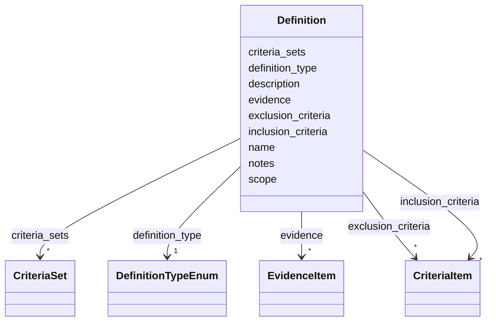

# Class: Definition 


_A diagnostic or phenotype definition for the disease_


URI: [dismech:Definition](https://w3id.org/monarch-initiative/dismech/Definition)





<!-- no inheritance hierarchy -->


## Slots

| Name | Cardinality and Range | Description | Inheritance |
| ---  | --- | --- | --- |
| [name](name.md) | 1 <br/> [String](String.md) |  | direct |
| [definition_type](definition_type.md) | 1 <br/> [DefinitionTypeEnum](DefinitionTypeEnum.md) | The type of definition or criteria set | direct |
| [description](description.md) | 0..1 <br/> [String](String.md) |  | direct |
| [scope](scope.md) | 0..1 <br/> [String](String.md) | Scope or population for which the definition applies (e | direct |
| [criteria_sets](criteria_sets.md) | * <br/> [CriteriaSet](CriteriaSet.md) | Named criteria groupings within a definition | direct |
| [inclusion_criteria](inclusion_criteria.md) | * <br/> [CriteriaItem](CriteriaItem.md) | Inclusion criteria for a definition or criteria set | direct |
| [exclusion_criteria](exclusion_criteria.md) | * <br/> [CriteriaItem](CriteriaItem.md) | Exclusion criteria for a definition or criteria set | direct |
| [evidence](evidence.md) | * _recommended_ <br/> [EvidenceItem](EvidenceItem.md) |  | direct |
| [notes](notes.md) | 0..1 <br/> [String](String.md) |  | direct |


## Usages

| used by | used in | type | used |
| ---  | --- | --- | --- |
| [Disease](Disease.md) | [definitions](definitions.md) | range | [Definition](Definition.md) |


## Identifier and Mapping Information


### Schema Source


* from schema: https://w3id.org/monarch-initiative/dismech


## Mappings

| Mapping Type | Mapped Value |
| ---  | ---  |
| self | dismech:Definition |
| native | dismech:Definition |


## LinkML Source

<!-- TODO: investigate https://stackoverflow.com/questions/37606292/how-to-create-tabbed-code-blocks-in-mkdocs-or-sphinx -->

### Direct

<details>
```yaml
name: Definition
description: A diagnostic or phenotype definition for the disease
from_schema: https://w3id.org/monarch-initiative/dismech
slots:
- name
- definition_type
- description
- scope
- criteria_sets
- inclusion_criteria
- exclusion_criteria
- evidence
- notes
slot_usage:
  name:
    name: name
    required: true
  definition_type:
    name: definition_type
    required: true

```
</details>

### Induced

<details>
```yaml
name: Definition
description: A diagnostic or phenotype definition for the disease
from_schema: https://w3id.org/monarch-initiative/dismech
slot_usage:
  name:
    name: name
    required: true
  definition_type:
    name: definition_type
    required: true
attributes:
  name:
    name: name
    examples:
    - value: Adolescent Nephronophthisis
    from_schema: https://w3id.org/monarch-initiative/dismech
    rank: 1000
    identifier: true
    alias: name
    owner: Definition
    domain_of:
    - ClinicalTrial
    - ComputationalModel
    - DifferentialDiagnosis
    - Subtype
    - EpidemiologyInfo
    - Pathophysiology
    - Phenotype
    - Biochemical
    - HistopathologyFinding
    - Genetic
    - Environmental
    - Disease
    - Stage
    - AgentLifeCycleStage
    - Treatment
    - InfectiousAgent
    - Transmission
    - Assay
    - Diagnosis
    - Inheritance
    - Variant
    - Mechanism
    - ModelingConsideration
    - Definition
    - CriteriaSet
    - ComorbidityAssociation
    range: string
    required: true
  definition_type:
    name: definition_type
    description: The type of definition or criteria set
    from_schema: https://w3id.org/monarch-initiative/dismech
    rank: 1000
    alias: definition_type
    owner: Definition
    domain_of:
    - Definition
    range: DefinitionTypeEnum
    required: true
  description:
    name: description
    from_schema: https://w3id.org/monarch-initiative/dismech
    rank: 1000
    alias: description
    owner: Definition
    domain_of:
    - Descriptor
    - GeneticContext
    - Dataset
    - ClinicalTrial
    - ComputationalModel
    - DifferentialDiagnosis
    - Subtype
    - CausalEdge
    - TreatmentMechanismTarget
    - EpidemiologyInfo
    - Pathophysiology
    - Phenotype
    - HistopathologyFinding
    - Environmental
    - Disease
    - Stage
    - AgentLifeCycle
    - AgentLifeCycleStage
    - AnimalModel
    - Treatment
    - InfectiousAgent
    - Transmission
    - Assay
    - Diagnosis
    - Inheritance
    - Variant
    - FunctionalEffect
    - Mechanism
    - ModelingConsideration
    - Definition
    - CriteriaSet
    - ConditionDescriptor
    - GOEnrichment
    - ComorbidityHypothesis
    - UpstreamConditionHypothesis
    - MechanisticHypothesis
    range: string
  scope:
    name: scope
    description: Scope or population for which the definition applies (e.g., adults,
      pediatrics)
    from_schema: https://w3id.org/monarch-initiative/dismech
    rank: 1000
    alias: scope
    owner: Definition
    domain_of:
    - Definition
    - CriteriaSet
    range: string
  criteria_sets:
    name: criteria_sets
    description: Named criteria groupings within a definition
    from_schema: https://w3id.org/monarch-initiative/dismech
    rank: 1000
    alias: criteria_sets
    owner: Definition
    domain_of:
    - Definition
    range: CriteriaSet
    multivalued: true
    inlined: true
    inlined_as_list: true
  inclusion_criteria:
    name: inclusion_criteria
    description: Inclusion criteria for a definition or criteria set
    from_schema: https://w3id.org/monarch-initiative/dismech
    rank: 1000
    alias: inclusion_criteria
    owner: Definition
    domain_of:
    - Definition
    - CriteriaSet
    range: CriteriaItem
    multivalued: true
    inlined: true
    inlined_as_list: true
  exclusion_criteria:
    name: exclusion_criteria
    description: Exclusion criteria for a definition or criteria set
    from_schema: https://w3id.org/monarch-initiative/dismech
    rank: 1000
    alias: exclusion_criteria
    owner: Definition
    domain_of:
    - Definition
    - CriteriaSet
    range: CriteriaItem
    multivalued: true
    inlined: true
    inlined_as_list: true
  evidence:
    name: evidence
    from_schema: https://w3id.org/monarch-initiative/dismech
    rank: 1000
    alias: evidence
    owner: Definition
    domain_of:
    - PhenotypeContext
    - Dataset
    - ClinicalTrial
    - ComputationalModel
    - DifferentialDiagnosis
    - Subtype
    - CausalEdge
    - TreatmentMechanismTarget
    - Finding
    - Prevalence
    - ProgressionInfo
    - EpidemiologyInfo
    - Pathophysiology
    - Phenotype
    - Biochemical
    - HistopathologyFinding
    - Genetic
    - Environmental
    - Stage
    - AgentLifeCycle
    - AgentLifeCycleStage
    - AnimalModel
    - Treatment
    - InfectiousAgent
    - Transmission
    - Diagnosis
    - Inheritance
    - Variant
    - ModelingConsideration
    - ClassificationAssignment
    - Definition
    - CriteriaSet
    - AssociationSignal
    - AssociationStatistics
    - ComorbidityHypothesis
    - UpstreamConditionHypothesis
    - MechanisticHypothesis
    range: EvidenceItem
    recommended: true
    multivalued: true
    inlined: true
    inlined_as_list: true
  notes:
    name: notes
    examples:
    - value: Contagious stage where symptoms appear and the bacteria can be spread
        to others.
    from_schema: https://w3id.org/monarch-initiative/dismech
    rank: 1000
    alias: notes
    owner: Definition
    domain_of:
    - GeneticContext
    - OnsetDescriptor
    - PhenotypeContext
    - Dataset
    - ClinicalTrial
    - ComputationalModel
    - DifferentialDiagnosis
    - Prevalence
    - ProgressionInfo
    - EpidemiologyInfo
    - Pathophysiology
    - Phenotype
    - Biochemical
    - HistopathologyFinding
    - Genetic
    - Environmental
    - Disease
    - Stage
    - AgentLifeCycle
    - AgentLifeCycleStage
    - Treatment
    - Transmission
    - Diagnosis
    - ClassificationAssignment
    - Definition
    - CriteriaSet
    - TermMapping
    - MappingConsistency
    - ComorbidityAssociation
    - AssociationSignal
    - AssociationMetric
    - AssociationStatistics
    - MechanisticHypothesis
    range: string

```
</details>