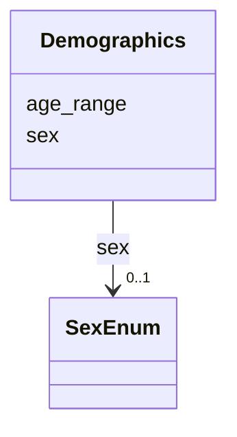

# Class: Demographics 


_Demographic stratification for an association signal_


URI: [dismech:Demographics](https://w3id.org/monarch-initiative/dismech/Demographics)





<!-- no inheritance hierarchy -->


## Slots

| Name | Cardinality and Range | Description | Inheritance |
| ---  | --- | --- | --- |
| [sex](sex.md) | 0..1 <br/> [SexEnum](SexEnum.md) | Sex-specific stratum, if applicable | direct |
| [age_range](age_range.md) | 0..1 <br/> [String](String.md) | Age range or stratification, if applicable | direct |


## Usages

| used by | used in | type | used |
| ---  | --- | --- | --- |
| [AssociationSignal](AssociationSignal.md) | [demographics](demographics.md) | range | [Demographics](Demographics.md) |


## Identifier and Mapping Information


### Schema Source


* from schema: https://w3id.org/monarch-initiative/dismech


## Mappings

| Mapping Type | Mapped Value |
| ---  | ---  |
| self | dismech:Demographics |
| native | dismech:Demographics |


## LinkML Source

<!-- TODO: investigate https://stackoverflow.com/questions/37606292/how-to-create-tabbed-code-blocks-in-mkdocs-or-sphinx -->

### Direct

<details>
```yaml
name: Demographics
description: Demographic stratification for an association signal
from_schema: https://w3id.org/monarch-initiative/dismech
slots:
- sex
- age_range
slot_usage:
  sex:
    name: sex
    range: SexEnum

```
</details>

### Induced

<details>
```yaml
name: Demographics
description: Demographic stratification for an association signal
from_schema: https://w3id.org/monarch-initiative/dismech
slot_usage:
  sex:
    name: sex
    range: SexEnum
attributes:
  sex:
    name: sex
    description: Sex-specific stratum, if applicable
    from_schema: https://w3id.org/monarch-initiative/dismech
    rank: 1000
    alias: sex
    owner: Demographics
    domain_of:
    - PhenotypeContext
    - Demographics
    range: SexEnum
  age_range:
    name: age_range
    description: Age range or stratification, if applicable
    examples:
    - value: Childhood-Adolescence
    from_schema: https://w3id.org/monarch-initiative/dismech
    rank: 1000
    alias: age_range
    owner: Demographics
    domain_of:
    - PhenotypeContext
    - ProgressionInfo
    - Demographics
    range: string

```
</details>