# Class: Descriptor 


_Base class for structured descriptors that allow a preferred term, optional description, optional ontology term binding, and post-composition via modifier, located_in, and laterality slots._


* __NOTE__: this is an abstract class and should not be instantiated directly


URI: [dismech:Descriptor](https://w3id.org/monarch-initiative/dismech/Descriptor)

```mermaid
 classDiagram
    class Descriptor
    click Descriptor href "../Descriptor/"
      Descriptor <|-- CellTypeDescriptor
        click CellTypeDescriptor href "../CellTypeDescriptor/"
      Descriptor <|-- BiologicalProcessDescriptor
        click BiologicalProcessDescriptor href "../BiologicalProcessDescriptor/"
      Descriptor <|-- AnatomicalEntityDescriptor
        click AnatomicalEntityDescriptor href "../AnatomicalEntityDescriptor/"
      Descriptor <|-- ChemicalEntityDescriptor
        click ChemicalEntityDescriptor href "../ChemicalEntityDescriptor/"
      Descriptor <|-- GeneDescriptor
        click GeneDescriptor href "../GeneDescriptor/"
      Descriptor <|-- CellularComponentDescriptor
        click CellularComponentDescriptor href "../CellularComponentDescriptor/"
      Descriptor <|-- ProteinComplexDescriptor
        click ProteinComplexDescriptor href "../ProteinComplexDescriptor/"
      Descriptor <|-- AssayDescriptor
        click AssayDescriptor href "../AssayDescriptor/"
      Descriptor <|-- TriggerDescriptor
        click TriggerDescriptor href "../TriggerDescriptor/"
      Descriptor <|-- DiseaseDescriptor
        click DiseaseDescriptor href "../DiseaseDescriptor/"
      Descriptor <|-- BiomarkerDescriptor
        click BiomarkerDescriptor href "../BiomarkerDescriptor/"
      Descriptor <|-- GeneProductDescriptor
        click GeneProductDescriptor href "../GeneProductDescriptor/"
      Descriptor <|-- HistopathologyFindingDescriptor
        click HistopathologyFindingDescriptor href "../HistopathologyFindingDescriptor/"
      Descriptor <|-- LifeCycleStageDescriptor
        click LifeCycleStageDescriptor href "../LifeCycleStageDescriptor/"
      Descriptor <|-- PhenotypeDescriptor
        click PhenotypeDescriptor href "../PhenotypeDescriptor/"
      Descriptor <|-- InheritanceDescriptor
        click InheritanceDescriptor href "../InheritanceDescriptor/"
      Descriptor <|-- TreatmentDescriptor
        click TreatmentDescriptor href "../TreatmentDescriptor/"
      Descriptor <|-- RegimenDescriptor
        click RegimenDescriptor href "../RegimenDescriptor/"
      Descriptor <|-- ExposureDescriptor
        click ExposureDescriptor href "../ExposureDescriptor/"
      Descriptor <|-- EnvironmentDescriptor
        click EnvironmentDescriptor href "../EnvironmentDescriptor/"
      Descriptor <|-- OrganismDescriptor
        click OrganismDescriptor href "../OrganismDescriptor/"
      Descriptor <|-- SampleTypeDescriptor
        click SampleTypeDescriptor href "../SampleTypeDescriptor/"
      Descriptor <|-- CriteriaItem
        click CriteriaItem href "../CriteriaItem/"
      Descriptor <|-- ConditionDescriptor
        click ConditionDescriptor href "../ConditionDescriptor/"
      
      Descriptor : description
        
      Descriptor : laterality
        
          
    
        
        
        Descriptor --> "0..1" LateralityEnum : laterality
        click LateralityEnum href "../LateralityEnum/"
    

        
      Descriptor : located_in
        
          
    
        
        
        Descriptor --> "0..1" AnatomicalEntityDescriptor : located_in
        click AnatomicalEntityDescriptor href "../AnatomicalEntityDescriptor/"
    

        
      Descriptor : modifier
        
          
    
        
        
        Descriptor --> "0..1" ModifierEnum : modifier
        click ModifierEnum href "../ModifierEnum/"
    

        
      Descriptor : preferred_term
        
      Descriptor : qualifiers
        
          
    
        
        
        Descriptor --> "*" Qualifier : qualifiers
        click Qualifier href "../Qualifier/"
    

        
      Descriptor : term
        
          
    
        
        
        Descriptor --> "0..1" Term : term
        click Term href "../Term/"
    

        
      
```





## Inheritance
* **Descriptor**
    * [CellTypeDescriptor](CellTypeDescriptor.md)
    * [BiologicalProcessDescriptor](BiologicalProcessDescriptor.md)
    * [AnatomicalEntityDescriptor](AnatomicalEntityDescriptor.md)
    * [ChemicalEntityDescriptor](ChemicalEntityDescriptor.md)
    * [GeneDescriptor](GeneDescriptor.md)
    * [CellularComponentDescriptor](CellularComponentDescriptor.md)
    * [ProteinComplexDescriptor](ProteinComplexDescriptor.md)
    * [AssayDescriptor](AssayDescriptor.md)
    * [TriggerDescriptor](TriggerDescriptor.md)
    * [DiseaseDescriptor](DiseaseDescriptor.md)
    * [BiomarkerDescriptor](BiomarkerDescriptor.md)
    * [GeneProductDescriptor](GeneProductDescriptor.md)
    * [HistopathologyFindingDescriptor](HistopathologyFindingDescriptor.md)
    * [LifeCycleStageDescriptor](LifeCycleStageDescriptor.md)
    * [PhenotypeDescriptor](PhenotypeDescriptor.md)
    * [InheritanceDescriptor](InheritanceDescriptor.md)
    * [TreatmentDescriptor](TreatmentDescriptor.md)
    * [RegimenDescriptor](RegimenDescriptor.md)
    * [ExposureDescriptor](ExposureDescriptor.md)
    * [EnvironmentDescriptor](EnvironmentDescriptor.md)
    * [OrganismDescriptor](OrganismDescriptor.md)
    * [SampleTypeDescriptor](SampleTypeDescriptor.md)
    * [CriteriaItem](CriteriaItem.md)
    * [ConditionDescriptor](ConditionDescriptor.md)


## Slots

| Name | Cardinality and Range | Description | Inheritance |
| ---  | --- | --- | --- |
| [preferred_term](preferred_term.md) | 1 <br/> [String](String.md) | The preferred human-readable term for this descriptor | direct |
| [description](description.md) | 0..1 <br/> [String](String.md) | A description of the descriptor | direct |
| [term](term.md) | 0..1 _recommended_ <br/> [Term](Term.md) | Optional structured ontology term reference | direct |
| [modifier](modifier.md) | 0..1 <br/> [ModifierEnum](ModifierEnum.md) | Directional or qualitative modifier for a descriptor (e | direct |
| [located_in](located_in.md) | 0..1 <br/> [AnatomicalEntityDescriptor](AnatomicalEntityDescriptor.md) | Anatomical location where this entity/process occurs or procedure is performe... | direct |
| [laterality](laterality.md) | 0..1 <br/> [LateralityEnum](LateralityEnum.md) | Laterality qualifier (left, right, or bilateral) | direct |
| [qualifiers](qualifiers.md) | * <br/> [Qualifier](Qualifier.md) | List of predicate-value pairs for formal post-composition | direct |


## Usages

| used by | used in | type | used |
| ---  | --- | --- | --- |
| [Qualifier](Qualifier.md) | [predicate](predicate.md) | range | [Descriptor](Descriptor.md) |
| [Qualifier](Qualifier.md) | [value](value.md) | range | [Descriptor](Descriptor.md) |


## Identifier and Mapping Information


### Schema Source


* from schema: https://w3id.org/monarch-initiative/dismech


## Mappings

| Mapping Type | Mapped Value |
| ---  | ---  |
| self | dismech:Descriptor |
| native | dismech:Descriptor |


## LinkML Source

<!-- TODO: investigate https://stackoverflow.com/questions/37606292/how-to-create-tabbed-code-blocks-in-mkdocs-or-sphinx -->

### Direct

<details>
```yaml
name: Descriptor
description: Base class for structured descriptors that allow a preferred term, optional
  description, optional ontology term binding, and post-composition via modifier,
  located_in, and laterality slots.
from_schema: https://w3id.org/monarch-initiative/dismech
abstract: true
slots:
- preferred_term
- description
- term
- modifier
- located_in
- laterality
- qualifiers
slot_usage:
  description:
    name: description
    description: A description of the descriptor. This may typically be redundant
      with the `term` object, but the description is more human-readable and may be
      used to communicate nuances not captured by the rigid standardization of the
      term object.
    recommended: false

```
</details>

### Induced

<details>
```yaml
name: Descriptor
description: Base class for structured descriptors that allow a preferred term, optional
  description, optional ontology term binding, and post-composition via modifier,
  located_in, and laterality slots.
from_schema: https://w3id.org/monarch-initiative/dismech
abstract: true
slot_usage:
  description:
    name: description
    description: A description of the descriptor. This may typically be redundant
      with the `term` object, but the description is more human-readable and may be
      used to communicate nuances not captured by the rigid standardization of the
      term object.
    recommended: false
attributes:
  preferred_term:
    name: preferred_term
    description: The preferred human-readable term for this descriptor
    from_schema: https://w3id.org/monarch-initiative/dismech
    rank: 1000
    alias: preferred_term
    owner: Descriptor
    domain_of:
    - Descriptor
    - ConditionDescriptor
    range: string
    required: true
  description:
    name: description
    description: A description of the descriptor. This may typically be redundant
      with the `term` object, but the description is more human-readable and may be
      used to communicate nuances not captured by the rigid standardization of the
      term object.
    from_schema: https://w3id.org/monarch-initiative/dismech
    rank: 1000
    alias: description
    owner: Descriptor
    domain_of:
    - Descriptor
    - GeneticContext
    - Dataset
    - ClinicalTrial
    - ComputationalModel
    - DifferentialDiagnosis
    - Subtype
    - CausalEdge
    - TreatmentMechanismTarget
    - EpidemiologyInfo
    - Pathophysiology
    - Phenotype
    - HistopathologyFinding
    - Environmental
    - Disease
    - Stage
    - AgentLifeCycle
    - AgentLifeCycleStage
    - AnimalModel
    - Treatment
    - InfectiousAgent
    - Transmission
    - Assay
    - Diagnosis
    - Inheritance
    - Variant
    - FunctionalEffect
    - Mechanism
    - ModelingConsideration
    - Definition
    - CriteriaSet
    - ConditionDescriptor
    - GOEnrichment
    - ComorbidityHypothesis
    - UpstreamConditionHypothesis
    - MechanisticHypothesis
    range: string
    recommended: false
  term:
    name: term
    description: Optional structured ontology term reference
    from_schema: https://w3id.org/monarch-initiative/dismech
    rank: 1000
    alias: term
    owner: Descriptor
    domain_of:
    - Descriptor
    - TermMapping
    - ConditionDescriptor
    - GOEnrichmentTerm
    range: Term
    recommended: true
    inlined: true
  modifier:
    name: modifier
    description: Directional or qualitative modifier for a descriptor (e.g., increased,
      decreased, abnormal)
    from_schema: https://w3id.org/monarch-initiative/dismech
    rank: 1000
    alias: modifier
    owner: Descriptor
    domain_of:
    - Descriptor
    range: ModifierEnum
  located_in:
    name: located_in
    description: Anatomical location where this entity/process occurs or procedure
      is performed
    from_schema: https://w3id.org/monarch-initiative/dismech
    rank: 1000
    alias: located_in
    owner: Descriptor
    domain_of:
    - Descriptor
    range: AnatomicalEntityDescriptor
    inlined: true
  laterality:
    name: laterality
    description: Laterality qualifier (left, right, or bilateral)
    from_schema: https://w3id.org/monarch-initiative/dismech
    rank: 1000
    alias: laterality
    owner: Descriptor
    domain_of:
    - Descriptor
    range: LateralityEnum
  qualifiers:
    name: qualifiers
    description: List of predicate-value pairs for formal post-composition. Allows
      OWL-like expressivity with controlled predicates (e.g., RO relations) and values.
    deprecated: Prefer explicit slots like located_in and laterality instead of generic
      qualifiers
    from_schema: https://w3id.org/monarch-initiative/dismech
    rank: 1000
    alias: qualifiers
    owner: Descriptor
    domain_of:
    - Descriptor
    range: Qualifier
    multivalued: true
    inlined: true
    inlined_as_list: true

```
</details>