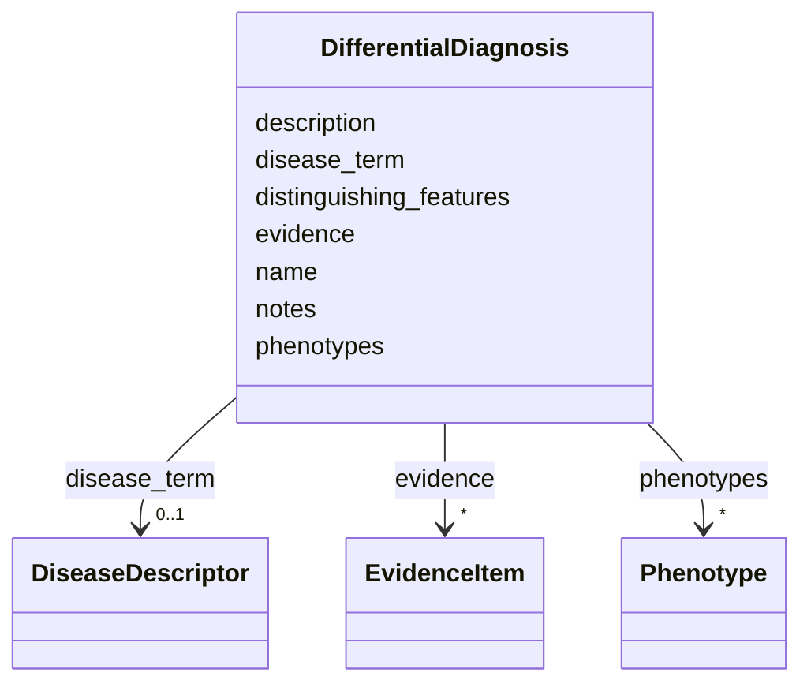

# Class: DifferentialDiagnosis 


_A disease or condition that presents similarly to the focal disease and must be differentiated_


URI: [dismech:DifferentialDiagnosis](https://w3id.org/monarch-initiative/dismech/DifferentialDiagnosis)





<!-- no inheritance hierarchy -->


## Slots

| Name | Cardinality and Range | Description | Inheritance |
| ---  | --- | --- | --- |
| [name](name.md) | 1 <br/> [String](String.md) |  | direct |
| [description](description.md) | 0..1 <br/> [String](String.md) | Clinical or mechanistic overlaps, shared presentations, and diagnostic consid... | direct |
| [phenotypes](phenotypes.md) | * <br/> [Phenotype](Phenotype.md) |  | direct |
| [distinguishing_features](distinguishing_features.md) | * <br/> [String](String.md) | Key clinical, laboratory, imaging, or epidemiological features that help diff... | direct |
| [evidence](evidence.md) | * _recommended_ <br/> [EvidenceItem](EvidenceItem.md) |  | direct |
| [notes](notes.md) | 0..1 <br/> [String](String.md) | Additional clinical notes or management considerations | direct |
| [disease_term](disease_term.md) | 0..1 <br/> [DiseaseDescriptor](DiseaseDescriptor.md) | The MONDO disease term for this disease | direct |


## Usages

| used by | used in | type | used |
| ---  | --- | --- | --- |
| [Disease](Disease.md) | [differential_diagnoses](differential_diagnoses.md) | range | [DifferentialDiagnosis](DifferentialDiagnosis.md) |


## Comments

* Documents diseases/conditions with overlapping clinical presentations
* Includes distinguishing features to help differentiate from the focal disease
* Essential for clinical diagnostic accuracy

## Identifier and Mapping Information


### Schema Source


* from schema: https://w3id.org/monarch-initiative/dismech


## Mappings

| Mapping Type | Mapped Value |
| ---  | ---  |
| self | dismech:DifferentialDiagnosis |
| native | dismech:DifferentialDiagnosis |


## LinkML Source

<!-- TODO: investigate https://stackoverflow.com/questions/37606292/how-to-create-tabbed-code-blocks-in-mkdocs-or-sphinx -->

### Direct

<details>
```yaml
name: DifferentialDiagnosis
description: A disease or condition that presents similarly to the focal disease and
  must be differentiated
comments:
- Documents diseases/conditions with overlapping clinical presentations
- Includes distinguishing features to help differentiate from the focal disease
- Essential for clinical diagnostic accuracy
from_schema: https://w3id.org/monarch-initiative/dismech
slots:
- name
- description
- phenotypes
- distinguishing_features
- evidence
- notes
- disease_term
slot_usage:
  description:
    name: description
    description: Clinical or mechanistic overlaps, shared presentations, and diagnostic
      considerations with the focal disease
  distinguishing_features:
    name: distinguishing_features
    description: Key clinical, laboratory, imaging, or epidemiological features that
      help differentiate this condition from the focal disease
  notes:
    name: notes
    description: Additional clinical notes or management considerations

```
</details>

### Induced

<details>
```yaml
name: DifferentialDiagnosis
description: A disease or condition that presents similarly to the focal disease and
  must be differentiated
comments:
- Documents diseases/conditions with overlapping clinical presentations
- Includes distinguishing features to help differentiate from the focal disease
- Essential for clinical diagnostic accuracy
from_schema: https://w3id.org/monarch-initiative/dismech
slot_usage:
  description:
    name: description
    description: Clinical or mechanistic overlaps, shared presentations, and diagnostic
      considerations with the focal disease
  distinguishing_features:
    name: distinguishing_features
    description: Key clinical, laboratory, imaging, or epidemiological features that
      help differentiate this condition from the focal disease
  notes:
    name: notes
    description: Additional clinical notes or management considerations
attributes:
  name:
    name: name
    examples:
    - value: Adolescent Nephronophthisis
    from_schema: https://w3id.org/monarch-initiative/dismech
    rank: 1000
    identifier: true
    alias: name
    owner: DifferentialDiagnosis
    domain_of:
    - ClinicalTrial
    - ComputationalModel
    - DifferentialDiagnosis
    - Subtype
    - EpidemiologyInfo
    - Pathophysiology
    - Phenotype
    - Biochemical
    - HistopathologyFinding
    - Genetic
    - Environmental
    - Disease
    - Stage
    - AgentLifeCycleStage
    - Treatment
    - InfectiousAgent
    - Transmission
    - Assay
    - Diagnosis
    - Inheritance
    - Variant
    - Mechanism
    - ModelingConsideration
    - Definition
    - CriteriaSet
    - ComorbidityAssociation
    range: string
    required: true
  description:
    name: description
    description: Clinical or mechanistic overlaps, shared presentations, and diagnostic
      considerations with the focal disease
    from_schema: https://w3id.org/monarch-initiative/dismech
    rank: 1000
    alias: description
    owner: DifferentialDiagnosis
    domain_of:
    - Descriptor
    - GeneticContext
    - Dataset
    - ClinicalTrial
    - ComputationalModel
    - DifferentialDiagnosis
    - Subtype
    - CausalEdge
    - TreatmentMechanismTarget
    - EpidemiologyInfo
    - Pathophysiology
    - Phenotype
    - HistopathologyFinding
    - Environmental
    - Disease
    - Stage
    - AgentLifeCycle
    - AgentLifeCycleStage
    - AnimalModel
    - Treatment
    - InfectiousAgent
    - Transmission
    - Assay
    - Diagnosis
    - Inheritance
    - Variant
    - FunctionalEffect
    - Mechanism
    - ModelingConsideration
    - Definition
    - CriteriaSet
    - ConditionDescriptor
    - GOEnrichment
    - ComorbidityHypothesis
    - UpstreamConditionHypothesis
    - MechanisticHypothesis
    range: string
  phenotypes:
    name: phenotypes
    from_schema: https://w3id.org/monarch-initiative/dismech
    rank: 1000
    alias: phenotypes
    owner: DifferentialDiagnosis
    domain_of:
    - DifferentialDiagnosis
    - Disease
    - ComorbidityAssociation
    range: Phenotype
    multivalued: true
    inlined: true
    inlined_as_list: true
  distinguishing_features:
    name: distinguishing_features
    description: Key clinical, laboratory, imaging, or epidemiological features that
      help differentiate this condition from the focal disease
    from_schema: https://w3id.org/monarch-initiative/dismech
    rank: 1000
    alias: distinguishing_features
    owner: DifferentialDiagnosis
    domain_of:
    - DifferentialDiagnosis
    range: string
    multivalued: true
  evidence:
    name: evidence
    from_schema: https://w3id.org/monarch-initiative/dismech
    rank: 1000
    alias: evidence
    owner: DifferentialDiagnosis
    domain_of:
    - PhenotypeContext
    - Dataset
    - ClinicalTrial
    - ComputationalModel
    - DifferentialDiagnosis
    - Subtype
    - CausalEdge
    - TreatmentMechanismTarget
    - Finding
    - Prevalence
    - ProgressionInfo
    - EpidemiologyInfo
    - Pathophysiology
    - Phenotype
    - Biochemical
    - HistopathologyFinding
    - Genetic
    - Environmental
    - Stage
    - AgentLifeCycle
    - AgentLifeCycleStage
    - AnimalModel
    - Treatment
    - InfectiousAgent
    - Transmission
    - Diagnosis
    - Inheritance
    - Variant
    - ModelingConsideration
    - ClassificationAssignment
    - Definition
    - CriteriaSet
    - AssociationSignal
    - AssociationStatistics
    - ComorbidityHypothesis
    - UpstreamConditionHypothesis
    - MechanisticHypothesis
    range: EvidenceItem
    recommended: true
    multivalued: true
    inlined: true
    inlined_as_list: true
  notes:
    name: notes
    description: Additional clinical notes or management considerations
    examples:
    - value: Contagious stage where symptoms appear and the bacteria can be spread
        to others.
    from_schema: https://w3id.org/monarch-initiative/dismech
    rank: 1000
    alias: notes
    owner: DifferentialDiagnosis
    domain_of:
    - GeneticContext
    - OnsetDescriptor
    - PhenotypeContext
    - Dataset
    - ClinicalTrial
    - ComputationalModel
    - DifferentialDiagnosis
    - Prevalence
    - ProgressionInfo
    - EpidemiologyInfo
    - Pathophysiology
    - Phenotype
    - Biochemical
    - HistopathologyFinding
    - Genetic
    - Environmental
    - Disease
    - Stage
    - AgentLifeCycle
    - AgentLifeCycleStage
    - Treatment
    - Transmission
    - Diagnosis
    - ClassificationAssignment
    - Definition
    - CriteriaSet
    - TermMapping
    - MappingConsistency
    - ComorbidityAssociation
    - AssociationSignal
    - AssociationMetric
    - AssociationStatistics
    - MechanisticHypothesis
    range: string
  disease_term:
    name: disease_term
    description: The MONDO disease term for this disease
    from_schema: https://w3id.org/monarch-initiative/dismech
    rank: 1000
    alias: disease_term
    owner: DifferentialDiagnosis
    domain_of:
    - DifferentialDiagnosis
    - Disease
    range: DiseaseDescriptor
    inlined: true

```
</details>