# Class: Disease 


URI: [dismech:Disease](https://w3id.org/monarch-initiative/dismech/Disease)

```mermaid
 classDiagram
    class Disease
    click Disease href "../Disease/"
      Disease : agent_life_cycle
        
          
    
        
        
        Disease --> "0..1" AgentLifeCycle : agent_life_cycle
        click AgentLifeCycle href "../AgentLifeCycle/"
    

        
      Disease : animal_models
        
          
    
        
        
        Disease --> "*" AnimalModel : animal_models
        click AnimalModel href "../AnimalModel/"
    

        
      Disease : biochemical
        
          
    
        
        
        Disease --> "*" Biochemical : biochemical
        click Biochemical href "../Biochemical/"
    

        
      Disease : categories
        
      Disease : category
        
      Disease : classifications
        
          
    
        
        
        Disease --> "0..1" DiseaseClassifications : classifications
        click DiseaseClassifications href "../DiseaseClassifications/"
    

        
      Disease : clinical_trials
        
          
    
        
        
        Disease --> "*" ClinicalTrial : clinical_trials
        click ClinicalTrial href "../ClinicalTrial/"
    

        
      Disease : computational_models
        
          
    
        
        
        Disease --> "*" ComputationalModel : computational_models
        click ComputationalModel href "../ComputationalModel/"
    

        
      Disease : creation_date
        
      Disease : curation_history
        
          
    
        
        
        Disease --> "*" CurationEvent : curation_history
        click CurationEvent href "../CurationEvent/"
    

        
      Disease : datasets
        
          
    
        
        
        Disease --> "*" Dataset : datasets
        click Dataset href "../Dataset/"
    

        
      Disease : definitions
        
          
    
        
        
        Disease --> "*" Definition : definitions
        click Definition href "../Definition/"
    

        
      Disease : description
        
      Disease : diagnosis
        
          
    
        
        
        Disease --> "*" Diagnosis : diagnosis
        click Diagnosis href "../Diagnosis/"
    

        
      Disease : differential_diagnoses
        
          
    
        
        
        Disease --> "*" DifferentialDiagnosis : differential_diagnoses
        click DifferentialDiagnosis href "../DifferentialDiagnosis/"
    

        
      Disease : disease_term
        
          
    
        
        
        Disease --> "0..1" DiseaseDescriptor : disease_term
        click DiseaseDescriptor href "../DiseaseDescriptor/"
    

        
      Disease : environmental
        
          
    
        
        
        Disease --> "*" Environmental : environmental
        click Environmental href "../Environmental/"
    

        
      Disease : epidemiology
        
          
    
        
        
        Disease --> "*" EpidemiologyInfo : epidemiology
        click EpidemiologyInfo href "../EpidemiologyInfo/"
    

        
      Disease : genetic
        
          
    
        
        
        Disease --> "*" Genetic : genetic
        click Genetic href "../Genetic/"
    

        
      Disease : has_subtypes
        
          
    
        
        
        Disease --> "*" Subtype : has_subtypes
        click Subtype href "../Subtype/"
    

        
      Disease : histopathology
        
          
    
        
        
        Disease --> "*" HistopathologyFinding : histopathology
        click HistopathologyFinding href "../HistopathologyFinding/"
    

        
      Disease : infectious_agent
        
          
    
        
        
        Disease --> "*" InfectiousAgent : infectious_agent
        click InfectiousAgent href "../InfectiousAgent/"
    

        
      Disease : inheritance
        
          
    
        
        
        Disease --> "*" Inheritance : inheritance
        click Inheritance href "../Inheritance/"
    

        
      Disease : mappings
        
          
    
        
        
        Disease --> "0..1" DiseaseMappings : mappings
        click DiseaseMappings href "../DiseaseMappings/"
    

        
      Disease : mechanistic_hypotheses
        
          
    
        
        
        Disease --> "*" MechanisticHypothesis : mechanistic_hypotheses
        click MechanisticHypothesis href "../MechanisticHypothesis/"
    

        
      Disease : modeling_considerations
        
          
    
        
        
        Disease --> "*" ModelingConsideration : modeling_considerations
        click ModelingConsideration href "../ModelingConsideration/"
    

        
      Disease : name
        
      Disease : notes
        
      Disease : parents
        
      Disease : pathophysiology
        
          
    
        
        
        Disease --> "*" Pathophysiology : pathophysiology
        click Pathophysiology href "../Pathophysiology/"
    

        
      Disease : phenotypes
        
          
    
        
        
        Disease --> "*" Phenotype : phenotypes
        click Phenotype href "../Phenotype/"
    

        
      Disease : prevalence
        
          
    
        
        
        Disease --> "*" Prevalence : prevalence
        click Prevalence href "../Prevalence/"
    

        
      Disease : progression
        
          
    
        
        
        Disease --> "*" ProgressionInfo : progression
        click ProgressionInfo href "../ProgressionInfo/"
    

        
      Disease : references
        
          
    
        
        
        Disease --> "*" PublicationReference : references
        click PublicationReference href "../PublicationReference/"
    

        
      Disease : review_notes
        
      Disease : stages
        
          
    
        
        
        Disease --> "*" Stage : stages
        click Stage href "../Stage/"
    

        
      Disease : synonyms
        
      Disease : transmission
        
          
    
        
        
        Disease --> "*" Transmission : transmission
        click Transmission href "../Transmission/"
    

        
      Disease : treatments
        
          
    
        
        
        Disease --> "*" Treatment : treatments
        click Treatment href "../Treatment/"
    

        
      Disease : updated_date
        
      Disease : variants
        
          
    
        
        
        Disease --> "*" Variant : variants
        click Variant href "../Variant/"
    

        
      
```





<!-- no inheritance hierarchy -->


## Slots

| Name | Cardinality and Range | Description | Inheritance |
| ---  | --- | --- | --- |
| [name](name.md) | 1 <br/> [String](String.md) | Preferred name for the disease | direct |
| [disease_term](disease_term.md) | 0..1 <br/> [DiseaseDescriptor](DiseaseDescriptor.md) | The MONDO disease term for this disease | direct |
| [creation_date](creation_date.md) | 0..1 _recommended_ <br/> [String](String.md) | Timestamp for initial creation of this disease entry | direct |
| [updated_date](updated_date.md) | 0..1 _recommended_ <br/> [String](String.md) | Timestamp for the latest substantive update to this disease entry | direct |
| [description](description.md) | 0..1 <br/> [String](String.md) |  | direct |
| [references](references.md) | * <br/> [PublicationReference](PublicationReference.md) | Top-level list of references with their key findings for this disease | direct |
| [category](category.md) | 0..1 <br/> [String](String.md) |  | direct |
| [parents](parents.md) | * <br/> [String](String.md) |  | direct |
| [has_subtypes](has_subtypes.md) | * <br/> [Subtype](Subtype.md) |  | direct |
| [prevalence](prevalence.md) | * <br/> [Prevalence](Prevalence.md) |  | direct |
| [progression](progression.md) | * <br/> [ProgressionInfo](ProgressionInfo.md) |  | direct |
| [pathophysiology](pathophysiology.md) | * <br/> [Pathophysiology](Pathophysiology.md) |  | direct |
| [mechanistic_hypotheses](mechanistic_hypotheses.md) | * <br/> [MechanisticHypothesis](MechanisticHypothesis.md) | Disease-level mechanistic hypotheses that group and annotate causal edges | direct |
| [phenotypes](phenotypes.md) | * <br/> [Phenotype](Phenotype.md) |  | direct |
| [histopathology](histopathology.md) | * <br/> [HistopathologyFinding](HistopathologyFinding.md) | Histopathologic findings including microscopic morphology, architectural patt... | direct |
| [biochemical](biochemical.md) | * <br/> [Biochemical](Biochemical.md) |  | direct |
| [stages](stages.md) | * <br/> [Stage](Stage.md) |  | direct |
| [genetic](genetic.md) | * <br/> [Genetic](Genetic.md) |  | direct |
| [variants](variants.md) | * <br/> [Variant](Variant.md) |  | direct |
| [environmental](environmental.md) | * <br/> [Environmental](Environmental.md) |  | direct |
| [treatments](treatments.md) | * <br/> [Treatment](Treatment.md) |  | direct |
| [categories](categories.md) | * <br/> [String](String.md) |  | direct |
| [infectious_agent](infectious_agent.md) | * <br/> [InfectiousAgent](InfectiousAgent.md) |  | direct |
| [agent_life_cycle](agent_life_cycle.md) | 0..1 <br/> [AgentLifeCycle](AgentLifeCycle.md) |  | direct |
| [transmission](transmission.md) | * <br/> [Transmission](Transmission.md) |  | direct |
| [modeling_considerations](modeling_considerations.md) | * <br/> [ModelingConsideration](ModelingConsideration.md) |  | direct |
| [epidemiology](epidemiology.md) | * <br/> [EpidemiologyInfo](EpidemiologyInfo.md) |  | direct |
| [diagnosis](diagnosis.md) | * <br/> [Diagnosis](Diagnosis.md) |  | direct |
| [differential_diagnoses](differential_diagnoses.md) | * <br/> [DifferentialDiagnosis](DifferentialDiagnosis.md) | Differential diagnoses - similar diseases that must be ruled out | direct |
| [synonyms](synonyms.md) | * <br/> [String](String.md) |  | direct |
| [inheritance](inheritance.md) | * <br/> [Inheritance](Inheritance.md) |  | direct |
| [animal_models](animal_models.md) | * <br/> [AnimalModel](AnimalModel.md) |  | direct |
| [datasets](datasets.md) | * _recommended_ <br/> [Dataset](Dataset.md) | Publicly available datasets relevant to disease research | direct |
| [clinical_trials](clinical_trials.md) | * <br/> [ClinicalTrial](ClinicalTrial.md) | Clinical trials relevant to disease treatment and research | direct |
| [computational_models](computational_models.md) | * <br/> [ComputationalModel](ComputationalModel.md) | Computational models (metabolic, mechanistic, ML, digital twins) for this dis... | direct |
| [classifications](classifications.md) | 0..1 <br/> [DiseaseClassifications](DiseaseClassifications.md) | Classification assignments for this disease from various nosologies | direct |
| [definitions](definitions.md) | * <br/> [Definition](Definition.md) | Definitions or diagnostic criteria for this disease | direct |
| [mappings](mappings.md) | 0..1 <br/> [DiseaseMappings](DiseaseMappings.md) | External identifier mappings for this disease (SSSOM-inspired) | direct |
| [notes](notes.md) | 0..1 <br/> [String](String.md) |  | direct |
| [review_notes](review_notes.md) | 0..1 <br/> [String](String.md) |  | direct |
| [curation_history](curation_history.md) | * <br/> [CurationEvent](CurationEvent.md) | Audit trail of AI-assisted curation events | direct |


## Usages

| used by | used in | type | used |
| ---  | --- | --- | --- |
| [DiseaseCollection](DiseaseCollection.md) | [diseases](diseases.md) | range | [Disease](Disease.md) |


## Identifier and Mapping Information


### Schema Source


* from schema: https://w3id.org/monarch-initiative/dismech


## Mappings

| Mapping Type | Mapped Value |
| ---  | ---  |
| self | dismech:Disease |
| native | dismech:Disease |


## LinkML Source

<!-- TODO: investigate https://stackoverflow.com/questions/37606292/how-to-create-tabbed-code-blocks-in-mkdocs-or-sphinx -->

### Direct

<details>
```yaml
name: Disease
from_schema: https://w3id.org/monarch-initiative/dismech
slots:
- name
- disease_term
- creation_date
- updated_date
- description
- references
- category
- parents
- has_subtypes
- prevalence
- progression
- pathophysiology
- mechanistic_hypotheses
- phenotypes
- histopathology
- biochemical
- stages
- genetic
- variants
- environmental
- treatments
- categories
- infectious_agent
- agent_life_cycle
- transmission
- modeling_considerations
- epidemiology
- diagnosis
- differential_diagnoses
- synonyms
- inheritance
- animal_models
- datasets
- clinical_trials
- computational_models
- classifications
- definitions
- mappings
- notes
- review_notes
- curation_history
slot_usage:
  name:
    name: name
    description: Preferred name for the disease
    required: true
  creation_date:
    name: creation_date
    description: Timestamp for initial creation of this disease entry. Keep this stable
      after first set.
  updated_date:
    name: updated_date
    description: Timestamp for the latest substantive update to this disease entry.
      Update this whenever curated content changes.

```
</details>

### Induced

<details>
```yaml
name: Disease
from_schema: https://w3id.org/monarch-initiative/dismech
slot_usage:
  name:
    name: name
    description: Preferred name for the disease
    required: true
  creation_date:
    name: creation_date
    description: Timestamp for initial creation of this disease entry. Keep this stable
      after first set.
  updated_date:
    name: updated_date
    description: Timestamp for the latest substantive update to this disease entry.
      Update this whenever curated content changes.
attributes:
  name:
    name: name
    description: Preferred name for the disease
    examples:
    - value: Adolescent Nephronophthisis
    from_schema: https://w3id.org/monarch-initiative/dismech
    rank: 1000
    identifier: true
    alias: name
    owner: Disease
    domain_of:
    - ClinicalTrial
    - ComputationalModel
    - DifferentialDiagnosis
    - Subtype
    - EpidemiologyInfo
    - Pathophysiology
    - Phenotype
    - Biochemical
    - HistopathologyFinding
    - Genetic
    - Environmental
    - Disease
    - Stage
    - AgentLifeCycleStage
    - Treatment
    - InfectiousAgent
    - Transmission
    - Assay
    - Diagnosis
    - Inheritance
    - Variant
    - Mechanism
    - ModelingConsideration
    - Definition
    - CriteriaSet
    - ComorbidityAssociation
    range: string
    required: true
  disease_term:
    name: disease_term
    description: The MONDO disease term for this disease
    from_schema: https://w3id.org/monarch-initiative/dismech
    rank: 1000
    alias: disease_term
    owner: Disease
    domain_of:
    - DifferentialDiagnosis
    - Disease
    range: DiseaseDescriptor
    inlined: true
  creation_date:
    name: creation_date
    description: Timestamp for initial creation of this disease entry. Keep this stable
      after first set.
    from_schema: https://w3id.org/monarch-initiative/dismech
    rank: 1000
    alias: creation_date
    owner: Disease
    domain_of:
    - Disease
    - ComorbidityAssociation
    range: string
    recommended: true
    pattern: ^\d{4}-\d{2}-\d{2}T\d{2}:\d{2}:\d{2}(?:\.\d+)?(?:Z|[+\-]\d{2}:\d{2})$
  updated_date:
    name: updated_date
    description: Timestamp for the latest substantive update to this disease entry.
      Update this whenever curated content changes.
    from_schema: https://w3id.org/monarch-initiative/dismech
    rank: 1000
    alias: updated_date
    owner: Disease
    domain_of:
    - Disease
    - ComorbidityAssociation
    range: string
    recommended: true
    pattern: ^\d{4}-\d{2}-\d{2}T\d{2}:\d{2}:\d{2}(?:\.\d+)?(?:Z|[+\-]\d{2}:\d{2})$
  description:
    name: description
    from_schema: https://w3id.org/monarch-initiative/dismech
    rank: 1000
    alias: description
    owner: Disease
    domain_of:
    - Descriptor
    - GeneticContext
    - Dataset
    - ClinicalTrial
    - ComputationalModel
    - DifferentialDiagnosis
    - Subtype
    - CausalEdge
    - TreatmentMechanismTarget
    - EpidemiologyInfo
    - Pathophysiology
    - Phenotype
    - HistopathologyFinding
    - Environmental
    - Disease
    - Stage
    - AgentLifeCycle
    - AgentLifeCycleStage
    - AnimalModel
    - Treatment
    - InfectiousAgent
    - Transmission
    - Assay
    - Diagnosis
    - Inheritance
    - Variant
    - FunctionalEffect
    - Mechanism
    - ModelingConsideration
    - Definition
    - CriteriaSet
    - ConditionDescriptor
    - GOEnrichment
    - ComorbidityHypothesis
    - UpstreamConditionHypothesis
    - MechanisticHypothesis
    range: string
  references:
    name: references
    description: Top-level list of references with their key findings for this disease
    from_schema: https://w3id.org/monarch-initiative/dismech
    rank: 1000
    alias: references
    owner: Disease
    domain_of:
    - Disease
    range: PublicationReference
    multivalued: true
    inlined: true
    inlined_as_list: true
  category:
    name: category
    examples:
    - value: Hematologic
    from_schema: https://w3id.org/monarch-initiative/dismech
    rank: 1000
    alias: category
    owner: Disease
    domain_of:
    - Phenotype
    - Disease
    - AnimalModel
    range: string
  parents:
    name: parents
    examples:
    - value: '[''Bacterial Infection'']'
    from_schema: https://w3id.org/monarch-initiative/dismech
    rank: 1000
    alias: parents
    owner: Disease
    domain_of:
    - Disease
    range: string
    multivalued: true
  has_subtypes:
    name: has_subtypes
    from_schema: https://w3id.org/monarch-initiative/dismech
    rank: 1000
    alias: has_subtypes
    owner: Disease
    domain_of:
    - Disease
    - InfectiousAgent
    range: Subtype
    multivalued: true
    inlined: true
    inlined_as_list: true
  prevalence:
    name: prevalence
    from_schema: https://w3id.org/monarch-initiative/dismech
    rank: 1000
    alias: prevalence
    owner: Disease
    domain_of:
    - Disease
    range: Prevalence
    multivalued: true
    inlined: true
    inlined_as_list: true
  progression:
    name: progression
    from_schema: https://w3id.org/monarch-initiative/dismech
    rank: 1000
    alias: progression
    owner: Disease
    domain_of:
    - Disease
    range: ProgressionInfo
    multivalued: true
    inlined: true
    inlined_as_list: true
  pathophysiology:
    name: pathophysiology
    from_schema: https://w3id.org/monarch-initiative/dismech
    rank: 1000
    alias: pathophysiology
    owner: Disease
    domain_of:
    - Disease
    - Stage
    - ComorbidityHypothesis
    range: Pathophysiology
    multivalued: true
    inlined: true
    inlined_as_list: true
  mechanistic_hypotheses:
    name: mechanistic_hypotheses
    description: Disease-level mechanistic hypotheses that group and annotate causal
      edges
    from_schema: https://w3id.org/monarch-initiative/dismech
    rank: 1000
    alias: mechanistic_hypotheses
    owner: Disease
    domain_of:
    - Disease
    range: MechanisticHypothesis
    multivalued: true
    inlined: true
    inlined_as_list: true
  phenotypes:
    name: phenotypes
    from_schema: https://w3id.org/monarch-initiative/dismech
    rank: 1000
    alias: phenotypes
    owner: Disease
    domain_of:
    - DifferentialDiagnosis
    - Disease
    - ComorbidityAssociation
    range: Phenotype
    multivalued: true
    inlined: true
    inlined_as_list: true
  histopathology:
    name: histopathology
    description: Histopathologic findings including microscopic morphology, architectural
      patterns, cellular features, growth patterns, and histologic grading.
    comments:
    - Separate from phenotypes as these are tissue-level microscopic observations
    - Use NCIT Morphologic Finding (C35867) or Histologic Grade (C18000) terms
    - '{''For cancer'': ''includes grade, differentiation, growth patterns, necrosis''}'
    - '{''For other diseases'': ''may include architectural changes, cellular infiltrates''}'
    from_schema: https://w3id.org/monarch-initiative/dismech
    rank: 1000
    alias: histopathology
    owner: Disease
    domain_of:
    - Disease
    range: HistopathologyFinding
    multivalued: true
    inlined: true
    inlined_as_list: true
  biochemical:
    name: biochemical
    from_schema: https://w3id.org/monarch-initiative/dismech
    rank: 1000
    alias: biochemical
    owner: Disease
    domain_of:
    - Disease
    range: Biochemical
    multivalued: true
    inlined: true
    inlined_as_list: true
  stages:
    name: stages
    from_schema: https://w3id.org/monarch-initiative/dismech
    rank: 1000
    alias: stages
    owner: Disease
    domain_of:
    - Disease
    range: Stage
    multivalued: true
    inlined: true
    inlined_as_list: true
  genetic:
    name: genetic
    from_schema: https://w3id.org/monarch-initiative/dismech
    rank: 1000
    alias: genetic
    owner: Disease
    domain_of:
    - Disease
    range: Genetic
    multivalued: true
    inlined: true
    inlined_as_list: true
  variants:
    name: variants
    comments:
    - can currently be used at gene or disease level, TODO - decide the best level
    from_schema: https://w3id.org/monarch-initiative/dismech
    rank: 1000
    alias: variants
    owner: Disease
    domain_of:
    - Genetic
    - Disease
    range: Variant
    multivalued: true
    inlined: true
    inlined_as_list: true
  environmental:
    name: environmental
    from_schema: https://w3id.org/monarch-initiative/dismech
    rank: 1000
    alias: environmental
    owner: Disease
    domain_of:
    - Disease
    range: Environmental
    multivalued: true
    inlined: true
    inlined_as_list: true
  treatments:
    name: treatments
    from_schema: https://w3id.org/monarch-initiative/dismech
    rank: 1000
    alias: treatments
    owner: Disease
    domain_of:
    - Disease
    range: Treatment
    multivalued: true
    inlined: true
    inlined_as_list: true
  categories:
    name: categories
    from_schema: https://w3id.org/monarch-initiative/dismech
    rank: 1000
    alias: categories
    owner: Disease
    domain_of:
    - Disease
    range: string
    multivalued: true
  infectious_agent:
    name: infectious_agent
    from_schema: https://w3id.org/monarch-initiative/dismech
    rank: 1000
    alias: infectious_agent
    owner: Disease
    domain_of:
    - Disease
    range: InfectiousAgent
    multivalued: true
    inlined: true
    inlined_as_list: true
  agent_life_cycle:
    name: agent_life_cycle
    from_schema: https://w3id.org/monarch-initiative/dismech
    rank: 1000
    alias: agent_life_cycle
    owner: Disease
    domain_of:
    - Disease
    range: AgentLifeCycle
  transmission:
    name: transmission
    from_schema: https://w3id.org/monarch-initiative/dismech
    rank: 1000
    alias: transmission
    owner: Disease
    domain_of:
    - Disease
    range: Transmission
    multivalued: true
    inlined: true
    inlined_as_list: true
  modeling_considerations:
    name: modeling_considerations
    from_schema: https://w3id.org/monarch-initiative/dismech
    rank: 1000
    alias: modeling_considerations
    owner: Disease
    domain_of:
    - Disease
    range: ModelingConsideration
    multivalued: true
    inlined: true
    inlined_as_list: true
  epidemiology:
    name: epidemiology
    examples:
    - value: '[''Global'']'
    from_schema: https://w3id.org/monarch-initiative/dismech
    rank: 1000
    alias: epidemiology
    owner: Disease
    domain_of:
    - Disease
    range: EpidemiologyInfo
    multivalued: true
    inlined: true
    inlined_as_list: true
  diagnosis:
    name: diagnosis
    from_schema: https://w3id.org/monarch-initiative/dismech
    rank: 1000
    alias: diagnosis
    owner: Disease
    domain_of:
    - Disease
    range: Diagnosis
    multivalued: true
    inlined: true
    inlined_as_list: true
  differential_diagnoses:
    name: differential_diagnoses
    description: Differential diagnoses - similar diseases that must be ruled out
    from_schema: https://w3id.org/monarch-initiative/dismech
    rank: 1000
    alias: differential_diagnoses
    owner: Disease
    domain_of:
    - Disease
    range: DifferentialDiagnosis
    recommended: false
    multivalued: true
    inlined: true
    inlined_as_list: true
  synonyms:
    name: synonyms
    examples:
    - value: '[''CYFRA 21-1'']'
    from_schema: https://w3id.org/monarch-initiative/dismech
    rank: 1000
    alias: synonyms
    owner: Disease
    domain_of:
    - Pathophysiology
    - Biochemical
    - Environmental
    - Disease
    - Variant
    range: string
    multivalued: true
  inheritance:
    name: inheritance
    examples:
    - value: Autosomal Dominant
    from_schema: https://w3id.org/monarch-initiative/dismech
    rank: 1000
    alias: inheritance
    owner: Disease
    domain_of:
    - Subtype
    - Genetic
    - Disease
    range: Inheritance
    multivalued: true
    inlined: true
    inlined_as_list: true
  animal_models:
    name: animal_models
    from_schema: https://w3id.org/monarch-initiative/dismech
    rank: 1000
    alias: animal_models
    owner: Disease
    domain_of:
    - Disease
    range: AnimalModel
    multivalued: true
    inlined: true
    inlined_as_list: true
  datasets:
    name: datasets
    description: Publicly available datasets relevant to disease research
    from_schema: https://w3id.org/monarch-initiative/dismech
    rank: 1000
    alias: datasets
    owner: Disease
    domain_of:
    - Disease
    range: Dataset
    recommended: true
    multivalued: true
    inlined: true
    inlined_as_list: true
  clinical_trials:
    name: clinical_trials
    description: Clinical trials relevant to disease treatment and research
    from_schema: https://w3id.org/monarch-initiative/dismech
    rank: 1000
    alias: clinical_trials
    owner: Disease
    domain_of:
    - Disease
    range: ClinicalTrial
    recommended: false
    multivalued: true
    inlined: true
    inlined_as_list: true
  computational_models:
    name: computational_models
    description: Computational models (metabolic, mechanistic, ML, digital twins)
      for this disease
    from_schema: https://w3id.org/monarch-initiative/dismech
    rank: 1000
    alias: computational_models
    owner: Disease
    domain_of:
    - Disease
    range: ComputationalModel
    multivalued: true
    inlined: true
    inlined_as_list: true
  classifications:
    name: classifications
    description: Classification assignments for this disease from various nosologies
    from_schema: https://w3id.org/monarch-initiative/dismech
    rank: 1000
    alias: classifications
    owner: Disease
    domain_of:
    - Disease
    range: DiseaseClassifications
    inlined: true
  definitions:
    name: definitions
    description: Definitions or diagnostic criteria for this disease
    from_schema: https://w3id.org/monarch-initiative/dismech
    rank: 1000
    alias: definitions
    owner: Disease
    domain_of:
    - Disease
    range: Definition
    multivalued: true
    inlined: true
    inlined_as_list: true
  mappings:
    name: mappings
    description: External identifier mappings for this disease (SSSOM-inspired)
    from_schema: https://w3id.org/monarch-initiative/dismech
    rank: 1000
    alias: mappings
    owner: Disease
    domain_of:
    - Disease
    range: DiseaseMappings
    inlined: true
  notes:
    name: notes
    examples:
    - value: Contagious stage where symptoms appear and the bacteria can be spread
        to others.
    from_schema: https://w3id.org/monarch-initiative/dismech
    rank: 1000
    alias: notes
    owner: Disease
    domain_of:
    - GeneticContext
    - OnsetDescriptor
    - PhenotypeContext
    - Dataset
    - ClinicalTrial
    - ComputationalModel
    - DifferentialDiagnosis
    - Prevalence
    - ProgressionInfo
    - EpidemiologyInfo
    - Pathophysiology
    - Phenotype
    - Biochemical
    - HistopathologyFinding
    - Genetic
    - Environmental
    - Disease
    - Stage
    - AgentLifeCycle
    - AgentLifeCycleStage
    - Treatment
    - Transmission
    - Diagnosis
    - ClassificationAssignment
    - Definition
    - CriteriaSet
    - TermMapping
    - MappingConsistency
    - ComorbidityAssociation
    - AssociationSignal
    - AssociationMetric
    - AssociationStatistics
    - MechanisticHypothesis
    range: string
  review_notes:
    name: review_notes
    examples:
    - value: Added an additional clinically relevant subtype.
    from_schema: https://w3id.org/monarch-initiative/dismech
    rank: 1000
    alias: review_notes
    owner: Disease
    domain_of:
    - ClinicalTrial
    - Subtype
    - ProgressionInfo
    - Phenotype
    - Genetic
    - Environmental
    - Disease
    - Stage
    - AgentLifeCycle
    - AgentLifeCycleStage
    - Treatment
    range: string
  curation_history:
    name: curation_history
    description: Audit trail of AI-assisted curation events
    from_schema: https://w3id.org/monarch-initiative/dismech
    rank: 1000
    alias: curation_history
    owner: Disease
    domain_of:
    - Disease
    range: CurationEvent
    multivalued: true
    inlined: true
    inlined_as_list: true

```
</details>