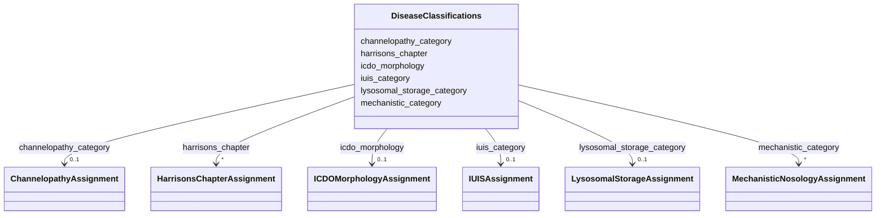

# Class: DiseaseClassifications 


_Container for all classification assignments for a disease_


URI: [dismech:DiseaseClassifications](https://w3id.org/monarch-initiative/dismech/DiseaseClassifications)





<!-- no inheritance hierarchy -->


## Slots

| Name | Cardinality and Range | Description | Inheritance |
| ---  | --- | --- | --- |
| [icdo_morphology](icdo_morphology.md) | 0..1 <br/> [ICDOMorphologyAssignment](ICDOMorphologyAssignment.md) | ICD-O morphology classification (for neoplastic diseases) | direct |
| [harrisons_chapter](harrisons_chapter.md) | * <br/> [HarrisonsChapterAssignment](HarrisonsChapterAssignment.md) | Harrison's internal medicine chapter classification | direct |
| [lysosomal_storage_category](lysosomal_storage_category.md) | 0..1 <br/> [LysosomalStorageAssignment](LysosomalStorageAssignment.md) | Lysosomal storage disease biochemical classification | direct |
| [mechanistic_category](mechanistic_category.md) | * <br/> [MechanisticNosologyAssignment](MechanisticNosologyAssignment.md) | Mechanistic/pathway-based disease classification | direct |
| [iuis_category](iuis_category.md) | 0..1 <br/> [IUISAssignment](IUISAssignment.md) | IUIS primary immunodeficiency classification | direct |
| [channelopathy_category](channelopathy_category.md) | 0..1 <br/> [ChannelopathyAssignment](ChannelopathyAssignment.md) | Channelopathy organ system classification | direct |


## Usages

| used by | used in | type | used |
| ---  | --- | --- | --- |
| [Disease](Disease.md) | [classifications](classifications.md) | range | [DiseaseClassifications](DiseaseClassifications.md) |


## Identifier and Mapping Information


### Schema Source


* from schema: https://w3id.org/monarch-initiative/dismech


## Mappings

| Mapping Type | Mapped Value |
| ---  | ---  |
| self | dismech:DiseaseClassifications |
| native | dismech:DiseaseClassifications |


## LinkML Source

<!-- TODO: investigate https://stackoverflow.com/questions/37606292/how-to-create-tabbed-code-blocks-in-mkdocs-or-sphinx -->

### Direct

<details>
```yaml
name: DiseaseClassifications
description: Container for all classification assignments for a disease
from_schema: https://w3id.org/monarch-initiative/dismech
slots:
- icdo_morphology
- harrisons_chapter
- lysosomal_storage_category
- mechanistic_category
- iuis_category
- channelopathy_category

```
</details>

### Induced

<details>
```yaml
name: DiseaseClassifications
description: Container for all classification assignments for a disease
from_schema: https://w3id.org/monarch-initiative/dismech
attributes:
  icdo_morphology:
    name: icdo_morphology
    description: ICD-O morphology classification (for neoplastic diseases)
    from_schema: https://w3id.org/monarch-initiative/dismech
    rank: 1000
    alias: icdo_morphology
    owner: DiseaseClassifications
    domain_of:
    - DiseaseClassifications
    range: ICDOMorphologyAssignment
    inlined: true
  harrisons_chapter:
    name: harrisons_chapter
    description: Harrison's internal medicine chapter classification
    from_schema: https://w3id.org/monarch-initiative/dismech
    rank: 1000
    alias: harrisons_chapter
    owner: DiseaseClassifications
    domain_of:
    - DiseaseClassifications
    range: HarrisonsChapterAssignment
    multivalued: true
    inlined: true
  lysosomal_storage_category:
    name: lysosomal_storage_category
    description: Lysosomal storage disease biochemical classification
    from_schema: https://w3id.org/monarch-initiative/dismech
    rank: 1000
    alias: lysosomal_storage_category
    owner: DiseaseClassifications
    domain_of:
    - DiseaseClassifications
    range: LysosomalStorageAssignment
    inlined: true
  mechanistic_category:
    name: mechanistic_category
    description: Mechanistic/pathway-based disease classification
    from_schema: https://w3id.org/monarch-initiative/dismech
    rank: 1000
    alias: mechanistic_category
    owner: DiseaseClassifications
    domain_of:
    - DiseaseClassifications
    range: MechanisticNosologyAssignment
    multivalued: true
    inlined: true
  iuis_category:
    name: iuis_category
    description: IUIS primary immunodeficiency classification
    from_schema: https://w3id.org/monarch-initiative/dismech
    rank: 1000
    alias: iuis_category
    owner: DiseaseClassifications
    domain_of:
    - DiseaseClassifications
    range: IUISAssignment
    inlined: true
  channelopathy_category:
    name: channelopathy_category
    description: Channelopathy organ system classification
    from_schema: https://w3id.org/monarch-initiative/dismech
    rank: 1000
    alias: channelopathy_category
    owner: DiseaseClassifications
    domain_of:
    - DiseaseClassifications
    range: ChannelopathyAssignment
    inlined: true

```
</details>