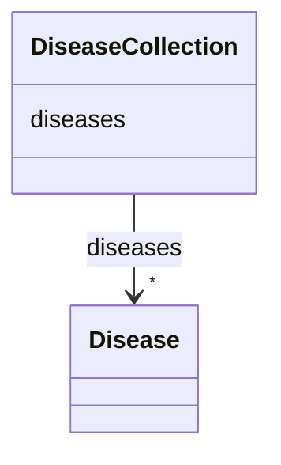

# Class: DiseaseCollection 


URI: [dismech:DiseaseCollection](https://w3id.org/monarch-initiative/dismech/DiseaseCollection)





<!-- no inheritance hierarchy -->


## Slots

| Name | Cardinality and Range | Description | Inheritance |
| ---  | --- | --- | --- |
| [diseases](diseases.md) | * <br/> [Disease](Disease.md) |  | direct |


## Identifier and Mapping Information


### Schema Source


* from schema: https://w3id.org/monarch-initiative/dismech


## Mappings

| Mapping Type | Mapped Value |
| ---  | ---  |
| self | dismech:DiseaseCollection |
| native | dismech:DiseaseCollection |


## LinkML Source

<!-- TODO: investigate https://stackoverflow.com/questions/37606292/how-to-create-tabbed-code-blocks-in-mkdocs-or-sphinx -->

### Direct

<details>
```yaml
name: DiseaseCollection
from_schema: https://w3id.org/monarch-initiative/dismech
slots:
- diseases
tree_root: true

```
</details>

### Induced

<details>
```yaml
name: DiseaseCollection
from_schema: https://w3id.org/monarch-initiative/dismech
attributes:
  diseases:
    name: diseases
    from_schema: https://w3id.org/monarch-initiative/dismech
    rank: 1000
    alias: diseases
    owner: DiseaseCollection
    domain_of:
    - DiseaseCollection
    range: Disease
    multivalued: true
    inlined: true
    inlined_as_list: true
tree_root: true

```
</details>