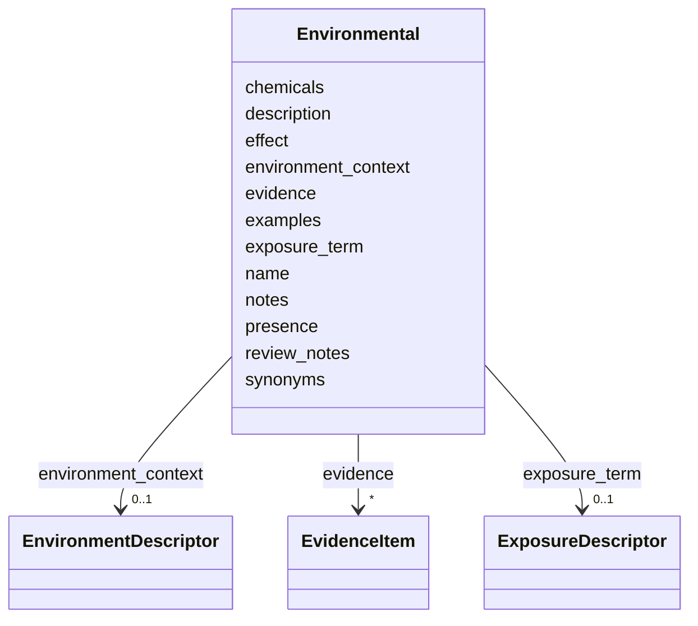

# Class: Environmental 


_An environmental factor, exposure, or context relevant to disease_


URI: [dismech:Environmental](https://w3id.org/monarch-initiative/dismech/Environmental)





<!-- no inheritance hierarchy -->


## Slots

| Name | Cardinality and Range | Description | Inheritance |
| ---  | --- | --- | --- |
| [name](name.md) | 1 <br/> [String](String.md) |  | direct |
| [presence](presence.md) | 0..1 <br/> [String](String.md) |  | direct |
| [evidence](evidence.md) | * _recommended_ <br/> [EvidenceItem](EvidenceItem.md) |  | direct |
| [notes](notes.md) | 0..1 <br/> [String](String.md) |  | direct |
| [description](description.md) | 0..1 <br/> [String](String.md) |  | direct |
| [chemicals](chemicals.md) | * <br/> [String](String.md) |  | direct |
| [synonyms](synonyms.md) | * <br/> [String](String.md) |  | direct |
| [effect](effect.md) | 0..1 <br/> [String](String.md) |  | direct |
| [examples](examples.md) | * <br/> [String](String.md) |  | direct |
| [review_notes](review_notes.md) | 0..1 <br/> [String](String.md) |  | direct |
| [exposure_term](exposure_term.md) | 0..1 <br/> [ExposureDescriptor](ExposureDescriptor.md) | The ECTO/XCO term for this exposure event | direct |
| [environment_context](environment_context.md) | 0..1 <br/> [EnvironmentDescriptor](EnvironmentDescriptor.md) | The ENVO term for the environmental context/setting | direct |


## Usages

| used by | used in | type | used |
| ---  | --- | --- | --- |
| [Disease](Disease.md) | [environmental](environmental.md) | range | [Environmental](Environmental.md) |


## Identifier and Mapping Information


### Schema Source


* from schema: https://w3id.org/monarch-initiative/dismech


## Mappings

| Mapping Type | Mapped Value |
| ---  | ---  |
| self | dismech:Environmental |
| native | dismech:Environmental |


## LinkML Source

<!-- TODO: investigate https://stackoverflow.com/questions/37606292/how-to-create-tabbed-code-blocks-in-mkdocs-or-sphinx -->

### Direct

<details>
```yaml
name: Environmental
description: An environmental factor, exposure, or context relevant to disease
from_schema: https://w3id.org/monarch-initiative/dismech
slots:
- name
- presence
- evidence
- notes
- description
- chemicals
- synonyms
- effect
- examples
- review_notes
- exposure_term
- environment_context

```
</details>

### Induced

<details>
```yaml
name: Environmental
description: An environmental factor, exposure, or context relevant to disease
from_schema: https://w3id.org/monarch-initiative/dismech
attributes:
  name:
    name: name
    examples:
    - value: Adolescent Nephronophthisis
    from_schema: https://w3id.org/monarch-initiative/dismech
    rank: 1000
    identifier: true
    alias: name
    owner: Environmental
    domain_of:
    - ClinicalTrial
    - ComputationalModel
    - DifferentialDiagnosis
    - Subtype
    - EpidemiologyInfo
    - Pathophysiology
    - Phenotype
    - Biochemical
    - HistopathologyFinding
    - Genetic
    - Environmental
    - Disease
    - Stage
    - AgentLifeCycleStage
    - Treatment
    - InfectiousAgent
    - Transmission
    - Assay
    - Diagnosis
    - Inheritance
    - Variant
    - Mechanism
    - ModelingConsideration
    - Definition
    - CriteriaSet
    - ComorbidityAssociation
    range: string
    required: true
  presence:
    name: presence
    examples:
    - value: Positive
    from_schema: https://w3id.org/monarch-initiative/dismech
    rank: 1000
    alias: presence
    owner: Environmental
    domain_of:
    - Biochemical
    - Genetic
    - Environmental
    - Diagnosis
    range: string
  evidence:
    name: evidence
    from_schema: https://w3id.org/monarch-initiative/dismech
    rank: 1000
    alias: evidence
    owner: Environmental
    domain_of:
    - PhenotypeContext
    - Dataset
    - ClinicalTrial
    - ComputationalModel
    - DifferentialDiagnosis
    - Subtype
    - CausalEdge
    - TreatmentMechanismTarget
    - Finding
    - Prevalence
    - ProgressionInfo
    - EpidemiologyInfo
    - Pathophysiology
    - Phenotype
    - Biochemical
    - HistopathologyFinding
    - Genetic
    - Environmental
    - Stage
    - AgentLifeCycle
    - AgentLifeCycleStage
    - AnimalModel
    - Treatment
    - InfectiousAgent
    - Transmission
    - Diagnosis
    - Inheritance
    - Variant
    - ModelingConsideration
    - ClassificationAssignment
    - Definition
    - CriteriaSet
    - AssociationSignal
    - AssociationStatistics
    - ComorbidityHypothesis
    - UpstreamConditionHypothesis
    - MechanisticHypothesis
    range: EvidenceItem
    recommended: true
    multivalued: true
    inlined: true
    inlined_as_list: true
  notes:
    name: notes
    examples:
    - value: Contagious stage where symptoms appear and the bacteria can be spread
        to others.
    from_schema: https://w3id.org/monarch-initiative/dismech
    rank: 1000
    alias: notes
    owner: Environmental
    domain_of:
    - GeneticContext
    - OnsetDescriptor
    - PhenotypeContext
    - Dataset
    - ClinicalTrial
    - ComputationalModel
    - DifferentialDiagnosis
    - Prevalence
    - ProgressionInfo
    - EpidemiologyInfo
    - Pathophysiology
    - Phenotype
    - Biochemical
    - HistopathologyFinding
    - Genetic
    - Environmental
    - Disease
    - Stage
    - AgentLifeCycle
    - AgentLifeCycleStage
    - Treatment
    - Transmission
    - Diagnosis
    - ClassificationAssignment
    - Definition
    - CriteriaSet
    - TermMapping
    - MappingConsistency
    - ComorbidityAssociation
    - AssociationSignal
    - AssociationMetric
    - AssociationStatistics
    - MechanisticHypothesis
    range: string
  description:
    name: description
    from_schema: https://w3id.org/monarch-initiative/dismech
    rank: 1000
    alias: description
    owner: Environmental
    domain_of:
    - Descriptor
    - GeneticContext
    - Dataset
    - ClinicalTrial
    - ComputationalModel
    - DifferentialDiagnosis
    - Subtype
    - CausalEdge
    - TreatmentMechanismTarget
    - EpidemiologyInfo
    - Pathophysiology
    - Phenotype
    - HistopathologyFinding
    - Environmental
    - Disease
    - Stage
    - AgentLifeCycle
    - AgentLifeCycleStage
    - AnimalModel
    - Treatment
    - InfectiousAgent
    - Transmission
    - Assay
    - Diagnosis
    - Inheritance
    - Variant
    - FunctionalEffect
    - Mechanism
    - ModelingConsideration
    - Definition
    - CriteriaSet
    - ConditionDescriptor
    - GOEnrichment
    - ComorbidityHypothesis
    - UpstreamConditionHypothesis
    - MechanisticHypothesis
    range: string
  chemicals:
    name: chemicals
    examples:
    - value: '[''Phenol'']'
    from_schema: https://w3id.org/monarch-initiative/dismech
    rank: 1000
    alias: chemicals
    owner: Environmental
    domain_of:
    - Environmental
    range: string
    multivalued: true
  synonyms:
    name: synonyms
    examples:
    - value: '[''CYFRA 21-1'']'
    from_schema: https://w3id.org/monarch-initiative/dismech
    rank: 1000
    alias: synonyms
    owner: Environmental
    domain_of:
    - Pathophysiology
    - Biochemical
    - Environmental
    - Disease
    - Variant
    range: string
    multivalued: true
  effect:
    name: effect
    examples:
    - value: Potential trigger for flare-ups
    from_schema: https://w3id.org/monarch-initiative/dismech
    rank: 1000
    alias: effect
    owner: Environmental
    domain_of:
    - Environmental
    - Transmission
    range: string
  examples:
    name: examples
    examples:
    - value: '[''Kaposi Sarcoma'']'
    from_schema: https://w3id.org/monarch-initiative/dismech
    rank: 1000
    alias: examples
    owner: Environmental
    domain_of:
    - Pathophysiology
    - Genetic
    - Environmental
    - Stage
    - Treatment
    range: string
    multivalued: true
  review_notes:
    name: review_notes
    examples:
    - value: Added an additional clinically relevant subtype.
    from_schema: https://w3id.org/monarch-initiative/dismech
    rank: 1000
    alias: review_notes
    owner: Environmental
    domain_of:
    - ClinicalTrial
    - Subtype
    - ProgressionInfo
    - Phenotype
    - Genetic
    - Environmental
    - Disease
    - Stage
    - AgentLifeCycle
    - AgentLifeCycleStage
    - Treatment
    range: string
  exposure_term:
    name: exposure_term
    description: The ECTO/XCO term for this exposure event
    from_schema: https://w3id.org/monarch-initiative/dismech
    rank: 1000
    alias: exposure_term
    owner: Environmental
    domain_of:
    - Environmental
    range: ExposureDescriptor
    inlined: true
  environment_context:
    name: environment_context
    description: The ENVO term for the environmental context/setting
    from_schema: https://w3id.org/monarch-initiative/dismech
    rank: 1000
    alias: environment_context
    owner: Environmental
    domain_of:
    - Environmental
    range: EnvironmentDescriptor
    inlined: true

```
</details>