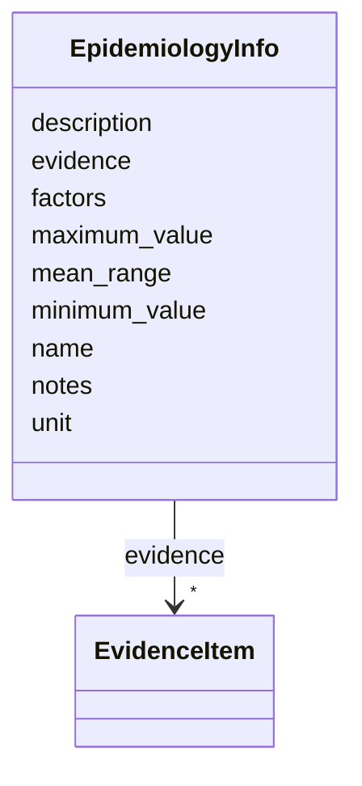

# Class: EpidemiologyInfo 


URI: [dismech:EpidemiologyInfo](https://w3id.org/monarch-initiative/dismech/EpidemiologyInfo)





<!-- no inheritance hierarchy -->


## Slots

| Name | Cardinality and Range | Description | Inheritance |
| ---  | --- | --- | --- |
| [name](name.md) | 1 <br/> [String](String.md) |  | direct |
| [description](description.md) | 0..1 <br/> [String](String.md) |  | direct |
| [minimum_value](minimum_value.md) | 0..1 <br/> [Float](Float.md) |  | direct |
| [maximum_value](maximum_value.md) | 0..1 <br/> [Float](Float.md) |  | direct |
| [mean_range](mean_range.md) | 0..1 <br/> [String](String.md) |  | direct |
| [notes](notes.md) | 0..1 <br/> [String](String.md) |  | direct |
| [factors](factors.md) | * <br/> [String](String.md) |  | direct |
| [unit](unit.md) | 0..1 <br/> [String](String.md) |  | direct |
| [evidence](evidence.md) | * _recommended_ <br/> [EvidenceItem](EvidenceItem.md) |  | direct |


## Usages

| used by | used in | type | used |
| ---  | --- | --- | --- |
| [Disease](Disease.md) | [epidemiology](epidemiology.md) | range | [EpidemiologyInfo](EpidemiologyInfo.md) |


## Identifier and Mapping Information


### Schema Source


* from schema: https://w3id.org/monarch-initiative/dismech


## Mappings

| Mapping Type | Mapped Value |
| ---  | ---  |
| self | dismech:EpidemiologyInfo |
| native | dismech:EpidemiologyInfo |


## LinkML Source

<!-- TODO: investigate https://stackoverflow.com/questions/37606292/how-to-create-tabbed-code-blocks-in-mkdocs-or-sphinx -->

### Direct

<details>
```yaml
name: EpidemiologyInfo
from_schema: https://w3id.org/monarch-initiative/dismech
slots:
- name
- description
- minimum_value
- maximum_value
- mean_range
- notes
- factors
- unit
- evidence

```
</details>

### Induced

<details>
```yaml
name: EpidemiologyInfo
from_schema: https://w3id.org/monarch-initiative/dismech
attributes:
  name:
    name: name
    examples:
    - value: Adolescent Nephronophthisis
    from_schema: https://w3id.org/monarch-initiative/dismech
    rank: 1000
    identifier: true
    alias: name
    owner: EpidemiologyInfo
    domain_of:
    - ClinicalTrial
    - ComputationalModel
    - DifferentialDiagnosis
    - Subtype
    - EpidemiologyInfo
    - Pathophysiology
    - Phenotype
    - Biochemical
    - HistopathologyFinding
    - Genetic
    - Environmental
    - Disease
    - Stage
    - AgentLifeCycleStage
    - Treatment
    - InfectiousAgent
    - Transmission
    - Assay
    - Diagnosis
    - Inheritance
    - Variant
    - Mechanism
    - ModelingConsideration
    - Definition
    - CriteriaSet
    - ComorbidityAssociation
    range: string
    required: true
  description:
    name: description
    from_schema: https://w3id.org/monarch-initiative/dismech
    rank: 1000
    alias: description
    owner: EpidemiologyInfo
    domain_of:
    - Descriptor
    - GeneticContext
    - Dataset
    - ClinicalTrial
    - ComputationalModel
    - DifferentialDiagnosis
    - Subtype
    - CausalEdge
    - TreatmentMechanismTarget
    - EpidemiologyInfo
    - Pathophysiology
    - Phenotype
    - HistopathologyFinding
    - Environmental
    - Disease
    - Stage
    - AgentLifeCycle
    - AgentLifeCycleStage
    - AnimalModel
    - Treatment
    - InfectiousAgent
    - Transmission
    - Assay
    - Diagnosis
    - Inheritance
    - Variant
    - FunctionalEffect
    - Mechanism
    - ModelingConsideration
    - Definition
    - CriteriaSet
    - ConditionDescriptor
    - GOEnrichment
    - ComorbidityHypothesis
    - UpstreamConditionHypothesis
    - MechanisticHypothesis
    range: string
  minimum_value:
    name: minimum_value
    from_schema: https://w3id.org/monarch-initiative/dismech
    rank: 1000
    alias: minimum_value
    owner: EpidemiologyInfo
    domain_of:
    - EpidemiologyInfo
    range: float
  maximum_value:
    name: maximum_value
    from_schema: https://w3id.org/monarch-initiative/dismech
    rank: 1000
    alias: maximum_value
    owner: EpidemiologyInfo
    domain_of:
    - EpidemiologyInfo
    range: float
  mean_range:
    name: mean_range
    from_schema: https://w3id.org/monarch-initiative/dismech
    rank: 1000
    alias: mean_range
    owner: EpidemiologyInfo
    domain_of:
    - EpidemiologyInfo
    range: string
  notes:
    name: notes
    examples:
    - value: Contagious stage where symptoms appear and the bacteria can be spread
        to others.
    from_schema: https://w3id.org/monarch-initiative/dismech
    rank: 1000
    alias: notes
    owner: EpidemiologyInfo
    domain_of:
    - GeneticContext
    - OnsetDescriptor
    - PhenotypeContext
    - Dataset
    - ClinicalTrial
    - ComputationalModel
    - DifferentialDiagnosis
    - Prevalence
    - ProgressionInfo
    - EpidemiologyInfo
    - Pathophysiology
    - Phenotype
    - Biochemical
    - HistopathologyFinding
    - Genetic
    - Environmental
    - Disease
    - Stage
    - AgentLifeCycle
    - AgentLifeCycleStage
    - Treatment
    - Transmission
    - Diagnosis
    - ClassificationAssignment
    - Definition
    - CriteriaSet
    - TermMapping
    - MappingConsistency
    - ComorbidityAssociation
    - AssociationSignal
    - AssociationMetric
    - AssociationStatistics
    - MechanisticHypothesis
    range: string
  factors:
    name: factors
    examples:
    - value: '[''Genetic'', ''Environmental'', ''Infectious'', ''Autoimmune'', ''Metabolic'',
        ''Neoplastic'', ''Traumatic'', ''Iatrogenic'', ''Idiopathic'']'
    from_schema: https://w3id.org/monarch-initiative/dismech
    rank: 1000
    alias: factors
    owner: EpidemiologyInfo
    domain_of:
    - EpidemiologyInfo
    range: string
    multivalued: true
  unit:
    name: unit
    examples:
    - value: cm
    from_schema: https://w3id.org/monarch-initiative/dismech
    rank: 1000
    alias: unit
    owner: EpidemiologyInfo
    domain_of:
    - EpidemiologyInfo
    range: string
  evidence:
    name: evidence
    from_schema: https://w3id.org/monarch-initiative/dismech
    rank: 1000
    alias: evidence
    owner: EpidemiologyInfo
    domain_of:
    - PhenotypeContext
    - Dataset
    - ClinicalTrial
    - ComputationalModel
    - DifferentialDiagnosis
    - Subtype
    - CausalEdge
    - TreatmentMechanismTarget
    - Finding
    - Prevalence
    - ProgressionInfo
    - EpidemiologyInfo
    - Pathophysiology
    - Phenotype
    - Biochemical
    - HistopathologyFinding
    - Genetic
    - Environmental
    - Stage
    - AgentLifeCycle
    - AgentLifeCycleStage
    - AnimalModel
    - Treatment
    - InfectiousAgent
    - Transmission
    - Diagnosis
    - Inheritance
    - Variant
    - ModelingConsideration
    - ClassificationAssignment
    - Definition
    - CriteriaSet
    - AssociationSignal
    - AssociationStatistics
    - ComorbidityHypothesis
    - UpstreamConditionHypothesis
    - MechanisticHypothesis
    range: EvidenceItem
    recommended: true
    multivalued: true
    inlined: true
    inlined_as_list: true

```
</details>