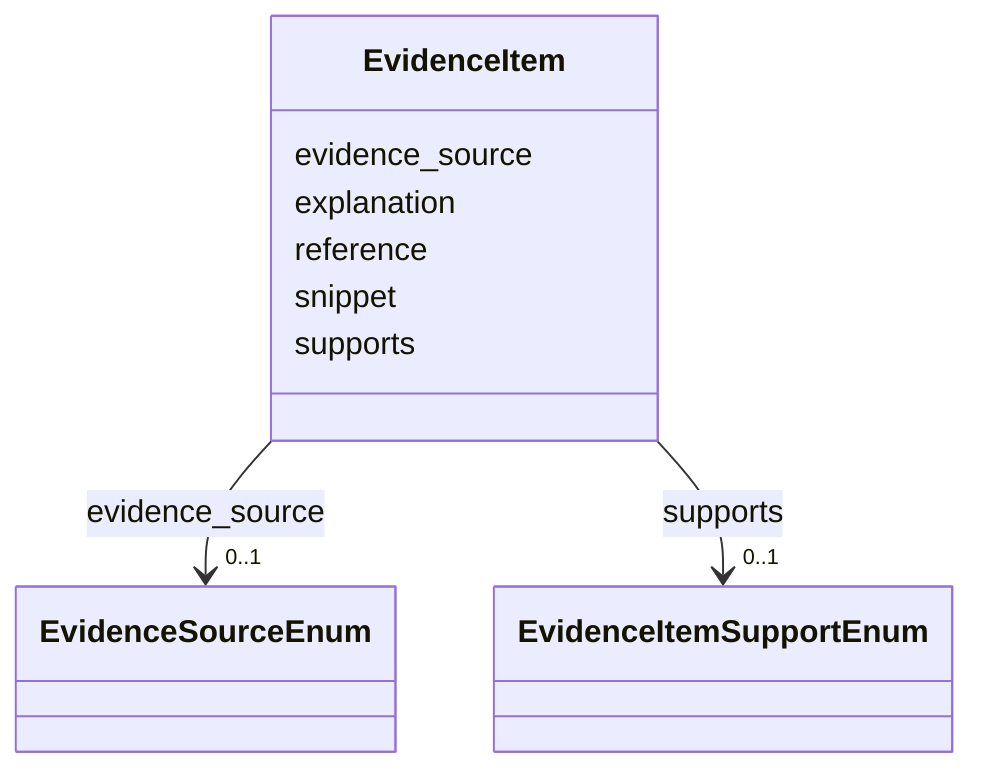

# Class: EvidenceItem 


URI: [dismech:EvidenceItem](https://w3id.org/monarch-initiative/dismech/EvidenceItem)





<!-- no inheritance hierarchy -->


## Slots

| Name | Cardinality and Range | Description | Inheritance |
| ---  | --- | --- | --- |
| [reference](reference.md) | 0..1 <br/> [PMID](PMID.md) | The authoritative reference (publication) for this evidence item | direct |
| [supports](supports.md) | 0..1 <br/> [EvidenceItemSupportEnum](EvidenceItemSupportEnum.md) |  | direct |
| [evidence_source](evidence_source.md) | 0..1 <br/> [EvidenceSourceEnum](EvidenceSourceEnum.md) | Origin of the evidence item (human clinical, model organism, in vitro, or com... | direct |
| [snippet](snippet.md) | 0..1 <br/> [String](String.md) | An exact excerpt/quote from the referenced publication that supports or refut... | direct |
| [explanation](explanation.md) | 0..1 <br/> [String](String.md) |  | direct |


## Usages

| used by | used in | type | used |
| ---  | --- | --- | --- |
| [PhenotypeContext](PhenotypeContext.md) | [evidence](evidence.md) | range | [EvidenceItem](EvidenceItem.md) |
| [Dataset](Dataset.md) | [evidence](evidence.md) | range | [EvidenceItem](EvidenceItem.md) |
| [ClinicalTrial](ClinicalTrial.md) | [evidence](evidence.md) | range | [EvidenceItem](EvidenceItem.md) |
| [ComputationalModel](ComputationalModel.md) | [evidence](evidence.md) | range | [EvidenceItem](EvidenceItem.md) |
| [DifferentialDiagnosis](DifferentialDiagnosis.md) | [evidence](evidence.md) | range | [EvidenceItem](EvidenceItem.md) |
| [Subtype](Subtype.md) | [evidence](evidence.md) | range | [EvidenceItem](EvidenceItem.md) |
| [CausalEdge](CausalEdge.md) | [evidence](evidence.md) | range | [EvidenceItem](EvidenceItem.md) |
| [TreatmentMechanismTarget](TreatmentMechanismTarget.md) | [evidence](evidence.md) | range | [EvidenceItem](EvidenceItem.md) |
| [Finding](Finding.md) | [evidence](evidence.md) | range | [EvidenceItem](EvidenceItem.md) |
| [Prevalence](Prevalence.md) | [evidence](evidence.md) | range | [EvidenceItem](EvidenceItem.md) |
| [ProgressionInfo](ProgressionInfo.md) | [evidence](evidence.md) | range | [EvidenceItem](EvidenceItem.md) |
| [EpidemiologyInfo](EpidemiologyInfo.md) | [evidence](evidence.md) | range | [EvidenceItem](EvidenceItem.md) |
| [Pathophysiology](Pathophysiology.md) | [evidence](evidence.md) | range | [EvidenceItem](EvidenceItem.md) |
| [Phenotype](Phenotype.md) | [evidence](evidence.md) | range | [EvidenceItem](EvidenceItem.md) |
| [Biochemical](Biochemical.md) | [evidence](evidence.md) | range | [EvidenceItem](EvidenceItem.md) |
| [HistopathologyFinding](HistopathologyFinding.md) | [evidence](evidence.md) | range | [EvidenceItem](EvidenceItem.md) |
| [Genetic](Genetic.md) | [evidence](evidence.md) | range | [EvidenceItem](EvidenceItem.md) |
| [Environmental](Environmental.md) | [evidence](evidence.md) | range | [EvidenceItem](EvidenceItem.md) |
| [Stage](Stage.md) | [evidence](evidence.md) | range | [EvidenceItem](EvidenceItem.md) |
| [AgentLifeCycle](AgentLifeCycle.md) | [evidence](evidence.md) | range | [EvidenceItem](EvidenceItem.md) |
| [AgentLifeCycleStage](AgentLifeCycleStage.md) | [evidence](evidence.md) | range | [EvidenceItem](EvidenceItem.md) |
| [AnimalModel](AnimalModel.md) | [evidence](evidence.md) | range | [EvidenceItem](EvidenceItem.md) |
| [Treatment](Treatment.md) | [evidence](evidence.md) | range | [EvidenceItem](EvidenceItem.md) |
| [InfectiousAgent](InfectiousAgent.md) | [evidence](evidence.md) | range | [EvidenceItem](EvidenceItem.md) |
| [Transmission](Transmission.md) | [evidence](evidence.md) | range | [EvidenceItem](EvidenceItem.md) |
| [Diagnosis](Diagnosis.md) | [evidence](evidence.md) | range | [EvidenceItem](EvidenceItem.md) |
| [Inheritance](Inheritance.md) | [evidence](evidence.md) | range | [EvidenceItem](EvidenceItem.md) |
| [Variant](Variant.md) | [evidence](evidence.md) | range | [EvidenceItem](EvidenceItem.md) |
| [ModelingConsideration](ModelingConsideration.md) | [evidence](evidence.md) | range | [EvidenceItem](EvidenceItem.md) |
| [ClassificationAssignment](ClassificationAssignment.md) | [evidence](evidence.md) | range | [EvidenceItem](EvidenceItem.md) |
| [ICDOMorphologyAssignment](ICDOMorphologyAssignment.md) | [evidence](evidence.md) | range | [EvidenceItem](EvidenceItem.md) |
| [HarrisonsChapterAssignment](HarrisonsChapterAssignment.md) | [evidence](evidence.md) | range | [EvidenceItem](EvidenceItem.md) |
| [LysosomalStorageAssignment](LysosomalStorageAssignment.md) | [evidence](evidence.md) | range | [EvidenceItem](EvidenceItem.md) |
| [MechanisticNosologyAssignment](MechanisticNosologyAssignment.md) | [evidence](evidence.md) | range | [EvidenceItem](EvidenceItem.md) |
| [IUISAssignment](IUISAssignment.md) | [evidence](evidence.md) | range | [EvidenceItem](EvidenceItem.md) |
| [ChannelopathyAssignment](ChannelopathyAssignment.md) | [evidence](evidence.md) | range | [EvidenceItem](EvidenceItem.md) |
| [Definition](Definition.md) | [evidence](evidence.md) | range | [EvidenceItem](EvidenceItem.md) |
| [CriteriaSet](CriteriaSet.md) | [evidence](evidence.md) | range | [EvidenceItem](EvidenceItem.md) |
| [ComorbidityAssociation](ComorbidityAssociation.md) | [literature_evidence](literature_evidence.md) | range | [EvidenceItem](EvidenceItem.md) |
| [AssociationSignal](AssociationSignal.md) | [evidence](evidence.md) | range | [EvidenceItem](EvidenceItem.md) |
| [AssociationStatistics](AssociationStatistics.md) | [evidence](evidence.md) | range | [EvidenceItem](EvidenceItem.md) |
| [ComorbidityHypothesis](ComorbidityHypothesis.md) | [evidence](evidence.md) | range | [EvidenceItem](EvidenceItem.md) |
| [UpstreamConditionHypothesis](UpstreamConditionHypothesis.md) | [evidence](evidence.md) | range | [EvidenceItem](EvidenceItem.md) |
| [MechanisticHypothesis](MechanisticHypothesis.md) | [evidence](evidence.md) | range | [EvidenceItem](EvidenceItem.md) |


## Identifier and Mapping Information


### Schema Source


* from schema: https://w3id.org/monarch-initiative/dismech


## Mappings

| Mapping Type | Mapped Value |
| ---  | ---  |
| self | dismech:EvidenceItem |
| native | dismech:EvidenceItem |


## LinkML Source

<!-- TODO: investigate https://stackoverflow.com/questions/37606292/how-to-create-tabbed-code-blocks-in-mkdocs-or-sphinx -->

### Direct

<details>
```yaml
name: EvidenceItem
from_schema: https://w3id.org/monarch-initiative/dismech
slots:
- reference
- supports
- evidence_source
- snippet
- explanation

```
</details>

### Induced

<details>
```yaml
name: EvidenceItem
from_schema: https://w3id.org/monarch-initiative/dismech
attributes:
  reference:
    name: reference
    implements:
    - linkml:authoritative_reference
    description: The authoritative reference (publication) for this evidence item
    examples:
    - value: PMID:35533128
    from_schema: https://w3id.org/monarch-initiative/dismech
    rank: 1000
    alias: reference
    owner: EvidenceItem
    domain_of:
    - EvidenceItem
    - PublicationReference
    - MappingConsistency
    range: PMID
  supports:
    name: supports
    examples:
    - value: SUPPORT
    from_schema: https://w3id.org/monarch-initiative/dismech
    rank: 1000
    alias: supports
    owner: EvidenceItem
    domain_of:
    - EvidenceItem
    range: EvidenceItemSupportEnum
  evidence_source:
    name: evidence_source
    description: Origin of the evidence item (human clinical, model organism, in vitro,
      or computational)
    from_schema: https://w3id.org/monarch-initiative/dismech
    rank: 1000
    alias: evidence_source
    owner: EvidenceItem
    domain_of:
    - EvidenceItem
    range: EvidenceSourceEnum
    recommended: false
  snippet:
    name: snippet
    implements:
    - linkml:excerpt
    description: An exact excerpt/quote from the referenced publication that supports
      or refutes the claim
    comments:
    - This is automatically validated by the linkml-reference-validator tool.
    examples:
    - value: At the moment there is no healing therapy, so early kidney transplant
        is a fundamental tool to improve prognosis.
    from_schema: https://w3id.org/monarch-initiative/dismech
    rank: 1000
    alias: snippet
    owner: EvidenceItem
    domain_of:
    - EvidenceItem
    range: string
  explanation:
    name: explanation
    examples:
    - value: There is no curative treatment for nephronophthisis, indicating that
        supportive care, including symptomatic treatment and monitoring, is currently
        applied to manage associated complications.
    from_schema: https://w3id.org/monarch-initiative/dismech
    rank: 1000
    alias: explanation
    owner: EvidenceItem
    domain_of:
    - EvidenceItem
    range: string

```
</details>