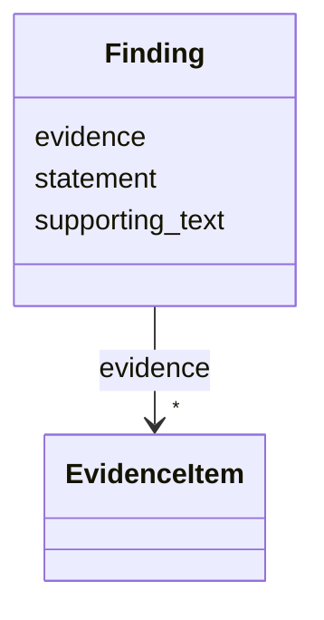

# Class: Finding 


_A key finding or claim extracted from a source (publication or dataset)_


URI: [dismech:Finding](https://w3id.org/monarch-initiative/dismech/Finding)





<!-- no inheritance hierarchy -->


## Slots

| Name | Cardinality and Range | Description | Inheritance |
| ---  | --- | --- | --- |
| [statement](statement.md) | 1 <br/> [String](String.md) | A key finding or claim from the publication | direct |
| [supporting_text](supporting_text.md) | 0..1 <br/> [String](String.md) | Exact excerpt/quote from the publication supporting the statement | direct |
| [evidence](evidence.md) | * _recommended_ <br/> [EvidenceItem](EvidenceItem.md) |  | direct |


## Usages

| used by | used in | type | used |
| ---  | --- | --- | --- |
| [Dataset](Dataset.md) | [findings](findings.md) | range | [Finding](Finding.md) |
| [ComputationalModel](ComputationalModel.md) | [findings](findings.md) | range | [Finding](Finding.md) |
| [PublicationReference](PublicationReference.md) | [findings](findings.md) | range | [Finding](Finding.md) |


## Identifier and Mapping Information


### Schema Source


* from schema: https://w3id.org/monarch-initiative/dismech


## Mappings

| Mapping Type | Mapped Value |
| ---  | ---  |
| self | dismech:Finding |
| native | dismech:Finding |


## LinkML Source

<!-- TODO: investigate https://stackoverflow.com/questions/37606292/how-to-create-tabbed-code-blocks-in-mkdocs-or-sphinx -->

### Direct

<details>
```yaml
name: Finding
description: A key finding or claim extracted from a source (publication or dataset)
from_schema: https://w3id.org/monarch-initiative/dismech
slots:
- statement
- supporting_text
- evidence

```
</details>

### Induced

<details>
```yaml
name: Finding
description: A key finding or claim extracted from a source (publication or dataset)
from_schema: https://w3id.org/monarch-initiative/dismech
attributes:
  statement:
    name: statement
    description: A key finding or claim from the publication
    from_schema: https://w3id.org/monarch-initiative/dismech
    rank: 1000
    alias: statement
    owner: Finding
    domain_of:
    - Finding
    range: string
    required: true
  supporting_text:
    name: supporting_text
    description: Exact excerpt/quote from the publication supporting the statement
    from_schema: https://w3id.org/monarch-initiative/dismech
    rank: 1000
    alias: supporting_text
    owner: Finding
    domain_of:
    - Finding
    range: string
  evidence:
    name: evidence
    from_schema: https://w3id.org/monarch-initiative/dismech
    rank: 1000
    alias: evidence
    owner: Finding
    domain_of:
    - PhenotypeContext
    - Dataset
    - ClinicalTrial
    - ComputationalModel
    - DifferentialDiagnosis
    - Subtype
    - CausalEdge
    - TreatmentMechanismTarget
    - Finding
    - Prevalence
    - ProgressionInfo
    - EpidemiologyInfo
    - Pathophysiology
    - Phenotype
    - Biochemical
    - HistopathologyFinding
    - Genetic
    - Environmental
    - Stage
    - AgentLifeCycle
    - AgentLifeCycleStage
    - AnimalModel
    - Treatment
    - InfectiousAgent
    - Transmission
    - Diagnosis
    - Inheritance
    - Variant
    - ModelingConsideration
    - ClassificationAssignment
    - Definition
    - CriteriaSet
    - AssociationSignal
    - AssociationStatistics
    - ComorbidityHypothesis
    - UpstreamConditionHypothesis
    - MechanisticHypothesis
    range: EvidenceItem
    recommended: true
    multivalued: true
    inlined: true
    inlined_as_list: true

```
</details>