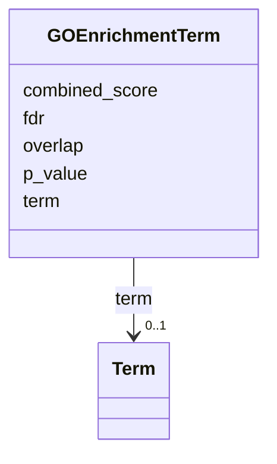

# Class: GOEnrichmentTerm 


_GO term enrichment result with statistical metrics._


URI: [dismech:GOEnrichmentTerm](https://w3id.org/monarch-initiative/dismech/GOEnrichmentTerm)





<!-- no inheritance hierarchy -->


## Slots

| Name | Cardinality and Range | Description | Inheritance |
| ---  | --- | --- | --- |
| [term](term.md) | 0..1 _recommended_ <br/> [Term](Term.md) | Optional structured ontology term reference | direct |
| [p_value](p_value.md) | 0..1 <br/> [Float](Float.md) | P-value for an association or enrichment | direct |
| [fdr](fdr.md) | 0..1 <br/> [Float](Float.md) | FDR-adjusted p-value for an association or enrichment | direct |
| [overlap](overlap.md) | 0..1 <br/> [Float](Float.md) | Overlap fraction for an enrichment term | direct |
| [combined_score](combined_score.md) | 0..1 <br/> [Float](Float.md) | Combined score used by an enrichment method | direct |


## Usages

| used by | used in | type | used |
| ---  | --- | --- | --- |
| [GOEnrichment](GOEnrichment.md) | [go_terms](go_terms.md) | range | [GOEnrichmentTerm](GOEnrichmentTerm.md) |


## Identifier and Mapping Information


### Schema Source


* from schema: https://w3id.org/monarch-initiative/dismech


## Mappings

| Mapping Type | Mapped Value |
| ---  | ---  |
| self | dismech:GOEnrichmentTerm |
| native | dismech:GOEnrichmentTerm |


## LinkML Source

<!-- TODO: investigate https://stackoverflow.com/questions/37606292/how-to-create-tabbed-code-blocks-in-mkdocs-or-sphinx -->

### Direct

<details>
```yaml
name: GOEnrichmentTerm
description: GO term enrichment result with statistical metrics.
from_schema: https://w3id.org/monarch-initiative/dismech
slots:
- term
- p_value
- fdr
- overlap
- combined_score

```
</details>

### Induced

<details>
```yaml
name: GOEnrichmentTerm
description: GO term enrichment result with statistical metrics.
from_schema: https://w3id.org/monarch-initiative/dismech
attributes:
  term:
    name: term
    description: Optional structured ontology term reference
    from_schema: https://w3id.org/monarch-initiative/dismech
    rank: 1000
    alias: term
    owner: GOEnrichmentTerm
    domain_of:
    - Descriptor
    - TermMapping
    - ConditionDescriptor
    - GOEnrichmentTerm
    range: Term
    recommended: true
    inlined: true
  p_value:
    name: p_value
    description: P-value for an association or enrichment
    from_schema: https://w3id.org/monarch-initiative/dismech
    rank: 1000
    alias: p_value
    owner: GOEnrichmentTerm
    domain_of:
    - AssociationMetric
    - GOEnrichmentTerm
    range: float
  fdr:
    name: fdr
    description: FDR-adjusted p-value for an association or enrichment
    from_schema: https://w3id.org/monarch-initiative/dismech
    rank: 1000
    alias: fdr
    owner: GOEnrichmentTerm
    domain_of:
    - AssociationMetric
    - GOEnrichmentTerm
    range: float
  overlap:
    name: overlap
    description: Overlap fraction for an enrichment term
    from_schema: https://w3id.org/monarch-initiative/dismech
    rank: 1000
    alias: overlap
    owner: GOEnrichmentTerm
    domain_of:
    - GOEnrichmentTerm
    range: float
  combined_score:
    name: combined_score
    description: Combined score used by an enrichment method
    from_schema: https://w3id.org/monarch-initiative/dismech
    rank: 1000
    alias: combined_score
    owner: GOEnrichmentTerm
    domain_of:
    - GOEnrichmentTerm
    range: float

```
</details>