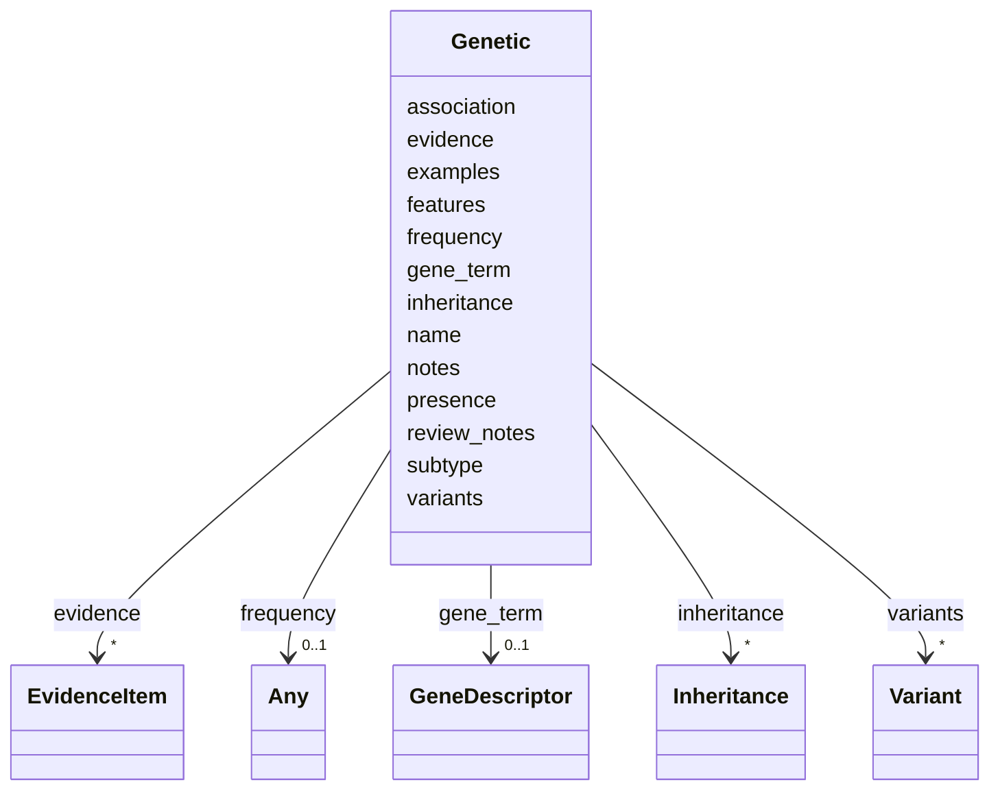

# Class: Genetic 


URI: [dismech:Genetic](https://w3id.org/monarch-initiative/dismech/Genetic)





<!-- no inheritance hierarchy -->


## Slots

| Name | Cardinality and Range | Description | Inheritance |
| ---  | --- | --- | --- |
| [name](name.md) | 1 <br/> [String](String.md) |  | direct |
| [gene_term](gene_term.md) | 0..1 <br/> [GeneDescriptor](GeneDescriptor.md) | The HGNC term for this gene | direct |
| [presence](presence.md) | 0..1 <br/> [String](String.md) |  | direct |
| [evidence](evidence.md) | * _recommended_ <br/> [EvidenceItem](EvidenceItem.md) |  | direct |
| [association](association.md) | 0..1 <br/> [String](String.md) |  | direct |
| [review_notes](review_notes.md) | 0..1 <br/> [String](String.md) |  | direct |
| [subtype](subtype.md) | 0..1 <br/> [String](String.md) |  | direct |
| [frequency](frequency.md) | 0..1 <br/> [Any](Any.md)&nbsp;or&nbsp;<br />[FrequencyEnum](FrequencyEnum.md)&nbsp;or&nbsp;<br />[FrequencyQuantity](FrequencyQuantity.md) |  | direct |
| [inheritance](inheritance.md) | * <br/> [Inheritance](Inheritance.md) |  | direct |
| [variants](variants.md) | * <br/> [Variant](Variant.md) |  | direct |
| [features](features.md) | 0..1 <br/> [String](String.md) |  | direct |
| [notes](notes.md) | 0..1 <br/> [String](String.md) |  | direct |
| [examples](examples.md) | * <br/> [String](String.md) |  | direct |


## Usages

| used by | used in | type | used |
| ---  | --- | --- | --- |
| [Disease](Disease.md) | [genetic](genetic.md) | range | [Genetic](Genetic.md) |


## Identifier and Mapping Information


### Schema Source


* from schema: https://w3id.org/monarch-initiative/dismech


## Mappings

| Mapping Type | Mapped Value |
| ---  | ---  |
| self | dismech:Genetic |
| native | dismech:Genetic |


## LinkML Source

<!-- TODO: investigate https://stackoverflow.com/questions/37606292/how-to-create-tabbed-code-blocks-in-mkdocs-or-sphinx -->

### Direct

<details>
```yaml
name: Genetic
from_schema: https://w3id.org/monarch-initiative/dismech
slots:
- name
- gene_term
- presence
- evidence
- association
- review_notes
- subtype
- frequency
- inheritance
- variants
- features
- notes
- examples

```
</details>

### Induced

<details>
```yaml
name: Genetic
from_schema: https://w3id.org/monarch-initiative/dismech
attributes:
  name:
    name: name
    examples:
    - value: Adolescent Nephronophthisis
    from_schema: https://w3id.org/monarch-initiative/dismech
    rank: 1000
    identifier: true
    alias: name
    owner: Genetic
    domain_of:
    - ClinicalTrial
    - ComputationalModel
    - DifferentialDiagnosis
    - Subtype
    - EpidemiologyInfo
    - Pathophysiology
    - Phenotype
    - Biochemical
    - HistopathologyFinding
    - Genetic
    - Environmental
    - Disease
    - Stage
    - AgentLifeCycleStage
    - Treatment
    - InfectiousAgent
    - Transmission
    - Assay
    - Diagnosis
    - Inheritance
    - Variant
    - Mechanism
    - ModelingConsideration
    - Definition
    - CriteriaSet
    - ComorbidityAssociation
    range: string
    required: true
  gene_term:
    name: gene_term
    description: The HGNC term for this gene
    from_schema: https://w3id.org/monarch-initiative/dismech
    rank: 1000
    alias: gene_term
    owner: Genetic
    domain_of:
    - Genetic
    range: GeneDescriptor
    inlined: true
  presence:
    name: presence
    examples:
    - value: Positive
    from_schema: https://w3id.org/monarch-initiative/dismech
    rank: 1000
    alias: presence
    owner: Genetic
    domain_of:
    - Biochemical
    - Genetic
    - Environmental
    - Diagnosis
    range: string
  evidence:
    name: evidence
    from_schema: https://w3id.org/monarch-initiative/dismech
    rank: 1000
    alias: evidence
    owner: Genetic
    domain_of:
    - PhenotypeContext
    - Dataset
    - ClinicalTrial
    - ComputationalModel
    - DifferentialDiagnosis
    - Subtype
    - CausalEdge
    - TreatmentMechanismTarget
    - Finding
    - Prevalence
    - ProgressionInfo
    - EpidemiologyInfo
    - Pathophysiology
    - Phenotype
    - Biochemical
    - HistopathologyFinding
    - Genetic
    - Environmental
    - Stage
    - AgentLifeCycle
    - AgentLifeCycleStage
    - AnimalModel
    - Treatment
    - InfectiousAgent
    - Transmission
    - Diagnosis
    - Inheritance
    - Variant
    - ModelingConsideration
    - ClassificationAssignment
    - Definition
    - CriteriaSet
    - AssociationSignal
    - AssociationStatistics
    - ComorbidityHypothesis
    - UpstreamConditionHypothesis
    - MechanisticHypothesis
    range: EvidenceItem
    recommended: true
    multivalued: true
    inlined: true
    inlined_as_list: true
  association:
    name: association
    examples:
    - value: Susceptibility
    from_schema: https://w3id.org/monarch-initiative/dismech
    rank: 1000
    alias: association
    owner: Genetic
    domain_of:
    - Genetic
    range: string
  review_notes:
    name: review_notes
    examples:
    - value: Added an additional clinically relevant subtype.
    from_schema: https://w3id.org/monarch-initiative/dismech
    rank: 1000
    alias: review_notes
    owner: Genetic
    domain_of:
    - ClinicalTrial
    - Subtype
    - ProgressionInfo
    - Phenotype
    - Genetic
    - Environmental
    - Disease
    - Stage
    - AgentLifeCycle
    - AgentLifeCycleStage
    - Treatment
    range: string
  subtype:
    name: subtype
    examples:
    - value: Eyelid Myoclonia with Absences
    from_schema: https://w3id.org/monarch-initiative/dismech
    rank: 1000
    alias: subtype
    owner: Genetic
    domain_of:
    - PhenotypeContext
    - Prevalence
    - ProgressionInfo
    - Phenotype
    - Biochemical
    - HistopathologyFinding
    - Genetic
    range: string
  frequency:
    name: frequency
    examples:
    - value: Occasional
    from_schema: https://w3id.org/monarch-initiative/dismech
    rank: 1000
    alias: frequency
    owner: Genetic
    domain_of:
    - PhenotypeContext
    - Pathophysiology
    - Phenotype
    - Biochemical
    - HistopathologyFinding
    - Genetic
    range: Any
    any_of:
    - range: FrequencyEnum
    - range: FrequencyQuantity
  inheritance:
    name: inheritance
    examples:
    - value: Autosomal Dominant
    from_schema: https://w3id.org/monarch-initiative/dismech
    rank: 1000
    alias: inheritance
    owner: Genetic
    domain_of:
    - Subtype
    - Genetic
    - Disease
    range: Inheritance
    multivalued: true
    inlined: true
    inlined_as_list: true
  variants:
    name: variants
    comments:
    - can currently be used at gene or disease level, TODO - decide the best level
    from_schema: https://w3id.org/monarch-initiative/dismech
    rank: 1000
    alias: variants
    owner: Genetic
    domain_of:
    - Genetic
    - Disease
    range: Variant
    multivalued: true
    inlined: true
    inlined_as_list: true
  features:
    name: features
    examples:
    - value: DNA virus from the Orthopoxvirus genus
    from_schema: https://w3id.org/monarch-initiative/dismech
    rank: 1000
    alias: features
    owner: Genetic
    domain_of:
    - Genetic
    range: string
  notes:
    name: notes
    examples:
    - value: Contagious stage where symptoms appear and the bacteria can be spread
        to others.
    from_schema: https://w3id.org/monarch-initiative/dismech
    rank: 1000
    alias: notes
    owner: Genetic
    domain_of:
    - GeneticContext
    - OnsetDescriptor
    - PhenotypeContext
    - Dataset
    - ClinicalTrial
    - ComputationalModel
    - DifferentialDiagnosis
    - Prevalence
    - ProgressionInfo
    - EpidemiologyInfo
    - Pathophysiology
    - Phenotype
    - Biochemical
    - HistopathologyFinding
    - Genetic
    - Environmental
    - Disease
    - Stage
    - AgentLifeCycle
    - AgentLifeCycleStage
    - Treatment
    - Transmission
    - Diagnosis
    - ClassificationAssignment
    - Definition
    - CriteriaSet
    - TermMapping
    - MappingConsistency
    - ComorbidityAssociation
    - AssociationSignal
    - AssociationMetric
    - AssociationStatistics
    - MechanisticHypothesis
    range: string
  examples:
    name: examples
    examples:
    - value: '[''Kaposi Sarcoma'']'
    from_schema: https://w3id.org/monarch-initiative/dismech
    rank: 1000
    alias: examples
    owner: Genetic
    domain_of:
    - Pathophysiology
    - Genetic
    - Environmental
    - Stage
    - Treatment
    range: string
    multivalued: true

```
</details>