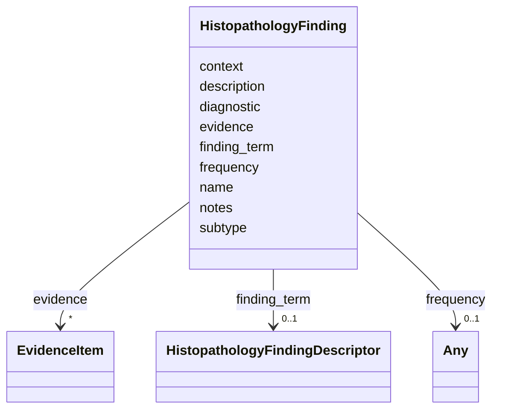

# Class: HistopathologyFinding 


_A histopathologic finding from microscopic examination of tissue. Includes morphologic features, architectural patterns, cellular characteristics, growth patterns, and histologic grading._


URI: [dismech:HistopathologyFinding](https://w3id.org/monarch-initiative/dismech/HistopathologyFinding)





<!-- no inheritance hierarchy -->


## Slots

| Name | Cardinality and Range | Description | Inheritance |
| ---  | --- | --- | --- |
| [name](name.md) | 1 <br/> [String](String.md) | Name of the histopathologic finding | direct |
| [finding_term](finding_term.md) | 0..1 <br/> [HistopathologyFindingDescriptor](HistopathologyFindingDescriptor.md) | Ontology term for a histopathologic finding (from NCIT or HP) | direct |
| [description](description.md) | 0..1 <br/> [String](String.md) | Detailed description of the finding and its clinical significance | direct |
| [frequency](frequency.md) | 0..1 <br/> [Any](Any.md)&nbsp;or&nbsp;<br />[FrequencyEnum](FrequencyEnum.md)&nbsp;or&nbsp;<br />[FrequencyQuantity](FrequencyQuantity.md) | How frequently this finding is observed in the disease | direct |
| [diagnostic](diagnostic.md) | 0..1 <br/> [Boolean](Boolean.md) | Whether this finding is pathognomonic or highly diagnostic | direct |
| [evidence](evidence.md) | * _recommended_ <br/> [EvidenceItem](EvidenceItem.md) |  | direct |
| [notes](notes.md) | 0..1 <br/> [String](String.md) |  | direct |
| [context](context.md) | 0..1 <br/> [String](String.md) | Context in which this finding is observed (e | direct |
| [subtype](subtype.md) | 0..1 <br/> [String](String.md) |  | direct |


## Usages

| used by | used in | type | used |
| ---  | --- | --- | --- |
| [Disease](Disease.md) | [histopathology](histopathology.md) | range | [HistopathologyFinding](HistopathologyFinding.md) |


## Comments

* {'For cancers': 'tumor grade, differentiation, growth patterns, necrosis, rosettes'}
* {'For other diseases': 'inflammatory infiltrates, architectural distortion, fibrosis'}
* Separate from phenotypes as these are microscopic observations requiring biopsy

## Identifier and Mapping Information


### Schema Source


* from schema: https://w3id.org/monarch-initiative/dismech


## Mappings

| Mapping Type | Mapped Value |
| ---  | ---  |
| self | dismech:HistopathologyFinding |
| native | dismech:HistopathologyFinding |


## LinkML Source

<!-- TODO: investigate https://stackoverflow.com/questions/37606292/how-to-create-tabbed-code-blocks-in-mkdocs-or-sphinx -->

### Direct

<details>
```yaml
name: HistopathologyFinding
description: A histopathologic finding from microscopic examination of tissue. Includes
  morphologic features, architectural patterns, cellular characteristics, growth patterns,
  and histologic grading.
comments:
- '{''For cancers'': ''tumor grade, differentiation, growth patterns, necrosis, rosettes''}'
- '{''For other diseases'': ''inflammatory infiltrates, architectural distortion,
  fibrosis''}'
- Separate from phenotypes as these are microscopic observations requiring biopsy
from_schema: https://w3id.org/monarch-initiative/dismech
slots:
- name
- finding_term
- description
- frequency
- diagnostic
- evidence
- notes
- context
- subtype
slot_usage:
  name:
    name: name
    description: Name of the histopathologic finding
    examples:
    - value: Flexner-Wintersteiner Rosettes
    - value: Spindle Cell Morphology
    - value: High Grade (Fuhrman Grade 3-4)
  description:
    name: description
    description: Detailed description of the finding and its clinical significance
  frequency:
    name: frequency
    description: How frequently this finding is observed in the disease
  diagnostic:
    name: diagnostic
    description: Whether this finding is pathognomonic or highly diagnostic
  context:
    name: context
    description: Context in which this finding is observed (e.g., specific subtype)

```
</details>

### Induced

<details>
```yaml
name: HistopathologyFinding
description: A histopathologic finding from microscopic examination of tissue. Includes
  morphologic features, architectural patterns, cellular characteristics, growth patterns,
  and histologic grading.
comments:
- '{''For cancers'': ''tumor grade, differentiation, growth patterns, necrosis, rosettes''}'
- '{''For other diseases'': ''inflammatory infiltrates, architectural distortion,
  fibrosis''}'
- Separate from phenotypes as these are microscopic observations requiring biopsy
from_schema: https://w3id.org/monarch-initiative/dismech
slot_usage:
  name:
    name: name
    description: Name of the histopathologic finding
    examples:
    - value: Flexner-Wintersteiner Rosettes
    - value: Spindle Cell Morphology
    - value: High Grade (Fuhrman Grade 3-4)
  description:
    name: description
    description: Detailed description of the finding and its clinical significance
  frequency:
    name: frequency
    description: How frequently this finding is observed in the disease
  diagnostic:
    name: diagnostic
    description: Whether this finding is pathognomonic or highly diagnostic
  context:
    name: context
    description: Context in which this finding is observed (e.g., specific subtype)
attributes:
  name:
    name: name
    description: Name of the histopathologic finding
    examples:
    - value: Flexner-Wintersteiner Rosettes
    - value: Spindle Cell Morphology
    - value: High Grade (Fuhrman Grade 3-4)
    from_schema: https://w3id.org/monarch-initiative/dismech
    rank: 1000
    identifier: true
    alias: name
    owner: HistopathologyFinding
    domain_of:
    - ClinicalTrial
    - ComputationalModel
    - DifferentialDiagnosis
    - Subtype
    - EpidemiologyInfo
    - Pathophysiology
    - Phenotype
    - Biochemical
    - HistopathologyFinding
    - Genetic
    - Environmental
    - Disease
    - Stage
    - AgentLifeCycleStage
    - Treatment
    - InfectiousAgent
    - Transmission
    - Assay
    - Diagnosis
    - Inheritance
    - Variant
    - Mechanism
    - ModelingConsideration
    - Definition
    - CriteriaSet
    - ComorbidityAssociation
    range: string
    required: true
  finding_term:
    name: finding_term
    description: Ontology term for a histopathologic finding (from NCIT or HP)
    comments:
    - Use NCIT terms from Morphologic Finding (C35867) or Histologic Grade (C18000)
    - Use HP terms for rosettes and cell morphology abnormalities (HP:0025461 descendants)
    from_schema: https://w3id.org/monarch-initiative/dismech
    rank: 1000
    alias: finding_term
    owner: HistopathologyFinding
    domain_of:
    - HistopathologyFinding
    range: HistopathologyFindingDescriptor
    inlined: true
  description:
    name: description
    description: Detailed description of the finding and its clinical significance
    from_schema: https://w3id.org/monarch-initiative/dismech
    rank: 1000
    alias: description
    owner: HistopathologyFinding
    domain_of:
    - Descriptor
    - GeneticContext
    - Dataset
    - ClinicalTrial
    - ComputationalModel
    - DifferentialDiagnosis
    - Subtype
    - CausalEdge
    - TreatmentMechanismTarget
    - EpidemiologyInfo
    - Pathophysiology
    - Phenotype
    - HistopathologyFinding
    - Environmental
    - Disease
    - Stage
    - AgentLifeCycle
    - AgentLifeCycleStage
    - AnimalModel
    - Treatment
    - InfectiousAgent
    - Transmission
    - Assay
    - Diagnosis
    - Inheritance
    - Variant
    - FunctionalEffect
    - Mechanism
    - ModelingConsideration
    - Definition
    - CriteriaSet
    - ConditionDescriptor
    - GOEnrichment
    - ComorbidityHypothesis
    - UpstreamConditionHypothesis
    - MechanisticHypothesis
    range: string
  frequency:
    name: frequency
    description: How frequently this finding is observed in the disease
    examples:
    - value: Occasional
    from_schema: https://w3id.org/monarch-initiative/dismech
    rank: 1000
    alias: frequency
    owner: HistopathologyFinding
    domain_of:
    - PhenotypeContext
    - Pathophysiology
    - Phenotype
    - Biochemical
    - HistopathologyFinding
    - Genetic
    range: Any
    any_of:
    - range: FrequencyEnum
    - range: FrequencyQuantity
  diagnostic:
    name: diagnostic
    description: Whether this finding is pathognomonic or highly diagnostic
    from_schema: https://w3id.org/monarch-initiative/dismech
    rank: 1000
    alias: diagnostic
    owner: HistopathologyFinding
    domain_of:
    - Phenotype
    - HistopathologyFinding
    range: boolean
  evidence:
    name: evidence
    from_schema: https://w3id.org/monarch-initiative/dismech
    rank: 1000
    alias: evidence
    owner: HistopathologyFinding
    domain_of:
    - PhenotypeContext
    - Dataset
    - ClinicalTrial
    - ComputationalModel
    - DifferentialDiagnosis
    - Subtype
    - CausalEdge
    - TreatmentMechanismTarget
    - Finding
    - Prevalence
    - ProgressionInfo
    - EpidemiologyInfo
    - Pathophysiology
    - Phenotype
    - Biochemical
    - HistopathologyFinding
    - Genetic
    - Environmental
    - Stage
    - AgentLifeCycle
    - AgentLifeCycleStage
    - AnimalModel
    - Treatment
    - InfectiousAgent
    - Transmission
    - Diagnosis
    - Inheritance
    - Variant
    - ModelingConsideration
    - ClassificationAssignment
    - Definition
    - CriteriaSet
    - AssociationSignal
    - AssociationStatistics
    - ComorbidityHypothesis
    - UpstreamConditionHypothesis
    - MechanisticHypothesis
    range: EvidenceItem
    recommended: true
    multivalued: true
    inlined: true
    inlined_as_list: true
  notes:
    name: notes
    examples:
    - value: Contagious stage where symptoms appear and the bacteria can be spread
        to others.
    from_schema: https://w3id.org/monarch-initiative/dismech
    rank: 1000
    alias: notes
    owner: HistopathologyFinding
    domain_of:
    - GeneticContext
    - OnsetDescriptor
    - PhenotypeContext
    - Dataset
    - ClinicalTrial
    - ComputationalModel
    - DifferentialDiagnosis
    - Prevalence
    - ProgressionInfo
    - EpidemiologyInfo
    - Pathophysiology
    - Phenotype
    - Biochemical
    - HistopathologyFinding
    - Genetic
    - Environmental
    - Disease
    - Stage
    - AgentLifeCycle
    - AgentLifeCycleStage
    - Treatment
    - Transmission
    - Diagnosis
    - ClassificationAssignment
    - Definition
    - CriteriaSet
    - TermMapping
    - MappingConsistency
    - ComorbidityAssociation
    - AssociationSignal
    - AssociationMetric
    - AssociationStatistics
    - MechanisticHypothesis
    range: string
  context:
    name: context
    description: Context in which this finding is observed (e.g., specific subtype)
    examples:
    - value: Pregnancy
    from_schema: https://w3id.org/monarch-initiative/dismech
    rank: 1000
    alias: context
    owner: HistopathologyFinding
    domain_of:
    - Phenotype
    - Biochemical
    - HistopathologyFinding
    - Stage
    - AgentLifeCycle
    - AgentLifeCycleStage
    - Treatment
    range: string
  subtype:
    name: subtype
    examples:
    - value: Eyelid Myoclonia with Absences
    from_schema: https://w3id.org/monarch-initiative/dismech
    rank: 1000
    alias: subtype
    owner: HistopathologyFinding
    domain_of:
    - PhenotypeContext
    - Prevalence
    - ProgressionInfo
    - Phenotype
    - Biochemical
    - HistopathologyFinding
    - Genetic
    range: string

```
</details>