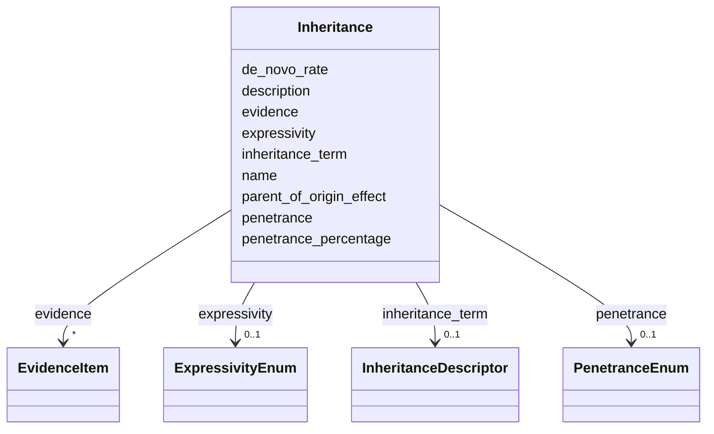

# Class: Inheritance 


URI: [dismech:Inheritance](https://w3id.org/monarch-initiative/dismech/Inheritance)





<!-- no inheritance hierarchy -->


## Slots

| Name | Cardinality and Range | Description | Inheritance |
| ---  | --- | --- | --- |
| [name](name.md) | 1 <br/> [String](String.md) |  | direct |
| [inheritance_term](inheritance_term.md) | 0..1 <br/> [InheritanceDescriptor](InheritanceDescriptor.md) | The HPO mode of inheritance term for this inheritance pattern | direct |
| [penetrance](penetrance.md) | 0..1 <br/> [PenetranceEnum](PenetranceEnum.md) | Penetrance classification for this inheritance pattern | direct |
| [penetrance_percentage](penetrance_percentage.md) | 0..1 <br/> [FrequencyQuantity](FrequencyQuantity.md) | Estimated penetrance percentage or range (e | direct |
| [expressivity](expressivity.md) | 0..1 <br/> [ExpressivityEnum](ExpressivityEnum.md) | Expressivity classification for this inheritance pattern | direct |
| [de_novo_rate](de_novo_rate.md) | 0..1 <br/> [FrequencyQuantity](FrequencyQuantity.md) | Estimated percentage of de novo cases (e | direct |
| [parent_of_origin_effect](parent_of_origin_effect.md) | 0..1 <br/> [String](String.md) | Parent-of-origin effect or bias (e | direct |
| [evidence](evidence.md) | * _recommended_ <br/> [EvidenceItem](EvidenceItem.md) |  | direct |
| [description](description.md) | 0..1 <br/> [String](String.md) |  | direct |


## Usages

| used by | used in | type | used |
| ---  | --- | --- | --- |
| [Subtype](Subtype.md) | [inheritance](inheritance.md) | range | [Inheritance](Inheritance.md) |
| [Genetic](Genetic.md) | [inheritance](inheritance.md) | range | [Inheritance](Inheritance.md) |
| [Disease](Disease.md) | [inheritance](inheritance.md) | range | [Inheritance](Inheritance.md) |


## Identifier and Mapping Information


### Schema Source


* from schema: https://w3id.org/monarch-initiative/dismech


## Mappings

| Mapping Type | Mapped Value |
| ---  | ---  |
| self | dismech:Inheritance |
| native | dismech:Inheritance |


## LinkML Source

<!-- TODO: investigate https://stackoverflow.com/questions/37606292/how-to-create-tabbed-code-blocks-in-mkdocs-or-sphinx -->

### Direct

<details>
```yaml
name: Inheritance
from_schema: https://w3id.org/monarch-initiative/dismech
slots:
- name
- inheritance_term
- penetrance
- penetrance_percentage
- expressivity
- de_novo_rate
- parent_of_origin_effect
- evidence
- description

```
</details>

### Induced

<details>
```yaml
name: Inheritance
from_schema: https://w3id.org/monarch-initiative/dismech
attributes:
  name:
    name: name
    examples:
    - value: Adolescent Nephronophthisis
    from_schema: https://w3id.org/monarch-initiative/dismech
    rank: 1000
    identifier: true
    alias: name
    owner: Inheritance
    domain_of:
    - ClinicalTrial
    - ComputationalModel
    - DifferentialDiagnosis
    - Subtype
    - EpidemiologyInfo
    - Pathophysiology
    - Phenotype
    - Biochemical
    - HistopathologyFinding
    - Genetic
    - Environmental
    - Disease
    - Stage
    - AgentLifeCycleStage
    - Treatment
    - InfectiousAgent
    - Transmission
    - Assay
    - Diagnosis
    - Inheritance
    - Variant
    - Mechanism
    - ModelingConsideration
    - Definition
    - CriteriaSet
    - ComorbidityAssociation
    range: string
    required: true
  inheritance_term:
    name: inheritance_term
    description: The HPO mode of inheritance term for this inheritance pattern
    from_schema: https://w3id.org/monarch-initiative/dismech
    rank: 1000
    alias: inheritance_term
    owner: Inheritance
    domain_of:
    - Inheritance
    range: InheritanceDescriptor
    inlined: true
  penetrance:
    name: penetrance
    description: Penetrance classification for this inheritance pattern
    from_schema: https://w3id.org/monarch-initiative/dismech
    rank: 1000
    alias: penetrance
    owner: Inheritance
    domain_of:
    - Inheritance
    range: PenetranceEnum
  penetrance_percentage:
    name: penetrance_percentage
    description: Estimated penetrance percentage or range (e.g., 80-90)
    from_schema: https://w3id.org/monarch-initiative/dismech
    rank: 1000
    alias: penetrance_percentage
    owner: Inheritance
    domain_of:
    - Inheritance
    range: FrequencyQuantity
  expressivity:
    name: expressivity
    description: Expressivity classification for this inheritance pattern
    from_schema: https://w3id.org/monarch-initiative/dismech
    rank: 1000
    alias: expressivity
    owner: Inheritance
    domain_of:
    - Inheritance
    range: ExpressivityEnum
  de_novo_rate:
    name: de_novo_rate
    description: Estimated percentage of de novo cases (e.g., 80)
    from_schema: https://w3id.org/monarch-initiative/dismech
    rank: 1000
    alias: de_novo_rate
    owner: Inheritance
    domain_of:
    - Inheritance
    range: FrequencyQuantity
  parent_of_origin_effect:
    name: parent_of_origin_effect
    description: Parent-of-origin effect or bias (e.g., paternal age effect)
    from_schema: https://w3id.org/monarch-initiative/dismech
    rank: 1000
    alias: parent_of_origin_effect
    owner: Inheritance
    domain_of:
    - Inheritance
    range: string
  evidence:
    name: evidence
    from_schema: https://w3id.org/monarch-initiative/dismech
    rank: 1000
    alias: evidence
    owner: Inheritance
    domain_of:
    - PhenotypeContext
    - Dataset
    - ClinicalTrial
    - ComputationalModel
    - DifferentialDiagnosis
    - Subtype
    - CausalEdge
    - TreatmentMechanismTarget
    - Finding
    - Prevalence
    - ProgressionInfo
    - EpidemiologyInfo
    - Pathophysiology
    - Phenotype
    - Biochemical
    - HistopathologyFinding
    - Genetic
    - Environmental
    - Stage
    - AgentLifeCycle
    - AgentLifeCycleStage
    - AnimalModel
    - Treatment
    - InfectiousAgent
    - Transmission
    - Diagnosis
    - Inheritance
    - Variant
    - ModelingConsideration
    - ClassificationAssignment
    - Definition
    - CriteriaSet
    - AssociationSignal
    - AssociationStatistics
    - ComorbidityHypothesis
    - UpstreamConditionHypothesis
    - MechanisticHypothesis
    range: EvidenceItem
    recommended: true
    multivalued: true
    inlined: true
    inlined_as_list: true
  description:
    name: description
    from_schema: https://w3id.org/monarch-initiative/dismech
    rank: 1000
    alias: description
    owner: Inheritance
    domain_of:
    - Descriptor
    - GeneticContext
    - Dataset
    - ClinicalTrial
    - ComputationalModel
    - DifferentialDiagnosis
    - Subtype
    - CausalEdge
    - TreatmentMechanismTarget
    - EpidemiologyInfo
    - Pathophysiology
    - Phenotype
    - HistopathologyFinding
    - Environmental
    - Disease
    - Stage
    - AgentLifeCycle
    - AgentLifeCycleStage
    - AnimalModel
    - Treatment
    - InfectiousAgent
    - Transmission
    - Assay
    - Diagnosis
    - Inheritance
    - Variant
    - FunctionalEffect
    - Mechanism
    - ModelingConsideration
    - Definition
    - CriteriaSet
    - ConditionDescriptor
    - GOEnrichment
    - ComorbidityHypothesis
    - UpstreamConditionHypothesis
    - MechanisticHypothesis
    range: string

```
</details>