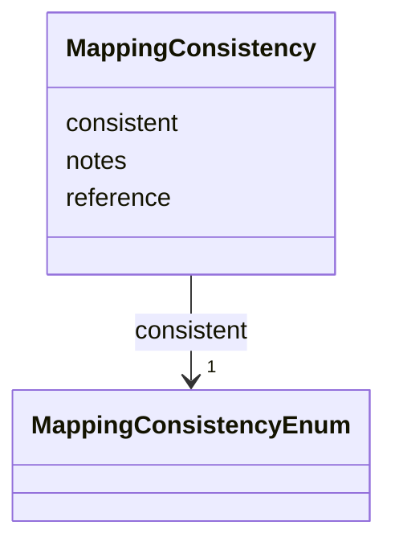

# Class: MappingConsistency 


_Consistency assertion for a mapping relative to another source_


URI: [dismech:MappingConsistency](https://w3id.org/monarch-initiative/dismech/MappingConsistency)





<!-- no inheritance hierarchy -->


## Slots

| Name | Cardinality and Range | Description | Inheritance |
| ---  | --- | --- | --- |
| [reference](reference.md) | 1 <br/> [String](String.md) | Reference source used to assess consistency (e | direct |
| [consistent](consistent.md) | 1 <br/> [MappingConsistencyEnum](MappingConsistencyEnum.md) | Consistency status for a mapping relative to a reference source | direct |
| [notes](notes.md) | 0..1 <br/> [String](String.md) |  | direct |


## Usages

| used by | used in | type | used |
| ---  | --- | --- | --- |
| [TermMapping](TermMapping.md) | [consistency](consistency.md) | range | [MappingConsistency](MappingConsistency.md) |
| [ICD10CMMapping](ICD10CMMapping.md) | [consistency](consistency.md) | range | [MappingConsistency](MappingConsistency.md) |
| [ICD11FMapping](ICD11FMapping.md) | [consistency](consistency.md) | range | [MappingConsistency](MappingConsistency.md) |
| [MondoMapping](MondoMapping.md) | [consistency](consistency.md) | range | [MappingConsistency](MappingConsistency.md) |


## Identifier and Mapping Information


### Schema Source


* from schema: https://w3id.org/monarch-initiative/dismech


## Mappings

| Mapping Type | Mapped Value |
| ---  | ---  |
| self | dismech:MappingConsistency |
| native | dismech:MappingConsistency |


## LinkML Source

<!-- TODO: investigate https://stackoverflow.com/questions/37606292/how-to-create-tabbed-code-blocks-in-mkdocs-or-sphinx -->

### Direct

<details>
```yaml
name: MappingConsistency
description: Consistency assertion for a mapping relative to another source
from_schema: https://w3id.org/monarch-initiative/dismech
slots:
- reference
- consistent
- notes
slot_usage:
  reference:
    name: reference
    description: Reference source used to assess consistency (e.g., MONDO)
    range: string
    required: true
  consistent:
    name: consistent
    required: true

```
</details>

### Induced

<details>
```yaml
name: MappingConsistency
description: Consistency assertion for a mapping relative to another source
from_schema: https://w3id.org/monarch-initiative/dismech
slot_usage:
  reference:
    name: reference
    description: Reference source used to assess consistency (e.g., MONDO)
    range: string
    required: true
  consistent:
    name: consistent
    required: true
attributes:
  reference:
    name: reference
    implements:
    - linkml:authoritative_reference
    description: Reference source used to assess consistency (e.g., MONDO)
    examples:
    - value: PMID:35533128
    from_schema: https://w3id.org/monarch-initiative/dismech
    rank: 1000
    alias: reference
    owner: MappingConsistency
    domain_of:
    - EvidenceItem
    - PublicationReference
    - MappingConsistency
    range: string
    required: true
  consistent:
    name: consistent
    description: Consistency status for a mapping relative to a reference source
    from_schema: https://w3id.org/monarch-initiative/dismech
    rank: 1000
    alias: consistent
    owner: MappingConsistency
    domain_of:
    - MappingConsistency
    range: MappingConsistencyEnum
    required: true
  notes:
    name: notes
    examples:
    - value: Contagious stage where symptoms appear and the bacteria can be spread
        to others.
    from_schema: https://w3id.org/monarch-initiative/dismech
    rank: 1000
    alias: notes
    owner: MappingConsistency
    domain_of:
    - GeneticContext
    - OnsetDescriptor
    - PhenotypeContext
    - Dataset
    - ClinicalTrial
    - ComputationalModel
    - DifferentialDiagnosis
    - Prevalence
    - ProgressionInfo
    - EpidemiologyInfo
    - Pathophysiology
    - Phenotype
    - Biochemical
    - HistopathologyFinding
    - Genetic
    - Environmental
    - Disease
    - Stage
    - AgentLifeCycle
    - AgentLifeCycleStage
    - Treatment
    - Transmission
    - Diagnosis
    - ClassificationAssignment
    - Definition
    - CriteriaSet
    - TermMapping
    - MappingConsistency
    - ComorbidityAssociation
    - AssociationSignal
    - AssociationMetric
    - AssociationStatistics
    - MechanisticHypothesis
    range: string

```
</details>