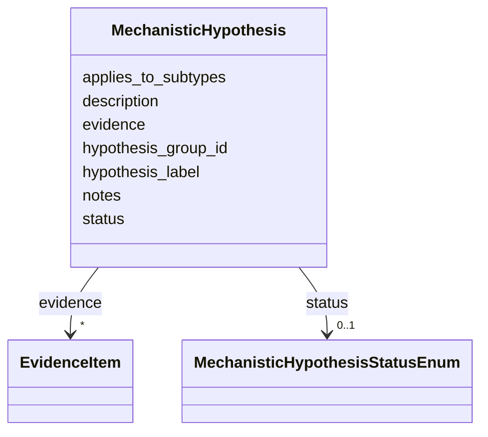

# Class: MechanisticHypothesis 


_Disease-level hypothesis metadata used to organize downstream causal edges into canonical or alternative explanatory models._


URI: [dismech:MechanisticHypothesis](https://w3id.org/monarch-initiative/dismech/MechanisticHypothesis)





<!-- no inheritance hierarchy -->


## Slots

| Name | Cardinality and Range | Description | Inheritance |
| ---  | --- | --- | --- |
| [hypothesis_group_id](hypothesis_group_id.md) | 1 <br/> [String](String.md) | Stable identifier for a disease-level mechanistic hypothesis grouping | direct |
| [hypothesis_label](hypothesis_label.md) | 0..1 <br/> [String](String.md) | Human-readable label/title for a mechanistic hypothesis | direct |
| [status](status.md) | 0..1 <br/> [MechanisticHypothesisStatusEnum](MechanisticHypothesisStatusEnum.md) | Status or state of a clinical trial or other process | direct |
| [description](description.md) | 0..1 <br/> [String](String.md) |  | direct |
| [applies_to_subtypes](applies_to_subtypes.md) | * <br/> [String](String.md) | Disease subtypes for which this hypothesis is intended to apply | direct |
| [evidence](evidence.md) | * _recommended_ <br/> [EvidenceItem](EvidenceItem.md) |  | direct |
| [notes](notes.md) | 0..1 <br/> [String](String.md) |  | direct |


## Usages

| used by | used in | type | used |
| ---  | --- | --- | --- |
| [Disease](Disease.md) | [mechanistic_hypotheses](mechanistic_hypotheses.md) | range | [MechanisticHypothesis](MechanisticHypothesis.md) |


## Identifier and Mapping Information


### Schema Source


* from schema: https://w3id.org/monarch-initiative/dismech


## Mappings

| Mapping Type | Mapped Value |
| ---  | ---  |
| self | dismech:MechanisticHypothesis |
| native | dismech:MechanisticHypothesis |


## LinkML Source

<!-- TODO: investigate https://stackoverflow.com/questions/37606292/how-to-create-tabbed-code-blocks-in-mkdocs-or-sphinx -->

### Direct

<details>
```yaml
name: MechanisticHypothesis
description: Disease-level hypothesis metadata used to organize downstream causal
  edges into canonical or alternative explanatory models.
from_schema: https://w3id.org/monarch-initiative/dismech
slots:
- hypothesis_group_id
- hypothesis_label
- status
- description
- applies_to_subtypes
- evidence
- notes
slot_usage:
  hypothesis_group_id:
    name: hypothesis_group_id
    required: true
  status:
    name: status
    range: MechanisticHypothesisStatusEnum

```
</details>

### Induced

<details>
```yaml
name: MechanisticHypothesis
description: Disease-level hypothesis metadata used to organize downstream causal
  edges into canonical or alternative explanatory models.
from_schema: https://w3id.org/monarch-initiative/dismech
slot_usage:
  hypothesis_group_id:
    name: hypothesis_group_id
    required: true
  status:
    name: status
    range: MechanisticHypothesisStatusEnum
attributes:
  hypothesis_group_id:
    name: hypothesis_group_id
    description: Stable identifier for a disease-level mechanistic hypothesis grouping
    from_schema: https://w3id.org/monarch-initiative/dismech
    rank: 1000
    alias: hypothesis_group_id
    owner: MechanisticHypothesis
    domain_of:
    - MechanisticHypothesis
    range: string
    required: true
  hypothesis_label:
    name: hypothesis_label
    description: Human-readable label/title for a mechanistic hypothesis
    from_schema: https://w3id.org/monarch-initiative/dismech
    rank: 1000
    alias: hypothesis_label
    owner: MechanisticHypothesis
    domain_of:
    - MechanisticHypothesis
    range: string
  status:
    name: status
    description: Status or state of a clinical trial or other process
    examples:
    - value: Recruiting
    - value: Completed
    - value: Terminated
    from_schema: https://w3id.org/monarch-initiative/dismech
    rank: 1000
    alias: status
    owner: MechanisticHypothesis
    domain_of:
    - ClinicalTrial
    - MechanisticHypothesis
    range: MechanisticHypothesisStatusEnum
  description:
    name: description
    from_schema: https://w3id.org/monarch-initiative/dismech
    rank: 1000
    alias: description
    owner: MechanisticHypothesis
    domain_of:
    - Descriptor
    - GeneticContext
    - Dataset
    - ClinicalTrial
    - ComputationalModel
    - DifferentialDiagnosis
    - Subtype
    - CausalEdge
    - TreatmentMechanismTarget
    - EpidemiologyInfo
    - Pathophysiology
    - Phenotype
    - HistopathologyFinding
    - Environmental
    - Disease
    - Stage
    - AgentLifeCycle
    - AgentLifeCycleStage
    - AnimalModel
    - Treatment
    - InfectiousAgent
    - Transmission
    - Assay
    - Diagnosis
    - Inheritance
    - Variant
    - FunctionalEffect
    - Mechanism
    - ModelingConsideration
    - Definition
    - CriteriaSet
    - ConditionDescriptor
    - GOEnrichment
    - ComorbidityHypothesis
    - UpstreamConditionHypothesis
    - MechanisticHypothesis
    range: string
  applies_to_subtypes:
    name: applies_to_subtypes
    description: Disease subtypes for which this hypothesis is intended to apply
    from_schema: https://w3id.org/monarch-initiative/dismech
    rank: 1000
    alias: applies_to_subtypes
    owner: MechanisticHypothesis
    domain_of:
    - MechanisticHypothesis
    range: string
    multivalued: true
  evidence:
    name: evidence
    from_schema: https://w3id.org/monarch-initiative/dismech
    rank: 1000
    alias: evidence
    owner: MechanisticHypothesis
    domain_of:
    - PhenotypeContext
    - Dataset
    - ClinicalTrial
    - ComputationalModel
    - DifferentialDiagnosis
    - Subtype
    - CausalEdge
    - TreatmentMechanismTarget
    - Finding
    - Prevalence
    - ProgressionInfo
    - EpidemiologyInfo
    - Pathophysiology
    - Phenotype
    - Biochemical
    - HistopathologyFinding
    - Genetic
    - Environmental
    - Stage
    - AgentLifeCycle
    - AgentLifeCycleStage
    - AnimalModel
    - Treatment
    - InfectiousAgent
    - Transmission
    - Diagnosis
    - Inheritance
    - Variant
    - ModelingConsideration
    - ClassificationAssignment
    - Definition
    - CriteriaSet
    - AssociationSignal
    - AssociationStatistics
    - ComorbidityHypothesis
    - UpstreamConditionHypothesis
    - MechanisticHypothesis
    range: EvidenceItem
    recommended: true
    multivalued: true
    inlined: true
    inlined_as_list: true
  notes:
    name: notes
    examples:
    - value: Contagious stage where symptoms appear and the bacteria can be spread
        to others.
    from_schema: https://w3id.org/monarch-initiative/dismech
    rank: 1000
    alias: notes
    owner: MechanisticHypothesis
    domain_of:
    - GeneticContext
    - OnsetDescriptor
    - PhenotypeContext
    - Dataset
    - ClinicalTrial
    - ComputationalModel
    - DifferentialDiagnosis
    - Prevalence
    - ProgressionInfo
    - EpidemiologyInfo
    - Pathophysiology
    - Phenotype
    - Biochemical
    - HistopathologyFinding
    - Genetic
    - Environmental
    - Disease
    - Stage
    - AgentLifeCycle
    - AgentLifeCycleStage
    - Treatment
    - Transmission
    - Diagnosis
    - ClassificationAssignment
    - Definition
    - CriteriaSet
    - TermMapping
    - MappingConsistency
    - ComorbidityAssociation
    - AssociationSignal
    - AssociationMetric
    - AssociationStatistics
    - MechanisticHypothesis
    range: string

```
</details>