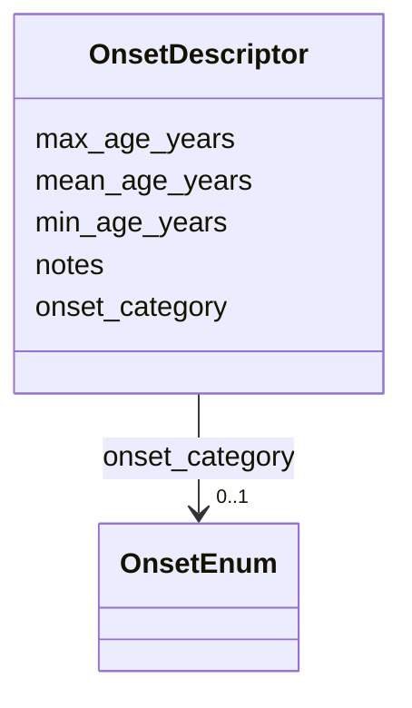

# Class: OnsetDescriptor 


_Structured description of age of onset. Combines an HPO onset category with optional quantitative age data and notes._


URI: [dismech:OnsetDescriptor](https://w3id.org/monarch-initiative/dismech/OnsetDescriptor)





<!-- no inheritance hierarchy -->


## Slots

| Name | Cardinality and Range | Description | Inheritance |
| ---  | --- | --- | --- |
| [onset_category](onset_category.md) | 0..1 <br/> [OnsetEnum](OnsetEnum.md) | HPO onset category (e | direct |
| [mean_age_years](mean_age_years.md) | 0..1 <br/> [Float](Float.md) | Mean age of onset in years, as reported in a cohort study | direct |
| [min_age_years](min_age_years.md) | 0..1 <br/> [Float](Float.md) | Minimum (earliest) age of onset in years | direct |
| [max_age_years](max_age_years.md) | 0..1 <br/> [Float](Float.md) | Maximum (latest) age of onset in years | direct |
| [notes](notes.md) | 0..1 <br/> [String](String.md) |  | direct |


## Usages

| used by | used in | type | used |
| ---  | --- | --- | --- |
| [PhenotypeContext](PhenotypeContext.md) | [onset](onset.md) | range | [OnsetDescriptor](OnsetDescriptor.md) |


## Identifier and Mapping Information


### Schema Source


* from schema: https://w3id.org/monarch-initiative/dismech


## Mappings

| Mapping Type | Mapped Value |
| ---  | ---  |
| self | dismech:OnsetDescriptor |
| native | dismech:OnsetDescriptor |


## LinkML Source

<!-- TODO: investigate https://stackoverflow.com/questions/37606292/how-to-create-tabbed-code-blocks-in-mkdocs-or-sphinx -->

### Direct

<details>
```yaml
name: OnsetDescriptor
description: Structured description of age of onset. Combines an HPO onset category
  with optional quantitative age data and notes.
from_schema: https://w3id.org/monarch-initiative/dismech
slots:
- onset_category
- mean_age_years
- min_age_years
- max_age_years
- notes

```
</details>

### Induced

<details>
```yaml
name: OnsetDescriptor
description: Structured description of age of onset. Combines an HPO onset category
  with optional quantitative age data and notes.
from_schema: https://w3id.org/monarch-initiative/dismech
attributes:
  onset_category:
    name: onset_category
    description: HPO onset category (e.g., CHILDHOOD, NEONATAL). Use when an approximate
      developmental stage is known.
    from_schema: https://w3id.org/monarch-initiative/dismech
    rank: 1000
    alias: onset_category
    owner: OnsetDescriptor
    domain_of:
    - OnsetDescriptor
    range: OnsetEnum
  mean_age_years:
    name: mean_age_years
    description: Mean age of onset in years, as reported in a cohort study.
    from_schema: https://w3id.org/monarch-initiative/dismech
    rank: 1000
    alias: mean_age_years
    owner: OnsetDescriptor
    domain_of:
    - OnsetDescriptor
    range: float
  min_age_years:
    name: min_age_years
    description: Minimum (earliest) age of onset in years.
    from_schema: https://w3id.org/monarch-initiative/dismech
    rank: 1000
    alias: min_age_years
    owner: OnsetDescriptor
    domain_of:
    - OnsetDescriptor
    range: float
  max_age_years:
    name: max_age_years
    description: Maximum (latest) age of onset in years.
    from_schema: https://w3id.org/monarch-initiative/dismech
    rank: 1000
    alias: max_age_years
    owner: OnsetDescriptor
    domain_of:
    - OnsetDescriptor
    range: float
  notes:
    name: notes
    examples:
    - value: Contagious stage where symptoms appear and the bacteria can be spread
        to others.
    from_schema: https://w3id.org/monarch-initiative/dismech
    rank: 1000
    alias: notes
    owner: OnsetDescriptor
    domain_of:
    - GeneticContext
    - OnsetDescriptor
    - PhenotypeContext
    - Dataset
    - ClinicalTrial
    - ComputationalModel
    - DifferentialDiagnosis
    - Prevalence
    - ProgressionInfo
    - EpidemiologyInfo
    - Pathophysiology
    - Phenotype
    - Biochemical
    - HistopathologyFinding
    - Genetic
    - Environmental
    - Disease
    - Stage
    - AgentLifeCycle
    - AgentLifeCycleStage
    - Treatment
    - Transmission
    - Diagnosis
    - ClassificationAssignment
    - Definition
    - CriteriaSet
    - TermMapping
    - MappingConsistency
    - ComorbidityAssociation
    - AssociationSignal
    - AssociationMetric
    - AssociationStatistics
    - MechanisticHypothesis
    range: string

```
</details>