# Class: Pathophysiology 


URI: [dismech:Pathophysiology](https://w3id.org/monarch-initiative/dismech/Pathophysiology)

```mermaid
 classDiagram
    class Pathophysiology
    click Pathophysiology href "../Pathophysiology/"
      Pathophysiology : assays
        
          
    
        
        
        Pathophysiology --> "*" AssayDescriptor : assays
        click AssayDescriptor href "../AssayDescriptor/"
    

        
      Pathophysiology : biological_processes
        
          
    
        
        
        Pathophysiology --> "*" BiologicalProcessDescriptor : biological_processes
        click BiologicalProcessDescriptor href "../BiologicalProcessDescriptor/"
    

        
      Pathophysiology : cell_types
        
          
    
        
        
        Pathophysiology --> "*" CellTypeDescriptor : cell_types
        click CellTypeDescriptor href "../CellTypeDescriptor/"
    

        
      Pathophysiology : cellular_components
        
          
    
        
        
        Pathophysiology --> "*" CellularComponentDescriptor : cellular_components
        click CellularComponentDescriptor href "../CellularComponentDescriptor/"
    

        
      Pathophysiology : chemical_entities
        
          
    
        
        
        Pathophysiology --> "*" ChemicalEntityDescriptor : chemical_entities
        click ChemicalEntityDescriptor href "../ChemicalEntityDescriptor/"
    

        
      Pathophysiology : consequence
        
      Pathophysiology : consequences
        
      Pathophysiology : description
        
      Pathophysiology : downstream
        
          
    
        
        
        Pathophysiology --> "*" CausalEdge : downstream
        click CausalEdge href "../CausalEdge/"
    

        
      Pathophysiology : evidence
        
          
    
        
        
        Pathophysiology --> "*" EvidenceItem : evidence
        click EvidenceItem href "../EvidenceItem/"
    

        
      Pathophysiology : examples
        
      Pathophysiology : frequency
        
          
    
        
        
        Pathophysiology --> "0..1" Any : frequency
        click Any href "../Any/"
    

        
      Pathophysiology : gene
        
          
    
        
        
        Pathophysiology --> "0..1" GeneDescriptor : gene
        click GeneDescriptor href "../GeneDescriptor/"
    

        
      Pathophysiology : gene_products
        
          
    
        
        
        Pathophysiology --> "*" GeneProductDescriptor : gene_products
        click GeneProductDescriptor href "../GeneProductDescriptor/"
    

        
      Pathophysiology : genes
        
          
    
        
        
        Pathophysiology --> "*" GeneDescriptor : genes
        click GeneDescriptor href "../GeneDescriptor/"
    

        
      Pathophysiology : locations
        
          
    
        
        
        Pathophysiology --> "*" AnatomicalEntityDescriptor : locations
        click AnatomicalEntityDescriptor href "../AnatomicalEntityDescriptor/"
    

        
      Pathophysiology : mechanisms
        
      Pathophysiology : name
        
      Pathophysiology : notes
        
      Pathophysiology : pathways
        
          
    
        
        
        Pathophysiology --> "*" BiologicalProcessDescriptor : pathways
        click BiologicalProcessDescriptor href "../BiologicalProcessDescriptor/"
    

        
      Pathophysiology : protein_complexes
        
          
    
        
        
        Pathophysiology --> "*" ProteinComplexDescriptor : protein_complexes
        click ProteinComplexDescriptor href "../ProteinComplexDescriptor/"
    

        
      Pathophysiology : role
        
      Pathophysiology : subtypes
        
      Pathophysiology : synonyms
        
      Pathophysiology : triggers
        
          
    
        
        
        Pathophysiology --> "*" TriggerDescriptor : triggers
        click TriggerDescriptor href "../TriggerDescriptor/"
    

        
      
```





<!-- no inheritance hierarchy -->


## Slots

| Name | Cardinality and Range | Description | Inheritance |
| ---  | --- | --- | --- |
| [name](name.md) | 1 <br/> [String](String.md) |  | direct |
| [description](description.md) | 0..1 <br/> [String](String.md) |  | direct |
| [cell_types](cell_types.md) | * <br/> [CellTypeDescriptor](CellTypeDescriptor.md) |  | direct |
| [evidence](evidence.md) | * _recommended_ <br/> [EvidenceItem](EvidenceItem.md) |  | direct |
| [biological_processes](biological_processes.md) | * <br/> [BiologicalProcessDescriptor](BiologicalProcessDescriptor.md) |  | direct |
| [locations](locations.md) | * <br/> [AnatomicalEntityDescriptor](AnatomicalEntityDescriptor.md) |  | direct |
| [examples](examples.md) | * <br/> [String](String.md) |  | direct |
| [role](role.md) | 0..1 <br/> [String](String.md) |  | direct |
| [synonyms](synonyms.md) | * <br/> [String](String.md) |  | direct |
| [consequence](consequence.md) | 0..1 <br/> [String](String.md) |  | direct |
| [consequences](consequences.md) | * <br/> [String](String.md) |  | direct |
| [gene](gene.md) | 0..1 <br/> [GeneDescriptor](GeneDescriptor.md) |  | direct |
| [pathways](pathways.md) | * <br/> [BiologicalProcessDescriptor](BiologicalProcessDescriptor.md) |  | direct |
| [downstream](downstream.md) | * <br/> [CausalEdge](CausalEdge.md) |  | direct |
| [genes](genes.md) | * <br/> [GeneDescriptor](GeneDescriptor.md) |  | direct |
| [subtypes](subtypes.md) | * <br/> [String](String.md) |  | direct |
| [cellular_components](cellular_components.md) | * <br/> [CellularComponentDescriptor](CellularComponentDescriptor.md) |  | direct |
| [protein_complexes](protein_complexes.md) | * <br/> [ProteinComplexDescriptor](ProteinComplexDescriptor.md) | Protein complexes that gene products participate in | direct |
| [chemical_entities](chemical_entities.md) | * <br/> [ChemicalEntityDescriptor](ChemicalEntityDescriptor.md) |  | direct |
| [gene_products](gene_products.md) | * <br/> [GeneProductDescriptor](GeneProductDescriptor.md) | Gene products (proteins, fusion proteins, oncoproteins) involved in this path... | direct |
| [triggers](triggers.md) | * <br/> [TriggerDescriptor](TriggerDescriptor.md) |  | direct |
| [assays](assays.md) | * <br/> [AssayDescriptor](AssayDescriptor.md) |  | direct |
| [mechanisms](mechanisms.md) | * <br/> [String](String.md) |  | direct |
| [notes](notes.md) | 0..1 <br/> [String](String.md) |  | direct |
| [frequency](frequency.md) | 0..1 <br/> [Any](Any.md)&nbsp;or&nbsp;<br />[FrequencyEnum](FrequencyEnum.md)&nbsp;or&nbsp;<br />[FrequencyQuantity](FrequencyQuantity.md) |  | direct |


## Usages

| used by | used in | type | used |
| ---  | --- | --- | --- |
| [Disease](Disease.md) | [pathophysiology](pathophysiology.md) | range | [Pathophysiology](Pathophysiology.md) |
| [Stage](Stage.md) | [pathophysiology](pathophysiology.md) | range | [Pathophysiology](Pathophysiology.md) |
| [ComorbidityHypothesis](ComorbidityHypothesis.md) | [pathophysiology](pathophysiology.md) | range | [Pathophysiology](Pathophysiology.md) |


## Identifier and Mapping Information


### Schema Source


* from schema: https://w3id.org/monarch-initiative/dismech


## Mappings

| Mapping Type | Mapped Value |
| ---  | ---  |
| self | dismech:Pathophysiology |
| native | dismech:Pathophysiology |


## LinkML Source

<!-- TODO: investigate https://stackoverflow.com/questions/37606292/how-to-create-tabbed-code-blocks-in-mkdocs-or-sphinx -->

### Direct

<details>
```yaml
name: Pathophysiology
from_schema: https://w3id.org/monarch-initiative/dismech
slots:
- name
- description
- cell_types
- evidence
- biological_processes
- locations
- examples
- role
- synonyms
- consequence
- consequences
- gene
- pathways
- downstream
- genes
- subtypes
- cellular_components
- protein_complexes
- chemical_entities
- gene_products
- triggers
- assays
- mechanisms
- notes
- frequency

```
</details>

### Induced

<details>
```yaml
name: Pathophysiology
from_schema: https://w3id.org/monarch-initiative/dismech
attributes:
  name:
    name: name
    examples:
    - value: Adolescent Nephronophthisis
    from_schema: https://w3id.org/monarch-initiative/dismech
    rank: 1000
    identifier: true
    alias: name
    owner: Pathophysiology
    domain_of:
    - ClinicalTrial
    - ComputationalModel
    - DifferentialDiagnosis
    - Subtype
    - EpidemiologyInfo
    - Pathophysiology
    - Phenotype
    - Biochemical
    - HistopathologyFinding
    - Genetic
    - Environmental
    - Disease
    - Stage
    - AgentLifeCycleStage
    - Treatment
    - InfectiousAgent
    - Transmission
    - Assay
    - Diagnosis
    - Inheritance
    - Variant
    - Mechanism
    - ModelingConsideration
    - Definition
    - CriteriaSet
    - ComorbidityAssociation
    range: string
    required: true
  description:
    name: description
    from_schema: https://w3id.org/monarch-initiative/dismech
    rank: 1000
    alias: description
    owner: Pathophysiology
    domain_of:
    - Descriptor
    - GeneticContext
    - Dataset
    - ClinicalTrial
    - ComputationalModel
    - DifferentialDiagnosis
    - Subtype
    - CausalEdge
    - TreatmentMechanismTarget
    - EpidemiologyInfo
    - Pathophysiology
    - Phenotype
    - HistopathologyFinding
    - Environmental
    - Disease
    - Stage
    - AgentLifeCycle
    - AgentLifeCycleStage
    - AnimalModel
    - Treatment
    - InfectiousAgent
    - Transmission
    - Assay
    - Diagnosis
    - Inheritance
    - Variant
    - FunctionalEffect
    - Mechanism
    - ModelingConsideration
    - Definition
    - CriteriaSet
    - ConditionDescriptor
    - GOEnrichment
    - ComorbidityHypothesis
    - UpstreamConditionHypothesis
    - MechanisticHypothesis
    range: string
  cell_types:
    name: cell_types
    examples:
    - value: '[{preferred_term: Macrophage}, {preferred_term: T Cell}]'
    from_schema: https://w3id.org/monarch-initiative/dismech
    rank: 1000
    alias: cell_types
    owner: Pathophysiology
    domain_of:
    - Pathophysiology
    - Biochemical
    range: CellTypeDescriptor
    multivalued: true
    inlined: true
    inlined_as_list: true
  evidence:
    name: evidence
    from_schema: https://w3id.org/monarch-initiative/dismech
    rank: 1000
    alias: evidence
    owner: Pathophysiology
    domain_of:
    - PhenotypeContext
    - Dataset
    - ClinicalTrial
    - ComputationalModel
    - DifferentialDiagnosis
    - Subtype
    - CausalEdge
    - TreatmentMechanismTarget
    - Finding
    - Prevalence
    - ProgressionInfo
    - EpidemiologyInfo
    - Pathophysiology
    - Phenotype
    - Biochemical
    - HistopathologyFinding
    - Genetic
    - Environmental
    - Stage
    - AgentLifeCycle
    - AgentLifeCycleStage
    - AnimalModel
    - Treatment
    - InfectiousAgent
    - Transmission
    - Diagnosis
    - Inheritance
    - Variant
    - ModelingConsideration
    - ClassificationAssignment
    - Definition
    - CriteriaSet
    - AssociationSignal
    - AssociationStatistics
    - ComorbidityHypothesis
    - UpstreamConditionHypothesis
    - MechanisticHypothesis
    range: EvidenceItem
    recommended: true
    multivalued: true
    inlined: true
    inlined_as_list: true
  biological_processes:
    name: biological_processes
    examples:
    - value: '[{preferred_term: TNF-alpha Production}]'
    from_schema: https://w3id.org/monarch-initiative/dismech
    rank: 1000
    alias: biological_processes
    owner: Pathophysiology
    domain_of:
    - Pathophysiology
    range: BiologicalProcessDescriptor
    multivalued: true
    inlined: true
    inlined_as_list: true
  locations:
    name: locations
    from_schema: https://w3id.org/monarch-initiative/dismech
    rank: 1000
    alias: locations
    owner: Pathophysiology
    domain_of:
    - Subtype
    - Pathophysiology
    range: AnatomicalEntityDescriptor
    multivalued: true
    inlined: true
    inlined_as_list: true
  examples:
    name: examples
    examples:
    - value: '[''Kaposi Sarcoma'']'
    from_schema: https://w3id.org/monarch-initiative/dismech
    rank: 1000
    alias: examples
    owner: Pathophysiology
    domain_of:
    - Pathophysiology
    - Genetic
    - Environmental
    - Stage
    - Treatment
    range: string
    multivalued: true
  role:
    name: role
    examples:
    - value: Primary
    from_schema: https://w3id.org/monarch-initiative/dismech
    rank: 1000
    alias: role
    owner: Pathophysiology
    domain_of:
    - HostDescriptor
    - Pathophysiology
    - Stage
    - Treatment
    range: string
  synonyms:
    name: synonyms
    examples:
    - value: '[''CYFRA 21-1'']'
    from_schema: https://w3id.org/monarch-initiative/dismech
    rank: 1000
    alias: synonyms
    owner: Pathophysiology
    domain_of:
    - Pathophysiology
    - Biochemical
    - Environmental
    - Disease
    - Variant
    range: string
    multivalued: true
  consequence:
    name: consequence
    examples:
    - value: Leads to abnormal sexual development and bone maturation.
    from_schema: https://w3id.org/monarch-initiative/dismech
    rank: 1000
    alias: consequence
    owner: Pathophysiology
    domain_of:
    - Pathophysiology
    range: string
  consequences:
    name: consequences
    todos:
    - unify consequences and consequence
    from_schema: https://w3id.org/monarch-initiative/dismech
    rank: 1000
    alias: consequences
    owner: Pathophysiology
    domain_of:
    - Pathophysiology
    range: string
    multivalued: true
  gene:
    name: gene
    examples:
    - value: '{preferred_term: MEFV}'
    from_schema: https://w3id.org/monarch-initiative/dismech
    rank: 1000
    alias: gene
    owner: Pathophysiology
    domain_of:
    - GeneticContext
    - Pathophysiology
    - Variant
    range: GeneDescriptor
    inlined: true
  pathways:
    name: pathways
    examples:
    - value: '[{preferred_term: Wnt Pathway}]'
    from_schema: https://w3id.org/monarch-initiative/dismech
    rank: 1000
    alias: pathways
    owner: Pathophysiology
    domain_of:
    - Pathophysiology
    range: BiologicalProcessDescriptor
    multivalued: true
    inlined: true
    inlined_as_list: true
  downstream:
    name: downstream
    examples:
    - value: '[{target: Tissue Damage, causal_link_type: INDIRECT_UNKNOWN_INTERMEDIATES,
        hypothesis_groups: [canonical_model]}]'
    from_schema: https://w3id.org/monarch-initiative/dismech
    rank: 1000
    alias: downstream
    owner: Pathophysiology
    domain_of:
    - Pathophysiology
    range: CausalEdge
    multivalued: true
    inlined: true
    inlined_as_list: true
  genes:
    name: genes
    examples:
    - value: '[{preferred_term: HLA-DQ2}, {preferred_term: INS}]'
    from_schema: https://w3id.org/monarch-initiative/dismech
    rank: 1000
    alias: genes
    owner: Pathophysiology
    domain_of:
    - GeneticContext
    - Dataset
    - Subtype
    - Pathophysiology
    - AnimalModel
    range: GeneDescriptor
    multivalued: true
    inlined: true
    inlined_as_list: true
  subtypes:
    name: subtypes
    examples:
    - value: '[''DENV-1'', ''DENV-2'', ''DENV-3'', ''DENV-4'']'
    from_schema: https://w3id.org/monarch-initiative/dismech
    rank: 1000
    alias: subtypes
    owner: Pathophysiology
    domain_of:
    - Pathophysiology
    range: string
    multivalued: true
  cellular_components:
    name: cellular_components
    examples:
    - value: '[{preferred_term: Peroxisome}]'
    from_schema: https://w3id.org/monarch-initiative/dismech
    rank: 1000
    alias: cellular_components
    owner: Pathophysiology
    domain_of:
    - Pathophysiology
    range: CellularComponentDescriptor
    multivalued: true
    inlined: true
    inlined_as_list: true
  protein_complexes:
    name: protein_complexes
    description: Protein complexes that gene products participate in
    examples:
    - value: '[{preferred_term: FA nuclear complex, term: {id: "GO:0043240", label:
        "Fanconi anaemia nuclear complex"}}]'
    from_schema: https://w3id.org/monarch-initiative/dismech
    rank: 1000
    alias: protein_complexes
    owner: Pathophysiology
    domain_of:
    - Pathophysiology
    range: ProteinComplexDescriptor
    multivalued: true
    inlined: true
    inlined_as_list: true
  chemical_entities:
    name: chemical_entities
    examples:
    - value: '[{preferred_term: Plasmalogen}]'
    from_schema: https://w3id.org/monarch-initiative/dismech
    rank: 1000
    alias: chemical_entities
    owner: Pathophysiology
    domain_of:
    - Pathophysiology
    range: ChemicalEntityDescriptor
    multivalued: true
    inlined: true
    inlined_as_list: true
  gene_products:
    name: gene_products
    description: Gene products (proteins, fusion proteins, oncoproteins) involved
      in this pathophysiology mechanism. Use NCIT terms for specific proteins.
    examples:
    - value: '[{preferred_term: BCR-ABL1 fusion protein, term: {id: NCIT:C16325, label:
        BCR/ABL1 Fusion Protein}}]'
    from_schema: https://w3id.org/monarch-initiative/dismech
    rank: 1000
    alias: gene_products
    owner: Pathophysiology
    domain_of:
    - Pathophysiology
    range: GeneProductDescriptor
    multivalued: true
    inlined: true
    inlined_as_list: true
  triggers:
    name: triggers
    examples:
    - value: '[{preferred_term: Viral Infections}]'
    from_schema: https://w3id.org/monarch-initiative/dismech
    rank: 1000
    alias: triggers
    owner: Pathophysiology
    domain_of:
    - Pathophysiology
    range: TriggerDescriptor
    multivalued: true
    inlined: true
    inlined_as_list: true
  assays:
    name: assays
    examples:
    - value: '[{preferred_term: Elevated Blood Glucose}]'
    from_schema: https://w3id.org/monarch-initiative/dismech
    rank: 1000
    alias: assays
    owner: Pathophysiology
    domain_of:
    - Pathophysiology
    - Biochemical
    range: AssayDescriptor
    multivalued: true
    inlined: true
    inlined_as_list: true
  mechanisms:
    name: mechanisms
    examples:
    - value: '[''Thrombocytopenia'', ''Platelet Dysfunction'', ''Disseminated Intravascular
        Coagulation (DIC)'']'
    from_schema: https://w3id.org/monarch-initiative/dismech
    rank: 1000
    alias: mechanisms
    owner: Pathophysiology
    domain_of:
    - Pathophysiology
    range: string
    multivalued: true
  notes:
    name: notes
    examples:
    - value: Contagious stage where symptoms appear and the bacteria can be spread
        to others.
    from_schema: https://w3id.org/monarch-initiative/dismech
    rank: 1000
    alias: notes
    owner: Pathophysiology
    domain_of:
    - GeneticContext
    - OnsetDescriptor
    - PhenotypeContext
    - Dataset
    - ClinicalTrial
    - ComputationalModel
    - DifferentialDiagnosis
    - Prevalence
    - ProgressionInfo
    - EpidemiologyInfo
    - Pathophysiology
    - Phenotype
    - Biochemical
    - HistopathologyFinding
    - Genetic
    - Environmental
    - Disease
    - Stage
    - AgentLifeCycle
    - AgentLifeCycleStage
    - Treatment
    - Transmission
    - Diagnosis
    - ClassificationAssignment
    - Definition
    - CriteriaSet
    - TermMapping
    - MappingConsistency
    - ComorbidityAssociation
    - AssociationSignal
    - AssociationMetric
    - AssociationStatistics
    - MechanisticHypothesis
    range: string
  frequency:
    name: frequency
    examples:
    - value: Occasional
    from_schema: https://w3id.org/monarch-initiative/dismech
    rank: 1000
    alias: frequency
    owner: Pathophysiology
    domain_of:
    - PhenotypeContext
    - Pathophysiology
    - Phenotype
    - Biochemical
    - HistopathologyFinding
    - Genetic
    range: Any
    any_of:
    - range: FrequencyEnum
    - range: FrequencyQuantity

```
</details>