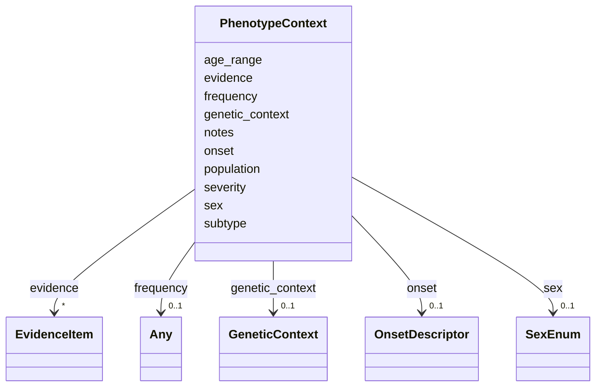

# Class: PhenotypeContext 


_A context-specific annotation qualifying how a phenotype manifests under particular conditions. Each context can specify a genetic context, demographic stratum, or disease subtype, along with frequency, severity, onset, and supporting evidence specific to that context._

_When no context qualifier slots are set (no genetic_context, sex, population, age_range, or subtype), the context provides evidence for the overall/default frequency claim, addressing the evidence separation problem (issue #112)._


URI: [dismech:PhenotypeContext](https://w3id.org/monarch-initiative/dismech/PhenotypeContext)





<!-- no inheritance hierarchy -->


## Slots

| Name | Cardinality and Range | Description | Inheritance |
| ---  | --- | --- | --- |
| [frequency](frequency.md) | 0..1 <br/> [Any](Any.md)&nbsp;or&nbsp;<br />[FrequencyEnum](FrequencyEnum.md)&nbsp;or&nbsp;<br />[FrequencyQuantity](FrequencyQuantity.md) |  | direct |
| [severity](severity.md) | 0..1 <br/> [String](String.md) |  | direct |
| [onset](onset.md) | 0..1 <br/> [OnsetDescriptor](OnsetDescriptor.md) | Structured age of onset descriptor | direct |
| [notes](notes.md) | 0..1 <br/> [String](String.md) |  | direct |
| [evidence](evidence.md) | * _recommended_ <br/> [EvidenceItem](EvidenceItem.md) | Evidence supporting the frequency, severity, or onset claims made in this spe... | direct |
| [genetic_context](genetic_context.md) | 0..1 <br/> [GeneticContext](GeneticContext.md) | The genetic context under which this qualification applies | direct |
| [sex](sex.md) | 0..1 <br/> [SexEnum](SexEnum.md) | Sex-specific stratum, if applicable | direct |
| [population](population.md) | 0..1 <br/> [String](String.md) | Population or cohort description (e | direct |
| [age_range](age_range.md) | 0..1 <br/> [String](String.md) | Age range or stratification, if applicable | direct |
| [subtype](subtype.md) | 0..1 <br/> [String](String.md) |  | direct |


## Usages

| used by | used in | type | used |
| ---  | --- | --- | --- |
| [Phenotype](Phenotype.md) | [phenotype_contexts](phenotype_contexts.md) | range | [PhenotypeContext](PhenotypeContext.md) |


## Identifier and Mapping Information


### Schema Source


* from schema: https://w3id.org/monarch-initiative/dismech


## Mappings

| Mapping Type | Mapped Value |
| ---  | ---  |
| self | dismech:PhenotypeContext |
| native | dismech:PhenotypeContext |


## LinkML Source

<!-- TODO: investigate https://stackoverflow.com/questions/37606292/how-to-create-tabbed-code-blocks-in-mkdocs-or-sphinx -->

### Direct

<details>
```yaml
name: PhenotypeContext
description: 'A context-specific annotation qualifying how a phenotype manifests under
  particular conditions. Each context can specify a genetic context, demographic stratum,
  or disease subtype, along with frequency, severity, onset, and supporting evidence
  specific to that context.

  When no context qualifier slots are set (no genetic_context, sex, population, age_range,
  or subtype), the context provides evidence for the overall/default frequency claim,
  addressing the evidence separation problem (issue #112).'
from_schema: https://w3id.org/monarch-initiative/dismech
slots:
- frequency
- severity
- onset
- notes
- evidence
- genetic_context
- sex
- population
- age_range
- subtype
slot_usage:
  sex:
    name: sex
    range: SexEnum
  evidence:
    name: evidence
    description: Evidence supporting the frequency, severity, or onset claims made
      in this specific context. Distinct from the D2P evidence on the parent Phenotype.

```
</details>

### Induced

<details>
```yaml
name: PhenotypeContext
description: 'A context-specific annotation qualifying how a phenotype manifests under
  particular conditions. Each context can specify a genetic context, demographic stratum,
  or disease subtype, along with frequency, severity, onset, and supporting evidence
  specific to that context.

  When no context qualifier slots are set (no genetic_context, sex, population, age_range,
  or subtype), the context provides evidence for the overall/default frequency claim,
  addressing the evidence separation problem (issue #112).'
from_schema: https://w3id.org/monarch-initiative/dismech
slot_usage:
  sex:
    name: sex
    range: SexEnum
  evidence:
    name: evidence
    description: Evidence supporting the frequency, severity, or onset claims made
      in this specific context. Distinct from the D2P evidence on the parent Phenotype.
attributes:
  frequency:
    name: frequency
    examples:
    - value: Occasional
    from_schema: https://w3id.org/monarch-initiative/dismech
    rank: 1000
    alias: frequency
    owner: PhenotypeContext
    domain_of:
    - PhenotypeContext
    - Pathophysiology
    - Phenotype
    - Biochemical
    - HistopathologyFinding
    - Genetic
    range: Any
    any_of:
    - range: FrequencyEnum
    - range: FrequencyQuantity
  severity:
    name: severity
    examples:
    - value: Severe
    from_schema: https://w3id.org/monarch-initiative/dismech
    rank: 1000
    alias: severity
    owner: PhenotypeContext
    domain_of:
    - PhenotypeContext
    - Phenotype
    range: string
  onset:
    name: onset
    description: Structured age of onset descriptor. Combines an HPO onset category
      with optional quantitative age data (mean, min, max in years) and free-text
      notes.
    from_schema: https://w3id.org/monarch-initiative/dismech
    rank: 1000
    alias: onset
    owner: PhenotypeContext
    domain_of:
    - PhenotypeContext
    range: OnsetDescriptor
    inlined: true
  notes:
    name: notes
    examples:
    - value: Contagious stage where symptoms appear and the bacteria can be spread
        to others.
    from_schema: https://w3id.org/monarch-initiative/dismech
    rank: 1000
    alias: notes
    owner: PhenotypeContext
    domain_of:
    - GeneticContext
    - OnsetDescriptor
    - PhenotypeContext
    - Dataset
    - ClinicalTrial
    - ComputationalModel
    - DifferentialDiagnosis
    - Prevalence
    - ProgressionInfo
    - EpidemiologyInfo
    - Pathophysiology
    - Phenotype
    - Biochemical
    - HistopathologyFinding
    - Genetic
    - Environmental
    - Disease
    - Stage
    - AgentLifeCycle
    - AgentLifeCycleStage
    - Treatment
    - Transmission
    - Diagnosis
    - ClassificationAssignment
    - Definition
    - CriteriaSet
    - TermMapping
    - MappingConsistency
    - ComorbidityAssociation
    - AssociationSignal
    - AssociationMetric
    - AssociationStatistics
    - MechanisticHypothesis
    range: string
  evidence:
    name: evidence
    description: Evidence supporting the frequency, severity, or onset claims made
      in this specific context. Distinct from the D2P evidence on the parent Phenotype.
    from_schema: https://w3id.org/monarch-initiative/dismech
    rank: 1000
    alias: evidence
    owner: PhenotypeContext
    domain_of:
    - PhenotypeContext
    - Dataset
    - ClinicalTrial
    - ComputationalModel
    - DifferentialDiagnosis
    - Subtype
    - CausalEdge
    - TreatmentMechanismTarget
    - Finding
    - Prevalence
    - ProgressionInfo
    - EpidemiologyInfo
    - Pathophysiology
    - Phenotype
    - Biochemical
    - HistopathologyFinding
    - Genetic
    - Environmental
    - Stage
    - AgentLifeCycle
    - AgentLifeCycleStage
    - AnimalModel
    - Treatment
    - InfectiousAgent
    - Transmission
    - Diagnosis
    - Inheritance
    - Variant
    - ModelingConsideration
    - ClassificationAssignment
    - Definition
    - CriteriaSet
    - AssociationSignal
    - AssociationStatistics
    - ComorbidityHypothesis
    - UpstreamConditionHypothesis
    - MechanisticHypothesis
    range: EvidenceItem
    recommended: true
    multivalued: true
    inlined: true
    inlined_as_list: true
  genetic_context:
    name: genetic_context
    description: The genetic context under which this qualification applies. May specify
      genes, mutation types, zygosity, complementation groups, or complex genotypes.
    from_schema: https://w3id.org/monarch-initiative/dismech
    rank: 1000
    alias: genetic_context
    owner: PhenotypeContext
    domain_of:
    - PhenotypeContext
    range: GeneticContext
    inlined: true
  sex:
    name: sex
    description: Sex-specific stratum, if applicable
    from_schema: https://w3id.org/monarch-initiative/dismech
    rank: 1000
    alias: sex
    owner: PhenotypeContext
    domain_of:
    - PhenotypeContext
    - Demographics
    range: SexEnum
  population:
    name: population
    description: Population or cohort description (e.g., for prevalence or association
      signals)
    examples:
    - value: Global
    from_schema: https://w3id.org/monarch-initiative/dismech
    rank: 1000
    alias: population
    owner: PhenotypeContext
    domain_of:
    - PhenotypeContext
    - Prevalence
    - AssociationSignal
    range: string
  age_range:
    name: age_range
    description: Age range or stratification, if applicable
    examples:
    - value: Childhood-Adolescence
    from_schema: https://w3id.org/monarch-initiative/dismech
    rank: 1000
    alias: age_range
    owner: PhenotypeContext
    domain_of:
    - PhenotypeContext
    - ProgressionInfo
    - Demographics
    range: string
  subtype:
    name: subtype
    examples:
    - value: Eyelid Myoclonia with Absences
    from_schema: https://w3id.org/monarch-initiative/dismech
    rank: 1000
    alias: subtype
    owner: PhenotypeContext
    domain_of:
    - PhenotypeContext
    - Prevalence
    - ProgressionInfo
    - Phenotype
    - Biochemical
    - HistopathologyFinding
    - Genetic
    range: string

```
</details>