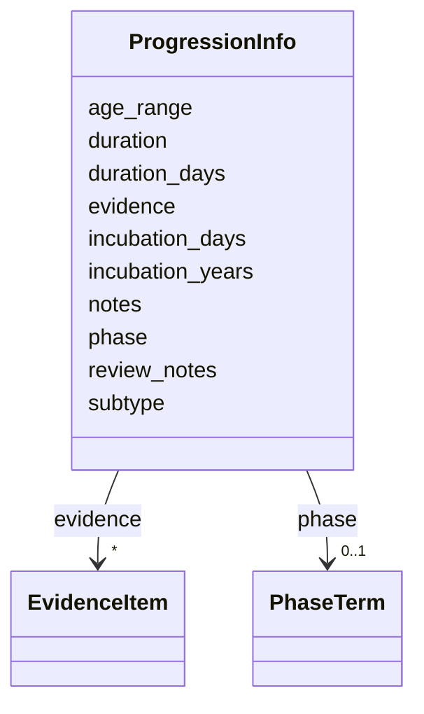

# Class: ProgressionInfo 


URI: [dismech:ProgressionInfo](https://w3id.org/monarch-initiative/dismech/ProgressionInfo)





<!-- no inheritance hierarchy -->


## Slots

| Name | Cardinality and Range | Description | Inheritance |
| ---  | --- | --- | --- |
| [phase](phase.md) | 0..1 <br/> [PhaseTerm](PhaseTerm.md) |  | direct |
| [subtype](subtype.md) | 0..1 <br/> [String](String.md) |  | direct |
| [age_range](age_range.md) | 0..1 <br/> [String](String.md) | Age range or stratification, if applicable | direct |
| [evidence](evidence.md) | * _recommended_ <br/> [EvidenceItem](EvidenceItem.md) |  | direct |
| [incubation_days](incubation_days.md) | 0..1 <br/> [String](String.md) |  | direct |
| [review_notes](review_notes.md) | 0..1 <br/> [String](String.md) |  | direct |
| [incubation_years](incubation_years.md) | 0..1 <br/> [String](String.md) |  | direct |
| [notes](notes.md) | 0..1 <br/> [String](String.md) |  | direct |
| [duration_days](duration_days.md) | 0..1 <br/> [String](String.md) |  | direct |
| [duration](duration.md) | 0..1 <br/> [String](String.md) |  | direct |


## Usages

| used by | used in | type | used |
| ---  | --- | --- | --- |
| [Disease](Disease.md) | [progression](progression.md) | range | [ProgressionInfo](ProgressionInfo.md) |


## Identifier and Mapping Information


### Schema Source


* from schema: https://w3id.org/monarch-initiative/dismech


## Mappings

| Mapping Type | Mapped Value |
| ---  | ---  |
| self | dismech:ProgressionInfo |
| native | dismech:ProgressionInfo |


## LinkML Source

<!-- TODO: investigate https://stackoverflow.com/questions/37606292/how-to-create-tabbed-code-blocks-in-mkdocs-or-sphinx -->

### Direct

<details>
```yaml
name: ProgressionInfo
from_schema: https://w3id.org/monarch-initiative/dismech
slots:
- phase
- subtype
- age_range
- evidence
- incubation_days
- review_notes
- incubation_years
- notes
- duration_days
- duration

```
</details>

### Induced

<details>
```yaml
name: ProgressionInfo
from_schema: https://w3id.org/monarch-initiative/dismech
attributes:
  phase:
    name: phase
    examples:
    - value: Active TB
    from_schema: https://w3id.org/monarch-initiative/dismech
    rank: 1000
    alias: phase
    owner: ProgressionInfo
    domain_of:
    - ClinicalTrial
    - ProgressionInfo
    range: PhaseTerm
  subtype:
    name: subtype
    examples:
    - value: Eyelid Myoclonia with Absences
    from_schema: https://w3id.org/monarch-initiative/dismech
    rank: 1000
    alias: subtype
    owner: ProgressionInfo
    domain_of:
    - PhenotypeContext
    - Prevalence
    - ProgressionInfo
    - Phenotype
    - Biochemical
    - HistopathologyFinding
    - Genetic
    range: string
  age_range:
    name: age_range
    description: Age range or stratification, if applicable
    examples:
    - value: Childhood-Adolescence
    from_schema: https://w3id.org/monarch-initiative/dismech
    rank: 1000
    alias: age_range
    owner: ProgressionInfo
    domain_of:
    - PhenotypeContext
    - ProgressionInfo
    - Demographics
    range: string
  evidence:
    name: evidence
    from_schema: https://w3id.org/monarch-initiative/dismech
    rank: 1000
    alias: evidence
    owner: ProgressionInfo
    domain_of:
    - PhenotypeContext
    - Dataset
    - ClinicalTrial
    - ComputationalModel
    - DifferentialDiagnosis
    - Subtype
    - CausalEdge
    - TreatmentMechanismTarget
    - Finding
    - Prevalence
    - ProgressionInfo
    - EpidemiologyInfo
    - Pathophysiology
    - Phenotype
    - Biochemical
    - HistopathologyFinding
    - Genetic
    - Environmental
    - Stage
    - AgentLifeCycle
    - AgentLifeCycleStage
    - AnimalModel
    - Treatment
    - InfectiousAgent
    - Transmission
    - Diagnosis
    - Inheritance
    - Variant
    - ModelingConsideration
    - ClassificationAssignment
    - Definition
    - CriteriaSet
    - AssociationSignal
    - AssociationStatistics
    - ComorbidityHypothesis
    - UpstreamConditionHypothesis
    - MechanisticHypothesis
    range: EvidenceItem
    recommended: true
    multivalued: true
    inlined: true
    inlined_as_list: true
  incubation_days:
    name: incubation_days
    examples:
    - value: 3-14
    from_schema: https://w3id.org/monarch-initiative/dismech
    rank: 1000
    alias: incubation_days
    owner: ProgressionInfo
    domain_of:
    - ProgressionInfo
    range: string
  review_notes:
    name: review_notes
    examples:
    - value: Added an additional clinically relevant subtype.
    from_schema: https://w3id.org/monarch-initiative/dismech
    rank: 1000
    alias: review_notes
    owner: ProgressionInfo
    domain_of:
    - ClinicalTrial
    - Subtype
    - ProgressionInfo
    - Phenotype
    - Genetic
    - Environmental
    - Disease
    - Stage
    - AgentLifeCycle
    - AgentLifeCycleStage
    - Treatment
    range: string
  incubation_years:
    name: incubation_years
    examples:
    - value: 2-15
    from_schema: https://w3id.org/monarch-initiative/dismech
    rank: 1000
    alias: incubation_years
    owner: ProgressionInfo
    domain_of:
    - ProgressionInfo
    range: string
  notes:
    name: notes
    examples:
    - value: Contagious stage where symptoms appear and the bacteria can be spread
        to others.
    from_schema: https://w3id.org/monarch-initiative/dismech
    rank: 1000
    alias: notes
    owner: ProgressionInfo
    domain_of:
    - GeneticContext
    - OnsetDescriptor
    - PhenotypeContext
    - Dataset
    - ClinicalTrial
    - ComputationalModel
    - DifferentialDiagnosis
    - Prevalence
    - ProgressionInfo
    - EpidemiologyInfo
    - Pathophysiology
    - Phenotype
    - Biochemical
    - HistopathologyFinding
    - Genetic
    - Environmental
    - Disease
    - Stage
    - AgentLifeCycle
    - AgentLifeCycleStage
    - Treatment
    - Transmission
    - Diagnosis
    - ClassificationAssignment
    - Definition
    - CriteriaSet
    - TermMapping
    - MappingConsistency
    - ComorbidityAssociation
    - AssociationSignal
    - AssociationMetric
    - AssociationStatistics
    - MechanisticHypothesis
    range: string
  duration_days:
    name: duration_days
    examples:
    - value: 2-5
    from_schema: https://w3id.org/monarch-initiative/dismech
    rank: 1000
    alias: duration_days
    owner: ProgressionInfo
    domain_of:
    - ProgressionInfo
    range: string
  duration:
    name: duration
    examples:
    - value: Variable
    from_schema: https://w3id.org/monarch-initiative/dismech
    rank: 1000
    alias: duration
    owner: ProgressionInfo
    domain_of:
    - ProgressionInfo
    range: string

```
</details>