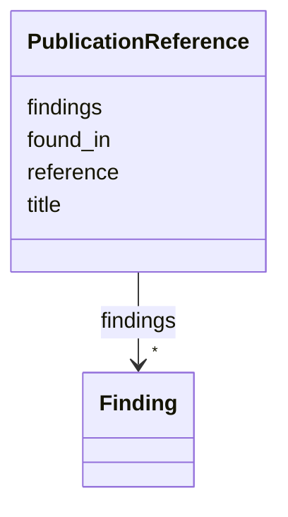

# Class: PublicationReference 


_A reference to a publication with associated findings_


URI: [dismech:PublicationReference](https://w3id.org/monarch-initiative/dismech/PublicationReference)





<!-- no inheritance hierarchy -->


## Slots

| Name | Cardinality and Range | Description | Inheritance |
| ---  | --- | --- | --- |
| [reference](reference.md) | 1 <br/> [PMID](PMID.md) | The authoritative reference (publication) for this evidence item | direct |
| [title](title.md) | 0..1 <br/> [String](String.md) | Title of the publication | direct |
| [found_in](found_in.md) | * <br/> [String](String.md) | Deep-research output files where this reference was cited | direct |
| [findings](findings.md) | * <br/> [Finding](Finding.md) | Key findings or claims extracted from this source (publication or dataset) | direct |


## Usages

| used by | used in | type | used |
| ---  | --- | --- | --- |
| [Disease](Disease.md) | [references](references.md) | range | [PublicationReference](PublicationReference.md) |


## Identifier and Mapping Information


### Schema Source


* from schema: https://w3id.org/monarch-initiative/dismech


## Mappings

| Mapping Type | Mapped Value |
| ---  | ---  |
| self | dismech:PublicationReference |
| native | dismech:PublicationReference |


## LinkML Source

<!-- TODO: investigate https://stackoverflow.com/questions/37606292/how-to-create-tabbed-code-blocks-in-mkdocs-or-sphinx -->

### Direct

<details>
```yaml
name: PublicationReference
description: A reference to a publication with associated findings
from_schema: https://w3id.org/monarch-initiative/dismech
slots:
- reference
- title
- found_in
- findings
slot_usage:
  reference:
    name: reference
    identifier: true
    required: true

```
</details>

### Induced

<details>
```yaml
name: PublicationReference
description: A reference to a publication with associated findings
from_schema: https://w3id.org/monarch-initiative/dismech
slot_usage:
  reference:
    name: reference
    identifier: true
    required: true
attributes:
  reference:
    name: reference
    implements:
    - linkml:authoritative_reference
    description: The authoritative reference (publication) for this evidence item
    examples:
    - value: PMID:35533128
    from_schema: https://w3id.org/monarch-initiative/dismech
    rank: 1000
    identifier: true
    alias: reference
    owner: PublicationReference
    domain_of:
    - EvidenceItem
    - PublicationReference
    - MappingConsistency
    range: PMID
    required: true
  title:
    name: title
    implements:
    - linkml:title
    description: Title of the publication
    from_schema: https://w3id.org/monarch-initiative/dismech
    rank: 1000
    alias: title
    owner: PublicationReference
    domain_of:
    - Dataset
    - PublicationReference
    range: string
  found_in:
    name: found_in
    description: Deep-research output files where this reference was cited
    from_schema: https://w3id.org/monarch-initiative/dismech
    rank: 1000
    alias: found_in
    owner: PublicationReference
    domain_of:
    - PublicationReference
    range: string
    multivalued: true
  findings:
    name: findings
    description: Key findings or claims extracted from this source (publication or
      dataset)
    from_schema: https://w3id.org/monarch-initiative/dismech
    rank: 1000
    alias: findings
    owner: PublicationReference
    domain_of:
    - Dataset
    - ComputationalModel
    - PublicationReference
    range: Finding
    multivalued: true
    inlined: true
    inlined_as_list: true

```
</details>