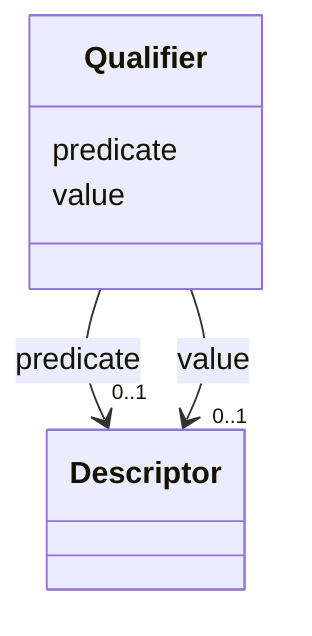

# Class: Qualifier  <span style="color: red;"><strong> (DEPRECATED) </strong></span> 


_A predicate-value pair for formal post-composition. Allows OWL-like expressivity with controlled predicates and values, both as full Descriptors._


URI: [dismech:Qualifier](https://w3id.org/monarch-initiative/dismech/Qualifier)





<!-- no inheritance hierarchy -->


## Slots

| Name | Cardinality and Range | Description | Inheritance |
| ---  | --- | --- | --- |
| [predicate](predicate.md) | 0..1 <br/> [Descriptor](Descriptor.md) | The relationship/predicate in a qualifier (e | direct |
| [value](value.md) | 0..1 <br/> [Descriptor](Descriptor.md) | The value/filler in a qualifier | direct |


## Usages

| used by | used in | type | used |
| ---  | --- | --- | --- |
| [Descriptor](Descriptor.md) | [qualifiers](qualifiers.md) | range | [Qualifier](Qualifier.md) |
| [CellTypeDescriptor](CellTypeDescriptor.md) | [qualifiers](qualifiers.md) | range | [Qualifier](Qualifier.md) |
| [BiologicalProcessDescriptor](BiologicalProcessDescriptor.md) | [qualifiers](qualifiers.md) | range | [Qualifier](Qualifier.md) |
| [AnatomicalEntityDescriptor](AnatomicalEntityDescriptor.md) | [qualifiers](qualifiers.md) | range | [Qualifier](Qualifier.md) |
| [ChemicalEntityDescriptor](ChemicalEntityDescriptor.md) | [qualifiers](qualifiers.md) | range | [Qualifier](Qualifier.md) |
| [GeneDescriptor](GeneDescriptor.md) | [qualifiers](qualifiers.md) | range | [Qualifier](Qualifier.md) |
| [CellularComponentDescriptor](CellularComponentDescriptor.md) | [qualifiers](qualifiers.md) | range | [Qualifier](Qualifier.md) |
| [ProteinComplexDescriptor](ProteinComplexDescriptor.md) | [qualifiers](qualifiers.md) | range | [Qualifier](Qualifier.md) |
| [AssayDescriptor](AssayDescriptor.md) | [qualifiers](qualifiers.md) | range | [Qualifier](Qualifier.md) |
| [TriggerDescriptor](TriggerDescriptor.md) | [qualifiers](qualifiers.md) | range | [Qualifier](Qualifier.md) |
| [DiseaseDescriptor](DiseaseDescriptor.md) | [qualifiers](qualifiers.md) | range | [Qualifier](Qualifier.md) |
| [BiomarkerDescriptor](BiomarkerDescriptor.md) | [qualifiers](qualifiers.md) | range | [Qualifier](Qualifier.md) |
| [GeneProductDescriptor](GeneProductDescriptor.md) | [qualifiers](qualifiers.md) | range | [Qualifier](Qualifier.md) |
| [HistopathologyFindingDescriptor](HistopathologyFindingDescriptor.md) | [qualifiers](qualifiers.md) | range | [Qualifier](Qualifier.md) |
| [LifeCycleStageDescriptor](LifeCycleStageDescriptor.md) | [qualifiers](qualifiers.md) | range | [Qualifier](Qualifier.md) |
| [PhenotypeDescriptor](PhenotypeDescriptor.md) | [qualifiers](qualifiers.md) | range | [Qualifier](Qualifier.md) |
| [InheritanceDescriptor](InheritanceDescriptor.md) | [qualifiers](qualifiers.md) | range | [Qualifier](Qualifier.md) |
| [TreatmentDescriptor](TreatmentDescriptor.md) | [qualifiers](qualifiers.md) | range | [Qualifier](Qualifier.md) |
| [RegimenDescriptor](RegimenDescriptor.md) | [qualifiers](qualifiers.md) | range | [Qualifier](Qualifier.md) |
| [ExposureDescriptor](ExposureDescriptor.md) | [qualifiers](qualifiers.md) | range | [Qualifier](Qualifier.md) |
| [EnvironmentDescriptor](EnvironmentDescriptor.md) | [qualifiers](qualifiers.md) | range | [Qualifier](Qualifier.md) |
| [OrganismDescriptor](OrganismDescriptor.md) | [qualifiers](qualifiers.md) | range | [Qualifier](Qualifier.md) |
| [HostDescriptor](HostDescriptor.md) | [qualifiers](qualifiers.md) | range | [Qualifier](Qualifier.md) |
| [SampleTypeDescriptor](SampleTypeDescriptor.md) | [qualifiers](qualifiers.md) | range | [Qualifier](Qualifier.md) |
| [CriteriaItem](CriteriaItem.md) | [qualifiers](qualifiers.md) | range | [Qualifier](Qualifier.md) |
| [ConditionDescriptor](ConditionDescriptor.md) | [qualifiers](qualifiers.md) | range | [Qualifier](Qualifier.md) |


## Comments

* DEPRECATED - prefer explicit slots (located_in, laterality) for better constraints
* Use for formal semantic relationships like "has_input some X"
* Both predicate and value are Descriptors, allowing recursive composition
* Predicate typically uses RO (Relation Ontology) terms

## Identifier and Mapping Information


### Schema Source


* from schema: https://w3id.org/monarch-initiative/dismech


## Mappings

| Mapping Type | Mapped Value |
| ---  | ---  |
| self | dismech:Qualifier |
| native | dismech:Qualifier |


## LinkML Source

<!-- TODO: investigate https://stackoverflow.com/questions/37606292/how-to-create-tabbed-code-blocks-in-mkdocs-or-sphinx -->

### Direct

<details>
```yaml
name: Qualifier
description: A predicate-value pair for formal post-composition. Allows OWL-like expressivity
  with controlled predicates and values, both as full Descriptors.
deprecated: Use explicit slots like located_in and laterality on Descriptor instead
comments:
- DEPRECATED - prefer explicit slots (located_in, laterality) for better constraints
- Use for formal semantic relationships like "has_input some X"
- Both predicate and value are Descriptors, allowing recursive composition
- Predicate typically uses RO (Relation Ontology) terms
from_schema: https://w3id.org/monarch-initiative/dismech
slots:
- predicate
- value

```
</details>

### Induced

<details>
```yaml
name: Qualifier
description: A predicate-value pair for formal post-composition. Allows OWL-like expressivity
  with controlled predicates and values, both as full Descriptors.
deprecated: Use explicit slots like located_in and laterality on Descriptor instead
comments:
- DEPRECATED - prefer explicit slots (located_in, laterality) for better constraints
- Use for formal semantic relationships like "has_input some X"
- Both predicate and value are Descriptors, allowing recursive composition
- Predicate typically uses RO (Relation Ontology) terms
from_schema: https://w3id.org/monarch-initiative/dismech
attributes:
  predicate:
    name: predicate
    description: The relationship/predicate in a qualifier (e.g., RO:0002233 'has
      input')
    from_schema: https://w3id.org/monarch-initiative/dismech
    rank: 1000
    alias: predicate
    owner: Qualifier
    domain_of:
    - Qualifier
    range: Descriptor
    inlined: true
  value:
    name: value
    description: The value/filler in a qualifier
    from_schema: https://w3id.org/monarch-initiative/dismech
    rank: 1000
    alias: value
    owner: Qualifier
    domain_of:
    - Qualifier
    range: Descriptor
    inlined: true

```
</details>