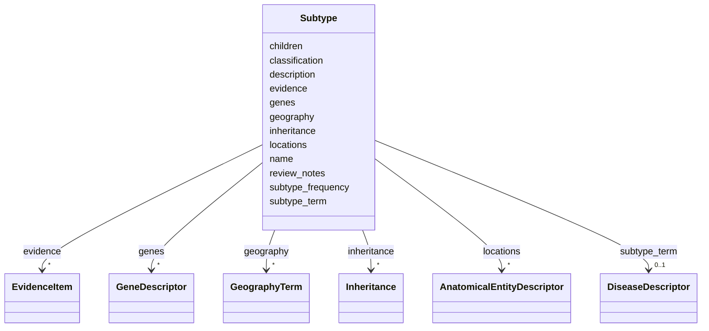

# Class: Subtype 


URI: [dismech:Subtype](https://w3id.org/monarch-initiative/dismech/Subtype)





<!-- no inheritance hierarchy -->


## Slots

| Name | Cardinality and Range | Description | Inheritance |
| ---  | --- | --- | --- |
| [name](name.md) | 1 <br/> [String](String.md) |  | direct |
| [subtype_term](subtype_term.md) | 0..1 <br/> [DiseaseDescriptor](DiseaseDescriptor.md) | The MONDO term for a disease subtype | direct |
| [description](description.md) | 0..1 <br/> [String](String.md) |  | direct |
| [evidence](evidence.md) | * _recommended_ <br/> [EvidenceItem](EvidenceItem.md) |  | direct |
| [review_notes](review_notes.md) | 0..1 <br/> [String](String.md) |  | direct |
| [locations](locations.md) | * <br/> [AnatomicalEntityDescriptor](AnatomicalEntityDescriptor.md) |  | direct |
| [geography](geography.md) | * <br/> [GeographyTerm](GeographyTerm.md) |  | direct |
| [classification](classification.md) | 0..1 <br/> [String](String.md) | Classification scheme this subtype belongs to (e | direct |
| [children](children.md) | * <br/> [String](String.md) | Names of other subtypes in this list that are members/children of this groupi... | direct |
| [genes](genes.md) | * <br/> [GeneDescriptor](GeneDescriptor.md) |  | direct |
| [subtype_frequency](subtype_frequency.md) | 0..1 <br/> [String](String.md)&nbsp;or&nbsp;<br />[FrequencyEnum](FrequencyEnum.md)&nbsp;or&nbsp;<br />[FrequencyQuantity](FrequencyQuantity.md) | Frequency of this subtype among all cases of the parent disease (e | direct |
| [inheritance](inheritance.md) | * <br/> [Inheritance](Inheritance.md) |  | direct |


## Usages

| used by | used in | type | used |
| ---  | --- | --- | --- |
| [Disease](Disease.md) | [has_subtypes](has_subtypes.md) | range | [Subtype](Subtype.md) |
| [InfectiousAgent](InfectiousAgent.md) | [has_subtypes](has_subtypes.md) | range | [Subtype](Subtype.md) |


## Identifier and Mapping Information


### Schema Source


* from schema: https://w3id.org/monarch-initiative/dismech


## Mappings

| Mapping Type | Mapped Value |
| ---  | ---  |
| self | dismech:Subtype |
| native | dismech:Subtype |


## LinkML Source

<!-- TODO: investigate https://stackoverflow.com/questions/37606292/how-to-create-tabbed-code-blocks-in-mkdocs-or-sphinx -->

### Direct

<details>
```yaml
name: Subtype
from_schema: https://w3id.org/monarch-initiative/dismech
slots:
- name
- subtype_term
- description
- evidence
- review_notes
- locations
- geography
- classification
- children
- genes
- subtype_frequency
- inheritance

```
</details>

### Induced

<details>
```yaml
name: Subtype
from_schema: https://w3id.org/monarch-initiative/dismech
attributes:
  name:
    name: name
    examples:
    - value: Adolescent Nephronophthisis
    from_schema: https://w3id.org/monarch-initiative/dismech
    rank: 1000
    identifier: true
    alias: name
    owner: Subtype
    domain_of:
    - ClinicalTrial
    - ComputationalModel
    - DifferentialDiagnosis
    - Subtype
    - EpidemiologyInfo
    - Pathophysiology
    - Phenotype
    - Biochemical
    - HistopathologyFinding
    - Genetic
    - Environmental
    - Disease
    - Stage
    - AgentLifeCycleStage
    - Treatment
    - InfectiousAgent
    - Transmission
    - Assay
    - Diagnosis
    - Inheritance
    - Variant
    - Mechanism
    - ModelingConsideration
    - Definition
    - CriteriaSet
    - ComorbidityAssociation
    range: string
    required: true
  subtype_term:
    name: subtype_term
    description: The MONDO term for a disease subtype
    from_schema: https://w3id.org/monarch-initiative/dismech
    rank: 1000
    alias: subtype_term
    owner: Subtype
    domain_of:
    - Subtype
    range: DiseaseDescriptor
    inlined: true
  description:
    name: description
    from_schema: https://w3id.org/monarch-initiative/dismech
    rank: 1000
    alias: description
    owner: Subtype
    domain_of:
    - Descriptor
    - GeneticContext
    - Dataset
    - ClinicalTrial
    - ComputationalModel
    - DifferentialDiagnosis
    - Subtype
    - CausalEdge
    - TreatmentMechanismTarget
    - EpidemiologyInfo
    - Pathophysiology
    - Phenotype
    - HistopathologyFinding
    - Environmental
    - Disease
    - Stage
    - AgentLifeCycle
    - AgentLifeCycleStage
    - AnimalModel
    - Treatment
    - InfectiousAgent
    - Transmission
    - Assay
    - Diagnosis
    - Inheritance
    - Variant
    - FunctionalEffect
    - Mechanism
    - ModelingConsideration
    - Definition
    - CriteriaSet
    - ConditionDescriptor
    - GOEnrichment
    - ComorbidityHypothesis
    - UpstreamConditionHypothesis
    - MechanisticHypothesis
    range: string
  evidence:
    name: evidence
    from_schema: https://w3id.org/monarch-initiative/dismech
    rank: 1000
    alias: evidence
    owner: Subtype
    domain_of:
    - PhenotypeContext
    - Dataset
    - ClinicalTrial
    - ComputationalModel
    - DifferentialDiagnosis
    - Subtype
    - CausalEdge
    - TreatmentMechanismTarget
    - Finding
    - Prevalence
    - ProgressionInfo
    - EpidemiologyInfo
    - Pathophysiology
    - Phenotype
    - Biochemical
    - HistopathologyFinding
    - Genetic
    - Environmental
    - Stage
    - AgentLifeCycle
    - AgentLifeCycleStage
    - AnimalModel
    - Treatment
    - InfectiousAgent
    - Transmission
    - Diagnosis
    - Inheritance
    - Variant
    - ModelingConsideration
    - ClassificationAssignment
    - Definition
    - CriteriaSet
    - AssociationSignal
    - AssociationStatistics
    - ComorbidityHypothesis
    - UpstreamConditionHypothesis
    - MechanisticHypothesis
    range: EvidenceItem
    recommended: true
    multivalued: true
    inlined: true
    inlined_as_list: true
  review_notes:
    name: review_notes
    examples:
    - value: Added an additional clinically relevant subtype.
    from_schema: https://w3id.org/monarch-initiative/dismech
    rank: 1000
    alias: review_notes
    owner: Subtype
    domain_of:
    - ClinicalTrial
    - Subtype
    - ProgressionInfo
    - Phenotype
    - Genetic
    - Environmental
    - Disease
    - Stage
    - AgentLifeCycle
    - AgentLifeCycleStage
    - Treatment
    range: string
  locations:
    name: locations
    from_schema: https://w3id.org/monarch-initiative/dismech
    rank: 1000
    alias: locations
    owner: Subtype
    domain_of:
    - Subtype
    - Pathophysiology
    range: AnatomicalEntityDescriptor
    multivalued: true
    inlined: true
    inlined_as_list: true
  geography:
    name: geography
    examples:
    - value: '[''Philippines'']'
    from_schema: https://w3id.org/monarch-initiative/dismech
    rank: 1000
    alias: geography
    owner: Subtype
    domain_of:
    - Subtype
    range: GeographyTerm
    multivalued: true
  classification:
    name: classification
    description: Classification scheme this subtype belongs to (e.g., 'complementation_group',
      'pathway_tier', 'histological', 'molecular', 'clinical_phenotype').
    from_schema: https://w3id.org/monarch-initiative/dismech
    rank: 1000
    alias: classification
    owner: Subtype
    domain_of:
    - Subtype
    range: string
  children:
    name: children
    description: Names of other subtypes in this list that are members/children of
      this grouping subtype. Used to express cross-scheme relationships (e.g., a pathway_tier
      subtype grouping complementation_group subtypes).
    from_schema: https://w3id.org/monarch-initiative/dismech
    rank: 1000
    alias: children
    owner: Subtype
    domain_of:
    - Subtype
    range: string
    multivalued: true
  genes:
    name: genes
    examples:
    - value: '[{preferred_term: HLA-DQ2}, {preferred_term: INS}]'
    from_schema: https://w3id.org/monarch-initiative/dismech
    rank: 1000
    alias: genes
    owner: Subtype
    domain_of:
    - GeneticContext
    - Dataset
    - Subtype
    - Pathophysiology
    - AnimalModel
    range: GeneDescriptor
    multivalued: true
    inlined: true
    inlined_as_list: true
  subtype_frequency:
    name: subtype_frequency
    description: Frequency of this subtype among all cases of the parent disease (e.g.,
      '60-70%', '~15%'). Distinct from phenotype frequency.
    from_schema: https://w3id.org/monarch-initiative/dismech
    rank: 1000
    alias: subtype_frequency
    owner: Subtype
    domain_of:
    - Subtype
    any_of:
    - range: FrequencyEnum
    - range: FrequencyQuantity
  inheritance:
    name: inheritance
    examples:
    - value: Autosomal Dominant
    from_schema: https://w3id.org/monarch-initiative/dismech
    rank: 1000
    alias: inheritance
    owner: Subtype
    domain_of:
    - Subtype
    - Genetic
    - Disease
    range: Inheritance
    multivalued: true
    inlined: true
    inlined_as_list: true

```
</details>