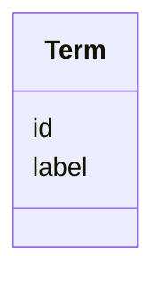

# Class: Term 


_A structured reference to an ontology term_


URI: [dismech:Term](https://w3id.org/monarch-initiative/dismech/Term)





<!-- no inheritance hierarchy -->


## Slots

| Name | Cardinality and Range | Description | Inheritance |
| ---  | --- | --- | --- |
| [id](id.md) | 1 <br/> [Uriorcurie](Uriorcurie.md) | Ontology term identifier (CURIE) | direct |
| [label](label.md) | 0..1 <br/> [String](String.md) | Human-readable label for the ontology term | direct |


## Usages

| used by | used in | type | used |
| ---  | --- | --- | --- |
| [Descriptor](Descriptor.md) | [term](term.md) | range | [Term](Term.md) |
| [CellTypeDescriptor](CellTypeDescriptor.md) | [term](term.md) | range | [Term](Term.md) |
| [BiologicalProcessDescriptor](BiologicalProcessDescriptor.md) | [term](term.md) | range | [Term](Term.md) |
| [AnatomicalEntityDescriptor](AnatomicalEntityDescriptor.md) | [term](term.md) | range | [Term](Term.md) |
| [ChemicalEntityDescriptor](ChemicalEntityDescriptor.md) | [term](term.md) | range | [Term](Term.md) |
| [GeneDescriptor](GeneDescriptor.md) | [term](term.md) | range | [Term](Term.md) |
| [CellularComponentDescriptor](CellularComponentDescriptor.md) | [term](term.md) | range | [Term](Term.md) |
| [ProteinComplexDescriptor](ProteinComplexDescriptor.md) | [term](term.md) | range | [Term](Term.md) |
| [AssayDescriptor](AssayDescriptor.md) | [term](term.md) | range | [Term](Term.md) |
| [TriggerDescriptor](TriggerDescriptor.md) | [term](term.md) | range | [Term](Term.md) |
| [DiseaseDescriptor](DiseaseDescriptor.md) | [term](term.md) | range | [Term](Term.md) |
| [BiomarkerDescriptor](BiomarkerDescriptor.md) | [term](term.md) | range | [Term](Term.md) |
| [GeneProductDescriptor](GeneProductDescriptor.md) | [term](term.md) | range | [Term](Term.md) |
| [HistopathologyFindingDescriptor](HistopathologyFindingDescriptor.md) | [term](term.md) | range | [Term](Term.md) |
| [LifeCycleStageDescriptor](LifeCycleStageDescriptor.md) | [term](term.md) | range | [Term](Term.md) |
| [PhenotypeDescriptor](PhenotypeDescriptor.md) | [term](term.md) | range | [Term](Term.md) |
| [InheritanceDescriptor](InheritanceDescriptor.md) | [term](term.md) | range | [Term](Term.md) |
| [TreatmentDescriptor](TreatmentDescriptor.md) | [term](term.md) | range | [Term](Term.md) |
| [RegimenDescriptor](RegimenDescriptor.md) | [term](term.md) | range | [Term](Term.md) |
| [ExposureDescriptor](ExposureDescriptor.md) | [term](term.md) | range | [Term](Term.md) |
| [EnvironmentDescriptor](EnvironmentDescriptor.md) | [term](term.md) | range | [Term](Term.md) |
| [OrganismDescriptor](OrganismDescriptor.md) | [term](term.md) | range | [Term](Term.md) |
| [HostDescriptor](HostDescriptor.md) | [term](term.md) | range | [Term](Term.md) |
| [SampleTypeDescriptor](SampleTypeDescriptor.md) | [term](term.md) | range | [Term](Term.md) |
| [CriteriaItem](CriteriaItem.md) | [term](term.md) | range | [Term](Term.md) |
| [TermMapping](TermMapping.md) | [term](term.md) | range | [Term](Term.md) |
| [ICD10CMMapping](ICD10CMMapping.md) | [term](term.md) | range | [Term](Term.md) |
| [ICD11FMapping](ICD11FMapping.md) | [term](term.md) | range | [Term](Term.md) |
| [MondoMapping](MondoMapping.md) | [term](term.md) | range | [Term](Term.md) |
| [ConditionDescriptor](ConditionDescriptor.md) | [term](term.md) | range | [Term](Term.md) |
| [GOEnrichmentTerm](GOEnrichmentTerm.md) | [term](term.md) | range | [Term](Term.md) |


## Identifier and Mapping Information


### Schema Source


* from schema: https://w3id.org/monarch-initiative/dismech


## Mappings

| Mapping Type | Mapped Value |
| ---  | ---  |
| self | dismech:Term |
| native | dismech:Term |


## LinkML Source

<!-- TODO: investigate https://stackoverflow.com/questions/37606292/how-to-create-tabbed-code-blocks-in-mkdocs-or-sphinx -->

### Direct

<details>
```yaml
name: Term
description: A structured reference to an ontology term
from_schema: https://w3id.org/monarch-initiative/dismech
slots:
- id
- label

```
</details>

### Induced

<details>
```yaml
name: Term
description: A structured reference to an ontology term
from_schema: https://w3id.org/monarch-initiative/dismech
attributes:
  id:
    name: id
    description: Ontology term identifier (CURIE)
    from_schema: https://w3id.org/monarch-initiative/dismech
    rank: 1000
    identifier: true
    alias: id
    owner: Term
    domain_of:
    - Term
    range: uriorcurie
    required: true
  label:
    name: label
    description: Human-readable label for the ontology term
    comments:
    - This is automatically validated by the linkml-term-validator tool.
    from_schema: https://w3id.org/monarch-initiative/dismech
    rank: 1000
    alias: label
    owner: Term
    domain_of:
    - Term
    range: string

```
</details>