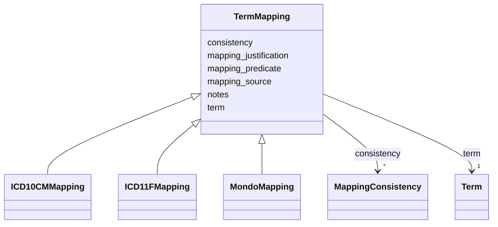

# Class: TermMapping 


_Mapping from this disease entry to an external term or code_


URI: [dismech:TermMapping](https://w3id.org/monarch-initiative/dismech/TermMapping)





## Inheritance
* **TermMapping**
    * [ICD10CMMapping](ICD10CMMapping.md)
    * [ICD11FMapping](ICD11FMapping.md)
    * [MondoMapping](MondoMapping.md)


## Slots

| Name | Cardinality and Range | Description | Inheritance |
| ---  | --- | --- | --- |
| [term](term.md) | 1 _recommended_ <br/> [Term](Term.md) | Optional structured ontology term reference | direct |
| [mapping_predicate](mapping_predicate.md) | 1 <br/> [Uriorcurie](Uriorcurie.md) | Relationship between this disease and the mapped term (e | direct |
| [mapping_source](mapping_source.md) | 0..1 <br/> [String](String.md) | Source of the mapping (e | direct |
| [mapping_justification](mapping_justification.md) | 0..1 <br/> [String](String.md) | Brief rationale or justification for the mapping | direct |
| [consistency](consistency.md) | * <br/> [MappingConsistency](MappingConsistency.md) | Consistency assertions for this mapping against other sources | direct |
| [notes](notes.md) | 0..1 <br/> [String](String.md) |  | direct |


## Identifier and Mapping Information


### Schema Source


* from schema: https://w3id.org/monarch-initiative/dismech


## Mappings

| Mapping Type | Mapped Value |
| ---  | ---  |
| self | dismech:TermMapping |
| native | dismech:TermMapping |


## LinkML Source

<!-- TODO: investigate https://stackoverflow.com/questions/37606292/how-to-create-tabbed-code-blocks-in-mkdocs-or-sphinx -->

### Direct

<details>
```yaml
name: TermMapping
description: Mapping from this disease entry to an external term or code
from_schema: https://w3id.org/monarch-initiative/dismech
slots:
- term
- mapping_predicate
- mapping_source
- mapping_justification
- consistency
- notes
slot_usage:
  term:
    name: term
    required: true
  mapping_predicate:
    name: mapping_predicate
    required: true

```
</details>

### Induced

<details>
```yaml
name: TermMapping
description: Mapping from this disease entry to an external term or code
from_schema: https://w3id.org/monarch-initiative/dismech
slot_usage:
  term:
    name: term
    required: true
  mapping_predicate:
    name: mapping_predicate
    required: true
attributes:
  term:
    name: term
    description: Optional structured ontology term reference
    from_schema: https://w3id.org/monarch-initiative/dismech
    rank: 1000
    alias: term
    owner: TermMapping
    domain_of:
    - Descriptor
    - TermMapping
    - ConditionDescriptor
    - GOEnrichmentTerm
    range: Term
    required: true
    recommended: true
    inlined: true
  mapping_predicate:
    name: mapping_predicate
    description: Relationship between this disease and the mapped term (e.g., skos:exactMatch)
    from_schema: https://w3id.org/monarch-initiative/dismech
    rank: 1000
    alias: mapping_predicate
    owner: TermMapping
    domain_of:
    - TermMapping
    range: uriorcurie
    required: true
  mapping_source:
    name: mapping_source
    description: Source of the mapping (e.g., MONDO, ICD-10-CM, manual curation)
    from_schema: https://w3id.org/monarch-initiative/dismech
    rank: 1000
    alias: mapping_source
    owner: TermMapping
    domain_of:
    - TermMapping
    range: string
  mapping_justification:
    name: mapping_justification
    description: Brief rationale or justification for the mapping
    from_schema: https://w3id.org/monarch-initiative/dismech
    rank: 1000
    alias: mapping_justification
    owner: TermMapping
    domain_of:
    - TermMapping
    range: string
  consistency:
    name: consistency
    description: Consistency assertions for this mapping against other sources
    from_schema: https://w3id.org/monarch-initiative/dismech
    rank: 1000
    alias: consistency
    owner: TermMapping
    domain_of:
    - TermMapping
    range: MappingConsistency
    multivalued: true
    inlined: true
    inlined_as_list: true
  notes:
    name: notes
    examples:
    - value: Contagious stage where symptoms appear and the bacteria can be spread
        to others.
    from_schema: https://w3id.org/monarch-initiative/dismech
    rank: 1000
    alias: notes
    owner: TermMapping
    domain_of:
    - GeneticContext
    - OnsetDescriptor
    - PhenotypeContext
    - Dataset
    - ClinicalTrial
    - ComputationalModel
    - DifferentialDiagnosis
    - Prevalence
    - ProgressionInfo
    - EpidemiologyInfo
    - Pathophysiology
    - Phenotype
    - Biochemical
    - HistopathologyFinding
    - Genetic
    - Environmental
    - Disease
    - Stage
    - AgentLifeCycle
    - AgentLifeCycleStage
    - Treatment
    - Transmission
    - Diagnosis
    - ClassificationAssignment
    - Definition
    - CriteriaSet
    - TermMapping
    - MappingConsistency
    - ComorbidityAssociation
    - AssociationSignal
    - AssociationMetric
    - AssociationStatistics
    - MechanisticHypothesis
    range: string

```
</details>