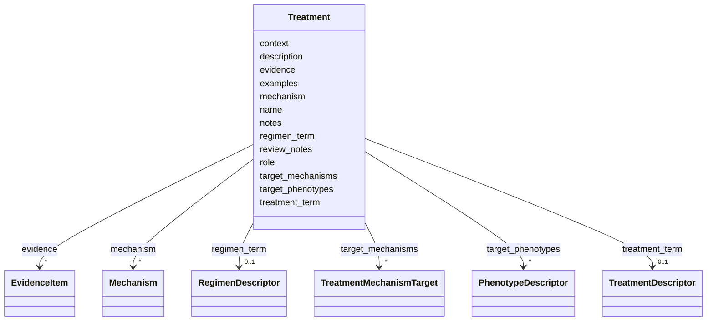

# Class: Treatment 


URI: [dismech:Treatment](https://w3id.org/monarch-initiative/dismech/Treatment)





<!-- no inheritance hierarchy -->


## Slots

| Name | Cardinality and Range | Description | Inheritance |
| ---  | --- | --- | --- |
| [name](name.md) | 1 <br/> [String](String.md) |  | direct |
| [description](description.md) | 0..1 <br/> [String](String.md) |  | direct |
| [treatment_term](treatment_term.md) | 0..1 <br/> [TreatmentDescriptor](TreatmentDescriptor.md) | The MAXO term for this treatment/medical action | direct |
| [regimen_term](regimen_term.md) | 0..1 <br/> [RegimenDescriptor](RegimenDescriptor.md) | The NCIT term for this treatment regimen | direct |
| [target_phenotypes](target_phenotypes.md) | * <br/> [PhenotypeDescriptor](PhenotypeDescriptor.md) | Phenotypes that this treatment or trial addresses or targets | direct |
| [target_mechanisms](target_mechanisms.md) | * <br/> [TreatmentMechanismTarget](TreatmentMechanismTarget.md) | Pathophysiology mechanism nodes that this treatment targets or modulates | direct |
| [evidence](evidence.md) | * _recommended_ <br/> [EvidenceItem](EvidenceItem.md) |  | direct |
| [notes](notes.md) | 0..1 <br/> [String](String.md) |  | direct |
| [context](context.md) | 0..1 <br/> [String](String.md) |  | direct |
| [review_notes](review_notes.md) | 0..1 <br/> [String](String.md) |  | direct |
| [role](role.md) | 0..1 <br/> [String](String.md) |  | direct |
| [mechanism](mechanism.md) | * <br/> [Mechanism](Mechanism.md) |  | direct |
| [examples](examples.md) | * <br/> [String](String.md) |  | direct |


## Usages

| used by | used in | type | used |
| ---  | --- | --- | --- |
| [Disease](Disease.md) | [treatments](treatments.md) | range | [Treatment](Treatment.md) |


## Identifier and Mapping Information


### Schema Source


* from schema: https://w3id.org/monarch-initiative/dismech


## Mappings

| Mapping Type | Mapped Value |
| ---  | ---  |
| self | dismech:Treatment |
| native | dismech:Treatment |


## LinkML Source

<!-- TODO: investigate https://stackoverflow.com/questions/37606292/how-to-create-tabbed-code-blocks-in-mkdocs-or-sphinx -->

### Direct

<details>
```yaml
name: Treatment
from_schema: https://w3id.org/monarch-initiative/dismech
slots:
- name
- description
- treatment_term
- regimen_term
- target_phenotypes
- target_mechanisms
- evidence
- notes
- context
- review_notes
- role
- mechanism
- examples

```
</details>

### Induced

<details>
```yaml
name: Treatment
from_schema: https://w3id.org/monarch-initiative/dismech
attributes:
  name:
    name: name
    examples:
    - value: Adolescent Nephronophthisis
    from_schema: https://w3id.org/monarch-initiative/dismech
    rank: 1000
    identifier: true
    alias: name
    owner: Treatment
    domain_of:
    - ClinicalTrial
    - ComputationalModel
    - DifferentialDiagnosis
    - Subtype
    - EpidemiologyInfo
    - Pathophysiology
    - Phenotype
    - Biochemical
    - HistopathologyFinding
    - Genetic
    - Environmental
    - Disease
    - Stage
    - AgentLifeCycleStage
    - Treatment
    - InfectiousAgent
    - Transmission
    - Assay
    - Diagnosis
    - Inheritance
    - Variant
    - Mechanism
    - ModelingConsideration
    - Definition
    - CriteriaSet
    - ComorbidityAssociation
    range: string
    required: true
  description:
    name: description
    from_schema: https://w3id.org/monarch-initiative/dismech
    rank: 1000
    alias: description
    owner: Treatment
    domain_of:
    - Descriptor
    - GeneticContext
    - Dataset
    - ClinicalTrial
    - ComputationalModel
    - DifferentialDiagnosis
    - Subtype
    - CausalEdge
    - TreatmentMechanismTarget
    - EpidemiologyInfo
    - Pathophysiology
    - Phenotype
    - HistopathologyFinding
    - Environmental
    - Disease
    - Stage
    - AgentLifeCycle
    - AgentLifeCycleStage
    - AnimalModel
    - Treatment
    - InfectiousAgent
    - Transmission
    - Assay
    - Diagnosis
    - Inheritance
    - Variant
    - FunctionalEffect
    - Mechanism
    - ModelingConsideration
    - Definition
    - CriteriaSet
    - ConditionDescriptor
    - GOEnrichment
    - ComorbidityHypothesis
    - UpstreamConditionHypothesis
    - MechanisticHypothesis
    range: string
  treatment_term:
    name: treatment_term
    description: The MAXO term for this treatment/medical action
    from_schema: https://w3id.org/monarch-initiative/dismech
    rank: 1000
    alias: treatment_term
    owner: Treatment
    domain_of:
    - Treatment
    range: TreatmentDescriptor
    inlined: true
  regimen_term:
    name: regimen_term
    description: The NCIT term for this treatment regimen
    from_schema: https://w3id.org/monarch-initiative/dismech
    rank: 1000
    alias: regimen_term
    owner: Treatment
    domain_of:
    - Treatment
    range: RegimenDescriptor
    inlined: true
  target_phenotypes:
    name: target_phenotypes
    description: Phenotypes that this treatment or trial addresses or targets
    comments:
    - Should reference phenotype names defined in the same disease's phenotypes list
    - Enables linking treatments/trials to the symptoms/manifestations they aim to
      manage
    - Each phenotype can include ontology term references (HP)
    from_schema: https://w3id.org/monarch-initiative/dismech
    rank: 1000
    alias: target_phenotypes
    owner: Treatment
    domain_of:
    - ClinicalTrial
    - Treatment
    range: PhenotypeDescriptor
    multivalued: true
    inlined: true
    inlined_as_list: true
  target_mechanisms:
    name: target_mechanisms
    description: Pathophysiology mechanism nodes that this treatment targets or modulates.
      Links a treatment to specific steps in the disease's causal graph, enabling
      inference about which downstream phenotypes should respond to therapy.
    comments:
    - Target names should match pathophysiology entry names in the same disease file
    - Complements target_phenotypes by explaining WHERE in the causal chain the drug
      acts
    - Analogous to DrugMechDB paths but anchored to dismech pathophysiology nodes
    from_schema: https://w3id.org/monarch-initiative/dismech
    rank: 1000
    alias: target_mechanisms
    owner: Treatment
    domain_of:
    - Treatment
    range: TreatmentMechanismTarget
    multivalued: true
    inlined: true
    inlined_as_list: true
  evidence:
    name: evidence
    from_schema: https://w3id.org/monarch-initiative/dismech
    rank: 1000
    alias: evidence
    owner: Treatment
    domain_of:
    - PhenotypeContext
    - Dataset
    - ClinicalTrial
    - ComputationalModel
    - DifferentialDiagnosis
    - Subtype
    - CausalEdge
    - TreatmentMechanismTarget
    - Finding
    - Prevalence
    - ProgressionInfo
    - EpidemiologyInfo
    - Pathophysiology
    - Phenotype
    - Biochemical
    - HistopathologyFinding
    - Genetic
    - Environmental
    - Stage
    - AgentLifeCycle
    - AgentLifeCycleStage
    - AnimalModel
    - Treatment
    - InfectiousAgent
    - Transmission
    - Diagnosis
    - Inheritance
    - Variant
    - ModelingConsideration
    - ClassificationAssignment
    - Definition
    - CriteriaSet
    - AssociationSignal
    - AssociationStatistics
    - ComorbidityHypothesis
    - UpstreamConditionHypothesis
    - MechanisticHypothesis
    range: EvidenceItem
    recommended: true
    multivalued: true
    inlined: true
    inlined_as_list: true
  notes:
    name: notes
    examples:
    - value: Contagious stage where symptoms appear and the bacteria can be spread
        to others.
    from_schema: https://w3id.org/monarch-initiative/dismech
    rank: 1000
    alias: notes
    owner: Treatment
    domain_of:
    - GeneticContext
    - OnsetDescriptor
    - PhenotypeContext
    - Dataset
    - ClinicalTrial
    - ComputationalModel
    - DifferentialDiagnosis
    - Prevalence
    - ProgressionInfo
    - EpidemiologyInfo
    - Pathophysiology
    - Phenotype
    - Biochemical
    - HistopathologyFinding
    - Genetic
    - Environmental
    - Disease
    - Stage
    - AgentLifeCycle
    - AgentLifeCycleStage
    - Treatment
    - Transmission
    - Diagnosis
    - ClassificationAssignment
    - Definition
    - CriteriaSet
    - TermMapping
    - MappingConsistency
    - ComorbidityAssociation
    - AssociationSignal
    - AssociationMetric
    - AssociationStatistics
    - MechanisticHypothesis
    range: string
  context:
    name: context
    examples:
    - value: Pregnancy
    from_schema: https://w3id.org/monarch-initiative/dismech
    rank: 1000
    alias: context
    owner: Treatment
    domain_of:
    - Phenotype
    - Biochemical
    - HistopathologyFinding
    - Stage
    - AgentLifeCycle
    - AgentLifeCycleStage
    - Treatment
    range: string
  review_notes:
    name: review_notes
    examples:
    - value: Added an additional clinically relevant subtype.
    from_schema: https://w3id.org/monarch-initiative/dismech
    rank: 1000
    alias: review_notes
    owner: Treatment
    domain_of:
    - ClinicalTrial
    - Subtype
    - ProgressionInfo
    - Phenotype
    - Genetic
    - Environmental
    - Disease
    - Stage
    - AgentLifeCycle
    - AgentLifeCycleStage
    - Treatment
    range: string
  role:
    name: role
    examples:
    - value: Primary
    from_schema: https://w3id.org/monarch-initiative/dismech
    rank: 1000
    alias: role
    owner: Treatment
    domain_of:
    - HostDescriptor
    - Pathophysiology
    - Stage
    - Treatment
    range: string
  mechanism:
    name: mechanism
    from_schema: https://w3id.org/monarch-initiative/dismech
    rank: 1000
    alias: mechanism
    owner: Treatment
    domain_of:
    - Treatment
    range: Mechanism
    multivalued: true
    inlined: true
    inlined_as_list: true
  examples:
    name: examples
    examples:
    - value: '[''Kaposi Sarcoma'']'
    from_schema: https://w3id.org/monarch-initiative/dismech
    rank: 1000
    alias: examples
    owner: Treatment
    domain_of:
    - Pathophysiology
    - Genetic
    - Environmental
    - Stage
    - Treatment
    range: string
    multivalued: true

```
</details>