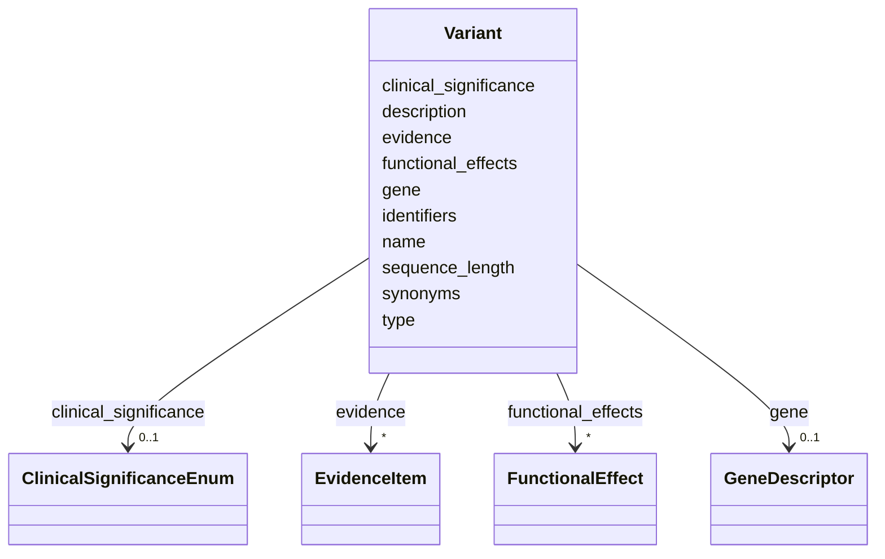

# Class: Variant 


URI: [dismech:Variant](https://w3id.org/monarch-initiative/dismech/Variant)





<!-- no inheritance hierarchy -->


## Slots

| Name | Cardinality and Range | Description | Inheritance |
| ---  | --- | --- | --- |
| [name](name.md) | 1 <br/> [String](String.md) |  | direct |
| [description](description.md) | 0..1 <br/> [String](String.md) |  | direct |
| [gene](gene.md) | 0..1 <br/> [GeneDescriptor](GeneDescriptor.md) |  | direct |
| [evidence](evidence.md) | * _recommended_ <br/> [EvidenceItem](EvidenceItem.md) |  | direct |
| [functional_effects](functional_effects.md) | * <br/> [FunctionalEffect](FunctionalEffect.md) |  | direct |
| [synonyms](synonyms.md) | * <br/> [String](String.md) |  | direct |
| [identifiers](identifiers.md) | * <br/> [Uriorcurie](Uriorcurie.md) |  | direct |
| [sequence_length](sequence_length.md) | 0..1 <br/> [Integer](Integer.md) |  | direct |
| [clinical_significance](clinical_significance.md) | 0..1 <br/> [ClinicalSignificanceEnum](ClinicalSignificanceEnum.md) |  | direct |
| [type](type.md) | 0..1 <br/> [String](String.md) |  | direct |


## Usages

| used by | used in | type | used |
| ---  | --- | --- | --- |
| [Genetic](Genetic.md) | [variants](variants.md) | range | [Variant](Variant.md) |
| [Disease](Disease.md) | [variants](variants.md) | range | [Variant](Variant.md) |


## Identifier and Mapping Information


### Schema Source


* from schema: https://w3id.org/monarch-initiative/dismech


## Mappings

| Mapping Type | Mapped Value |
| ---  | ---  |
| self | dismech:Variant |
| native | dismech:Variant |


## LinkML Source

<!-- TODO: investigate https://stackoverflow.com/questions/37606292/how-to-create-tabbed-code-blocks-in-mkdocs-or-sphinx -->

### Direct

<details>
```yaml
name: Variant
from_schema: https://w3id.org/monarch-initiative/dismech
slots:
- name
- description
- gene
- evidence
- functional_effects
- synonyms
- identifiers
- sequence_length
- clinical_significance
- type

```
</details>

### Induced

<details>
```yaml
name: Variant
from_schema: https://w3id.org/monarch-initiative/dismech
attributes:
  name:
    name: name
    examples:
    - value: Adolescent Nephronophthisis
    from_schema: https://w3id.org/monarch-initiative/dismech
    rank: 1000
    identifier: true
    alias: name
    owner: Variant
    domain_of:
    - ClinicalTrial
    - ComputationalModel
    - DifferentialDiagnosis
    - Subtype
    - EpidemiologyInfo
    - Pathophysiology
    - Phenotype
    - Biochemical
    - HistopathologyFinding
    - Genetic
    - Environmental
    - Disease
    - Stage
    - AgentLifeCycleStage
    - Treatment
    - InfectiousAgent
    - Transmission
    - Assay
    - Diagnosis
    - Inheritance
    - Variant
    - Mechanism
    - ModelingConsideration
    - Definition
    - CriteriaSet
    - ComorbidityAssociation
    range: string
    required: true
  description:
    name: description
    from_schema: https://w3id.org/monarch-initiative/dismech
    rank: 1000
    alias: description
    owner: Variant
    domain_of:
    - Descriptor
    - GeneticContext
    - Dataset
    - ClinicalTrial
    - ComputationalModel
    - DifferentialDiagnosis
    - Subtype
    - CausalEdge
    - TreatmentMechanismTarget
    - EpidemiologyInfo
    - Pathophysiology
    - Phenotype
    - HistopathologyFinding
    - Environmental
    - Disease
    - Stage
    - AgentLifeCycle
    - AgentLifeCycleStage
    - AnimalModel
    - Treatment
    - InfectiousAgent
    - Transmission
    - Assay
    - Diagnosis
    - Inheritance
    - Variant
    - FunctionalEffect
    - Mechanism
    - ModelingConsideration
    - Definition
    - CriteriaSet
    - ConditionDescriptor
    - GOEnrichment
    - ComorbidityHypothesis
    - UpstreamConditionHypothesis
    - MechanisticHypothesis
    range: string
  gene:
    name: gene
    examples:
    - value: '{preferred_term: MEFV}'
    from_schema: https://w3id.org/monarch-initiative/dismech
    rank: 1000
    alias: gene
    owner: Variant
    domain_of:
    - GeneticContext
    - Pathophysiology
    - Variant
    range: GeneDescriptor
    inlined: true
  evidence:
    name: evidence
    from_schema: https://w3id.org/monarch-initiative/dismech
    rank: 1000
    alias: evidence
    owner: Variant
    domain_of:
    - PhenotypeContext
    - Dataset
    - ClinicalTrial
    - ComputationalModel
    - DifferentialDiagnosis
    - Subtype
    - CausalEdge
    - TreatmentMechanismTarget
    - Finding
    - Prevalence
    - ProgressionInfo
    - EpidemiologyInfo
    - Pathophysiology
    - Phenotype
    - Biochemical
    - HistopathologyFinding
    - Genetic
    - Environmental
    - Stage
    - AgentLifeCycle
    - AgentLifeCycleStage
    - AnimalModel
    - Treatment
    - InfectiousAgent
    - Transmission
    - Diagnosis
    - Inheritance
    - Variant
    - ModelingConsideration
    - ClassificationAssignment
    - Definition
    - CriteriaSet
    - AssociationSignal
    - AssociationStatistics
    - ComorbidityHypothesis
    - UpstreamConditionHypothesis
    - MechanisticHypothesis
    range: EvidenceItem
    recommended: true
    multivalued: true
    inlined: true
    inlined_as_list: true
  functional_effects:
    name: functional_effects
    from_schema: https://w3id.org/monarch-initiative/dismech
    rank: 1000
    alias: functional_effects
    owner: Variant
    domain_of:
    - Variant
    range: FunctionalEffect
    multivalued: true
    inlined: true
    inlined_as_list: true
  synonyms:
    name: synonyms
    examples:
    - value: '[''CYFRA 21-1'']'
    from_schema: https://w3id.org/monarch-initiative/dismech
    rank: 1000
    alias: synonyms
    owner: Variant
    domain_of:
    - Pathophysiology
    - Biochemical
    - Environmental
    - Disease
    - Variant
    range: string
    multivalued: true
  identifiers:
    name: identifiers
    from_schema: https://w3id.org/monarch-initiative/dismech
    rank: 1000
    alias: identifiers
    owner: Variant
    domain_of:
    - Variant
    range: uriorcurie
    multivalued: true
  sequence_length:
    name: sequence_length
    from_schema: https://w3id.org/monarch-initiative/dismech
    rank: 1000
    alias: sequence_length
    owner: Variant
    domain_of:
    - Variant
    range: integer
  clinical_significance:
    name: clinical_significance
    from_schema: https://w3id.org/monarch-initiative/dismech
    rank: 1000
    alias: clinical_significance
    owner: Variant
    domain_of:
    - Variant
    range: ClinicalSignificanceEnum
  type:
    name: type
    from_schema: https://w3id.org/monarch-initiative/dismech
    rank: 1000
    alias: type
    owner: Variant
    domain_of:
    - Variant
    - FunctionalEffect
    range: string

```
</details>