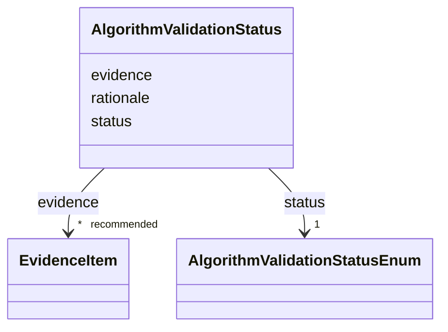

# Class: AlgorithmValidationStatus 


_Validation maturity of a phenotype algorithm / computable case definition: a graded status plus a free-text rationale and optional citing evidence (the standard EvidenceItem model — reference + verbatim snippet + explanation)._


URI: [dismech:class/AlgorithmValidationStatus](https://w3id.org/monarch-initiative/dismech/class/AlgorithmValidationStatus)





<!-- no inheritance hierarchy -->

## Slots

| Name | Cardinality and Range | Description | Inheritance |
| ---  | --- | --- | --- |
| [status](../slots/status.md) | 1 <br/> [AlgorithmValidationStatusEnum](../enums/AlgorithmValidationStatusEnum.md) | Status or state of a clinical trial or other process | direct |
| [rationale](../slots/rationale.md) | 0..1 <br/> [String](../types/String.md) | Why this status — what was (or was not) run, against which cohort, with what ... | direct |
| [evidence](../slots/evidence.md) | * _recommended_ <br/> [EvidenceItem](../classes/EvidenceItem.md) |  | direct |


## Usages

| used by | used in | type | used |
| ---  | --- | --- | --- |
| [Definition](../classes/Definition.md) | [validation_status](../slots/validation_status.md) | range | [AlgorithmValidationStatus](../classes/AlgorithmValidationStatus.md) |


## Identifier and Mapping Information


### Schema Source


* from schema: https://w3id.org/monarch-initiative/dismech


## Mappings

| Mapping Type | Mapped Value |
| ---  | ---  |
| self | dismech:AlgorithmValidationStatus |
| native | dismech:AlgorithmValidationStatus |


## LinkML Source

<!-- TODO: investigate https://stackoverflow.com/questions/37606292/how-to-create-tabbed-code-blocks-in-mkdocs-or-sphinx -->

### Direct

<details>
```yaml
name: AlgorithmValidationStatus
description: 'Validation maturity of a phenotype algorithm / computable case definition:
  a graded status plus a free-text rationale and optional citing evidence (the standard
  EvidenceItem model — reference + verbatim snippet + explanation).'
from_schema: https://w3id.org/monarch-initiative/dismech
slots:
- status
- rationale
- evidence
slot_usage:
  status:
    name: status
    range: AlgorithmValidationStatusEnum
    required: true
  rationale:
    name: rationale
    description: Why this status — what was (or was not) run, against which cohort,
      with what result.

```
</details>

### Induced

<details>
```yaml
name: AlgorithmValidationStatus
description: 'Validation maturity of a phenotype algorithm / computable case definition:
  a graded status plus a free-text rationale and optional citing evidence (the standard
  EvidenceItem model — reference + verbatim snippet + explanation).'
from_schema: https://w3id.org/monarch-initiative/dismech
slot_usage:
  status:
    name: status
    range: AlgorithmValidationStatusEnum
    required: true
  rationale:
    name: rationale
    description: Why this status — what was (or was not) run, against which cohort,
      with what result.
attributes:
  status:
    name: status
    description: Status or state of a clinical trial or other process
    examples:
    - value: Recruiting
    - value: Completed
    - value: Terminated
    from_schema: https://w3id.org/monarch-initiative/dismech
    rank: 1000
    alias: status
    owner: AlgorithmValidationStatus
    domain_of:
    - ClinicalTrial
    - AlgorithmValidationStatus
    - MechanisticHypothesis
    - Discussion
    range: AlgorithmValidationStatusEnum
    required: true
  rationale:
    name: rationale
    description: Why this status — what was (or was not) run, against which cohort,
      with what result.
    from_schema: https://w3id.org/monarch-initiative/dismech
    rank: 1000
    alias: rationale
    owner: AlgorithmValidationStatus
    domain_of:
    - ClinicalBurden
    - AlgorithmValidationStatus
    - Discussion
    range: string
  evidence:
    name: evidence
    from_schema: https://w3id.org/monarch-initiative/dismech
    rank: 1000
    alias: evidence
    owner: AlgorithmValidationStatus
    domain_of:
    - PhenotypeContext
    - Dataset
    - ExperimentalModel
    - Experiment
    - ExperimentalPerturbation
    - ExperimentalReadout
    - ExperimentalControl
    - ClinicalTrial
    - ComputationalModel
    - DifferentialDiagnosis
    - Subtype
    - CausalEdge
    - TreatmentMechanismTarget
    - ModelMechanismLink
    - BiomarkerReadout
    - PhenotypeReadout
    - ReferenceRange
    - SurrogateEndpoint
    - ExternalAssertion
    - Finding
    - Prevalence
    - GeneCaseFraction
    - ProgressionInfo
    - ClinicalBurden
    - EpidemiologyInfo
    - Pathophysiology
    - Phenotype
    - Biochemical
    - HistopathologyFinding
    - ImagingFinding
    - Genetic
    - Environmental
    - Stage
    - AgentLifeCycle
    - AgentLifeCycleStage
    - AnimalModel
    - Treatment
    - InfectiousAgent
    - Transmission
    - Diagnosis
    - Inheritance
    - Variant
    - ModelingConsideration
    - ClassificationAssignment
    - Definition
    - AlgorithmValidationStatus
    - CriteriaSet
    - AssociationSignal
    - AssociationStatistics
    - ComorbidityHypothesis
    - UpstreamConditionHypothesis
    - MechanisticHypothesis
    - Discussion
    - GroupingCriteria
    - GroupingMember
    - DifferentiatingMechanism
    range: EvidenceItem
    recommended: true
    multivalued: true
    inlined: true
    inlined_as_list: true

```
</details>